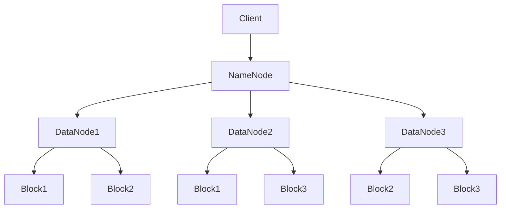

# 【AI大数据计算原理与代码实例讲解】HDFS

## 1. 背景介绍

在大数据时代,海量数据的存储和计算成为了企业和组织面临的重大挑战。传统的集中式存储和计算架构已经无法满足大数据处理的需求。为了应对这一挑战,Hadoop分布式文件系统(HDFS)应运而生。

HDFS是Hadoop生态系统的核心组件之一,是一个高度容错的分布式文件系统。它借鉴了Google File System (GFS)的设计理念,旨在提供高吞吐量的数据访问,适合在商用硬件集群上运行。

### 1.1 HDFS的设计目标

HDFS的设计目标主要包括:

- 高容错性:能够在硬件故障的情况下继续运行
- 适合大数据处理:支持高吞吐量的数据访问
- 适合部署在低成本硬件上:降低硬件成本,提高ROI

### 1.2 HDFS的发展历程

HDFS最初由Doug Cutting和Mike Cafarella开发,后来成为Apache Hadoop项目的一部分。它经历了多个版本的迭代和改进:

- 2006年,Hadoop 0.1.0发布,包含了HDFS的雏形
- 2011年,Hadoop 1.0发布,HDFS成为Hadoop不可或缺的一部分 
- 2013年,HDFS Federation引入,支持多个Namespace
- 2015年,Hadoop 2.7引入异构存储层,支持内存、SSD等多种存储介质
- ......

如今,HDFS已经成为大数据存储领域的事实标准,被广泛应用于各行各业。

## 2. 核心概念与联系

要深入理解HDFS的工作原理,我们需要掌握几个核心概念:

### 2.1 NameNode和DataNode

HDFS采用主/从(Master/Slave)架构,由一个NameNode和多个DataNode组成:

- NameNode:管理文件系统的命名空间,维护文件系统树及整棵树内所有的文件和目录。它记录每个文件中各个块所在的DataNode信息。
- DataNode:存储实际的数据块,执行数据块的读/写操作。

### 2.2 Block

HDFS中的文件被分割成块(Block)进行存储,默认大小为128MB。每个块会被复制到多个DataNode上,以提供容错能力。

### 2.3 Replication

HDFS采用数据复制(Replication)机制来确保数据的可靠性和可用性。每个Block默认存储3个副本,分布在不同的DataNode上。当DataNode失效时,NameNode会自动复制块数据到其他DataNode,保证始终满足最小副本数要求。

下图展示了HDFS的基本架构:



## 3. 核心算法原理具体操作步骤

HDFS的核心是将大文件分割成块并存储在多个DataNode上。下面我们通过一个具体的操作步骤来说明HDFS的工作原理。

### 3.1 文件写入

1. Client将文件切分成Block,并通知NameNode
2. NameNode找到可用的DataNode列表,返回给Client
3. Client将Block写入DataNode管道的第一个节点
4. 数据沿管道传输,同时写入本地磁盘,并传输到下一个DataNode
5. 当Block全部写入后,Client告知NameNode完成状态

### 3.2 文件读取

1. Client向NameNode请求读取文件
2. NameNode返回文件的Block列表及所在的DataNode
3. Client直接从最近的DataNode并行读取Block数据
4. 将读取的Block数据合并成完整的文件

### 3.3 故障恢复

当DataNode失效时:

1. NameNode检测到DataNode心跳丢失
2. NameNode将失效DataNode从集群中移除
3. NameNode检查Block副本数,如不满足要求,则开始复制
4. 复制完成后,NameNode更新元数据,保证数据完整性

## 4. 数学模型和公式详细讲解举例说明

HDFS的数据分布和容错机制可以用数学模型来描述。假设存在以下参数:

- $n$:集群中DataNode总数
- $m$:每个Block的副本数
- $p$:单个DataNode失效概率
- $f(n,m,p)$:至少有一个Block副本丢失的概率

我们可以推导出$f(n,m,p)$的计算公式:

$$
f(n,m,p) = 1 - \sum_{i=0}^{m-1} \binom{n}{i} p^i (1-p)^{n-i}
$$

举例说明,假设一个集群有10个DataNode($n=10$),每个Block有3个副本($m=3$),单个DataNode失效概率为0.1($p=0.1$),则至少有一个Block副本丢失的概率:

$$
\begin{aligned}
f(10,3,0.1) &= 1 - \sum_{i=0}^{2} \binom{10}{i} 0.1^i 0.9^{10-i} \\
            &= 1 - \left[\binom{10}{0} 0.1^0 0.9^{10} + \binom{10}{1} 0.1^1 0.9^9 + \binom{10}{2} 0.1^2 0.9^8 \right] \\
            &\approx 0.057
\end{aligned}
$$

可见,在这种配置下,至少有一个Block副本丢失的概率只有5.7%,HDFS能够提供很高的数据可靠性。

## 5. 项目实践：代码实例和详细解释说明

下面我们通过一个简单的Java代码实例来演示如何使用HDFS API进行文件操作。

### 5.1 创建目录

```java
public void mkdir(String path) throws IOException {
    Path dirPath = new Path(path);
    FileSystem fs = FileSystem.get(URI.create(hdfsPath), conf);
    if (!fs.exists(dirPath)) {
        fs.mkdirs(dirPath);
        System.out.println("Create dir success: " + path);
    }
    fs.close();
}
```

这段代码创建了一个新的HDFS目录。首先构造一个`Path`对象表示目录路径,然后通过`FileSystem.get()`获取HDFS的文件系统对象。接着使用`exists()`方法检查目录是否已存在,如果不存在则调用`mkdirs()`创建新目录。最后关闭`FileSystem`对象。

### 5.2 上传文件

```java
public void uploadFile(String localPath, String hdfsPath) throws IOException {
    Path srcPath = new Path(localPath);
    Path dstPath = new Path(hdfsPath);
    FileSystem fs = FileSystem.get(URI.create(hdfsPath), conf);        
    fs.copyFromLocalFile(srcPath, dstPath);
    System.out.println("Upload to "+ hdfsPath);
    fs.close();
}
```

这段代码将本地文件上传到HDFS。首先构造本地文件和HDFS目标文件的`Path`对象,然后获取HDFS的`FileSystem`对象。接着调用`copyFromLocalFile()`方法将本地文件拷贝到HDFS。注意该方法会自动将文件切分成Block。

### 5.3 读取文件

```java
public void readFile(String hdfsFile) throws IOException {
    Path path = new Path(hdfsFile);
    FileSystem fs = FileSystem.get(URI.create(hdfsFile), conf);
    FSDataInputStream in = fs.open(path);
    BufferedReader br = new BufferedReader(new InputStreamReader(in));
    String line;
    while ((line = br.readLine()) != null) {
        System.out.println(line);
    }
    br.close();
    in.close();
    fs.close();
}
```

这段代码从HDFS读取文件内容并打印到控制台。首先构造要读取的HDFS文件`Path`对象,获取`FileSystem`对象,然后调用`open()`打开文件输入流。接着用`BufferedReader`包装输入流,循环读取每一行内容并打印。最后关闭流和`FileSystem`对象。

## 6. 实际应用场景

HDFS在许多大数据应用场景中发挥着关键作用,例如:

### 6.1 日志存储与分析

互联网公司每天会产生海量的用户行为日志、服务器日志等。将这些日志存储在HDFS上,可以便于后续的数据处理和分析,挖掘用户行为特征,优化系统性能。

### 6.2 数据仓库与BI

企业可以将来自不同业务系统的数据统一存储在HDFS,构建数据仓库。再使用Hive、Spark等工具进行ETL处理和数据分析,支持BI报表和数据挖掘。

### 6.3 内容存储与备份

HDFS为非结构化数据如图片、视频等提供了理想的存储平台。例如一些视频网站使用HDFS存储PB级的视频资源,并作为备份系统防止单点故障。

### 6.4 机器学习与人工智能

机器学习和深度学习算法往往需要海量的训练数据。HDFS可以作为数据湖,为算法提供原始数据。配合Spark MLlib、TensorFlow等框架,可以实现高效的分布式模型训练。

## 7. 工具和资源推荐

要学习和使用HDFS,推荐以下工具和资源:

- Hadoop官网:https://hadoop.apache.org/ 
- Hadoop权威指南(第四版):经典的Hadoop学习教材
- Ambari:大数据平台管理工具,便于部署和监控Hadoop集群
- Cloudera Manager:企业级的Hadoop管理平台 
- Hortonworks教程:https://hortonworks.com/tutorials/
- IBM DeveloperWorks:包含大量优质的Hadoop文章

此外,各大公司如阿里、腾讯、百度等也有丰富的HDFS实践经验分享,可以多关注他们的技术博客。

## 8. 总结：未来发展趋势与挑战

HDFS是大数据时代重要的基础设施,经过十多年的发展已经日趋成熟。未来HDFS还将不断演进,以应对新的需求和挑战:

- 容量和性能的扩展性:随着数据量的增长,如何突破HDFS容量瓶颈,提升海量小文件处理性能,将是重要方向。
- 多租户资源隔离:在共享的HDFS集群中,需要更好的多租户资源隔离和性能保障机制。
- 存储介质的异构性:集成SSD、NVME等新型存储介质,优化分层存储,将进一步提升HDFS性能。
- 云原生:支持在Kubernetes等容器平台上灵活部署HDFS组件,实现存储和计算的解耦。
- AI工作负载:针对机器学习、深度学习等新型工作负载,优化HDFS数据存取和调度策略。

总之,HDFS将与Hadoop生态圈的其他组件一起,为大数据和人工智能的发展提供坚实的数据存储基础设施。

## 9. 附录：常见问题与解答

### Q1:HDFS适合存储什么样的数据?
A1:HDFS适合存储大规模的、非结构化的数据,如日志文件、图片、视频等。对于结构化数据,通常还是使用传统的关系型数据库更合适。

### Q2:HDFS的Block大小可以修改吗?
A2:可以的,HDFS默认Block大小为128MB,可以在hdfs-site.xml配置文件中修改dfs.blocksize属性值。但Block过大会影响数据传输效率,过小会增加NameNode内存压力,需要权衡。

### Q3:HDFS如何保证数据的一致性?
A3:HDFS采用强一致性模型,所有数据写入都遵循"写入时复制"语义。数据在写入Pipeline中的所有DataNode后,才返回成功。任何DataNode失效,都会触发复制,保证一致性。

### Q4:HDFS适合用于频繁修改的数据吗?
A4:不太适合。HDFS采用追加写的方式,对文件的修改是以新版本的形式添加的,旧版本仍会保留。因此不适合频繁修改的场景,那样会导致大量的版本和小文件。

### Q5:HDFS集群规模可以动态调整吗?
A5:可以的。可以在运行过程中动态添加或下线DataNode,系统会自动感知并调整数据分布。这种水平扩展能力是HDFS的一大特色。NameNode也支持HA部署。

作者：禅与计算机程序设计艺术 / Zen and the Art of Computer Programming