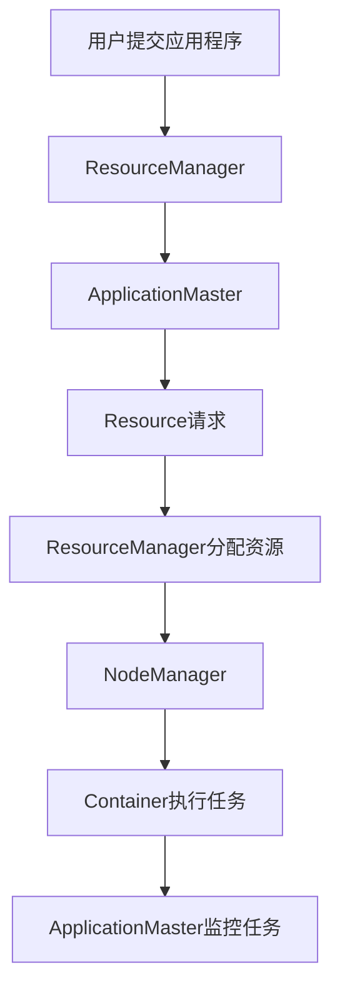

# 【AI大数据计算原理与代码实例讲解】Yarn

## 1.背景介绍

在大数据时代，数据的处理和分析变得至关重要。Yarn（Yet Another Resource Negotiator）作为Hadoop生态系统中的资源管理框架，极大地提升了大数据处理的效率和灵活性。Yarn的出现解决了传统MapReduce框架中资源管理和调度的瓶颈，使得Hadoop可以支持多种数据处理模型和应用程序。

Yarn的核心思想是将资源管理和任务调度分离开来，通过一个全局的资源管理器（ResourceManager）和每个节点的节点管理器（NodeManager）来实现资源的高效利用和任务的灵活调度。本文将深入探讨Yarn的核心概念、算法原理、数学模型、实际应用场景，并通过代码实例详细解释其工作机制。

## 2.核心概念与联系

### 2.1 Yarn架构概述

Yarn的架构主要由以下几个核心组件组成：

- **ResourceManager**：全局资源管理器，负责集群资源的管理和分配。
- **NodeManager**：节点管理器，负责单个节点上的资源管理和任务执行。
- **ApplicationMaster**：应用程序主控，负责应用程序的生命周期管理和任务调度。
- **Container**：资源容器，封装了计算资源（CPU、内存等）和任务执行环境。

### 2.2 Yarn的工作流程

Yarn的工作流程可以概括为以下几个步骤：

1. **应用程序提交**：用户通过客户端提交应用程序到ResourceManager。
2. **资源请求**：ApplicationMaster向ResourceManager请求资源。
3. **资源分配**：ResourceManager根据资源可用情况分配资源。
4. **任务执行**：NodeManager在分配的Container中执行任务。
5. **任务监控**：ApplicationMaster监控任务执行状态，并进行相应的调度和重试。

以下是Yarn的工作流程图：



## 3.核心算法原理具体操作步骤

### 3.1 资源调度算法

Yarn采用了多种资源调度算法来实现资源的高效利用和公平分配，主要包括：

- **容量调度器（Capacity Scheduler）**：按队列分配资源，适用于多租户环境。
- **公平调度器（Fair Scheduler）**：按任务需求分配资源，确保所有任务公平共享资源。
- **FIFO调度器（First In First Out）**：按任务提交顺序分配资源，适用于简单的任务调度场景。

### 3.2 资源请求与分配

资源请求与分配的具体操作步骤如下：

1. **资源请求**：ApplicationMaster向ResourceManager提交资源请求，指定所需的资源数量和类型。
2. **资源分配**：ResourceManager根据当前资源可用情况和调度策略，分配资源给ApplicationMaster。
3. **任务启动**：ApplicationMaster在获得资源后，向NodeManager发送启动任务的请求。
4. **任务执行**：NodeManager在分配的Container中启动任务，并监控任务执行状态。

### 3.3 任务监控与重试

任务监控与重试的具体操作步骤如下：

1. **任务监控**：ApplicationMaster定期向NodeManager查询任务执行状态。
2. **任务重试**：如果任务执行失败，ApplicationMaster根据预设的重试策略重新提交任务。

## 4.数学模型和公式详细讲解举例说明

### 4.1 资源分配模型

Yarn的资源分配模型可以用数学公式来描述。假设集群中有 $N$ 个节点，每个节点的资源容量为 $C_i$，其中 $i = 1, 2, \ldots, N$。应用程序 $A$ 需要的资源为 $R_A$，则资源分配的目标是找到一个资源分配方案，使得：

$$
\sum_{i=1}^{N} R_{A,i} \leq C_i
$$

其中，$R_{A,i}$ 表示分配给应用程序 $A$ 的第 $i$ 个节点的资源。

### 4.2 调度算法的数学描述

以公平调度器为例，假设有 $M$ 个应用程序，每个应用程序 $A_j$ 的资源需求为 $R_{A_j}$，其中 $j = 1, 2, \ldots, M$。公平调度器的目标是确保所有应用程序公平共享资源，即：

$$
\frac{R_{A_j}}{R_{total}} \approx \frac{1}{M}
$$

其中，$R_{total}$ 表示集群的总资源容量。

## 5.项目实践：代码实例和详细解释说明

### 5.1 环境配置

在开始代码实例之前，需要配置Yarn的运行环境。以下是基本的配置步骤：

1. **下载Hadoop**：从Apache Hadoop官网（http://hadoop.apache.org）下载Hadoop发行版。
2. **配置Hadoop**：解压Hadoop包，并配置 `core-site.xml`、`hdfs-site.xml` 和 `yarn-site.xml` 文件。
3. **启动Hadoop**：启动HDFS和Yarn服务。

### 5.2 提交应用程序

以下是一个简单的MapReduce应用程序提交示例：

```bash
# 提交MapReduce应用程序
hadoop jar hadoop-mapreduce-examples.jar wordcount /input /output
```

### 5.3 代码实例：自定义ApplicationMaster

以下是一个自定义ApplicationMaster的代码示例：

```java
public class CustomApplicationMaster {
    public static void main(String[] args) throws Exception {
        Configuration conf = new YarnConfiguration();
        YarnClient yarnClient = YarnClient.createYarnClient();
        yarnClient.init(conf);
        yarnClient.start();

        // 创建应用程序
        YarnClientApplication app = yarnClient.createApplication();
        GetNewApplicationResponse appResponse = app.getNewApplicationResponse();
        ApplicationId appId = appResponse.getApplicationId();

        // 设置应用程序提交上下文
        ApplicationSubmissionContext appContext = app.getApplicationSubmissionContext();
        appContext.setApplicationId(appId);
        appContext.setApplicationName("CustomApp");

        // 设置资源请求
        Resource capability = Resource.newInstance(1024, 1);
        appContext.setResource(capability);

        // 提交应用程序
        yarnClient.submitApplication(appContext);

        // 监控应用程序状态
        ApplicationReport report = yarnClient.getApplicationReport(appId);
        while (report.getYarnApplicationState() != YarnApplicationState.FINISHED) {
            Thread.sleep(1000);
            report = yarnClient.getApplicationReport(appId);
        }

        yarnClient.stop();
    }
}
```

### 5.4 代码解释

上述代码实现了一个自定义的ApplicationMaster，主要步骤包括：

1. 初始化Yarn客户端。
2. 创建应用程序并获取应用程序ID。
3. 设置应用程序提交上下文，包括应用程序名称和资源请求。
4. 提交应用程序并监控其状态。

## 6.实际应用场景

Yarn在大数据处理和分析中有广泛的应用，以下是几个典型的应用场景：

### 6.1 数据处理

Yarn支持多种数据处理框架，如MapReduce、Spark、Flink等，可以用于大规模数据处理和分析。例如，使用MapReduce进行日志分析，使用Spark进行实时数据处理。

### 6.2 机器学习

Yarn可以支持多种机器学习框架，如TensorFlow、MXNet等，可以用于大规模机器学习模型的训练和预测。例如，使用TensorFlow在Yarn上训练深度学习模型。

### 6.3 数据存储

Yarn可以与HDFS、HBase等分布式存储系统集成，提供高效的数据存储和访问。例如，使用HDFS存储大规模数据集，使用HBase进行实时数据查询。

## 7.工具和资源推荐

### 7.1 开发工具

- **IntelliJ IDEA**：强大的Java开发工具，支持Hadoop和Yarn的开发。
- **Eclipse**：经典的Java开发工具，支持Hadoop和Yarn的开发。
- **Visual Studio Code**：轻量级的代码编辑器，支持多种编程语言和插件。

### 7.2 学习资源

- **《Hadoop: The Definitive Guide》**：Hadoop权威指南，详细介绍了Hadoop生态系统的各个组件。
- **《YARN: Yet Another Resource Negotiator》**：Yarn官方文档，详细介绍了Yarn的架构和工作原理。
- **Coursera**：提供多种大数据和机器学习相关的在线课程。

## 8.总结：未来发展趋势与挑战

Yarn作为Hadoop生态系统中的核心组件，极大地提升了大数据处理的效率和灵活性。随着大数据技术的不断发展，Yarn也在不断演进和优化。未来，Yarn将面临以下几个发展趋势和挑战：

### 8.1 趋势

- **多租户支持**：随着大数据应用的普及，多租户支持将变得越来越重要。Yarn将进一步优化资源调度算法，确保多租户环境下的资源公平分配。
- **容器化支持**：随着容器技术的发展，Yarn将进一步集成和支持容器化应用，提升资源利用率和任务调度灵活性。
- **智能调度**：随着人工智能技术的发展，Yarn将引入智能调度算法，提升资源调度的效率和准确性。

### 8.2 挑战

- **资源管理的复杂性**：随着集群规模的扩大，资源管理的复杂性也在增加。Yarn需要不断优化资源管理算法，提升资源利用率和调度效率。
- **任务调度的灵活性**：在多种数据处理框架和应用场景下，任务调度的灵活性变得越来越重要。Yarn需要支持更多的调度策略和任务类型。
- **系统的稳定性和可靠性**：在大规模数据处理和分析中，系统的稳定性和可靠性至关重要。Yarn需要不断优化系统架构和容错机制，确保系统的高可用性。

## 9.附录：常见问题与解答

### 9.1 如何配置Yarn的资源调度器？

Yarn支持多种资源调度器，如容量调度器、公平调度器和FIFO调度器。可以通过修改 `yarn-site.xml` 文件中的 `yarn.resourcemanager.scheduler.class` 属性来配置资源调度器。例如，配置容量调度器：

```xml
<property>
    <name>yarn.resourcemanager.scheduler.class</name>
    <value>org.apache.hadoop.yarn.server.resourcemanager.scheduler.capacity.CapacityScheduler</value>
</property>
```

### 9.2 如何监控Yarn的资源使用情况？

可以通过Yarn的Web UI监控资源使用情况。默认情况下，Yarn的ResourceManager Web UI地址为 `http://<ResourceManager主机>:8088`，NodeManager Web UI地址为 `http://<NodeManager主机>:8042`。

### 9.3 如何处理Yarn任务执行失败？

Yarn支持任务重试机制，可以通过配置 `yarn-site.xml` 文件中的 `yarn.resourcemanager.am.max-attempts` 属性来设置任务的最大重试次数。例如，设置最大重试次数为3：

```xml
<property>
    <name>yarn.resourcemanager.am.max-attempts</name>
    <value>3</value>
</property>
```

### 9.4 如何优化Yarn的资源利用率？

可以通过以下几种方式优化Yarn的资源利用率：

- **调整资源调度策略**：选择合适的资源调度器和调度策略，确保资源的高效利用。
- **优化任务并行度**：合理设置任务的并行度，避免资源的过度分配和浪费。
- **监控和调整资源配置**：定期监控资源使用情况，及时调整资源配置，确保资源的合理分配。

### 9.5 如何在Yarn上运行容器化应用？

Yarn支持运行容器化应用，可以通过配置 `yarn-site.xml` 文件中的 `yarn.nodemanager.container-executor.class` 属性来启用容器化支持。例如，启用Docker容器：

```xml
<property>
    <name>yarn.nodemanager.container-executor.class</name>
    <value>org.apache.hadoop.yarn.server.nodemanager.LinuxContainerExecutor</value>
</property>
<property>
    <name>yarn.nodemanager.linux-container-executor.group</name>
    <value>docker</value>
</property>
<property>
    <name>yarn.nodemanager.runtime.linux.docker.allowed-container-networks</name>
    <value>bridge,host</value>
</property>
```

作者：禅与计算机程序设计艺术 / Zen and the Art of Computer Programming