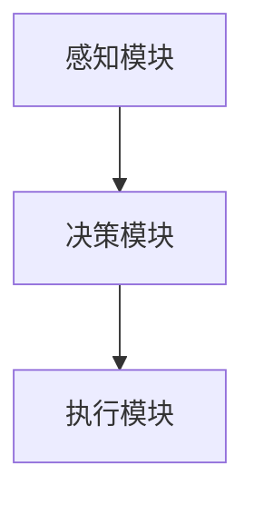

# 【大模型应用开发 动手做AI Agent】思维树

## 1.背景介绍

在人工智能领域，AI Agent（人工智能代理）已经成为一个热门话题。AI Agent不仅在学术研究中占据重要地位，而且在实际应用中也展现出巨大的潜力。无论是自动驾驶、智能客服，还是金融分析、医疗诊断，AI Agent都在不断改变我们的生活和工作方式。本文将深入探讨大模型应用开发中的AI Agent，帮助读者理解其核心概念、算法原理、数学模型、实际应用以及未来发展趋势。

## 2.核心概念与联系

### 2.1 AI Agent的定义

AI Agent是指能够自主感知环境、做出决策并执行行动的智能系统。它通常由感知模块、决策模块和执行模块组成。

### 2.2 大模型的定义

大模型是指具有大量参数和复杂结构的深度学习模型，如GPT-3、BERT等。这些模型通过大规模数据训练，能够在多种任务中表现出色。

### 2.3 AI Agent与大模型的联系

大模型为AI Agent提供了强大的感知和决策能力，使其能够在复杂环境中执行任务。通过结合大模型，AI Agent可以实现更高的智能化和自动化。

## 3.核心算法原理具体操作步骤

### 3.1 感知模块

感知模块负责从环境中获取信息，通常使用传感器、摄像头等设备。大模型在感知模块中可以用于图像识别、语音识别等任务。

### 3.2 决策模块

决策模块根据感知模块提供的信息，使用算法进行决策。常用的算法包括强化学习、深度学习等。大模型在决策模块中可以用于自然语言处理、预测分析等任务。

### 3.3 执行模块

执行模块根据决策模块的输出，执行相应的行动。大模型在执行模块中可以用于生成自然语言、控制机器人等任务。



## 4.数学模型和公式详细讲解举例说明

### 4.1 强化学习

强化学习是AI Agent常用的算法之一，其核心思想是通过与环境的交互，学习最优策略。其数学模型可以表示为马尔可夫决策过程（MDP）。

$$
MDP = (S, A, P, R, \gamma)
$$

其中，$S$ 是状态空间，$A$ 是动作空间，$P$ 是状态转移概率，$R$ 是奖励函数，$\gamma$ 是折扣因子。

### 4.2 深度学习

深度学习是大模型的基础，其核心是通过多层神经网络进行特征提取和模式识别。其数学模型可以表示为：

$$
y = f(Wx + b)
$$

其中，$W$ 是权重矩阵，$x$ 是输入向量，$b$ 是偏置向量，$f$ 是激活函数。

### 4.3 自然语言处理

自然语言处理是大模型的重要应用领域，其核心任务包括文本分类、情感分析、机器翻译等。其数学模型可以表示为：

$$
P(y|x) = \frac{P(x|y)P(y)}{P(x)}
$$

其中，$P(y|x)$ 是后验概率，$P(x|y)$ 是似然函数，$P(y)$ 是先验概率，$P(x)$ 是证据。

## 5.项目实践：代码实例和详细解释说明

### 5.1 环境配置

首先，确保安装了必要的库和工具，如TensorFlow、PyTorch、OpenAI Gym等。

```bash
pip install tensorflow torch gym
```

### 5.2 感知模块代码示例

以下是一个使用大模型进行图像识别的示例代码：

```python
import tensorflow as tf
from tensorflow.keras.applications import ResNet50
from tensorflow.keras.preprocessing import image
from tensorflow.keras.applications.resnet50 import preprocess_input, decode_predictions
import numpy as np

model = ResNet50(weights='imagenet')

img_path = 'elephant.jpg'
img = image.load_img(img_path, target_size=(224, 224))
x = image.img_to_array(img)
x = np.expand_dims(x, axis=0)
x = preprocess_input(x)

preds = model.predict(x)
print('Predicted:', decode_predictions(preds, top=3)[0])
```

### 5.3 决策模块代码示例

以下是一个使用强化学习进行决策的示例代码：

```python
import gym
import numpy as np

env = gym.make('CartPole-v1')
state = env.reset()

for _ in range(1000):
    action = env.action_space.sample()
    next_state, reward, done, _ = env.step(action)
    if done:
        break
    state = next_state

env.close()
```

### 5.4 执行模块代码示例

以下是一个使用大模型生成自然语言的示例代码：

```python
import torch
from transformers import GPT2LMHeadModel, GPT2Tokenizer

tokenizer = GPT2Tokenizer.from_pretrained('gpt2')
model = GPT2LMHeadModel.from_pretrained('gpt2')

input_text = "Once upon a time"
input_ids = tokenizer.encode(input_text, return_tensors='pt')

output = model.generate(input_ids, max_length=50, num_return_sequences=1)
print(tokenizer.decode(output[0], skip_special_tokens=True))
```

## 6.实际应用场景

### 6.1 自动驾驶

AI Agent在自动驾驶中扮演着重要角色，通过感知模块获取道路信息，决策模块进行路径规划，执行模块控制车辆行驶。

### 6.2 智能客服

智能客服系统利用大模型进行自然语言处理，能够理解用户问题并给出准确回答，提高客户满意度。

### 6.3 金融分析

AI Agent在金融分析中可以进行市场预测、风险评估等任务，帮助投资者做出更明智的决策。

### 6.4 医疗诊断

在医疗领域，AI Agent可以辅助医生进行疾病诊断、药物推荐等，提高医疗服务质量。

## 7.工具和资源推荐

### 7.1 开发工具

- TensorFlow：一个开源的机器学习框架，适用于大规模数据训练和部署。
- PyTorch：一个灵活的深度学习框架，适用于研究和开发。
- OpenAI Gym：一个用于强化学习的开发环境，提供了多种模拟环境。

### 7.2 数据集

- ImageNet：一个大规模图像数据集，常用于图像识别任务。
- COCO：一个用于图像分割和物体检测的数据集。
- SQuAD：一个用于自然语言处理的问答数据集。

### 7.3 在线资源

- Coursera：提供多种人工智能和机器学习课程。
- GitHub：一个代码托管平台，包含大量开源项目和代码示例。
- ArXiv：一个学术论文预印本平台，提供最新的研究成果。

## 8.总结：未来发展趋势与挑战

### 8.1 未来发展趋势

随着技术的不断进步，AI Agent将在更多领域得到应用。未来，AI Agent将更加智能化、自动化，能够处理更复杂的任务。

### 8.2 挑战

尽管AI Agent具有广阔的前景，但也面临诸多挑战，如数据隐私、安全性、伦理问题等。如何在保证安全和隐私的前提下，充分发挥AI Agent的潜力，是未来需要解决的重要问题。

## 9.附录：常见问题与解答

### 9.1 如何选择合适的大模型？

选择大模型时，应根据具体任务需求、计算资源、数据量等因素进行综合考虑。常用的大模型包括GPT-3、BERT、ResNet等。

### 9.2 如何提高AI Agent的性能？

提高AI Agent性能的方法包括优化算法、增加数据量、使用更强大的计算资源等。此外，模型调优和参数调整也是重要手段。

### 9.3 AI Agent在实际应用中有哪些风险？

AI Agent在实际应用中可能面临数据隐私泄露、安全漏洞、伦理问题等风险。应采取相应措施，如数据加密、安全审计、伦理审查等，降低风险。

---

作者：禅与计算机程序设计艺术 / Zen and the Art of Computer Programming