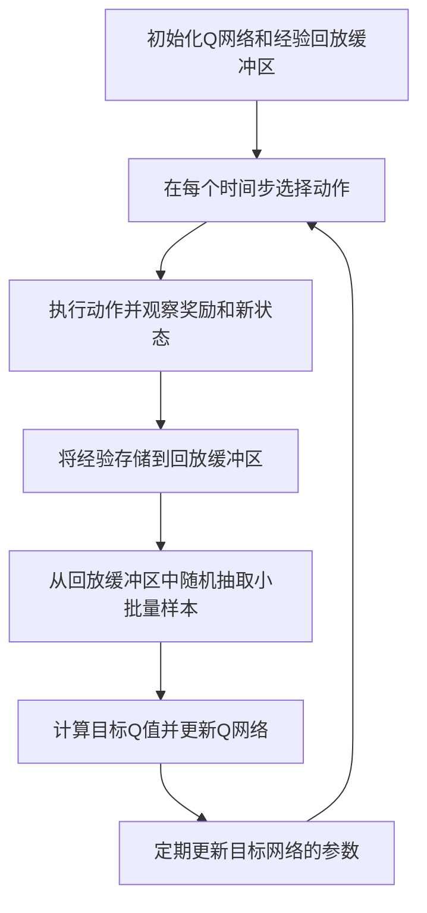

# 一切皆是映射：DQN在工业自动化中的应用：挑战与机遇

## 1.背景介绍

在工业自动化领域，智能化和自动化的需求日益增长。传统的控制方法，如PID控制器，虽然在许多应用中表现良好，但在面对复杂的非线性系统和高维度状态空间时，往往显得力不从心。深度强化学习（Deep Reinforcement Learning, DRL）作为一种新兴的技术，展示了其在解决复杂控制问题上的巨大潜力。特别是深度Q网络（Deep Q-Network, DQN），通过结合深度学习和强化学习，能够在高维度状态空间中进行有效的决策。

## 2.核心概念与联系

### 2.1 强化学习基础

强化学习是一种通过与环境交互来学习策略的机器学习方法。其核心思想是通过试错法来最大化累积奖励。强化学习的基本组成部分包括：

- **状态（State, S）**：环境的描述。
- **动作（Action, A）**：智能体在每个状态下可以采取的行为。
- **奖励（Reward, R）**：智能体在采取某个动作后从环境中获得的反馈。
- **策略（Policy, π）**：智能体在每个状态下选择动作的规则。

### 2.2 深度Q网络（DQN）

DQN是将深度学习引入Q学习的一种方法。Q学习是一种无模型的强化学习算法，通过学习状态-动作值函数（Q函数）来指导智能体的行为。DQN使用神经网络来逼近Q函数，从而能够处理高维度的状态空间。

### 2.3 工业自动化中的映射

在工业自动化中，许多问题可以被看作是从状态空间到动作空间的映射问题。例如，机器人路径规划可以看作是从当前状态（位置、速度等）到下一步动作（移动方向、速度等）的映射。DQN通过学习这种映射关系，能够在复杂的工业环境中进行有效的决策。

## 3.核心算法原理具体操作步骤

### 3.1 Q学习算法

Q学习的目标是找到一个最优的Q函数，使得在每个状态下选择的动作能够最大化未来的累积奖励。Q学习的更新公式为：

$$
Q(s, a) \leftarrow Q(s, a) + \alpha [r + \gamma \max_{a'} Q(s', a') - Q(s, a)]
$$

其中，$\alpha$ 是学习率，$\gamma$ 是折扣因子，$r$ 是即时奖励，$s'$ 是执行动作 $a$ 后到达的新状态。

### 3.2 DQN的改进

DQN通过引入深度神经网络来逼近Q函数，并采用以下改进来稳定训练过程：

- **经验回放（Experience Replay）**：将智能体的经验存储在一个回放缓冲区中，随机抽取小批量样本进行训练，打破数据相关性。
- **目标网络（Target Network）**：使用一个独立的目标网络来计算目标Q值，定期更新目标网络的参数，减少训练过程中的震荡。

### 3.3 DQN的训练步骤

1. 初始化经验回放缓冲区和Q网络。
2. 在每个时间步，使用 $\epsilon$-贪婪策略选择动作。
3. 执行动作，观察奖励和新状态。
4. 将经验存储到回放缓冲区中。
5. 从回放缓冲区中随机抽取小批量样本，计算目标Q值并更新Q网络。
6. 定期更新目标网络的参数。

以下是DQN的Mermaid流程图：



## 4.数学模型和公式详细讲解举例说明

### 4.1 Q函数的定义

Q函数 $Q(s, a)$ 表示在状态 $s$ 下采取动作 $a$ 所能获得的期望累积奖励。其数学定义为：

$$
Q(s, a) = \mathbb{E} \left[ \sum_{t=0}^{\infty} \gamma^t r_t \mid s_0 = s, a_0 = a \right]
$$

其中，$\gamma$ 是折扣因子，$r_t$ 是时间步 $t$ 的即时奖励。

### 4.2 DQN的损失函数

DQN通过最小化以下损失函数来更新Q网络的参数：

$$
L(\theta) = \mathbb{E}_{(s, a, r, s') \sim D} \left[ \left( r + \gamma \max_{a'} Q_{\text{target}}(s', a'; \theta^{-}) - Q(s, a; \theta) \right)^2 \right]
$$

其中，$D$ 是经验回放缓冲区，$Q_{\text{target}}$ 是目标网络，$\theta$ 和 $\theta^{-}$ 分别是Q网络和目标网络的参数。

### 4.3 实例讲解

假设我们有一个简单的工业自动化任务：控制一个温度调节系统，使其温度保持在目标范围内。状态 $s$ 表示当前温度，动作 $a$ 表示加热或冷却的力度，奖励 $r$ 表示温度与目标温度的差异。

1. 初始化Q网络和经验回放缓冲区。
2. 在每个时间步，根据当前温度选择加热或冷却的力度。
3. 执行加热或冷却操作，观察新的温度和奖励。
4. 将经验存储到回放缓冲区中。
5. 从回放缓冲区中随机抽取小批量样本，计算目标Q值并更新Q网络。
6. 定期更新目标网络的参数。

## 5.项目实践：代码实例和详细解释说明

### 5.1 环境设置

首先，我们需要设置一个模拟的温度调节环境。可以使用OpenAI Gym库来创建自定义环境。

```python
import gym
from gym import spaces
import numpy as np

class TemperatureControlEnv(gym.Env):
    def __init__(self):
        super(TemperatureControlEnv, self).__init__()
        self.action_space = spaces.Discrete(3)  # 0: cool, 1: maintain, 2: heat
        self.observation_space = spaces.Box(low=0, high=100, shape=(1,), dtype=np.float32)
        self.state = 50  # initial temperature
        self.target_temperature = 70

    def step(self, action):
        if action == 0:
            self.state -= 1
        elif action == 2:
            self.state += 1
        reward = -abs(self.state - self.target_temperature)
        done = False
        return np.array([self.state]), reward, done, {}

    def reset(self):
        self.state = 50
        return np.array([self.state])

    def render(self, mode='human'):
        print(f'Temperature: {self.state}')
```

### 5.2 DQN实现

接下来，我们使用TensorFlow或PyTorch来实现DQN算法。

```python
import tensorflow as tf
from tensorflow.keras import layers
import random
from collections import deque

class DQNAgent:
    def __init__(self, state_size, action_size):
        self.state_size = state_size
        self.action_size = action_size
        self.memory = deque(maxlen=2000)
        self.gamma = 0.95
        self.epsilon = 1.0
        self.epsilon_min = 0.01
        self.epsilon_decay = 0.995
        self.learning_rate = 0.001
        self.model = self._build_model()
        self.target_model = self._build_model()
        self.update_target_model()

    def _build_model(self):
        model = tf.keras.Sequential()
        model.add(layers.Dense(24, input_dim=self.state_size, activation='relu'))
        model.add(layers.Dense(24, activation='relu'))
        model.add(layers.Dense(self.action_size, activation='linear'))
        model.compile(loss='mse', optimizer=tf.keras.optimizers.Adam(lr=self.learning_rate))
        return model

    def update_target_model(self):
        self.target_model.set_weights(self.model.get_weights())

    def remember(self, state, action, reward, next_state, done):
        self.memory.append((state, action, reward, next_state, done))

    def act(self, state):
        if np.random.rand() <= self.epsilon:
            return random.randrange(self.action_size)
        act_values = self.model.predict(state)
        return np.argmax(act_values[0])

    def replay(self, batch_size):
        minibatch = random.sample(self.memory, batch_size)
        for state, action, reward, next_state, done in minibatch:
            target = reward
            if not done:
                target = reward + self.gamma * np.amax(self.target_model.predict(next_state)[0])
            target_f = self.model.predict(state)
            target_f[0][action] = target
            self.model.fit(state, target_f, epochs=1, verbose=0)
        if self.epsilon > self.epsilon_min:
            self.epsilon *= self.epsilon_decay

    def load(self, name):
        self.model.load_weights(name)

    def save(self, name):
        self.model.save_weights(name)
```

### 5.3 训练过程

最后，我们将环境和DQN智能体结合起来进行训练。

```python
if __name__ == "__main__":
    env = TemperatureControlEnv()
    state_size = env.observation_space.shape[0]
    action_size = env.action_space.n
    agent = DQNAgent(state_size, action_size)
    episodes = 1000
    batch_size = 32

    for e in range(episodes):
        state = env.reset()
        state = np.reshape(state, [1, state_size])
        for time in range(500):
            action = agent.act(state)
            next_state, reward, done, _ = env.step(action)
            reward = reward if not done else -10
            next_state = np.reshape(next_state, [1, state_size])
            agent.remember(state, action, reward, next_state, done)
            state = next_state
            if done:
                agent.update_target_model()
                print(f"episode: {e}/{episodes}, score: {time}, e: {agent.epsilon:.2}")
                break
            if len(agent.memory) > batch_size:
                agent.replay(batch_size)
```

## 6.实际应用场景

### 6.1 机器人路径规划

在机器人路径规划中，DQN可以用于学习从当前状态（位置、速度等）到下一步动作（移动方向、速度等）的映射，从而实现高效的路径规划。

### 6.2 生产线优化

在生产线优化中，DQN可以用于学习如何在不同的生产状态下调整生产参数，以最大化生产效率和质量。

### 6.3 设备维护

在设备维护中，DQN可以用于预测设备的故障风险，并制定最佳的维护策略，以减少停机时间和维护成本。

## 7.工具和资源推荐

### 7.1 开发工具

- **TensorFlow**：一个开源的深度学习框架，适用于构建和训练DQN模型。
- **PyTorch**：另一个流行的深度学习框架，具有灵活的动态计算图特性。
- **OpenAI Gym**：一个用于开发和比较强化学习算法的工具包，提供了许多标准化的环境。

### 7.2 学习资源

- **《深度强化学习》**：一本详细介绍深度强化学习理论和实践的书籍。
- **Coursera上的强化学习课程**：由知名大学提供的在线课程，涵盖强化学习的基础知识和高级主题。
- **GitHub上的开源项目**：许多开源项目提供了DQN在不同应用场景中的实现，可以作为学习和参考的资源。

## 8.总结：未来发展趋势与挑战

### 8.1 未来发展趋势

随着计算能力的提升和算法的不断改进，DQN在工业自动化中的应用前景广阔。未来，DQN有望在以下几个方面取得突破：

- **多智能体系统**：在复杂的工业环境中，多个智能体协同工作将成为趋势，DQN可以用于学习多智能体之间的协作策略。
- **自适应学习**：DQN可以结合自适应学习技术，实现对环境变化的快速响应和调整。
- **边缘计算**：随着边缘计算的发展，DQN可以在边缘设备上进行实时决策，减少延迟和带宽消耗。

### 8.2 挑战

尽管DQN在工业自动化中展示了巨大的潜力，但仍面临一些挑战：

- **样本效率**：DQN需要大量的样本进行训练，在实际应用中可能难以获得足够的数据。
- **稳定性**：DQN的训练过程可能不稳定，需要精心设计的算法和参数调整。
- **可解释性**：DQN的决策过程较为复杂，难以解释其行为和结果，这在工业应用中可能带来安全和可靠性问题。

## 9.附录：常见问题与解答

### 9.1 DQN与传统控制方法的区别是什么？

DQN通过学习状态-动作值函数来进行决策，能够处理高维度和非线性的复杂系统，而传统控制方法（如PID控制器）通常依赖于预先设定的规则和参数，难以应对复杂环境。

### 9.2 如何选择DQN的超参数？

DQN的超参数（如学习率、折扣因子、经验回放缓冲区大小等）需要通过实验进行调整。可以使用网格搜索或贝叶斯优化等方法来选择最优的超参数。

### 9.3 DQN在工业自动化中的应用有哪些成功案例？

DQN在工业自动化中的应用包括机器人路径规划、生产线优化、设备维护等。具体案例可以参考相关的学术论文和工业报告。

### 9.4 如何提高DQN的样本效率？

可以通过以下方法提高DQN的样本效率：
- 使用优先经验回放（Prioritized Experience Replay）来增加有价值样本的采样概率。
- 结合模型学习（Model-based Learning）来生成更多的训练样本。
- 使用迁移学习（Transfer Learning）将已有模型的知识迁移到新任务中。

### 9.5 DQN的训练时间长吗？

DQN的训练时间取决于任务的复杂性、模型的规模和计算资源。对于复杂的工业自动化任务，训练时间可能较长，但可以通过分布式训练和硬件加速（如GPU、TPU）来加速训练过程。

---

作者：禅与计算机程序设计艺术 / Zen and the Art of Computer Programming