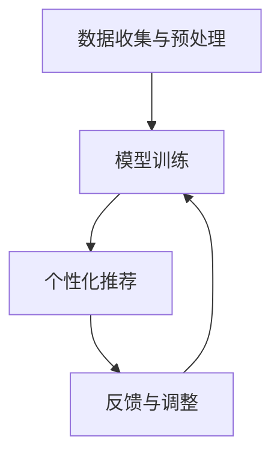

# 大模型在教育中的应用：个性化学习路径

## 1.背景介绍

在现代教育中，个性化学习路径的需求日益增加。传统的教育模式往往无法满足每个学生的独特需求和学习节奏。随着人工智能技术的迅猛发展，特别是大模型（如GPT-4）的出现，为个性化学习路径的实现提供了新的可能性。大模型通过处理大量数据，能够理解和生成自然语言，从而为教育领域带来了革命性的变化。

## 2.核心概念与联系

### 2.1 大模型简介

大模型是指具有大量参数和复杂结构的深度学习模型，通常基于神经网络架构。它们通过训练海量数据，能够执行多种任务，如自然语言处理、图像识别和生成等。

### 2.2 个性化学习路径

个性化学习路径是指根据每个学生的兴趣、能力和学习进度，定制化的学习计划和资源。其目标是最大化学生的学习效果和兴趣。

### 2.3 大模型与个性化学习的联系

大模型通过分析学生的学习数据，能够生成个性化的学习建议和资源。这种能力使得大模型在个性化学习路径的实现中扮演了重要角色。

## 3.核心算法原理具体操作步骤

### 3.1 数据收集与预处理

首先，需要收集学生的学习数据，包括学习进度、考试成绩、兴趣爱好等。然后，对这些数据进行预处理，如去噪、归一化等。

### 3.2 模型训练

使用预处理后的数据训练大模型。训练过程中，模型会学习学生的学习模式和偏好。

### 3.3 个性化推荐

训练好的模型可以根据学生的当前状态，生成个性化的学习建议和资源。这些建议可以是学习材料、练习题、视频教程等。

### 3.4 反馈与调整

根据学生的反馈，调整模型的参数和推荐策略，以不断优化个性化学习路径。



## 4.数学模型和公式详细讲解举例说明

### 4.1 数据表示

假设我们有 $n$ 个学生，每个学生有 $m$ 个特征。我们可以用一个矩阵 $X \in \mathbb{R}^{n \times m}$ 来表示这些数据。

### 4.2 模型训练

我们使用一个神经网络模型 $f(X, \theta)$，其中 $\theta$ 是模型的参数。训练的目标是最小化损失函数 $L$，通常是均方误差（MSE）：

$$
L(\theta) = \frac{1}{n} \sum_{i=1}^{n} (y_i - f(x_i, \theta))^2
$$

### 4.3 个性化推荐

对于每个学生 $i$，模型生成的个性化推荐可以表示为：

$$
\hat{y}_i = f(x_i, \theta)
$$

### 4.4 反馈与调整

根据学生的反馈，我们可以更新模型的参数 $\theta$，使用梯度下降法：

$$
\theta = \theta - \eta \nabla_\theta L(\theta)
$$

其中，$\eta$ 是学习率。

## 5.项目实践：代码实例和详细解释说明

### 5.1 数据收集与预处理

```python
import pandas as pd
from sklearn.preprocessing import StandardScaler

# 读取数据
data = pd.read_csv('student_data.csv')

# 数据预处理
scaler = StandardScaler()
data_scaled = scaler.fit_transform(data)
```

### 5.2 模型训练

```python
import torch
import torch.nn as nn
import torch.optim as optim

# 定义神经网络模型
class Net(nn.Module):
    def __init__(self):
        super(Net, self).__init__()
        self.fc1 = nn.Linear(10, 50)
        self.fc2 = nn.Linear(50, 1)

    def forward(self, x):
        x = torch.relu(self.fc1(x))
        x = self.fc2(x)
        return x

# 初始化模型、损失函数和优化器
model = Net()
criterion = nn.MSELoss()
optimizer = optim.SGD(model.parameters(), lr=0.01)

# 训练模型
for epoch in range(100):
    optimizer.zero_grad()
    outputs = model(torch.tensor(data_scaled, dtype=torch.float32))
    loss = criterion(outputs, torch.tensor(targets, dtype=torch.float32))
    loss.backward()
    optimizer.step()
```

### 5.3 个性化推荐

```python
# 生成个性化推荐
student_data = torch.tensor(data_scaled[0], dtype=torch.float32)
recommendation = model(student_data)
print(f'个性化推荐: {recommendation.item()}')
```

### 5.4 反馈与调整

```python
# 根据反馈调整模型
feedback = 0.8  # 假设学生反馈的评分
loss = criterion(recommendation, torch.tensor([feedback], dtype=torch.float32))
optimizer.zero_grad()
loss.backward()
optimizer.step()
```

## 6.实际应用场景

### 6.1 K-12 教育

在K-12教育中，大模型可以帮助教师为每个学生定制个性化的学习计划，提供适合其学习水平和兴趣的资源。

### 6.2 高等教育

在高等教育中，大模型可以根据学生的专业和兴趣，推荐相关的课程和研究方向，帮助学生更好地规划学术生涯。

### 6.3 在线教育平台

在线教育平台可以利用大模型分析用户行为数据，提供个性化的课程推荐和学习路径，提升用户的学习体验和效果。

## 7.工具和资源推荐

### 7.1 工具

- **TensorFlow**：一个开源的机器学习框架，适用于大规模数据处理和模型训练。
- **PyTorch**：一个深度学习框架，提供灵活的模型定义和训练接口。
- **Scikit-learn**：一个简单易用的机器学习库，适用于数据预处理和基本模型训练。

### 7.2 资源

- **Kaggle**：一个数据科学竞赛平台，提供大量的公开数据集和学习资源。
- **Coursera**：一个在线教育平台，提供丰富的机器学习和人工智能课程。
- **arXiv**：一个学术论文预印本平台，提供最新的研究成果和技术报告。

## 8.总结：未来发展趋势与挑战

### 8.1 未来发展趋势

随着大模型技术的不断进步，个性化学习路径的实现将更加精准和高效。未来，我们可以期待更多智能化的教育工具和平台，帮助学生实现个性化学习目标。

### 8.2 挑战

尽管大模型在个性化学习路径中展现了巨大的潜力，但仍面临一些挑战，如数据隐私问题、模型的可解释性和公平性等。这些问题需要在未来的研究和应用中得到解决。

## 9.附录：常见问题与解答

### 9.1 大模型在教育中的应用有哪些优势？

大模型可以处理大量数据，生成个性化的学习建议和资源，从而提高学习效果和兴趣。

### 9.2 如何确保大模型生成的个性化推荐是准确的？

通过不断收集学生的反馈，调整模型的参数和推荐策略，可以提高个性化推荐的准确性。

### 9.3 大模型在教育中的应用面临哪些挑战？

主要挑战包括数据隐私问题、模型的可解释性和公平性等。

---

作者：禅与计算机程序设计艺术 / Zen and the Art of Computer Programming