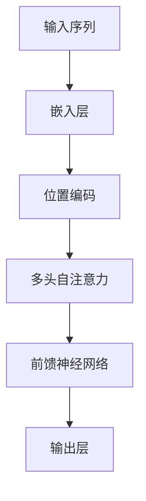

# 大语言模型原理基础与前沿 基于规范的方法

## 1.背景介绍

大语言模型（Large Language Model, LLM）是近年来人工智能领域的一个重要突破。它们通过大量的文本数据进行训练，能够生成高质量的自然语言文本，完成翻译、问答、文本生成等多种任务。大语言模型的出现不仅推动了自然语言处理（NLP）的发展，也在各个行业中展现了广泛的应用前景。

### 1.1 大语言模型的起源与发展

大语言模型的概念最早可以追溯到20世纪50年代的马尔可夫链模型，但真正的突破是在2018年OpenAI发布的GPT（Generative Pre-trained Transformer）系列模型。GPT-3的发布更是将大语言模型推向了一个新的高度，展示了其在生成自然语言文本方面的强大能力。

### 1.2 大语言模型的基本原理

大语言模型的核心是基于深度学习的Transformer架构。Transformer通过自注意力机制（Self-Attention）和多头注意力机制（Multi-Head Attention）来捕捉文本中的长距离依赖关系，从而生成高质量的文本。

### 1.3 大语言模型的应用领域

大语言模型在多个领域中展现了其强大的应用潜力，包括但不限于：
- 自然语言生成（NLG）
- 机器翻译
- 问答系统
- 文本摘要
- 情感分析

## 2.核心概念与联系

在深入探讨大语言模型的原理和应用之前，我们需要了解一些核心概念和它们之间的联系。

### 2.1 自注意力机制

自注意力机制是Transformer架构的核心。它通过计算输入序列中每个位置的表示与其他位置的表示之间的相似度，来捕捉文本中的长距离依赖关系。

### 2.2 多头注意力机制

多头注意力机制是对自注意力机制的扩展。它通过并行计算多个自注意力机制，来捕捉不同子空间中的依赖关系，从而提高模型的表达能力。

### 2.3 位置编码

由于Transformer架构不包含循环神经网络（RNN）或卷积神经网络（CNN），它无法直接捕捉输入序列的位置信息。位置编码通过将位置信息添加到输入序列中，解决了这一问题。

### 2.4 预训练与微调

大语言模型通常采用预训练和微调的训练策略。预训练阶段，模型在大规模无监督数据上进行训练；微调阶段，模型在特定任务的有监督数据上进行训练，以提高其在特定任务上的表现。

## 3.核心算法原理具体操作步骤

在这一部分，我们将详细介绍大语言模型的核心算法原理和具体操作步骤。

### 3.1 数据预处理

数据预处理是大语言模型训练的第一步。它包括文本清洗、分词、词嵌入等步骤。

### 3.2 模型架构设计

大语言模型的核心是Transformer架构。下面是一个简化的Transformer架构图：



### 3.3 模型训练

模型训练包括前向传播、损失计算和反向传播三个步骤。前向传播通过模型生成预测结果，损失计算通过比较预测结果和真实标签计算损失，反向传播通过梯度下降算法更新模型参数。

### 3.4 模型评估

模型评估通过计算模型在验证集上的性能指标（如准确率、精确率、召回率等）来评估模型的表现。

## 4.数学模型和公式详细讲解举例说明

在这一部分，我们将详细讲解大语言模型的数学模型和公式，并通过具体例子说明。

### 4.1 自注意力机制的数学公式

自注意力机制的核心是通过计算输入序列中每个位置的表示与其他位置的表示之间的相似度来捕捉长距离依赖关系。其数学公式如下：

$$
\text{Attention}(Q, K, V) = \text{softmax}\left(\frac{QK^T}{\sqrt{d_k}}\right)V
$$

其中，$Q$、$K$、$V$分别表示查询矩阵、键矩阵和值矩阵，$d_k$表示键矩阵的维度。

### 4.2 多头注意力机制的数学公式

多头注意力机制是对自注意力机制的扩展。其数学公式如下：

$$
\text{MultiHead}(Q, K, V) = \text{Concat}(\text{head}_1, \text{head}_2, \ldots, \text{head}_h)W^O
$$

其中，$\text{head}_i = \text{Attention}(QW_i^Q, KW_i^K, VW_i^V)$，$W_i^Q$、$W_i^K$、$W_i^V$和$W^O$是可训练的权重矩阵。

### 4.3 位置编码的数学公式

位置编码通过将位置信息添加到输入序列中，解决了Transformer无法直接捕捉位置信息的问题。其数学公式如下：

$$
\text{PE}(pos, 2i) = \sin\left(\frac{pos}{10000^{2i/d_{model}}}\right)
$$

$$
\text{PE}(pos, 2i+1) = \cos\left(\frac{pos}{10000^{2i/d_{model}}}\right)
$$

其中，$pos$表示位置，$i$表示维度索引，$d_{model}$表示模型的维度。

## 5.项目实践：代码实例和详细解释说明

在这一部分，我们将通过一个具体的代码实例，详细解释大语言模型的实现过程。

### 5.1 数据预处理

首先，我们需要进行数据预处理。以下是一个简单的文本清洗和分词的代码示例：

```python
import re
import nltk
from nltk.tokenize import word_tokenize

# 下载nltk数据
nltk.download('punkt')

def preprocess_text(text):
    # 转换为小写
    text = text.lower()
    # 移除标点符号
    text = re.sub(r'[^\w\s]', '', text)
    # 分词
    tokens = word_tokenize(text)
    return tokens

text = "Hello, world! This is a test."
tokens = preprocess_text(text)
print(tokens)
```

### 5.2 模型架构设计

接下来，我们设计一个简化的Transformer模型。以下是一个基于PyTorch的代码示例：

```python
import torch
import torch.nn as nn
import torch.nn.functional as F

class MultiHeadAttention(nn.Module):
    def __init__(self, d_model, num_heads):
        super(MultiHeadAttention, self).__init__()
        self.num_heads = num_heads
        self.d_model = d_model

        self.query = nn.Linear(d_model, d_model)
        self.key = nn.Linear(d_model, d_model)
        self.value = nn.Linear(d_model, d_model)
        self.out = nn.Linear(d_model, d_model)

    def forward(self, x):
        batch_size = x.size(0)
        Q = self.query(x)
        K = self.key(x)
        V = self.value(x)

        Q = Q.view(batch_size, -1, self.num_heads, self.d_model // self.num_heads).transpose(1, 2)
        K = K.view(batch_size, -1, self.num_heads, self.d_model // self.num_heads).transpose(1, 2)
        V = V.view(batch_size, -1, self.num_heads, self.d_model // self.num_heads).transpose(1, 2)

        scores = torch.matmul(Q, K.transpose(-2, -1)) / torch.sqrt(torch.tensor(self.d_model // self.num_heads, dtype=torch.float32))
        attention = F.softmax(scores, dim=-1)
        context = torch.matmul(attention, V)
        context = context.transpose(1, 2).contiguous().view(batch_size, -1, self.d_model)
        out = self.out(context)
        return out

class Transformer(nn.Module):
    def __init__(self, d_model, num_heads, num_layers):
        super(Transformer, self).__init__()
        self.layers = nn.ModuleList([MultiHeadAttention(d_model, num_heads) for _ in range(num_layers)])
        self.fc = nn.Linear(d_model, 1)

    def forward(self, x):
        for layer in self.layers:
            x = layer(x)
        out = self.fc(x[:, 0, :])
        return out

# 模型实例化
model = Transformer(d_model=512, num_heads=8, num_layers=6)
print(model)
```

### 5.3 模型训练

以下是一个简单的模型训练代码示例：

```python
import torch.optim as optim

# 定义损失函数和优化器
criterion = nn.MSELoss()
optimizer = optim.Adam(model.parameters(), lr=0.001)

# 训练循环
for epoch in range(10):
    model.train()
    optimizer.zero_grad()
    outputs = model(torch.randn(32, 10, 512))  # 假设输入是32个样本，每个样本10个时间步，每个时间步512维
    loss = criterion(outputs, torch.randn(32, 1))  # 假设目标是32个样本，每个样本1个值
    loss.backward()
    optimizer.step()
    print(f'Epoch {epoch+1}, Loss: {loss.item()}')
```

## 6.实际应用场景

大语言模型在多个实际应用场景中展现了其强大的能力。以下是一些典型的应用场景：

### 6.1 自然语言生成（NLG）

大语言模型可以生成高质量的自然语言文本，应用于新闻生成、内容创作等领域。

### 6.2 机器翻译

大语言模型可以实现高质量的机器翻译，应用于跨语言交流、文档翻译等领域。

### 6.3 问答系统

大语言模型可以实现智能问答系统，应用于客服、教育等领域。

### 6.4 文本摘要

大语言模型可以生成文本摘要，应用于新闻摘要、文档摘要等领域。

### 6.5 情感分析

大语言模型可以进行情感分析，应用于市场分析、舆情监控等领域。

## 7.工具和资源推荐

在这一部分，我们将推荐一些常用的工具和资源，帮助读者更好地理解和应用大语言模型。

### 7.1 工具推荐

- **PyTorch**：一个流行的深度学习框架，适用于大语言模型的实现和训练。
- **TensorFlow**：另一个流行的深度学习框架，适用于大语言模型的实现和训练。
- **Hugging Face Transformers**：一个开源库，提供了多种预训练的大语言模型，方便用户进行微调和应用。

### 7.2 资源推荐

- **《Attention is All You Need》**：Transformer架构的开创性论文，详细介绍了自注意力机制和多头注意力机制。
- **OpenAI GPT-3 论文**：详细介绍了GPT-3的架构和训练方法。
- **Hugging Face 文档**：提供了详细的使用指南和示例代码，帮助用户快速上手大语言模型。

## 8.总结：未来发展趋势与挑战

大语言模型在自然语言处理领域展现了强大的能力，但也面临一些挑战和未来的发展趋势。

### 8.1 未来发展趋势

- **更大规模的模型**：随着计算能力的提升和数据量的增加，未来的大语言模型将会更加庞大，具备更强的生成能力。
- **多模态模型**：未来的大语言模型将不仅限于文本，还会结合图像、音频等多种模态，提升模型的综合能力。
- **更高效的训练方法**：未来的研究将致力于开发更高效的训练方法，降低大语言模型的训练成本。

### 8.2 挑战

- **计算资源需求**：大语言模型的训练需要大量的计算资源，如何降低计算成本是一个重要的挑战。
- **数据隐私问题**：大语言模型的训练需要大量的数据，如何保护数据隐私是一个重要的问题。
- **模型解释性**：大语言模型的内部机制复杂，如何提高模型的解释性是一个重要的研究方向。

## 9.附录：常见问题与解答

在这一部分，我们将解答一些读者在学习和应用大语言模型过程中常见的问题。

### 9.1 大语言模型的训练需要多长时间？

大语言模型的训练时间取决于模型的规模和计算资源。一般来说，训练一个大规模的大语言模型需要数周甚至数月的时间。

### 9.2 如何选择合适的大语言模型？

选择合适的大语言模型取决于具体的应用场景和需求。对于一般的文本生成任务，可以选择GPT-3等预训练模型；对于特定任务，可以选择在特定数据集上微调的模型。

### 9.3 如何提高大语言模型的性能？

提高大语言模型的性能可以从以下几个方面入手：
- 增加模型的规模
- 使用更高效的训练方法
- 使用更大规模的训练数据
- 进行模型微调

### 9.4 大语言模型的应用有哪些限制？

大语言模型的应用主要受到计算资源和数据隐私的限制。此外，大语言模型的生成结果可能存在偏见和错误，需要进行人工审核和校正。

### 9.5 如何保护大语言模型的训练数据隐私？

保护大语言模型的训练数据隐私可以通过以下几种方法：
- 使用数据加密技术
- 采用差分隐私技术
- 使用联邦学习等分布式训练方法

---

作者：禅与计算机程序设计艺术 / Zen and the Art of Computer Programming