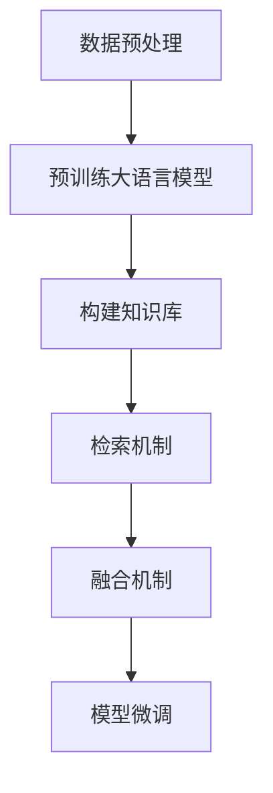

# 大语言模型原理基础与前沿 检索增强型语言模型

## 1.背景介绍

在过去的十年中，人工智能（AI）和自然语言处理（NLP）领域取得了显著的进展。特别是大语言模型（Large Language Models, LLMs），如GPT-3、BERT等，已经在多个应用场景中展示了其强大的能力。然而，尽管这些模型在生成和理解自然语言方面表现出色，它们仍然面临一些挑战，如知识更新滞后、生成内容的准确性和一致性等问题。为了解决这些问题，检索增强型语言模型（Retrieval-Augmented Language Models, RALMs）应运而生。

## 2.核心概念与联系

### 2.1 大语言模型（LLMs）

大语言模型是基于深度学习的模型，通常使用大量的文本数据进行训练，以生成或理解自然语言。它们的核心在于使用变压器（Transformer）架构，通过自注意力机制来捕捉文本中的长距离依赖关系。

### 2.2 检索增强型语言模型（RALMs）

检索增强型语言模型是在大语言模型的基础上，结合了信息检索技术。其核心思想是通过检索外部知识库中的相关信息，来增强语言模型的生成和理解能力。这种方法不仅可以提高生成内容的准确性，还可以使模型具备实时更新知识的能力。

### 2.3 关系与区别

大语言模型主要依赖于预训练的数据，而检索增强型语言模型则通过实时检索外部知识库，来弥补预训练数据的不足。两者的结合可以在保持生成能力的同时，提高内容的准确性和时效性。

## 3.核心算法原理具体操作步骤

### 3.1 数据预处理

在构建检索增强型语言模型之前，首先需要对数据进行预处理。这包括文本的清洗、分词、去停用词等步骤。

### 3.2 预训练大语言模型

使用大规模的文本数据对语言模型进行预训练。常用的预训练方法包括自回归模型（如GPT）和自编码模型（如BERT）。

### 3.3 构建知识库

知识库可以是结构化的数据库，也可以是非结构化的文本集合。知识库的构建需要考虑数据的来源、格式和更新机制。

### 3.4 检索机制

设计高效的检索算法，从知识库中提取与输入文本相关的信息。常用的检索算法包括TF-IDF、BM25和基于向量的检索方法。

### 3.5 融合机制

将检索到的信息与语言模型的生成结果进行融合。常见的方法包括直接拼接、加权平均和注意力机制。

### 3.6 模型微调

在融合机制的基础上，对模型进行微调，以优化其生成效果。



## 4.数学模型和公式详细讲解举例说明

### 4.1 语言模型的数学基础

语言模型的核心是计算一个给定序列的概率。对于一个序列 $X = (x_1, x_2, ..., x_n)$，其概率可以表示为：

$$
P(X) = P(x_1, x_2, ..., x_n) = \prod_{i=1}^{n} P(x_i | x_1, x_2, ..., x_{i-1})
$$

### 4.2 自注意力机制

自注意力机制是变压器架构的核心。其计算公式为：

$$
Attention(Q, K, V) = softmax\left(\frac{QK^T}{\sqrt{d_k}}\right)V
$$

其中，$Q$、$K$、$V$分别表示查询、键和值矩阵，$d_k$是键的维度。

### 4.3 检索增强机制

检索增强机制的核心在于如何将检索到的信息与语言模型的生成结果进行融合。假设检索到的信息为 $R$，输入文本为 $X$，则融合后的生成结果 $Y$ 可以表示为：

$$
Y = f(X, R)
$$

其中，$f$ 可以是简单的拼接操作，也可以是复杂的注意力机制。

### 4.4 实例说明

假设我们有一个输入句子 "What is the capital of France?"，通过检索机制，我们从知识库中获取到相关信息 "The capital of France is Paris."。然后，我们将检索到的信息与输入句子进行融合，生成最终的回答 "The capital of France is Paris."

## 5.项目实践：代码实例和详细解释说明

### 5.1 数据预处理

```python
import re

def preprocess_text(text):
    # 去除特殊字符
    text = re.sub(r'\W', ' ', text)
    # 转换为小写
    text = text.lower()
    # 去除多余的空格
    text = re.sub(r'\s+', ' ', text)
    return text

sample_text = "What is the capital of France?"
cleaned_text = preprocess_text(sample_text)
print(cleaned_text)
```

### 5.2 预训练大语言模型

```python
from transformers import GPT2LMHeadModel, GPT2Tokenizer

tokenizer = GPT2Tokenizer.from_pretrained('gpt2')
model = GPT2LMHeadModel.from_pretrained('gpt2')

input_text = "What is the capital of France?"
input_ids = tokenizer.encode(input_text, return_tensors='pt')
output = model.generate(input_ids, max_length=50, num_return_sequences=1)
print(tokenizer.decode(output[0], skip_special_tokens=True))
```

### 5.3 构建知识库

```python
knowledge_base = {
    "France": "The capital of France is Paris.",
    "Germany": "The capital of Germany is Berlin."
}

def retrieve_info(query):
    for key, value in knowledge_base.items():
        if key.lower() in query.lower():
            return value
    return "Information not found."

query = "What is the capital of France?"
retrieved_info = retrieve_info(query)
print(retrieved_info)
```

### 5.4 融合机制

```python
def fuse_information(input_text, retrieved_info):
    return input_text + " " + retrieved_info

fused_text = fuse_information(input_text, retrieved_info)
print(fused_text)
```

### 5.5 模型微调

```python
# 这里省略了具体的微调代码，实际操作中需要使用大量的标注数据进行微调
```

## 6.实际应用场景

### 6.1 问答系统

检索增强型语言模型在问答系统中有广泛的应用。通过实时检索外部知识库，可以提供更加准确和及时的回答。

### 6.2 文档生成

在文档生成任务中，检索增强型语言模型可以通过检索相关文档，提高生成内容的质量和一致性。

### 6.3 聊天机器人

聊天机器人可以利用检索增强型语言模型，通过检索外部知识库，提供更加智能和个性化的对话体验。

## 7.工具和资源推荐

### 7.1 工具

- **Transformers**：由Hugging Face提供的开源库，支持多种预训练语言模型。
- **ElasticSearch**：一个强大的分布式搜索引擎，适用于构建知识库和检索机制。
- **spaCy**：一个高效的自然语言处理库，适用于文本预处理和特征提取。

### 7.2 资源

- **OpenAI GPT-3**：一个强大的预训练语言模型，适用于多种NLP任务。
- **Wikipedia**：一个丰富的知识库，可以用于构建检索增强型语言模型的外部知识库。
- **ArXiv**：一个学术论文预印本平台，提供最新的研究成果和技术报告。

## 8.总结：未来发展趋势与挑战

检索增强型语言模型在提高生成内容的准确性和时效性方面展示了巨大的潜力。然而，未来的发展仍然面临一些挑战，如如何高效地检索和融合信息、如何处理多模态数据等。随着技术的不断进步，我们有理由相信，检索增强型语言模型将在更多的应用场景中发挥重要作用。

## 9.附录：常见问题与解答

### 9.1 检索增强型语言模型的优势是什么？

检索增强型语言模型通过结合信息检索技术，可以提高生成内容的准确性和时效性，弥补大语言模型在知识更新和内容一致性方面的不足。

### 9.2 如何构建高效的知识库？

构建高效的知识库需要考虑数据的来源、格式和更新机制。可以使用结构化的数据库或非结构化的文本集合，并设计高效的检索算法。

### 9.3 检索增强型语言模型的应用场景有哪些？

检索增强型语言模型在问答系统、文档生成和聊天机器人等多个应用场景中有广泛的应用。

### 9.4 如何进行模型微调？

模型微调需要使用大量的标注数据，通过优化模型参数，提高其生成效果。具体的微调方法可以参考相关的研究论文和技术报告。

---

作者：禅与计算机程序设计艺术 / Zen and the Art of Computer Programming