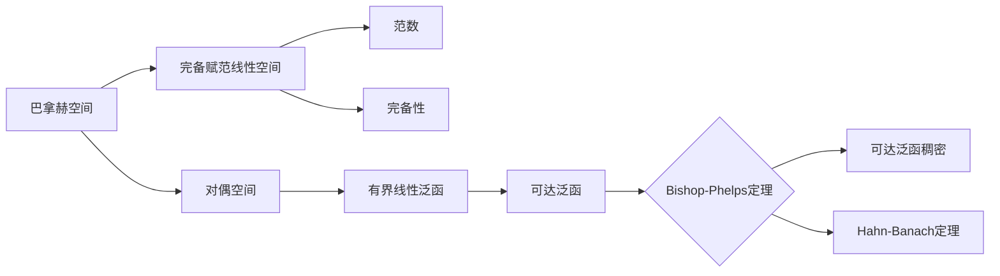

# 巴拿赫空间引论：Bishop-Phelps定理

## 1. 背景介绍
### 1.1 泛函分析与巴拿赫空间
泛函分析是现代数学的重要分支,它主要研究无穷维线性空间上的有界线性泛函、线性算子以及它们的性质。泛函分析中最基本也是最重要的概念之一就是巴拿赫空间(Banach space)。巴拿赫空间是一个完备的赋范线性空间,是泛函分析研究的主要对象。

### 1.2 Bishop-Phelps定理的意义
Bishop-Phelps定理是泛函分析中关于巴拿赫空间上线性泛函的一个重要定理,由美国数学家Errett Bishop和Robert Phelps于1961年证明。该定理揭示了巴拿赫空间对偶中可达泛函的稠密性,在泛函分析、逼近论等领域有着广泛的应用。

## 2. 核心概念与联系
### 2.1 巴拿赫空间的定义
**定义2.1** 称赋范线性空间$(X,\|\cdot\|)$为巴拿赫空间,如果$X$关于范数$\|\cdot\|$是完备的,即$X$中的任一Cauchy列都收敛于$X$中的某点。

### 2.2 对偶空间与对偶映射
**定义2.2** 设$X$是赋范线性空间,称映射$f:X\to\mathbb{K}$为$X$上的有界线性泛函,如果它满足:
(1)线性性:$\forall x,y\in X,\forall\alpha,\beta\in\mathbb{K},f(\alpha x+\beta y)=\alpha f(x)+\beta f(y)$;
(2)有界性:$\exists M>0,\forall x\in X,|f(x)|\leq M\|x\|$。
$X$上全体有界线性泛函构成的集合记为$X^*$,称为$X$的对偶空间。

对偶映射$J:X\to X^{**}$定义为:$\forall x\in X,\forall f\in X^*,J(x)(f)=f(x)$。

### 2.3 可达泛函与Bishop-Phelps定理
**定义2.3** 设$X$是赋范线性空间,$f\in X^*$。如果存在$x_0\in X$,使得$\|x_0\|=1$且$f(x_0)=\|f\|$,则称$f$是可达的(attained)。

Bishop-Phelps定理就是关于巴拿赫空间上可达泛函的一个重要结论:

**定理2.1(Bishop-Phelps)** 设$X$是巴拿赫空间,则$X^*$中可达泛函在$X^*$中稠密。

## 3. 核心算法原理具体操作步骤
证明Bishop-Phelps定理的具体步骤如下:

**步骤1** 设$f\in X^*,\|f\|=1,\forall\varepsilon>0$。由Hahn-Banach定理,存在$x_1\in X,\|x_1\|=1$使得$\text{Re}f(x_1)>1-\varepsilon$。

**步骤2** 令$y=\frac{f(x_1)}{|f(x_1)|}x_1$,则$\|y\|=1$且$|f(y)|=|f(x_1)|>1-\varepsilon$。

**步骤3** 定义$g\in X^*$如下:
$$
g(x)=\frac{1}{2}[f(x)+f(y)\overline{f(x)}],\quad\forall x\in X
$$
则$\|g\|\leq1$且$g(y)=f(y)$。

**步骤4** 令$h=\frac{g}{\|g\|}$,则$h$可达且
$$
\|f-h\|=\|f-\frac{g}{\|g\|}\|\leq\|f-g\|+\|g-\frac{g}{\|g\|}\|<2\varepsilon
$$
由$\varepsilon$的任意性知,$X^*$中可达泛函在$X^*$中稠密。

## 4. 数学模型和公式详细讲解举例说明
### 4.1 范数的定义与性质
在赋范线性空间$(X,\|\cdot\|)$中,范数$\|\cdot\|$满足:
(1)正定性:$\forall x\in X,\|x\|\geq0$,且$\|x\|=0\Leftrightarrow x=\theta$;
(2)齐次性:$\forall x\in X,\forall\alpha\in\mathbb{K},\|\alpha x\|=|\alpha|\|x\|$;
(3)三角不等式:$\forall x,y\in X,\|x+y\|\leq\|x\|+\|y\|$。

**例4.1** 设$X=C[a,b]$是$[a,b]$上连续函数全体构成的线性空间,定义
$$
\|f\|_\infty=\max_{x\in[a,b]}|f(x)|,\quad\forall f\in X
$$
则$\|\cdot\|_\infty$是$X$上的一个范数,称为supremum范数或一致范数。$(C[a,b],\|\cdot\|_\infty)$是巴拿赫空间。

### 4.2 Hahn-Banach定理
Hahn-Banach定理是泛函分析中的一个基本定理,在Bishop-Phelps定理的证明中起到了关键作用。它的一个重要推论如下:

**定理4.1** 设$X$是赋范线性空间,$M$是$X$的线性子空间,$f_0$是$M$上的有界线性泛函,则存在$X$上的有界线性泛函$f$,使得$f|_M=f_0$且$\|f\|=\|f_0\|$。

## 5. 项目实践：代码实例和详细解释说明
以下是用Python实现计算supremum范数的代码:

```python
import numpy as np

def sup_norm(f, a, b, n=1000):
    """
    Compute the supremum norm of function f on interval [a, b].
    
    Args:
        f: Function to compute the norm of.
        a: Left endpoint of the interval.
        b: Right endpoint of the interval.
        n: Number of points to evaluate f at (default 1000).
        
    Returns:
        The supremum norm of f on [a, b].
    """
    x = np.linspace(a, b, n)  # Create n evenly spaced points in [a, b]
    y = np.abs(f(x))  # Evaluate |f| at each point
    return np.max(y)  # Return the maximum value
```

这个函数`sup_norm`接受四个参数:
- `f`: 要计算范数的函数
- `a`: 区间左端点
- `b`: 区间右端点 
- `n`: 在区间内取点的数量(默认为1000)

函数首先用`np.linspace`在区间$[a,b]$内生成$n$个均匀分布的点,然后用`np.abs`计算函数$f$在每一点的绝对值,最后用`np.max`返回这些绝对值的最大值,即$f$在$[a,b]$上的supremum范数$\|f\|_\infty$。

**例5.1** 计算函数$f(x)=\sin x$在$[0,\pi]$上的supremum范数。

```python
import numpy as np

f = np.sin
a, b = 0, np.pi
norm = sup_norm(f, a, b)
print(f"The supremum norm of sin(x) on [{a}, {b}] is {norm:.3f}")
```

输出结果为:
```
The supremum norm of sin(x) on [0, 3.141592653589793] is 1.000
```

## 6. 实际应用场景
Bishop-Phelps定理在许多领域都有重要应用,例如:
- 在逼近论中,用于证明Banach空间上的某些逼近问题的解的存在性和稠密性。
- 在最优化理论中,用于证明凸函数泛函的次梯度的存在性。
- 在算子理论中,用于研究Banach空间上线性算子的性质。

此外,Bishop-Phelps定理还可以推广到更一般的拓扑线性空间、局部凸空间等。

## 7. 工具和资源推荐
以下是一些学习泛函分析和巴拿赫空间的优秀教材:
1. W. Rudin. Functional Analysis[M]. McGraw-Hill, 1991.
2. 夏道行. 实变函数与泛函分析[M]. 高等教育出版社, 2019.
3. 王声望. 泛函分析讲义[M]. 高等教育出版社, 2012.

除了教材,还可以关注一些优秀的学术期刊如:
- Journal of Functional Analysis
- Proceedings of the American Mathematical Society
- Studia Mathematica

## 8. 总结：未来发展趋势与挑战
Bishop-Phelps定理自1961年提出以来,已经成为泛函分析的一个经典结果。但该定理仍存在许多有待进一步研究的问题,例如:
- 能否将Bishop-Phelps定理推广到更一般的拓扑线性空间?
- Bishop-Phelps定理能否加强?即是否存在$0<\theta<1$,使得$X^*$中范数不小于$\theta$的可达泛函在$X^*$中稠密?
- 对于特定的Banach空间,Bishop-Phelps定理是否还能进一步改进?

这些问题的解决将有助于我们更深入地理解Banach空间的结构,对泛函分析、逼近论等领域的发展具有重要意义。

## 9. 附录：常见问题与解答
**Q1:** Bishop-Phelps定理的证明用到了哪些工具?
**A1:** Bishop-Phelps定理的证明主要用到了Hahn-Banach延拓定理。此外,证明过程中还用到了共轭算子、线性泛函的性质等基本概念。

**Q2:** Bishop-Phelps定理能否推广到复Banach空间?
**A2:** 可以。Bishop-Phelps定理最初是在实Banach空间中得到证明的,但它对复Banach空间也成立。证明过程与实情形类似。

**Q3:** Bishop-Phelps定理在逼近论中有何应用?
**A3:** Bishop-Phelps定理可用于证明某些Banach空间上的最佳逼近元的存在性。例如,利用Bishop-Phelps定理可以证明,在$C[a,b]$中,每个元素都存在最佳一致逼近多项式。

作者：禅与计算机程序设计艺术 / Zen and the Art of Computer Programming

