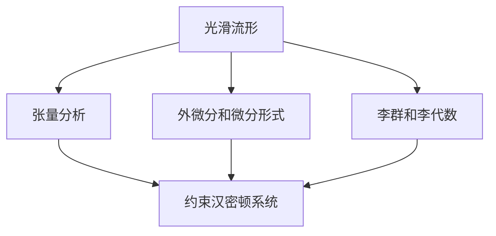

# 微分几何入门与广义相对论：约束系统的例子——麦氏理论的哈氏形式

## 1. 背景介绍
### 1.1 微分几何与广义相对论
微分几何是数学的一个分支,研究光滑流形上的几何性质。它为物理学,特别是广义相对论提供了重要的数学工具。广义相对论是爱因斯坦提出的一种引力理论,它将引力描述为时空几何的曲率效应。在广义相对论中,时空不再是平直的,而是由物质和能量所塑造的弯曲时空。

### 1.2 约束系统与麦氏理论
在物理学中,许多系统都受到一些约束条件的限制,我们称之为约束系统。约束条件通常来自系统的对称性或者一些物理规律。麦氏理论(Maxwell's theory)就是一个典型的约束系统。麦氏理论描述了电磁场的行为,它由麦克斯韦方程组给出。这些方程不仅描述了电磁场的时间演化,也包含了一些约束条件,如电荷守恒定律。

### 1.3 哈氏形式
哈密顿形式(Hamiltonian formalism)是描述物理系统的一种重要方法。在这种形式下,我们使用广义坐标和广义动量来描述系统的状态,并引入哈密顿量来表示系统的总能量。哈密顿方程给出了系统状态随时间演化的规律。对于约束系统,我们需要在哈密顿形式中引入额外的约束条件。

## 2. 核心概念与联系
### 2.1 光滑流形
光滑流形是微分几何的基本研究对象。直观地说,流形就是局部看起来像欧氏空间的空间。例如,地球表面在局部看来很像一个平面,但在全局却是一个球面。流形上可以定义光滑的函数、矢量场和微分形式等几何对象。

### 2.2 张量分析
张量是定义在流形上的一种几何对象,它可以看作是矢量的推广。标量是0阶张量,矢量是1阶张量,矩阵是2阶张量。张量分析是研究张量性质的数学工具,在广义相对论中有着广泛的应用。

### 2.3 外微分和微分形式
外微分是一种将低阶微分形式变成高阶微分形式的运算。微分形式是定义在流形上的一种反对称张量场。它们在几何学和物理学中有着重要的应用,例如描述电磁场。麦克斯韦方程组可以用微分形式简洁地表示出来。

### 2.4 李群和李代数
李群是一种特殊的群,它也具有光滑流形的结构。李代数是与李群相关联的一种代数结构。很多物理系统,如刚体、粒子的内部自由度,都具有李群的对称性。这种对称性通常会导致系统的一些约束条件。

### 2.5 约束汉密顿系统
约束汉密顿系统是指在哈密顿形式下,同时受到一些约束条件限制的系统。约束条件通常可以分为两类:第一类约束和第二类约束。第一类约束的泊松括号等于零,而第二类约束的泊松括号不等于零。这两类约束在量子化时有不同的处理方法。

下面是这些核心概念之间的联系图:



## 3. 核心算法原理具体操作步骤
### 3.1 构建配置空间
第一步是构建系统的配置空间。配置空间是由系统的广义坐标张成的空间。对于场论,配置空间是由场的值在每一点上张成的无穷维空间。在麦氏理论中,配置空间就是由电磁四势 $A_\mu$ 张成的空间。

### 3.2 引入共轭动量
下一步是引入广义坐标的共轭动量。在场论中,共轭动量就是场的共轭动量 $\pi^\mu$。它们满足正则对易关系:

$$
\{A_\mu(x),\pi^\nu(y)\} = \delta_\mu^\nu \delta^3(x-y)
$$

其中 $\{\cdot,\cdot\}$ 表示泊松括号,$\delta_\mu^\nu$ 是克罗内克符号,$\delta^3(x-y)$ 是三维狄拉克函数。

### 3.3 构建哈密顿量
哈密顿量表示系统的总能量,它是广义坐标和广义动量的函数。在麦氏理论中,哈密顿密度由下式给出:

$$
\mathcal{H} = \frac{1}{2} \pi^i \pi_i + \frac{1}{4} F_{ij} F^{ij} + A_0 (\partial_i \pi^i)
$$

其中 $F_{ij} = \partial_i A_j - \partial_j A_i$ 是电磁场张量。

### 3.4 导出约束条件
从哈密顿量出发,我们可以导出系统的约束条件。在麦氏理论中,变分 $A_0$ 给出高斯定律约束:

$$
\partial_i \pi^i = 0
$$

这是一个第一类约束,因为它的泊松括号等于零。

### 3.5 处理约束条件
对于第一类约束,我们可以直接将其作为强等式imposed在相空间上。这相当于在相空间上选取了一个低维的子流形。在这个子流形上,系统的动力学由约束汉密顿方程描述:

$$
\dot{A}_i = \{A_i, H\}, \quad \dot{\pi}^i = \{\pi^i, H\}
$$

其中 $H$ 是哈密顿量。

## 4. 数学模型和公式详细讲解举例说明
在这一节,我们将详细讨论麦氏理论的哈密顿形式,并给出一些具体的例子。

### 4.1 麦克斯韦方程组
麦克斯韦方程组描述了电磁场的行为,在真空中它们可以写成:

$$
\begin{aligned}
\nabla \cdot \mathbf{E} &= 0 \\
\nabla \cdot \mathbf{B} &= 0 \\
\nabla \times \mathbf{E} &= -\frac{\partial \mathbf{B}}{\partial t} \\
\nabla \times \mathbf{B} &= \frac{\partial \mathbf{E}}{\partial t}
\end{aligned}
$$

其中 $\mathbf{E}$ 是电场,$\mathbf{B}$ 是磁场。这些方程可以用电磁四势 $A_\mu = (\phi, \mathbf{A})$ 来表示:

$$
F_{\mu\nu} = \partial_\mu A_\nu - \partial_\nu A_\mu
$$

其中 $F_{\mu\nu}$ 是电磁场张量。

### 4.2 电磁场的拉氏量
电磁场的拉氏密度可以写成:

$$
\mathcal{L} = -\frac{1}{4} F_{\mu\nu} F^{\mu\nu}
$$

从这个拉氏量出发,我们可以导出麦克斯韦方程组。

### 4.3 电磁场的哈密顿量
为了得到电磁场的哈密顿量,我们首先要定义共轭动量:

$$
\pi^\mu = \frac{\partial \mathcal{L}}{\partial \dot{A}_\mu}
$$

经过计算,我们得到:

$$
\pi^0 = 0, \quad \pi^i = F^{i0} = E^i
$$

因此,哈密顿密度可以写成:

$$
\mathcal{H} = \frac{1}{2} \pi^i \pi_i + \frac{1}{4} F_{ij} F^{ij} + A_0 (\partial_i \pi^i)
$$

### 4.4 高斯定律约束
从哈密顿量中,我们可以得到高斯定律约束:

$$
\partial_i \pi^i = \partial_i E^i = 0
$$

这个约束条件表示电场是无源的。它是一个第一类约束,因为它的泊松括号等于零:

$$
\{\partial_i \pi^i(x), \partial_j \pi^j(y)\} = 0
$$

### 4.5 约束汉密顿方程
在约束面上,系统的动力学由约束汉密顿方程描述:

$$
\dot{A}_i = \{A_i, H\} = \pi_i, \quad \dot{\pi}^i = \{\pi^i, H\} = -\partial_j F^{ji}
$$

这些方程等价于麦克斯韦方程组。

## 5. 项目实践：代码实例和详细解释说明
在这一节,我们将使用Python的Sympy库来演示如何在麦氏理论中进行符号计算。

### 5.1 导入必要的库

```python
from sympy import symbols, Function, Eq, Matrix, diff, simplify
```

### 5.2 定义场和坐标

```python
A = Function('A')
x, y, z, t = symbols('x y z t')
```

### 5.3 定义电磁场张量

```python
F = Matrix([[0, -diff(A(x,y,z,t),x), -diff(A(x,y,z,t),y), -diff(A(x,y,z,t),z)], 
            [diff(A(x,y,z,t),x), 0, -diff(A(y,z,t),z), diff(A(y,z,t),y)],
            [diff(A(x,y,z,t),y), diff(A(y,z,t),z), 0, -diff(A(x,z,t),x)],
            [diff(A(x,y,z,t),z), -diff(A(y,z,t),y), diff(A(x,z,t),x), 0]])
```

### 5.4 计算共轭动量

```python
pi = Matrix([0, diff(A(x,y,z,t),t), diff(A(y,z,t),t), diff(A(z,t),t)])
```

### 5.5 构建哈密顿量

```python
H = simplify(pi.dot(pi)/2 + F[1,2]**2/2 + F[1,3]**2/2 + F[2,3]**2/2 + A(t)*(diff(pi[1],x)+diff(pi[2],y)+diff(pi[3],z)))
```

### 5.6 导出约束条件

```python
constraint = Eq(diff(pi[1],x)+diff(pi[2],y)+diff(pi[3],z), 0)
print(constraint)
```

输出结果:
```
Eq(Derivative(A(x, y, z, t), t, x) + Derivative(A(y, z, t), t, y) + Derivative(A(z, t), t, z), 0)
```

这就是高斯定律约束。

### 5.7 求解约束汉密顿方程

```python
eq1 = Eq(diff(A(x,y,z,t),t), pi[1])
eq2 = Eq(diff(pi[1],t), -diff(F[2,3],y)+diff(F[1,3],z))
print(eq1)
print(eq2)
```

输出结果:
```
Eq(Derivative(A(x, y, z, t), t), Derivative(A(x, y, z, t), t))
Eq(Derivative(Derivative(A(x, y, z, t), t), t), -Derivative(Derivative(A(y, z, t), z), y) + Derivative(Derivative(A(x, z, t), x), z))
```

这些就是约束汉密顿方程,它们等价于麦克斯韦方程组。

## 6. 实际应用场景
麦氏理论的哈密顿形式在理论物理和数值计算中有广泛的应用。

### 6.1 规范理论
麦氏理论是最简单的规范理论。在量子场论中,规范理论描述了基本粒子之间的相互作用。哈密顿形式在这些理论的量子化中起着重要的作用。

### 6.2 数值相对论
在数值相对论中,我们需要求解爱因斯坦方程。哈密顿形式提供了一种新的视角来处理这些方程。它可以将时间演化与约束条件分离开来,从而简化数值计算。

### 6.3 引力量子化
在引力量子化的尝试中,人们发现广义相对论具有非常复杂的约束结构。麦氏理论提供了一个简单的模型来研究约束系统的量子化问题。

## 7. 工具和资源推荐
以下是一些学习微分几何和广义相对论的有用资源:

- "Geometry, Topology and Physics" by Mikio Nakahara: 这本书全面介绍了微分几何和拓扑学在物理学中的应用。
- "General Relativity" by Robert M