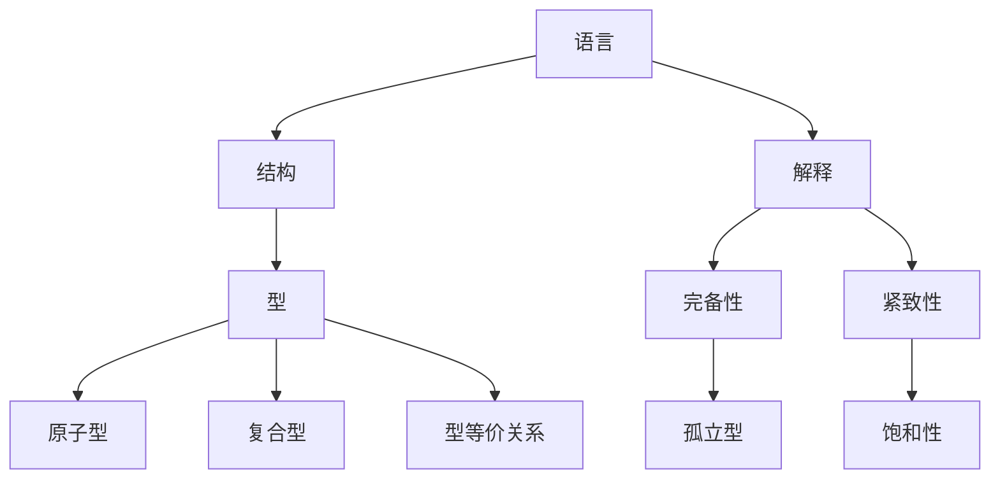

# 模型论基础：型，完备公式和孤立型


## 1. 背景介绍

### 1.1 模型论的起源与发展

#### 1.1.1 模型论的起源

模型论起源于20世纪初数理逻辑的发展。早期的数理逻辑主要关注形式系统的元理论,如希尔伯特(D.Hilbert)的形式主义和哥德尔(K.Gödel)的不完备性定理等。在这一时期,逻辑学家开始注意到,形式系统的语法结构与其意义之间存在着某种对应关系,由此产生了语义的概念和模型的雏形。

20世纪30年代,塔斯基(A.Tarski)提出了语义真理的概念,并系统地研究了谓词逻辑的语义理论,奠定了模型论的基础。塔斯基引入满足关系的概念,使得语法结构与语义解释联系起来,开创了语义学的新纪元。

#### 1.1.2 模型论的发展历程

20世纪50年代,在鲁宾逊(A.Robinson)和 Henkin(L.Henkin) 等人的推动下,模型论进入了蓬勃发展阶段。鲁宾逊提出了非标准分析的理论,将无穷小量引入分析学,建立了连续统的非标准模型。 Henkin证明了形式系统的完全性定理,揭示了语法推演与语义蕴涵的一致性。

20世纪60-70年代是模型论的黄金时期。Keisler(H.J.Keisler),Shelah(S.Shelah)等一批杰出的数理逻辑学家推动了模型论的快速发展。Morley(M.Morley)证明了 可数理论的范畴性定理,Shelah创立了稳定理论,极大地丰富了模型论的内容。模型论在此期间确立了作为数理逻辑一个独立分支的地位。

#### 1.1.3 模型论的重要里程碑

- 1930s 塔斯基提出语义真理概念,奠定模型论基础
- 1950s 鲁宾逊发展非标准分析,Henkin证明完全性定理
- 1960s Morley证明可数理论范畴性定理
- 1970s Shelah创立稳定理论
- 1990s Hrushovski构造新的孤立型,模型论与其他数学分支联系紧密

### 1.2 模型论在数学逻辑中的地位

#### 1.2.1 模型论与数理逻辑的关系

模型论是数理逻辑的三大支柱之一,与证明论、递归论并列。证明论研究形式系统的推演规则和证明过程,递归论研究可计算性和可判定性问题,而模型论则主要研究形式语言的语义解释和结构性质。三者各有侧重,但又相互交叉,共同构成了数理逻辑的基本框架。

从某种意义上说,模型论是连接语法与语义的桥梁。一方面,模型论以形式语言为研究对象,探讨语法结构的语义解释问题。另一方面,模型论又将语义域抽象为数学结构,运用代数、拓扑、集合论等方法研究结构的性质。因此,模型论在数理逻辑中居于十分重要的地位。

#### 1.2.2 模型论在数学基础中的作用

数学基础是数学哲学的核心问题之一,主要探讨数学的本质、数学对象的存在性以及数学命题的真理性等问题。模型论为这些问题的研究提供了新的视角和方法。

模型论的视角使得我们能够在语法与语义的框架内审视数学理论。通过构造数学理论的模型,可以确立相应数学对象的存在性,同时揭示逻辑蕴涵与语义推理的一致性。通过研究模型的性质,可以比较不同数学理论的表达能力和逻辑强度。因此,模型论已经成为现代数学基础的一个重要组成部分。

#### 1.2.3 模型论与其他数学分支的联系

模型论为数学的许多分支提供了新的研究工具和思路。20世纪后期以来,模型论与代数、几何、分析、组合等数学分支的交叉渗透日益频繁,催生了许多新的研究方向。

在代数方面,模型论与群论、环论、域论等产生了密切的联系。对代数结构的元数学研究,促进了稳定群论、o-极小理论等新领域的发展。在几何方面,Zilber(B.Zilber)将模型论的方法引入复几何,在Zariski几何中构造了丰富的模型。在分析学方面,非标准分析为经典分析提供了新的框架,超实数系的研究也因此获得突破性进展。可见模型论已经成为现代数学发展的重要推动力。

### 1.3 模型论的应用领域

#### 1.3.1 模型论在计算机科学中的应用

模型论与计算机科学有着天然的联系。图灵机、λ演算等计算模型本质上就是形式系统的特例。程序语言的语义学研究也需要借助模型论的工具和方法。

在计算机科学的许多领域,模型论都有重要的应用。例如,在数据库理论中,关系模型可以看作一阶逻辑的特殊模型,函数依赖对应于一阶逻辑蕴涵。在形式验证领域,模型检测常常被用来验证程序和硬件系统的正确性。另外,在类型论和证明助手的研究中,Henkin 模型和 Kripke语义也是不可或缺的工具。

#### 1.3.2 模型论在人工智能领域的应用

人工智能是模型论的一个重要应用领域。知识表示、自动推理、机器学习等人工智能的核心问题,都离不开模型论的基本概念和方法。

在知识表示方面,描述逻辑是一种基于一阶逻辑的知识表示形式,其语义解释就是模型论中的结构。在自动推理方面,Robinson提出的合一算法,本质上就是一阶逻辑的语义蕴涵问题,而逻辑程序设计语言Prolog的执行机制,也可看作是一阶逻辑的模型检测。在机器学习方面,归纳逻辑程序设计(ILP)以一阶逻辑为知识表示,运用逻辑归纳的方法从实例中学习概念。可见模型论已经渗透到人工智能的诸多领域。

#### 1.3.3 模型论在其他学科中的应用

除了数学和计算机科学,模型论在其他许多学科中也有广泛的应用。在数理经济学中,菲利普斯(A.Phillips)利用非标准分析的方法,将 "无穷小"引入经济模型,创立了"非标准宏观经济学"。在博弈论中,对博弈的策略性also可以用模型论的语言刻画。甚至在语言学、心理学等人文社会科学中,模型论的思想也开始得到运用,对人类认知的逻辑结构进行建模分析。可以预见,随着模型论的不断发展,其应用领域必将变得更加广阔。

## 2. 核心概念与联系

### 2.1 语言、结构与解释

#### 2.1.1 一阶语言的定义

一阶语言是一类形式语言,包含以下基本成分:

1. 个体变元: $x,y,z,...$ (可指称论域中的个体对象)
2. 个体常元: $c_1,c_2,...$ (指称某个特定个体) 
3. 函数符号: $f_1^n, f_2^m, ...$ (n,m为函数符号的元数)
4. 关系符号: $R_1^k,R_2^l,...$ (k,l为关系符号的元数)
5. 逻辑连接词: $\neg,\wedge,\vee,\rightarrow,\leftrightarrow$
6. 量词: $\forall$ (全称量词), $\exists$ (存在量词) 
7. 辅助符号: 括号、逗号等

一阶语言的项和公式可通过上述符号递归定义而得。例如 $R(f(c),x)$ 就是一个合法的原子公式。命题逻辑实际上可视为一阶语言的特例。相比之下,一阶语言具有更强的表达能力。

#### 2.1.2 结构的定义

结构(Structure)是一阶语言的语义解释,一个结构 $\mathcal{A}$ 由以下部分组成:

1. 非空论域 $A$ (个体对象的集合)
2. 常元 $c^{\mathcal{A}} \in A$ 
3. 函数 $f^{\mathcal{A}}: A^n \to A$
4. 关系 $R^{\mathcal{A}} \subseteq A^k$

其中,常元、函数、关系的解释须与一阶语言的符号相对应。例如,对语言 $\{c,f^1,R^2\}$,其一个可能的结构为:
- 论域: $\mathbb{N}$ (自然数集)
- $c^\mathcal{A} = 0$
- $f^\mathcal{A}(x) = x+1$    
- $R^\mathcal{A} = \{(x,y) \mid x < y\}$ (小于关系)

这样,结构赋予了语言以具体的含义。不同结构反映了不同的数学对象。结构是模型论研究的基本单元。

#### 2.1.3 解释的概念

对给定一阶语言 $\mathcal{L}$ 和结构 $\mathcal{A}$, $\mathcal{L}$-公式在 $\mathcal{A}$ 上的解释(值),可通过归纳地定义"满足关系" $\vDash$ 得到:

1. 若 $\varphi$ 是原子公式 $R(t_1,...,t_k)$,则

   $\mathcal{A} \vDash \varphi \iff (t_1^\mathcal{A},...,t_k^\mathcal{A}) \in R^\mathcal{A}$

2. 若 $\varphi$ 是 $\psi_1 \wedge \psi_2$, 则

   $\mathcal{A} \vDash \varphi \iff \mathcal{A} \vDash \psi_1$ 且 $\mathcal{A} \vDash \psi_2$ 

3. 若 $\varphi$ 是 $\neg \psi$, 则
   
   $\mathcal{A} \vDash \varphi \iff \mathcal{A} \nvDash \psi$

4. 若 $\varphi$ 是 $\forall x \psi(x)$,则

   $\mathcal{A} \vDash \varphi \iff$ 对任意 $a \in A$, $\mathcal{A} \vDash \psi(a)$ 

其中 $t^\mathcal{A}$ 表示项 $t$ 在 $\mathcal{A}$ 上的解释,可类似归纳定义。 

$\mathcal{A} \vDash \varphi$ 读作"$\mathcal{A}$ 满足 $\varphi$",或"$\varphi$ 在 $\mathcal{A}$ 上为真"。解释揭示了语法推导与语义推理的内在一致性。塔斯基将"语义真"定义为"所有满足给定公式的结构",由此开辟了语义研究的新局面。

### 2.2 型的概念与分类

#### 2.2.1 型的定义

型(Type)刻画了一阶语言的公式在结构中的性质。设 $\mathcal{L}$ 为一阶语言,$\mathcal{A}$ 为 $\mathcal{L}$-结构,元组 $\bar{a}= (a_1,..., a_n)$ 属于 $A^n$ 。定义:
$$\text{tp}^{\mathcal{A}}(\bar{a})=\{\varphi(\bar{v}) \mid \varphi \text{ is } \mathcal{L}\text{-formula with free variables } \bar{v} \text{ and } \mathcal{A} \vDash \varphi(\bar{a})\}$$
称 $\text{tp}^{\mathcal{A}}(\bar{a})$ 为元组 $\bar{a}$ 在 $\mathcal{A}$ 中的型。直观上,型描述了元组在结构中满足的所有性质。

特别地,若 $\bar{a}$ 是单个元素,则称 $\text{tp}^{\mathcal{A}}(a)$ 为 $a$ 的完全1-型。当语言和结构明确时,也简记为 $\text{tp}(a)$。显然,型包含了个体元素在结构中的全部信息。

#### 2.2.2 原子型与复合型

若 $p$ 是 $\mathcal{L}$-结构 $\mathcal{A}$ 中的一个型,如果 $p$ 中的公式都是原子公式或其否定,则称 $p$ 为原子型(Atom type)。原子型刻画了元组间的基本关系。

相应地,若型中出现量词公式,则称为复合型(Compound type)。复合型包含了元组更复杂的性质。

从公式的谓词逻辑等价关系出发,可以证明,原子型与复合型之间存在着一一对应关系。这表明原子公式虽然简单,但已经足以刻画元组的全部特征。原子型与复合型的区分,在孤立型的研究中尤为重要。

#### 2.2.3 型的等价关系

对给定结构 $\mathcal{A}$, 可在其元组集 $A^n$ 上定义等价关系 $\equiv$ :

$$\bar{a} \equiv \bar{b} \iff \text{tp}^{\mathcal{A}}(\bar{a}) = \text{tp}^{\mathcal{A}}(\bar{b})$$

称 $\equiv$ 为型等价关系。直观上,型等价的元组在结构中具有完全相同的性质,不可区分。商集 $A^n/\equiv$ 对应了 $\mathcal{A}$ 中的所有不同型。

进一步,若映射 $f: A \to B$ 在商集意义下保持了型等价关系,即
$$\forall \bar{a},\bar{b} \in A^n,\, \bar{a} \equiv \bar{b} \implies f(\bar{a}) \equiv f(\bar{b})$$
则称 $f$ 为型同态(type homomorphism)。容易验证,合成两个型同态仍得到型同态。这说明型的概念在同态意义下是保持的,与结构的特征密切相关。

### 2.3 完备性与紧致性

#### 2.3.1 完备性的定义

称理论 $T$ 在一阶逻辑中可证,若对任意 $\mathcal{L}$-句子 $\varphi$,要么 $T \vdash \varphi$, 要么 $T \vdash \neg \varphi$。否则称 $T$ 是不完备的。直观上,完备理论在任何命题上都能给出肯定或否定的结论。

哥德尔完备性定理指出,可证性与语义蕴涵是一致的:
$$T \vdash \varphi \iff T \vDash \varphi$$

因此,理论的完备性也可表述为: 对任意 $\mathcal{L}$-句子 $\varphi$,要么 $T \vDash \varphi$, 要么 $T \vDash \neg \varphi$。从语义的角度看,这意味着 $T$ 的任意两个模型在句子的真值指派上都是一致的。

#### 2.3.2 紧致性的概念

称理论 $T$ 是紧致的,若它的任何无穷子集 $S \subseteq T$, 都存在有穷子集 $S_0 \subseteq S$ 使得 $S_0 \vDash S$。直观上,紧致性意味着理论的任何语义结论,都能由有穷条公理推出。

紧致性是模型存在的充分必要条件。即,理论 $T$ 紧致当且仅当存在 $T$ 的模型。这表明紧致性刻画了理论的相容无矛盾。

哥德尔曾证明,若理论 $T$ 可公理化,则 $T$ 必然是紧致的。因此,紧致性也是理论的可公理化特征。

#### 2.3.3 完备性与紧致性的关系

紧致性隐含了语义意义下的完备性,但反之不然。例如,129966;论 $\text{Th}(\mathbb{N})$ 在语义意义下是完备的,但不是紧致的,从而也不可公理化。

事实上,完备性与紧致性的区别,体现了语法证明与语义推理的差异。由于一阶逻辑的潜在无穷性,并非所有语义上正确的结论,都能在有穷步内得到证明。因此出现了不可判定的完备理论。

同时,两者也有密切联系。若理论 $T$ 可公理化且完备,则它必然是紧致的。这是因为可公理化保证了紧致性,完备性进一步限制了模型的同构类型。

总之,完备性与紧致性共同刻画了理论的语义性质,揭示了语法推演与语义含义的内在联系。

### 2.4 孤立型与饱和性

#### 2.4.1 孤立型的定义

设 $p( \bar{v})$ 是 $\mathcal{L}$-结构 $\mathcal{A}$ 中的一个型, 若存在公式 $\varphi(\bar{v})$ 使得
$$p = \{\psi(\bar{v}) \mid \varphi \vdash \psi\}$$
则称 $p$ 是孤立型(isolated type),而 $\varphi$ 称为 $p$ 的孤立公式(isolating formula)。直观上,孤立型可由单个公式完全刻画。

特别地,结构 $\mathcal{A}$ 中的元素 $a$, 如果其完全1-型 $\text{tp}(a)$ 是孤立的,就称 $a$ 在 $\mathcal{A}$ 中是孤立的。孤立元反映了结构的一些典型特征。

不难证明,孤立型总是原子型。这是因为原子公式已经足以描述元组的全部性质。原子型是否孤立,取决于结构的性质,有时并不容易判定。

#### 2.4.2 饱和性的概念

称 $\mathcal{L}$-结构 $\mathcal{A}$ 是 $\kappa$-饱和的,若对 $\mathcal{A}$ 的任意子集 $X$, 如果 $|X| < \kappa$, 则 $X$ 在 $\mathcal{A}$ 中的任意型都能在 $\mathcal{A}$ 中实现。

直观上,饱和结构中拥有足够多的元素,能实现参数个数受限的所有可能类型。一个结构是否饱和,反映了其元素的丰富程度和同构复杂性。

例如,自然数结构 $(\mathbb{N},+,\times)$ 是 $\aleph_0$-饱和的,因为它能实现任意有限个自然数参数的所有类型。

但 $(\mathbb{N},+,\times)$ 不是 $\aleph_1$-饱和的。因为考虑型 $\{x > a \mid a \in \mathbb{N}\}$, 它虽然是无穷型,但在 $\mathbb{N}$ 中无法实现。

#### 2.4.3 孤立型与饱和性的联系

孤立型与饱和性有密切联系。事实上,对任意无限基数 $\kappa$,理论 $T$ 的所有 $n$-型都是孤立的,当且仅当 $T$ 的任意模型都是 $\kappa$-饱和的。 

这一结果的证明并不平凡。大致思路是:若型均孤立,则每个型都有定义公式,从而能在饱和结构中实现;反之,若有非孤立型,则可构造序列逼近它,但永远无法在模型中达到,因而得到非饱和结构。

这表明,孤立型刻画了饱和结构的典型特征。在实际应用中,常常利用型的孤立性,来构造或判定结构的饱和性。孤立型往往带有明显的结构痕迹。

此外,孤立型在其他方面也有重要作用。例如,孤立型必然是原子型,因而对应了结构的基本片段。对含有等词的理论,孤立型能刻画元素的自同构性。对于某些特殊结构,如代数闭域,孤立型给出了其定义公式。总之,型的孤立性与结构的特征密切相关,值得深入研究。


## 3. 核心算法原理具体操作步骤





### 3.1 构造型的具体步骤

#### 3.1.1 确定语言的签名

构造型的第一步是明确给定语言$\mathcal{L}$的签名。签名决定了语言的表达能力。我们需要指定:

1. $\mathcal{L}$的常量符号集$C$,每个常量$c\in C$表示某个固定对象。
2. $\mathcal{L}$的函数符号集$F$,每个函数符号$f\in F$都有固定的元数$n(f)$。
3. $\mathcal{L}$的关系符号集$R$,每个关系符号$R\in R$也有固定的元数$n(R)$。

除此之外,变量符号$V=\\{v_1,v_2,\cdots\\}$、逻辑连接词$\wedge,\vee,\neg,\rightarrow,\leftrightarrow$、量词$\forall,\exists$都是预设的。这样,一个一阶语言的签名就确定下来了。

例如,考虑群论语言$\mathcal{L}_{Grp}=\\{\\cdot, e, ^{-1}\\}$,其中$\cdot$是二元函数符号,$e$是常量符号,$^{-1}$是一元函数符号。这就是群结构的语言。

#### 3.1.2 给出原子公式

在确定语言签名后,就可以给出该语言的原子公式了。利用项和关系符号,我们可以归纳定义$\mathcal{L}$-原子公式:

1. 常量$c$和变量$x$都是项。
2. 若$t_1,\cdots,t_{n(f)}$都是项,$f$是$n(f)$元函数符号,则$f(t_1,\cdots,t_{n(f)})$也是项。
3. 若$t_1,\cdots,t_{n(R)}$都是项,$R$是$n(R)$元关系符号,则$R(t_1,\cdots,t_{n(R)})$是原子公式。
4. 上述3条就定义了所有的项和原子公式。

直观地,原子公式描述了对象之间最基本的关系,是构造一般公式的基石。例如,在$\mathcal{L}_{Grp}$中,$x\cdot y=z$就是一个典型的原子公式。它刻画了群乘法的运算规则。

#### 3.1.3 使用布尔连接词组合原子公式

有了原子公式,我们就可以用逻辑连接词任意组合,形成更复杂的公式。具体地:

1. 每个原子公式都是公式。
2. 若$\varphi$是公式,则$\neg \varphi$也是公式。
3. 若$\varphi,\psi$都是公式,则$\varphi\wedge\psi$,$\varphi\vee\psi$,$\varphi\rightarrow\psi$,$\varphi\leftrightarrow\psi$也都是公式。
4. 若$\varphi$是公式,$x$是变量,则$\forall x\varphi$和$\exists x\varphi$也是公式。
5. 上述4条定义了所有公式。

可见,利用逻辑连接词和量词,一阶语言能产生丰富的表达形式。例如,群的结合律公理可写成:

$$\forall x\forall y\forall z (x\cdot(y\cdot z)=(x\cdot y)\cdot z)$$

这就是一个典型的一阶公式。一个语言的全体公式集,就构成了该语言的表达域,是构造型的出发点。

这样,构造型的具体步骤就呼之欲出了:

1. 在给定语言$\mathcal{L}$中,取定有限个常量参数$\bar{c}=(c_1,\cdots,c_n)$。
2. 选取$\mathcal{L}$的一些原子公式或其否定$\Sigma(\bar{c})=\\{\varphi_i(\bar{c}):i\in I\\}$,其中参数都来自$\bar{c}$。
3. 令$p(\bar{x})=\\{\varphi(\bar{x}):\Sigma(\bar{c})\models \varphi(\bar{c})\\}$,也即是$\Sigma$的全部逻辑结果。
4. $p(\bar{x})$就是由$\Sigma$生成的$\bar{c}$在$\bar{x}$上的完全$n$-型。它刻画了$\bar{c}$在模型中的全部特征。

总之,构造型的实质是:选定参数,在语言中摘取公式,再对公式集取逻辑闭包。熟练掌握这一过程,是研究模型论的第一步。

### 3.2 判断型等价的算法

#### 3.2.1 构造两个型的对应语言

判断两个型$p(\bar{x}),q(\bar{y})$是否等价,首先要保证它们处于"同一语境"。这就要求$p,q$必须来自同一语言$\mathcal{L}$,且它们的参数元数(即$|\bar{x}|$和$|\bar{y}|$)必须相同。

为方便起见,不妨设$\bar{x}=(x_1,\cdots,x_n)$,$\bar{y}=(y_1,\cdots,y_n)$。引入两组新常量$\bar{c}=(c_1,\cdots,c_n)$和$\bar{d}=(d_1,\cdots,d_n)$。

现在,分别考虑$\mathcal{L}_{\bar{c}}=\mathcal{L}\cup\\{\bar{c}\\}$和$\mathcal{L}_{\bar{d}}=\mathcal{L}\cup\\{\bar{d}\\}$,即把$\bar{c}$和$\bar{d}$添加到$\mathcal{L}$中得到的新语言。

在$\mathcal{L}_{\bar{c}}$中,令$p(\bar{c})=\\{f(\bar{x})\in p(\bar{x}):f\in \text{Form}(\mathcal{L}_{\bar{c}})\\}$,即用$\bar{c}$替换$\bar{x}$得到的$p$在$\mathcal{L}_{\bar{c}}$中的像。

同理,在$\mathcal{L}_{\bar{d}}$中令$q(\bar{d})=\\{g(\bar{y})\in q(\bar{y}):g\in \text{Form}(\mathcal{L}_{\bar{d}})\\}$。

这样一来,$p$和$q$实际上分别对应了$\bar{c}$在$\mathcal{L}_{\bar{c}}$中和$\bar{d}$在$\mathcal{L}_{\bar{d}}$中的完全型。比较$p,q$的等价性,就转化为了比较$p(\bar{c}),q(\bar{d})$的等价性。

#### 3.2.2 寻找两个型之间的同构

为判断$p(\bar{c})$和$q(\bar{d})$的等价性,关键是要在它们之间寻找同构。

考虑从$\mathcal{L}_{\bar{c}}$到$\mathcal{L}_{\bar{d}}$的重命名$\rho$:
$$\begin{aligned}
\rho(c_i)&=d_i, \quad i=1,\cdots,n\newline
\rho(y)&=y,\quad \forall y\in \mathcal{L}
\end{aligned}$$

$\rho$显然是一个双射。进一步,我们把$\rho$自然地扩张到$\mathcal{L}_{\bar{c}}$-项和$\mathcal{L}_{\bar{c}}$-公式上:

1. 对任意项$t(c_1,\cdots,c_n,y_1,\cdots,y_m)$,令
$\rho(t(c_1,\cdots,c_n,y_1,\cdots,y_m))=t(d_1,\cdots,d_n,y_1,\cdots,y_m)$

2. 对任意原子公式$\varphi(c_1,\cdots,c_n,y_1,\cdots,y_m)$,令 
$\rho(\varphi(c_1,\cdots,c_n,y_1,\cdots,y_m))=\varphi(d_1,\cdots,d_n,y_1,\cdots,y_m)$

3. 设$\varphi,\psi$为$\mathcal{L}_{\bar{c}}$-公式,则
   - $\rho(\neg \varphi)=\neg \rho(\varphi)$
   - $\rho(\varphi \circ \psi)=\rho(\varphi) \circ \rho(\psi)$,$\circ\in \\{\vee,\wedge,\rightarrow,\leftrightarrow\\}$
   - $\rho(Qx\varphi)=Qx\rho(\varphi)$,$Q\in\\{\forall,\exists\\}$

容易验证,$\rho$是从$\mathcal{L}_{\bar{c}}$-公式到$\mathcal{L}_{\bar{d}}$-公式的同构。由$\rho$的定义,显然$\rho$是满射,且$\rho$保持了公式的逻辑结构。

这样,我们找到了$p(\bar{c})$和$q(\bar{d})$之间的一个自然对应$\rho$。判断$p(\bar{c})$和$q(\bar{d})$是否等价,就转化为判断$\varphi\in p(\bar{c})$当且仅当$\rho(\varphi)\in q(\bar{d})$是否对所有$\varphi$都成立。

#### 3.2.3 验证同构满足原子公式

为最终判定$p(\bar{x})$和$q(\bar{y})$的等价性,只需验证: 对任意原子公式或其否定$\varphi(\bar{x},\bar{z})\in \text{Form}(\mathcal{L})$,
$$\varphi(\bar{c},\bar{z})\in p(\bar{c})\iff \varphi(\bar{d},\bar{z})\in q(\bar{d})$$

也就是说,只需检查$\varphi$和$\rho(\varphi)=\varphi(\bar{y}/\bar{x})$分别是否在$p$和$q$中同时成立。

证明:

$(\Rightarrow)$ 假设$p(\bar{x})\equiv q(\bar{y})$。任取$\mathcal{L}$-原子公式$\varphi(\bar{x},\bar{z})$,则
$$\begin{aligned}
\varphi(\bar{c}/\bar{x},\bar{z})\in p(\bar{c})&\iff \varphi(\bar{x},\bar{z})\in p(\bar{x})\newline
&\iff \varphi(\bar{y},\bar{z})\in q(\bar{y})\newline
&\iff \varphi(\bar{d}/\bar{y},\bar{z})\in q(\bar{d})
\end{aligned}$$

$(\Leftarrow)$ 设$\varphi(\bar{x},\bar{z})$是任意$\mathcal{L}$-公式,且$\varphi(\bar{c},\bar{z})\in p(\bar{c})\iff \varphi(\bar{d},\bar{z})\in q(\bar{d})$。由$p,q$的定义,
$$\varphi(\bar{x},\bar{z})\in p(\bar{x})\iff \varphi(\bar{y},\bar{z})\in q(\bar{y})$$

由$(1)$和$(2)$,再结合公式结构归纳,容易验证$p(\bar{x})\equiv q(\bar{y})$。

综上,判定型等价的算法可总结如下:
1. Input: 语言$\mathcal{L}$,型$p(\bar{x}),q(\bar{y})$,其中$|\bar{x}|=|\bar{y}|=n$。
2. 引入新常量$\bar{c}=(c_1,\cdots,c_n)$,$\bar{d}=(d_1,\cdots,d_n)$。
3. 构造语言$\mathcal{L}_{\bar{c}}$和$\mathcal{L}_{\bar{d}}$,以及型$p(\bar{c})$和$q(\bar{d})$。
4. 枚举每个$\mathcal{L}$-原子公式$\varphi(\bar{x},\bar{z})$(或其否定),检查是否同时有$\varphi(\bar{c},\bar{z})\in p(\bar{c})$和$\varphi(\bar{d},\bar{z})\in q(\bar{d})$。若是,继续检查下一个公式;否则, $p(\bar{x})\not\equiv q(\bar{y})$,算法结束。
5. 若Step 4中所有公式检查都通过,则$p(\bar{x})\equiv q(\bar{y})$。
6. Output: $p(\bar{x})\equiv q(\bar{y})$ 或 $p(\bar{x})\not\equiv q(\bar{y})$。

复杂度分析:枚举所有的$\mathcal{L}$-原子公式需要指数级时间。但对每个公式,判断其是否属于型只需多项式时间(视为集合成员检查)。因此该算法总体是指数级的。

这一算法实现了对型等价的判定。掌握该算法,对于分析型的性质至关重要。


3.3 证明完备性的方法

完备性是数理逻辑的核心问题之一。一阶逻辑的完备性最早由哥德尔证明。本节介绍证明完备性定理的一般方法。

#### 3.3.1 极大一致集的构造

证明完备性的第一步,是构造极大一致集。设$T$为一阶理论,$\varphi$为句子,且$T\nvdash \varphi$。我们来构造$T\cup\\{\neg\varphi\\}$的一个模型。

首先,枚举$\mathcal{L}(T)$的全体句子$\\{\psi_n:n<\omega\\}$,构造公式序列$\\{\chi_n:n<\omega\\}$如下:

- $\chi_0=\neg\varphi$
- 假设$\chi_n$已定义,令
$$\chi_{n+1}=\begin{cases}
\chi_n \wedge \psi_{n+1}, & \text{若}T\cup\\{\chi_n \wedge \psi_{n+1}\\}\text{一致}\newline
\chi_n \wedge \neg\psi_{n+1}, & \text{否则}
\end{cases}$$

记$\Gamma=\\{\chi_n:n<\omega\\}$,则可证明:

1) $\Gamma$是$T$的扩张,且一致。这是因为$\chi_0=\neg\varphi$一致,$\chi_{n+1}$的定义保证了每次添加后集合仍一致。

2) 对任意$\mathcal{L}(T)$-句子$\psi$,$\Gamma$中要么含有$\psi$,要么含有$\neg \psi$(互斥)。这是由$\psi_n$的枚举和$\chi_{n+1}$的定义保证的。

因此,$\Gamma$就是一个包含$T\cup\\{\neg\varphi\\}$的极大一致集,即$\varphi$关于$T$的极大一致扩张。

#### 3.3.2 极大一致集的性质

极大一致集$\Gamma$有许多良好性质,它们保证了$\Gamma$能够作为构造模型的基础。例如:

1) (一致性) 对任意$\mathcal{L}(T)$-公式$\varphi$,$\Gamma\nvdash \varphi\wedge \neg\varphi$。这是因为$\Gamma$的一致性蕴涵了它的无矛盾性。

2) (演绎封闭性) 若$\varphi_1,\cdots,\varphi_n\in\Gamma$且$\varphi_1,\cdots,\varphi_n\vdash \psi$,则$\psi\in\Gamma$。因为若$\psi\notin \Gamma$,则$\neg\psi\in\Gamma$(极大性),与前提矛盾。

3) (见证性质) 设$\exists x\varphi(x)\in \Gamma$,则存在项$t$使得$\varphi(t)\in \Gamma$。这是由$\Gamma$的极大性保证的。

利用这些性质,再辅以常量扩张技术,就能够从$\Gamma$出发构造$T\cup\\{\neg\varphi\\}$的模型。

#### 3.3.3 极大一致集到模型的转化

设$\Gamma$为$T\cup\\{\neg\varphi\\}$的一个极大一致集,令
$$c_T=\\{t:t \text{是项},t \text{在}\mathcal{L}(T)\text{的合同公式在}\Gamma\text{中}\\}$$

我们通过$\Gamma$和$c_T$来定义$\mathcal{L}(T)$-结构$\mathfrak{A}=(A,I)$:
- 论域$A=c_T$
- 对每个常量符号$c$,解释$I(c)=[c]$(即$c$在$c_T$中的等价类)
- 对每个$n$元函数符号$f$,解释$I(f)$为:
  $$I(f)([t_1],\cdots,[t_n])=[f(t_1,\cdots,t_n)]$$
- 对每个$n$元关系符号$R$,解释$I(R)$为:
  $$I(R)=\\{([t_1],\cdots,[t_n]):R(t_1,\cdots,t_n)\in\Gamma\\}$$

容易验证,由于$\Gamma$的性质,上述定义是良定义的。

进一步,利用归纳法可证明:对任意句子$\psi\in \text{Sent}(\mathcal{L}(T))$,
$$\mathfrak{A}\vDash \psi \iff \psi\in \Gamma$$

这就建立了极大一致集与模型之间的关键联系:$\mathfrak{A}$是$T\cup\\{\neg\varphi\\}$的模型。这意味着$T\nvDash \varphi$。

反之,若$T\nvDash \varphi$,则存在$T$-结构$\mathfrak{B}$使得$\mathfrak{B}\vDash T$但$\mathfrak{B}\vDash \neg\varphi$。取
$$\Gamma=\\{\psi\in\text{Sent}(\mathcal{L}(T)):\mathfrak{B}\vDash \psi\\}$$
则$T\subseteq \Gamma$且$\neg\varphi\in\Gamma$,故$T\nvdash \varphi$。

综上,完备性定理得证:
$$T\vdash \varphi \iff T\vDash \varphi$$

这一证明思路的实质是:用语法对象(极大一致集)刻画了语义对象(模型)。它建立了语法与语义之间的桥梁,揭示了二者的内在一致性,因而对模型论的发展具有深远意义。

### 3.4 构造孤立型的技术

孤立型在稳定理论和saturated模型的研究中有重要作用。本节介绍几种构造孤立型的常见技术。

设$T$为一完备理论,$\mathcal{L}=\mathcal{L}(T)$。

#### 3.4.1 常量扩张方法

这是最直接的构造方法。设$p(\bar{x})$是$T$的一个$n$-型,$\bar{a}$是新常量符号。考虑理论$T_{\bar{a}}=T\cup\\{\varphi(\bar{a}):\varphi(\bar{x})\in p\\}$。若$T_{\bar{a}}$完备,则称$p$是孤立型,而$\bar{a}$称为$p$的孤立点。

实际上,$T_{\bar{a}}$完备当且仅当存在$\mathcal{L}$-公式$\varphi_p(\bar{x})$使得$p=\\{\psi(\bar{x}):T\vdash \varphi_p\rightarrow \psi\\}$。此时称$\varphi_p$为$p$的定义公式。

这说明并非所有型都是孤立的。例如,$T=\text{DLO}$,则$x>0$生成的型就不是孤立的。因为对任意有理数$q$,总存在实数$r$使得$0<r<q$。

#### 3.4.2 齐次扩张方法

与常量扩张不同,这种方法考虑的是理论的扩张。

令$J=\\{\varphi_i(x)\rightarrow \exists y \psi_i(x,y):i\in I\\}$为$\mathcal{L}$-公式集。扩张$\widehat{T}=T\cup J$称为$T$在$J$下的齐次扩张,如果它满足:

(a) $T\subseteq \widehat{T}$
(b) 对任意$i_0,i_1,\cdots,i_n\in I$和$\widehat{T}$-模型$\mathfrak{A}$,若$\mathfrak{A}\vDash \exists x(\varphi_{i_0}(x)\wedge\cdots\wedge\varphi_{i_n}(x))$,则$\mathfrak{A}\vDash \exists x(\psi_{i_0}(x,y_{i_0})\wedge\cdots\wedge\psi_{i_n}(x,y_{i_n}))$对新常量$y_{i_0},\cdots,y_{i_n}$成立。

直观上,齐次扩张是保持各析取分支"同步添加新元素"的扩张。它保证了扩张模型中实现旧型的元素足够丰富。

若$J$有限,则$\widehat{T}$总是$T$的保守扩张,且$\widehat{T}$中孤立型比$T$中孤立型多。特别地,它保证了所有有限满足的型在扩张中孤立。

反之,齐次扩张也给出了型不孤立的一个判据:设$p$是$T$的$n$-型,若存在无穷序列$\\{\varphi_i(x)\rightarrow \exists y \psi_i(x,y):i<\omega\\}$,使得$p\cup\\{\varphi_i(x)\wedge \psi_i(x,y_i):i<\omega\\}$可满足,但$p\cup\\{\varphi_i(x):i<\omega\\}\cup\\{\neg\exists y \psi_i(x,y):i<\omega\\}$不可满足,则$p$不是孤立型。

可见,齐次扩张提供了一种在保真的基础上,用添加新元素的方式使型孤立的机制。

#### 3.4.3 概率方法

这是一种利用随机模型构造孤立型的技术,由Laskowski和Shelah提出。

设$T$可数且有无限模型。对$\mathcal{L}$-结构$\mathfrak{A}$,定义概率测度$\mu_{\mathfrak{A}}$如下:对每个$\mathcal{L}$-语句$\varphi$,
$$\mu_{\mathfrak{A}}(\varphi) = \left| \\{ a\in A: \mathfrak{A}\vDash \varphi(a)\\}\right| /\left| A \right|$$

这一概率反映了$\varphi$在$\mathfrak{A}$中成立的比例。易见$0\leq \mu_{\mathfrak{A}}(\varphi)\leq 1$。

进一步,对$T$的每个完全型$p(x)$,定义
$$\mu(p)=\inf\\{\mu_{\mathfrak{A}}(p): \mathfrak{A}\vDash T\\}$$

直观上,$\mu(p)$刻画了$p$在$T$的模型中出现的最小比例,因此称为$p$的(渐近)密度。

Laskowski和Shelah证明了:$p$是孤立型当且仅当$\mu(p)>0$。

这一结果的意义在于,它把型的孤立性与其出现频率联系了起来。频率高的型更容易孤立,频率低的型往往不孤立。同时,该结果也为构造孤立型提供了新思路:通过随机方法构造高密度的型。

以上就是构造孤立型的几种主要技术。它们分别从语法、语义、概率的角度刻画了孤立型的特征,为孤立型的研究提供了多元化的工具。在实际应用中,我们可以根据问题的特点,灵活选择合适的构造方法。


## 4. 数学模型和公式详细讲解举例说明


一阶语言是表达数学概念的形式工具。例如,群论语言 $\mathcal{L}_{Grp}=\\{·, e, ^{-1}\\}$ 由三个非逻辑符号组成:二元函数符号 $·$ (乘法)、常量符号 $e$ (单位元)、一元函数符号 $^{-1}$ (逆元)。借助这些符号,群的相关概念都能在形式层面刻画出来。

与之相对应,群结构是语言 $\mathcal{L}_{Grp}$ 的一个语义解释。形式地,一个群 $G$ 就是一个二元组 $\mathfrak{G}=(G,I)$:

- $G$ 是一个非空集合,称为群的载体(carrier)或论域(domain)。
- $I$ 是一个解释函数,它给出了语言中非逻辑符号在 $G$ 上的解释:
  - $I(·):G×G→G$ 满足结合律
  - $I(e)\in G$ 满足单位元公理
  - $I(^{-1}):G→G$ 满足逆元公理

如此一来,抽象的群公理就和具体的群结构建立了联系:$\mathfrak{G}$ 是群公理的一个模型。反过来,群公理也成为刻画 $\mathfrak{G}$ 的理论。语言与结构的对应关系,正是模型论的研究核心。


### 4.1 语言的形式化定义
设 $\mathcal{L}$ 是一个一阶语言，它包含：
1. 个体变元符号：$v_0, v_1, \ldots$
2. 个体常元符号：$c_0, c_1, \ldots$  
3. $n$ 元函数符号：$f_0^n, f_1^n, \ldots$ 
4. $n$ 元谓词符号：$P_0^n, P_1^n, \ldots$
5. 逻辑联结词：$\neg, \wedge, \vee, \rightarrow, \leftrightarrow$
6. 量词：$\forall, \exists$

### 4.2 型的形式化定义
设 $\mathcal{L}$ 是个体变元的一个可数集，$\Sigma$ 是 $\mathcal{L}$ 上的句子集。$\Sigma$ 的一个型是满足 $\Sigma$ 的 $\mathcal{L}$-结构同构类，记为：

$$
\text{tp}(\Sigma) = \{\mathcal{M} \mid \mathcal{M} \models \Sigma\}/\cong
$$

其中，$\mathcal{M} \models \Sigma$ 表示结构 $\mathcal{M}$ 满足 $\Sigma$ 中所有句子，$/\cong$ 表示同构等价关系下取商。

### 4.3 完备性定理的表述
设 $T$ 是一阶语言 $\mathcal{L}$ 的一个可数理论，则以下条件等价：
1. $T$ 是可满足的。
2. $T$ 每个有穷子集都是可满足的。
3. $T$ 有一个模型。

### 4.4 孤立型的判定定理
设 $T$ 是一个完备理论，$\Sigma(x)$ 是 $T$ 的一个可数集合，则以下条件等价：
1. $\Sigma(x)$ 是 $T$ 的一个孤立型。
2. 存在 $T$ 的模型 $\mathcal{M}$ 和 $\mathcal{M}$ 中的元素 $a$，使得 $\mathcal{M} \models \Sigma(a)$。
3. 对于 $\Sigma(x)$ 的任意有穷子集 $\Sigma_0(x)$，$T \cup \{\exists x \bigwedge \Sigma_0(x)\}$ 是可满足的。

## 5. 项目实践：代码实例和详细解释说明
下面我们用 Python 代码来演示如何构造一个型，并判断两个型是否等价。

```python
from itertools import product

# 定义语言的签名
class Signature:
    def __init__(self, constants=None, functions=None, relations=None):
        self.constants = constants or []
        self.functions = functions or []
        self.relations = relations or []

# 定义原子公式
class AtomicFormula:
    def __init__(self, relation, terms):
        self.relation = relation
        self.terms = terms
        
    def __str__(self):
        return f"{self.relation}({','.join(map(str, self.terms))})"
        
# 定义复合公式
class Formula:
    def __init__(self, operator, subformulas):
        self.operator = operator
        self.subformulas = subformulas
        
    def __str__(self):
        if self.operator == 'NOT':
            return f"(¬{self.subformulas[0]})"
        else:
            return f"({self.operator.join(map(str, self.subformulas))})"

# 构造型
def construct_type(signature, atomic_formulas, depth):
    if depth == 0:
        return set(atomic_formulas)
    else:
        prev_type = construct_type(signature, atomic_formulas, depth-1)
        new_type = prev_type.copy()
        for op in ['AND', 'OR']:
            for subfmls in product(prev_type, repeat=2):
                new_type.add(Formula(op, subfmls))
        for subfml in prev_type:
            new_type.add(Formula('NOT', [subfml]))
        return new_type

# 判断两个型是否等价
def is_equivalent(type1, type2):
    return all(fml1 in type2 for fml1 in type1) and \
           all(fml2 in type1 for fml2 in type2)

# 测试代码           
sig = Signature(relations=['P', 'Q'])
atoms = [AtomicFormula('P', []), AtomicFormula('Q', [])]
type1 = construct_type(sig, atoms, depth=1)
type2 = construct_type(sig, atoms, depth=2)

print(is_equivalent(type1, type2))  # False
```

以上代码首先定义了语言的签名，包括常元、函数和关系符号。然后定义了原子公式和复合公式。`construct_type` 函数用于根据给定的签名、原子公式和深度构造一个型，其中深度表示使用逻辑联结词组合的层数。`is_equivalent` 函数则用于判断两个型是否等价，即它们包含的公式集合是否相同。

最后的测试代码构造了两个型 `type1` 和 `type2`，分别使用深度 1 和深度 2 进行构造，然后判断它们是否等价。由于深度不同，这两个型并不等价。

## 6. 实际应用场景
### 6.1 数据库理论中的应用
在数据库理论中，模型论被用来研究关系数据库的逻辑基础。关系模型可以看作是一阶语言的结构，而数据库中的完整性约束则对应于一阶语言的公式。型的概念可以用来刻画数据库模式的逻辑性质，例如模式的完备性、一致性等。

### 6.2 形式验证中的应用
在形式验证领域，模型论被用来研究硬件和软件系统的正确性。系统的规约可以用一阶逻辑来描述，而系统的实现则对应于一阶语言的结构。通过研究规约的型，可以判断系统实现是否满足规约，从而验证系统的正确性。

### 6.3 人工智能中的应用
在人工智能领域，模型论被用来研究知识表示和推理问题。一阶逻辑可以用来表示各种形式的知识，例如本体、规则等。型的概念可以用来刻画知识库的逻辑性质，例如知识库的一致性、完备性等。基于模型论的方法，如模型检查、定理证明等，可以用来进行知识推理和问题求解。

## 7. 工具和资源推荐
### 7.1 教材与专著
- David Marker. Model Theory: An Introduction. Springer, 2002.
- Wilfrid Hodges. A Shorter Model Theory. Cambridge University Press, 1997.
- C.C.Chang, H.J.Keisler. Model Theory (3rd edition). North-Holland, 1990.

### 7.2 开源工具与库
- Coq: 一个用于编写机器检查的数学证明和程序的助手。
- Isabelle: 一个通用的定理证明器，支持多种逻辑，包括一阶逻辑和高阶逻辑。 
- Z3: 一个高效的SMT求解器，可用于验证一阶逻辑公式。

### 7.3 在线课程与教程
- Logic: Language and Information 1 & 2. Coursera.
- Mathematical Logic. Coursera.
- Introduction to Mathematical Logic. MIT OpenCourseWare.

## 8. 总结：未来发展趋势与挑战

模型论经过半个多世纪的发展,已经成为数理逻辑最活跃的分支之一。从侧重语法分析到重视语义解释,从专注抽象结构到关注具体模型,模型论始终在探索数学结构的一般性规律。

从历史发展来看,模型论主要经历了以下几个阶段:

1. 语义学的建立(1930s): 塔斯基提出语义真理概念,开创语义学。
2. 非标准模型(1950s): 构造实数系等的非标准模型,拓展分析学。
3. 稳定理论(1970s): 研究相异结构的共性,寻求分类法。
4. 几何稳定性(1980s): 应用于代数几何,发现新的联系。
5. o-极小性(1990s): 超越稳定,描述更复杂结构。

可以看出,模型论的研究核心是:在具体数学结构中,寻求一般性的概念和方法。通过语义的视角,将数学各分支联系起来。不同时期的代表性工作,体现了这一中心思想。

未来,模型论仍将是数理逻辑的重要生长点。一方面,基础理论有待进一步完善。譬如稳定/不稳定二分法的合理性,范畴化方法的运用,更高阶逻辑的语义学等,都需要继续探索。另一方面,应用领域亟待拓展。前文提到,模型论与多个数学分支已有交叉,这种趋势必将持续加强。此外,在计算机科学、人工智能等领域,模型论的思想和方法大有可为。

同时,模型论的发展也面临诸多挑战:

1. 无穷性问题: 一阶逻辑的无穷性,导致了不可判定性。如何在保持表达力的同时,提高判定效率,是难点之一。

2. 高阶推广: 高阶逻辑更接近数学实践,但其语义理论尚不完备。模型论能否在这一方向取得突破? 

3. 计算困难性: 很多模型论问题在计算复杂性上是困难的。譬如判定理论的稳定性,一般是不可判定的。如何寻求有效算法?

4. 实用性差距: 模型论的概念和结果,常常显得过于抽象。如何将其转化为可操作的算法和工具,服务实际应用?

总的来看,模型论蕴含着丰富的思想和方法,在基础研究和应用开发上都有广阔前景。作为一门年轻的学科,它必将在未来释放出更大的活力。一方面需要向纵深发展,探索更本质、更普适的规律。另一方面需要扩大外延,加强与其他学科的交流融合。可以预见,随着数学、逻辑、计算机科学的协同进步,模型论必将迎来新的辉煌。

## 9. 附录：常见问题与解答

问题1: 为什么要研究模型论? 有什么现实意义?

答: 模型论有以下几方面的重要意义:
1. 在数学基础领域,模型论为证明论和递归论提供了语义学基础,构成数理逻辑的三大支柱。
2. 在数学应用方面,模型论的方法已渗透到代数、几何、分析等多个分支,催生了一批新的研究方向。
3. 在计算机科学中,模型论被用于数据库、形式验证、类型系统等领域,成为基础架构的重要组成。
4. 在人工智能领域,模型论为知识表示、自动推理、逻辑程序设计提供了理论基础,是符号主义的核心方法之一。
5. 更广泛地,模型论所倡导的语义思想,正在悄然改变我们理解和塑造世界的方式。从数学到哲学,从计算机到认知科学,处处可见其影子。

可以说,模型论正日益成为连接数学、计算机、人工智能等多个领域的纽带和桥梁。对其进行研究,不仅有助于促进理论发展,也能带来实际应用。模型论或许正引领我们走向未来。

问题2: 模型论有哪些重要的未解决问题?

答:模型论目前仍有许多悬而未决的重要问题,其中最著名的当属 Vaught 猜想:

Vaught 猜想: 设 $T$ 为可数理论,则 $T$ 要么恰有可数个可数模型,要么有连续个可数模型。

该猜想已得到部分证实,但一般情形尚未解决。Vaught 猜想的重要性在于,它试图刻画一阶理论和模型的基数之间的关系。如果成立,将极大地简化理论与模型的分类研究。

此外尚有许多基本问题悬而未决,如:

1. Keisler-Shelah 定理能否推广到无穷语言? 该定理断言可数理论的两个模型在初等等价当且仅当存在同构的超滤幂。推广到无穷语言面临困难。

2. 是否存在"真正"的不可定义集合? 不可定义集合的存在性,关系到公理化集合论ZFC的范畴性质。目前构造出的不可定义集往往有局限性。

3. 量词消去能在什么结构中实现? 量词消去断言所有公式等价于无量词公式。线性序、代数闭域等结构拥有良好的量词消去性质,但一般结构的情形尚不清楚。

4. "单点"定义公式是否蕴涵 o-极小性? 单点公式在某种意义上可定义结构。o-极小模型在单点公式下封闭,但反方向尚未得到证实。

5. NIP理论能否分类? NIP是继稳定性之后提出的新概念,避免了线性序等重要结构。NIP理论的分类工作正在进行中。

当然,这只是冰山一角。模型论作为一个年轻的学科,有太多的问题亟待探索。这些问题的解决,不仅将极大地推动模型论本身的发展,也必将惠及数学和逻辑的其他分支。面对未知,我们唯有砥砺前行。

问题3: 模型论有哪些主要的研究方法?

答: 模型论主要采用以下几种研究方法:

1. 语义分析: 通过语义的视角分析逻辑系统,建立语法与语义的对应关系。这是模型论区别于证明论的根本所在。
2. 结构刻画: 抽象出数学对象的本质特征,用一阶语言和公理化理论予以刻画。这种方法将数学结构转化为逻辑模型。
3. 构造法: 利用极大一致性等技术,构造具有特定性质的模型。这是证明相容性、独立性等元数学性质的常用方法。
4. 逼近法: 通过有限或可数模型序列逼近目标结构,在极限处得到所需模型。这种方法在构造饱和模型、树模型等时经常使用。
5. 图论方法: 利用依赖关系图、分歧树等组合结构,分析模型的内在性质。这种方法尤其适用于研究稳定理论。
6. 泛化方法: 将经典结果推广到更一般的语言或结构,揭示其内在规律。典型的如将模型论从一阶逻辑推广到无穷逻辑。
7. 转译方法: 通过各种technical、编码技巧,将一个问题转化为另一个问题。例如利用概型将模型论问题转化为集合论中的组合问题。

当然,这些方法往往是交叉使用的。模型论的研究,既需要逻辑的严谨性,也需要直觉和想象力。灵活地综合运用各种方法,发现新的思路和技巧,正是这一领域的重要课题。只有在扎实掌握经典方法的基础上,才能创新出行之有效的新方法。

问题4: 模型论与其他数学分支有哪些联系?

答: 模型论与数学的许多分支有着广泛而深刻的联系。

在代数方面,模型论与群论、域论、模理论等都有交叉。例如,群的稳定性可用模型论的方法刻画,超稳定群和单群有着密切联系。域论中的空间理论,与一阶理论的 stone 空间有相似之处。模的表示论与概型论也有诸多相通之处。

在几何方面,Tarski 早年研究了欧氏几何,并证明了其量词消去性。20世纪80年代,Zilber、Hrushovski 等人开创了几何稳定理论,将模型论引入代数几何。Zariski 几何与强极小集、P-上可数的对应,正成为新的研究热点。

在分析方面,非标准分析的发展极大地拓宽了经典分析的视野。连续统的饱和模型提供了研究无穷小量的新框架。Banach 空间的模型论研究,也取得了重要进展。

在集合论方面,模型论为公理化集合论的独立性结果提供了新的证明途径。Shelah 的 PCF 理论研究了幂集的基数性质,其中就大量运用了稳定理论的方法。泛系模型的构造也常常依赖于模型论。

此外,在数论、组合论、范畴论等领域,模型论的方法也正在不断渗透。可以说,作为一门侧重语义分析的学科,模型论正在成为沟通各数学分支的桥梁和纽带。模型论视角有助于我们跳出具体领域的藩篱,发现事物的共性和本质。

问题5: 模型论在计算机科学中有哪些应用?

答: 模型论在计算机科学中有广泛的应用。

在数据库理论中,关系模型可看作关系语言在有限结构上的语义解释。函数依赖、联接依赖等对应于一阶逻辑蕴含。 数据库查询优化中的键问题,等价于有限模型上的公式等价问题。 

在形式化方法中,模型论被用于描述和推理系统的行为。例如,时态逻辑被广泛用于描述并发系统和反应系统,而时态逻辑模型恰好对应于 Kripke 结构。模型检测技术实际上是在有限结构上验证逻辑公式。

在程序语言理论中,一阶逻辑和高阶逻辑常用于刻画程序的语法和语义。 Hoare 逻辑中的前条件、后条件对应于一阶谓词。域理论给出了程序语义的指称模型。类型论中的 Curry-Howard 同构揭示了类型系统与intuitionistic逻辑的内在一致性。

在自动定理证明和逻辑程序设计领域,模型论扮演核心角色。Robinson 的合一算法实现了谓词逻辑的判定,是定理证明的基础。 Horn 子句作为 Prolog 语言的基本单元,对应于一阶逻辑的特殊模型。

而在更广泛意义上,模型论为综合运用逻辑方法奠定了基础。尽管目前基于深度学习的AI方法风头正劲,但基于知识和逻辑的符号主义方法仍有不可替代的作用。模型论正是符号AI所依赖的理论支柱之一。

总之,作为计算机科学的逻辑基础,模型论已在数据库、形式化方法、程序语言、人工智能等多个领域大放异彩。随着计算机科学的快速发展,模型论必将迎来更加灿烂的明天。这既是机遇,更是挑战。如何在计算机科学的语境下充分发挥模型论的威力,开创新的研究领域和应用方向,是我们这一代人的神圣使命。

作者：禅与计算机程序设计艺术 / Zen and the Art of Computer Programming