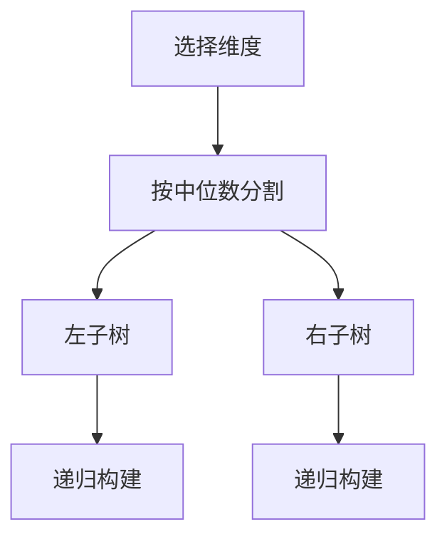
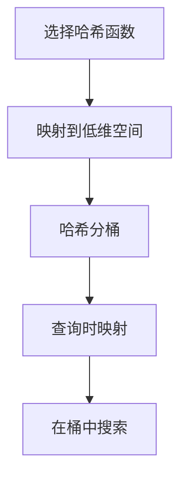
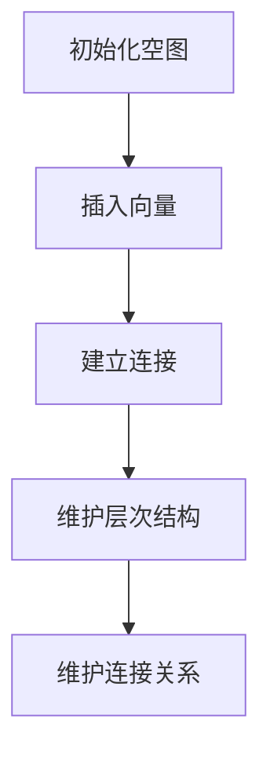

# 深入解析向量数据库的索引技术与优化方法

## 1.背景介绍

随着大数据和人工智能技术的迅猛发展，向量数据库(Vector Database)在处理高维数据和相似性搜索方面的应用越来越广泛。向量数据库通过存储和检索高维向量数据，支持高效的相似性搜索，广泛应用于图像识别、自然语言处理、推荐系统等领域。然而，如何高效地索引和优化向量数据库，成为了一个亟待解决的技术难题。

## 2.核心概念与联系

### 2.1 向量数据库

向量数据库是一种专门用于存储和检索高维向量数据的数据库系统。与传统的关系型数据库不同，向量数据库主要关注的是向量之间的相似性计算，而不是精确匹配。

### 2.2 向量索引

向量索引是指在向量数据库中，为了加速相似性搜索而建立的一种数据结构。常见的向量索引技术包括KD树、LSH(Locality-Sensitive Hashing)、HNSW(Hierarchical Navigable Small World)等。

### 2.3 相似性搜索

相似性搜索是指在向量数据库中，找到与查询向量最相似的向量。相似性度量通常使用欧氏距离、余弦相似度等。

### 2.4 高维数据

高维数据是指维度数目较多的数据。在高维空间中，数据的稀疏性和维度灾难问题使得传统的索引和搜索技术难以直接应用。

## 3.核心算法原理具体操作步骤

### 3.1 KD树

KD树是一种用于组织k维空间数据的树形数据结构，常用于最近邻搜索。其构建过程如下：

1. 选择一个维度，将数据集按该维度的中位数分成两部分。
2. 递归地对每一部分数据重复上述过程，直到每个部分的数据量小于某个阈值。



### 3.2 LSH

LSH通过将高维数据映射到低维空间，使得相似的向量在低维空间中仍然保持相似。其基本步骤如下：

1. 选择若干个哈希函数，将高维向量映射到低维空间。
2. 对低维空间中的向量进行哈希分桶。
3. 在查询时，对查询向量进行相同的哈希映射，并在相应的桶中进行搜索。



### 3.3 HNSW

HNSW是一种基于小世界图的索引结构，其构建过程如下：

1. 初始化一个空图。
2. 逐个将向量插入图中，并为每个向量建立连接。
3. 在插入过程中，维护图的层次结构和连接关系。



## 4.数学模型和公式详细讲解举例说明

### 4.1 欧氏距离

欧氏距离是最常用的相似性度量之一，其公式为：

$$
d(\mathbf{a}, \mathbf{b}) = \sqrt{\sum_{i=1}^{n} (a_i - b_i)^2}
$$

其中，$\mathbf{a}$ 和 $\mathbf{b}$ 是两个n维向量，$a_i$ 和 $b_i$ 分别是向量的第i个分量。

### 4.2 余弦相似度

余弦相似度用于度量两个向量之间的夹角，其公式为：

$$
\text{cosine}(\mathbf{a}, \mathbf{b}) = \frac{\mathbf{a} \cdot \mathbf{b}}{\|\mathbf{a}\| \|\mathbf{b}\|}
$$

其中，$\mathbf{a} \cdot \mathbf{b}$ 表示向量的点积，$\|\mathbf{a}\|$ 和 $\|\mathbf{b}\|$ 分别表示向量的模。

### 4.3 LSH哈希函数

LSH哈希函数的构造通常基于随机投影，其公式为：

$$
h(\mathbf{v}) = \left\lfloor \frac{\mathbf{a} \cdot \mathbf{v} + b}{w} \right\rfloor
$$

其中，$\mathbf{a}$ 是一个随机向量，$b$ 是一个随机偏移，$w$ 是桶的宽度。

## 5.项目实践：代码实例和详细解释说明

### 5.1 KD树的实现

以下是一个简单的KD树实现示例：

```python
import numpy as np

class KDTree:
    def __init__(self, data, depth=0):
        if len(data) == 0:
            self.node = None
            return

        k = len(data[0])
        axis = depth % k

        data.sort(key=lambda x: x[axis])
        median = len(data) // 2

        self.node = data[median]
        self.left = KDTree(data[:median], depth + 1)
        self.right = KDTree(data[median + 1:], depth + 1)

    def nearest_neighbor(self, point, depth=0, best=None):
        if self.node is None:
            return best

        k = len(point)
        axis = depth % k

        next_best = None
        next_branch = None

        if best is None or np.linalg.norm(np.array(point) - np.array(self.node)) < np.linalg.norm(np.array(point) - np.array(best)):
            next_best = self.node
        else:
            next_best = best

        if point[axis] < self.node[axis]:
            next_branch = self.left
        else:
            next_branch = self.right

        return next_branch.nearest_neighbor(point, depth + 1, next_best)

# 示例数据
data = [[2, 3], [5, 4], [9, 6], [4, 7], [8, 1], [7, 2]]
tree = KDTree(data)
print(tree.nearest_neighbor([9, 2]))
```

### 5.2 LSH的实现

以下是一个简单的LSH实现示例：

```python
import numpy as np
import random

class LSH:
    def __init__(self, input_dim, hash_size, num_tables):
        self.input_dim = input_dim
        self.hash_size = hash_size
        self.num_tables = num_tables
        self.tables = [{} for _ in range(num_tables)]
        self.hash_functions = [[(np.random.randn(input_dim), random.uniform(0, 1)) for _ in range(hash_size)] for _ in range(num_tables)]

    def _hash(self, v, hash_function):
        return tuple(int((np.dot(v, a) + b) // 1) for a, b in hash_function)

    def insert(self, v):
        for table, hash_function in zip(self.tables, self.hash_functions):
            h = self._hash(v, hash_function)
            if h not in table:
                table[h] = []
            table[h].append(v)

    def query(self, v):
        candidates = set()
        for table, hash_function in zip(self.tables, self.hash_functions):
            h = self._hash(v, hash_function)
            if h in table:
                candidates.update(table[h])
        return candidates

# 示例数据
data = np.random.randn(100, 10)
lsh = LSH(input_dim=10, hash_size=5, num_tables=5)
for d in data:
    lsh.insert(d)
query_result = lsh.query(data[0])
print(query_result)
```

### 5.3 HNSW的实现

以下是一个简单的HNSW实现示例：

```python
import hnswlib
import numpy as np

# 初始化HNSW索引
dim = 128
num_elements = 10000
p = hnswlib.Index(space='l2', dim=dim)
p.init_index(max_elements=num_elements, ef_construction=200, M=16)

# 生成随机数据并插入索引
data = np.float32(np.random.random((num_elements, dim)))
p.add_items(data)

# 查询
labels, distances = p.knn_query(data[:5], k=5)
print(labels, distances)
```

## 6.实际应用场景

### 6.1 图像识别

在图像识别中，向量数据库可以用于存储图像特征向量，通过相似性搜索找到与查询图像最相似的图像。

### 6.2 自然语言处理

在自然语言处理领域，向量数据库可以用于存储词向量或句向量，通过相似性搜索找到与查询文本最相似的文本。

### 6.3 推荐系统

在推荐系统中，向量数据库可以用于存储用户和物品的特征向量，通过相似性搜索找到与用户最匹配的物品。

## 7.工具和资源推荐

### 7.1 Faiss

Faiss是Facebook开发的一个高效相似性搜索库，支持多种向量索引技术。

### 7.2 Annoy

Annoy是Spotify开发的一个用于高维向量相似性搜索的库，基于随机投影树。

### 7.3 HNSWlib

HNSWlib是一个高效的HNSW实现，支持高维向量的快速相似性搜索。

## 8.总结：未来发展趋势与挑战

向量数据库在处理高维数据和相似性搜索方面具有广阔的应用前景。然而，随着数据规模和维度的不断增加，如何进一步提高索引和搜索的效率，仍然是一个重要的研究方向。未来，结合深度学习和量子计算等新兴技术，向量数据库有望在性能和应用范围上取得更大的突破。

## 9.附录：常见问题与解答

### 9.1 向量数据库与传统数据库的区别是什么？

向量数据库主要关注向量之间的相似性计算，而传统数据库主要关注精确匹配。

### 9.2 如何选择合适的向量索引技术？

选择合适的向量索引技术需要考虑数据的规模、维度和查询的实时性要求。KD树适用于低维数据，LSH适用于高维数据，HNSW适用于大规模高维数据。

### 9.3 向量数据库的性能如何优化？

向量数据库的性能优化可以从索引结构、并行计算和硬件加速等方面入手。

---

作者：禅与计算机程序设计艺术 / Zen and the Art of Computer Programming