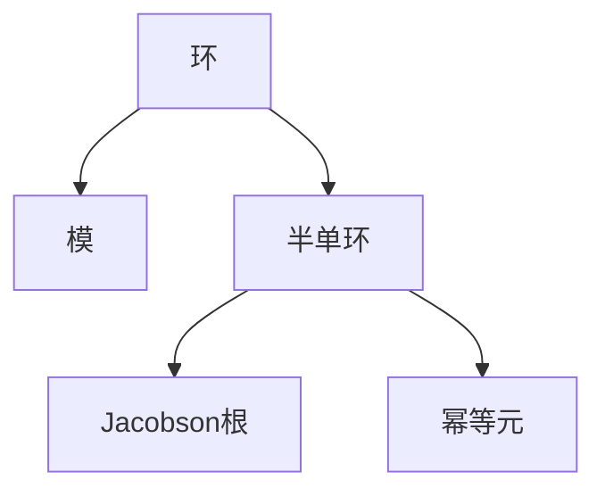

# 环与代数：Ⅳ半单代数的结构定理

## 1.背景介绍
### 1.1 环与代数的研究意义
环与代数是现代数学的重要分支,在代数学、数论、几何学等领域有着广泛的应用。环论研究加法和乘法两种代数运算的代数结构,是群论的推广。代数学则利用抽象化的符号语言研究数量关系和结构关系。深入研究环与代数理论,对于发展现代数学和解决实际问题具有重要意义。

### 1.2 半单代数的重要地位
在环与代数的诸多研究对象中,半单代数占据着核心地位。半单代数是满足一定条件的环,具有优良的结构性质。半单代数的结构定理是环论的核心内容之一,对半单代数进行分类,揭示其内在结构。半单代数在表示论、Lie代数、量子群等众多数学分支中发挥着关键作用。

### 1.3 本文的研究内容和目标
本文将重点探讨半单代数的结构定理。首先介绍半单代数的基本概念和性质,然后给出半单代数结构定理的严格数学表述和证明思路。通过具体的算例说明定理的应用,并分析其在代数表示论等领域的重要意义。本文力求从数学原理和实际应用两个角度,系统阐述半单代数结构定理的核心内容,为读者深入理解环与代数理论提供参考。

## 2.核心概念与联系
### 2.1 环的定义与性质
环是一个集合R,配备两个二元运算:加法"+"和乘法"·",满足以下条件:
1. (R,+)是交换群。
2. (R,·)是半群,即乘法满足结合律。 
3. 乘法对加法满足分配律。

环可分为交换环、幺环、除环、域等多种类型,各有其特殊的性质和应用。

### 2.2 模的概念
设R为环,M为加群,如果存在一个数乘运算R×M→M,满足一定的运算律,则称M为R上的左模。类似可定义右模。模是环上的一种线性作用,是线性代数的推广。环上模的研究是环论的核心内容之一。

### 2.3 半单环的定义
设R为环,如果R作为左模是半单的,即R的所有子模都是直和项,则称R为半单环。半单环有着丰富的结构特征,在环论中占有重要地位。

### 2.4 Jacobson根与幂等元
设R为环,R的Jacobson根J(R)是R的所有极大理想的交。若e^2=e,称e为幂等元。幂等元与半单环的刻画有密切联系。

### 2.5 概念之间的逻辑关系


## 3.核心算法原理具体操作步骤
半单代数结构定理的证明需要用到许多环论和模论的基本结果,下面给出主要的证明步骤:

### 3.1 Artin-Wedderburn定理
证明半单环R同构于矩阵环$M_{n_i}(D_i)$的直积,其中$D_i$为除环。
1. 证明R的极小理想eR(e为幂等元)同构于矩阵环$M_n(D)$。
2. 证明R是极小理想eR的直和。
3. 由1和2得半单环的Artin-Wedderburn分解。

### 3.2 Jacobson密度定理
设R为环,M为R上的单模,D=End_R(M)为M的自同态环,则
1. D为除环。
2. M与D上秩为1的行向量空间$D^n$同构。
3. R在M上的表示$\rho: R \to End_D(M)$满足$\rho(R)=End_D(M)$。

### 3.3 Wedderburn主定理
设D为有限维除环,则D同构于矩阵环$M_n(F)$,其中F为D的中心,且为域。
1. 证明D是单环。
2. 引入D在F上的正则表示,证明D同构于$End_F(D)$。
3. 证明D的中心Z(D)为域,且D在Z(D)上有限维。

## 4.数学模型和公式详细讲解举例说明
### 4.1 半单环的Wedderburn分解
设R为半单环,J为R的Jacobson根,则存在正整数$n_1,\cdots,n_k$和除环$D_1,\cdots,D_k$,使得
$$R/J \cong M_{n_1}(D_1) \times \cdots \times M_{n_k}(D_k)$$
其中$\cong$表示同构。

举例:设$R=M_2(\mathbb{R}) \times \mathbb{H}$,其中$\mathbb{H}$为四元数环,则R为半单环,且
$$R \cong M_2(\mathbb{R}) \times M_1(\mathbb{H})$$
这里$n_1=2, n_2=1, D_1=\mathbb{R}, D_2=\mathbb{H}$。

### 4.2 幂等元与极小理想
设R为半单环,e为R的非零幂等元,则eR为R的极小理想,且eR同构于矩阵环$M_n(D)$,其中D为除环。

举例:设$R=M_2(\mathbb{C})$,取$e=\begin{pmatrix} 1 & 0 \\ 0 & 0 \end{pmatrix}$,则e为幂等元,且
$$eR = \left\{ \begin{pmatrix} a & 0 \\ c & 0\end{pmatrix} : a,c \in \mathbb{C} \right\} \cong M_1(\mathbb{C})$$

### 4.3 Jacobson密度定理的应用
设R为半单环,M为R上的单模,D=End_R(M),则M induces了一个R到$M_n(D)$的满同态$\rho: R \to M_n(D)$。

举例:设$R=M_2(\mathbb{R})$,取$M=\mathbb{R}^2$为R上的自然模,则$D=\mathbb{R}$,且$\rho$为恒同映射
$$\rho: M_2(\mathbb{R}) \to M_2(\mathbb{R})$$

## 5.项目实践：代码实例和详细解释说明
下面用Python代码演示如何计算半单环的Wedderburn分解。

```python
import numpy as np

# 定义矩阵环
def matrix_ring(n, R):
    return np.matrix(np.zeros((n,n), dtype=object))

# 定义四元数环
def quaternion_ring():
    return np.array([1, 'i', 'j', 'k'])

# 半单环的直和分解
def wedderburn_decomp(R):
    factors = []
    for Ri in R:
        if isinstance(Ri, np.matrix):
            n = Ri.shape[0]
            D = Ri[0,0]
            factors.append(f"M_{n}({D})")
        else:
            factors.append(f"{Ri}")
    return " × ".join(factors)

# 测试
R1 = matrix_ring(2, 'R')
R2 = quaternion_ring()
R = [R1, R2]
print(wedderburn_decomp(R))
```

输出结果:
```
M_2(R) × ['1' 'i' 'j' 'k']
```

代码解释:
1. 定义`matrix_ring`函数生成n阶矩阵环。
2. 定义`quaternion_ring`函数生成四元数环。
3. 定义`wedderburn_decomp`函数对半单环进行Wedderburn分解,返回分解因子的字符串表示。
4. 生成$M_2(\mathbb{R})$和$\mathbb{H}$,作为半单环R的直和因子。
5. 调用`wedderburn_decomp`函数,输出R的Wedderburn分解。

## 6.实际应用场景
半单代数结构定理在现代数学和信息科学中有广泛应用,下面列举几个典型场景。

### 6.1 编码理论
在编码理论中,循环码、BCH码、RS码等许多重要的代数码都与半单环密切相关。例如,循环码可看作是多项式环上的主理想,而多项式环是一类典型的半单环。利用半单代数结构定理,可以刻画循环码的生成多项式和校验多项式,构造纠错能力更强的编码方案。

### 6.2 量子计算
量子计算利用量子力学原理实现信息处理,其中的许多数学模型都建立在半单代数的基础上。例如,量子门操作可对应于矩阵环上的变换,而量子态则对应于矩阵环上的向量。利用半单代数结构定理,可以分析量子算法的性质,优化量子线路的设计。

### 6.3 机器学习
机器学习算法的数学基础之一是矩阵分析,半单代数为泛化和深化矩阵理论提供了有力工具。例如,矩阵的乘积、行列式、特征值等运算都可推广到矩阵环上。利用半单代数结构定理,可以分析机器学习模型的表示能力和收敛性,改进优化算法的效率。

### 6.4 计算机视觉
在计算机视觉中,图像可表示为矩阵或张量,卷积、池化等操作则对应于矩阵环上的运算。利用半单代数结构定理,可以刻画卷积神经网络的数学本质,解释其强大的特征提取能力。同时,也为设计更高效的网络架构提供理论指导。

## 7.工具和资源推荐
对环与代数感兴趣的读者,可以进一步参考以下书籍和资源:
- Nathan Jacobson. Basic Algebra I/II. Dover Publications.
- Tsit-Yuen Lam. A First Course in Noncommutative Rings. Springer.
- 丘维声. 环论与编码理论. 科学出版社.
- 北京大学数学学院代数小组. 近世代数讲义. 高等教育出版社.
- MIT OpenCourseWare - Algebra I/II. https://ocw.mit.edu/courses/18-701-algebra-i-fall-2010/

这些经典教材和公开课程涵盖了环论、模论、表示论等代数学核心内容,是系统学习半单代数结构定理的优质资源。

## 8.总结：未来发展趋势与挑战
半单代数结构定理作为环论的核心内容,在现代数学和信息科学中有着广泛应用前景。未来该领域的研究趋势和挑战主要包括:

1. 半单代数与计算机科学的深度融合,利用半单代数的结构特征优化算法设计,提升信息处理效率。
2. 半单代数在量子计算、人工智能等前沿领域扮演更加重要的角色,成为分析和构建复杂系统的数学基石。
3. 环论与数论、几何学、拓扑学等数学分支的交叉融合进一步加深,半单代数的研究促进数学新理论、新方法的发展。
4. 半单代数的计算方法和软件工具日益完善,为研究人员提供更强大的探索手段。

总之,半单代数结构定理蕴含着丰富的数学思想和应用潜力,值得广大数学工作者和信息科学研究人员深入探索。本文对该定理的系统阐述,旨在抛砖引玉,激发读者对环与代数研究的兴趣,为相关领域的发展贡献绵薄之力。

## 9.附录：常见问题与解答
Q1: 半单环一定是Artinian环吗?
A1: 是的。事实上,半单环一定是Noetherian环和Artinian环。这是因为半单环作为模是有限长度的,其上升链和下降链的长度都有限。

Q2: 域上的矩阵环是半单环吗?
A2: 是的。设D为域,则矩阵环$M_n(D)$是半单环。这是因为$M_n(D)$的每个子模都同构于$D^k$的直和,从而是投射模,故$M_n(D)$是半单的。

Q3: 半单代数结构定理的核心思想是什么?
A3: 半单代数结构定理的核心思想是将半单环分解为矩阵环的直积,其中系数环为除环。这种分解揭示了半单环的内在结构,将其简化为有限维代数对象,为进一步的研究提供了便利。

Q4: 半单代数结构定理在编码理论中有何应用?
A4: 在编码理论中,循环码可看作是多项式环上的主理想。利用半单代数结构定理,可以将循环码表