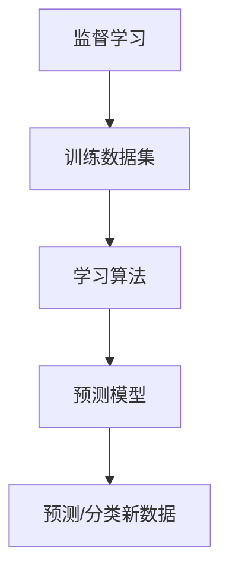

# 监督学习 (Supervised Learning) 原理与代码实例讲解

## 1. 背景介绍

在机器学习的广阔领域中,监督学习无疑是最常见和最广泛应用的一种范式。它的核心思想是利用已标注的训练数据集,通过学习过程建立一个模型,从而对新的未知数据进行预测或分类。监督学习在诸多领域发挥着关键作用,包括图像识别、自然语言处理、金融预测等。



## 2. 核心概念与联系

监督学习的核心概念包括:

1. **特征(Features)**: 描述训练数据样本的属性,是模型学习的基础。
2. **标签(Labels)**: 训练数据样本对应的目标值或类别。
3. **损失函数(Loss Function)**: 衡量模型预测值与真实值之间的差距。
4. **优化算法(Optimization Algorithm)**: 通过迭代调整模型参数,最小化损失函数。

这些概念紧密相连,构成了监督学习的基本框架。特征和标签组成训练数据集,损失函数评估模型性能,优化算法则调整模型以提高性能。

## 3. 核心算法原理具体操作步骤

监督学习算法的核心步骤如下:

1. **数据预处理**: 对原始数据进行清洗、标准化等预处理,以满足算法的输入要求。
2. **特征工程**: 从原始数据中提取有意义的特征,对模型的性能至关重要。
3. **训练集和测试集划分**: 将数据集划分为训练集和测试集,用于模型训练和评估。
4. **模型选择**: 根据问题的性质选择合适的监督学习算法,如线性回归、逻辑回归、决策树等。
5. **模型训练**: 使用训练数据集训练模型,通过优化算法调整模型参数,最小化损失函数。
6. **模型评估**: 使用测试数据集评估模型的性能,计算准确率、精确率、召回率等指标。
7. **模型调优**: 根据评估结果,通过调整超参数、特征选择等方式优化模型性能。
8. **模型部署**: 将训练好的模型应用于实际场景,对新的未知数据进行预测或分类。

## 4. 数学模型和公式详细讲解举例说明

监督学习算法通常基于数学模型和公式,以下是一些常见模型的数学表达式:

### 线性回归

线性回归旨在找到一条最佳拟合直线,使得数据点到直线的距离之和最小。其数学表达式为:

$$y = \theta_0 + \theta_1 x_1 + \theta_2 x_2 + ... + \theta_n x_n$$

其中 $y$ 是目标变量, $x_i$ 是特征变量, $\theta_i$ 是模型参数。通过优化算法求解 $\theta_i$,使得损失函数 $\sum_{i=1}^{m}(y_i - \hat{y_i})^2$ 最小化,即找到最佳拟合直线。

### 逻辑回归

逻辑回归用于二分类问题,其输出是一个概率值,表示样本属于某个类别的可能性。数学模型为:

$$\begin{aligned}
z &= \theta_0 + \theta_1 x_1 + \theta_2 x_2 + ... + \theta_n x_n\\
h_\theta(x) &= \sigma(z) = \frac{1}{1 + e^{-z}}
\end{aligned}$$

其中 $\sigma(z)$ 是 Sigmoid 函数,将线性组合 $z$ 映射到 $(0, 1)$ 范围内,作为概率值输出。通过优化算法求解 $\theta_i$,使得损失函数 $-\frac{1}{m}\sum_{i=1}^{m}[y^{(i)}\log h_\theta(x^{(i)}) + (1 - y^{(i)})\log(1 - h_\theta(x^{(i)}))]$ 最小化。

### 决策树

决策树是一种基于树形结构的监督学习算法,通过特征的条件判断将样本划分到不同的叶节点,每个叶节点对应一个分类或回归值。决策树的构建过程可以用递归的方式表示:

$$
\begin{aligned}
\text{Tree}(X, y) &= \begin{cases}
\text{CreateNode}() & \text{if stopping criterion is met}\\
\text{best_split} &= \text{FindBestSplit}(X, y)\\
\text{left_tree} &= \text{Tree}(X_\text{left}, y_\text{left})\\
\text{right_tree} &= \text{Tree}(X_\text{right}, y_\text{right})\\
\text{CreateNode}(\text{best_split}, \text{left_tree}, \text{right_tree}) & \text{otherwise}
\end{cases}
\end{aligned}
$$

其中 $X$ 是特征矩阵, $y$ 是标签向量。算法通过信息增益、基尼指数等指标选择最优特征进行分裂,递归构建决策树。

以上是监督学习中几种典型算法的数学模型,不同的算法有不同的数学表达式和优化目标,但都旨在从训练数据中学习出一个能够很好地预测或分类新数据的模型。

## 5. 项目实践: 代码实例和详细解释说明

为了更好地理解监督学习算法的实现,我们将以 Python 中的 Scikit-learn 库为例,展示线性回归、逻辑回归和决策树的代码实例。

### 线性回归

```python
from sklearn.linear_model import LinearRegression

# 创建线性回归模型实例
model = LinearRegression()

# 使用训练数据拟合模型
model.fit(X_train, y_train)

# 对测试数据进行预测
y_pred = model.predict(X_test)
```

在这个示例中,我们首先从 `sklearn.linear_model` 导入 `LinearRegression` 类,然后创建一个模型实例。接下来,使用 `fit()` 方法将模型拟合到训练数据 `(X_train, y_train)` 上。最后,我们可以使用 `predict()` 方法对测试数据 `X_test` 进行预测,得到预测值 `y_pred`。

### 逻辑回归

```python
from sklearn.linear_model import LogisticRegression

# 创建逻辑回归模型实例
model = LogisticRegression()

# 使用训练数据拟合模型
model.fit(X_train, y_train)

# 对测试数据进行预测
y_pred = model.predict(X_test)
```

逻辑回归的实现方式与线性回归类似,只需从 `sklearn.linear_model` 导入 `LogisticRegression` 类,并创建模型实例。然后使用 `fit()` 方法拟合训练数据,最后使用 `predict()` 方法对测试数据进行预测。

### 决策树

```python
from sklearn.tree import DecisionTreeClassifier

# 创建决策树分类器实例
model = DecisionTreeClassifier()

# 使用训练数据拟合模型
model.fit(X_train, y_train)

# 对测试数据进行预测
y_pred = model.predict(X_test)
```

在这个示例中,我们从 `sklearn.tree` 导入 `DecisionTreeClassifier` 类,创建一个决策树分类器实例。然后使用 `fit()` 方法拟合训练数据,最后使用 `predict()` 方法对测试数据进行预测。

这些示例展示了如何使用 Scikit-learn 库实现监督学习算法。在实际项目中,您还需要进行数据预处理、特征工程、模型评估和调优等步骤,以获得更好的性能。

## 6. 实际应用场景

监督学习在各个领域都有广泛的应用,以下是一些典型的应用场景:

1. **图像识别**: 通过监督学习算法,可以训练出能够识别图像中物体、人脸、文字等内容的模型,应用于安防、医疗、自动驾驶等领域。

2. **自然语言处理 (NLP)**: 监督学习在 NLP 领域有着重要应用,如文本分类、情感分析、机器翻译等任务。

3. **金融预测**: 利用历史金融数据,可以训练出预测股票、外汇等金融产品价格走势的模型。

4. **医疗诊断**: 通过分析患者的症状、检查结果等数据,监督学习模型可以辅助医生进行疾病诊断和预后预测。

5. **欺诈检测**: 在金融、电商等领域,监督学习模型可以通过分析交易数据,识别出潜在的欺诈行为。

6. **推荐系统**: 基于用户的历史行为数据,监督学习算法可以训练出个性化推荐模型,为用户推荐感兴趣的商品或内容。

7. **垃圾邮件过滤**: 通过分析已标注的垃圾邮件和正常邮件,监督学习模型可以自动识别并过滤垃圾邮件。

这些只是监督学习应用的一小部分,随着技术的不断发展,监督学习在更多领域发挥着重要作用。

## 7. 工具和资源推荐

在实践监督学习算法时,有许多优秀的工具和资源可供参考:

1. **Python 机器学习库**:
   - Scikit-learn: 功能全面的机器学习库,提供了多种监督学习算法的实现。
   - TensorFlow: 谷歌开源的深度学习框架,可用于构建和训练复杂的监督学习模型。
   - PyTorch: 另一个流行的深度学习框架,具有动态计算图和良好的可扩展性。

2. **数据集资源**:
   - UCI 机器学习数据库: 提供了多个领域的标准数据集,适合监督学习算法的实践和测试。
   - Kaggle: 一个著名的数据科学社区,提供了各种机器学习竞赛和数据集。

3. **在线课程和教程**:
   - Coursera 机器学习专项课程: 由 Andrew Ng 教授开设的经典机器学习课程。
   - DataCamp 监督学习课程: 提供了多个监督学习算法的交互式教程。
   - 书籍《机器学习实战》: 一本通过实例讲解监督学习算法的经典书籍。

4. **博客和社区**:
   - 机器学习掘金: 一个活跃的机器学习社区,分享最新的技术和应用。
   - KDnuggets: 一个权威的数据科学和机器学习新闻博客。
   - Towards Data Science: 一个分享数据科学和机器学习文章的平台。

利用这些丰富的资源,您可以深入学习监督学习算法的理论和实践,提高您的机器学习技能。

## 8. 总结: 未来发展趋势与挑战

监督学习在过去几十年取得了巨大的进步,但仍然面临着一些挑战和发展趋势:

1. **大数据和高维数据处理**: 随着数据量和维度的不断增加,如何高效地处理和学习大规模高维数据成为一个重要挑战。

2. **深度学习模型**: 深度神经网络在监督学习任务中表现出色,但仍然存在可解释性差、需要大量数据等问题,未来需要进一步改进和优化。

3. **小样本学习**: 在一些领域,获取大量标注数据成本很高,如何基于少量数据进行有效学习是一个重要研究方向。

4. **迁移学习和元学习**: 如何利用已学习的知识,快速适应新的任务和领域,是提高监督学习效率的关键。

5. **人工智能安全和隐私**: 随着监督学习模型在越来越多领域的应用,确保模型的安全性和隐私保护也变得越来越重要。

6. **模型可解释性**: 提高监督学习模型的可解释性,让人类能够理解模型的决策过程,是未来的一个重要发展方向。

7. **人工智能伦理**: 随着监督学习在更多领域的应用,如何确保模型的公平性、透明度和可责任性,是一个需要持续关注的问题。

总的来说,监督学习在未来仍将扮演重要角色,但也需要不断创新和改进,以应对新的挑战和需求。

## 9. 附录: 常见问题与解答

1. **什么是监督学习?**

   监督学习是机器学习中最常见