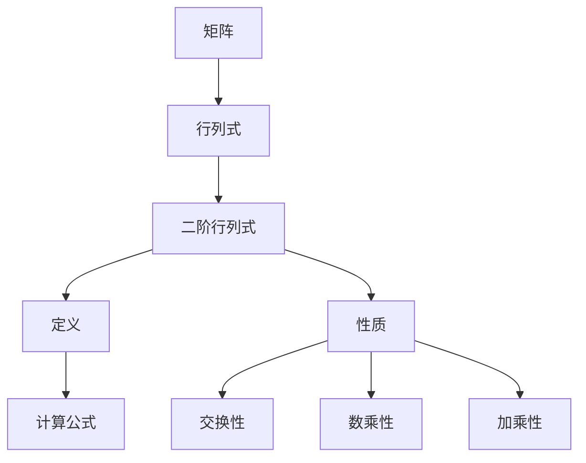
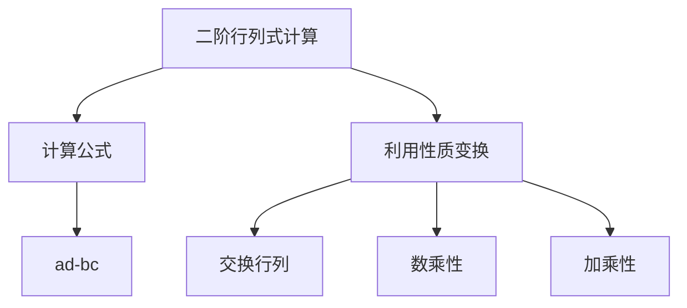

# 线性代代数导引：二阶行列式

## 1.背景介绍

线性代数是数学的一个重要分支,它研究向量、矩阵、线性变换以及它们之间的运算规律。线性代数在科学计算、机器学习、图像处理、信号处理等诸多领域有着广泛的应用。其中,行列式是线性代数中一个非常重要的概念,它反映了一个矩阵的某些性质,是研究矩阵的一个强有力的工具。

二阶行列式是最简单的行列式形式,它由一个2×2矩阵的元素构成。虽然二阶行列式看起来很简单,但它却蕴含着丰富的数学内涵,是理解更高阶行列式的基础。本文将深入探讨二阶行列式的概念、性质、计算方法以及在线性代数中的应用,为读者揭开行列式的神秘面纱。

## 2.核心概念与联系

### 2.1 矩阵与行列式

矩阵是由有限个数的元素按照矩形阵列排列而成的一种数学结构。行列式则是由矩阵的元素按一定计算法则构成的一个标量值。矩阵和行列式之间存在着密切的联系,矩阵的秩、可逆性等性质都可以通过行列式来判定。

### 2.2 二阶行列式的定义

二阶行列式是由一个2×2矩阵的四个元素构成的,记作:

$$
\begin{vmatrix}
a & b\\
c & d
\end{vmatrix}
$$

它的计算公式为:

$$
\begin{vmatrix}
a & b\\
c & d
\end{vmatrix} = ad - bc
$$

即二阶行列式等于矩阵对角线元素的乘积之和,减去反对角线元素的乘积之和。

### 2.3 二阶行列式的性质

1. 交换性:交换行列式中的两行(列),行列式的值会改变符号。
2. 数乘性:将行列式中的一行(列)的元素同乘以一个数k,行列式的值也会相应地乘以k。
3. 加乘性:将行列式中的一行(列)分别乘以数k1,k2,然后相加代入原行(列),行列式的值不变。



## 3.核心算法原理具体操作步骤

计算二阶行列式的核心算法步骤如下:

1. 构造2×2矩阵
2. 按公式 $\begin{vmatrix}a & b\\ c & d\end{vmatrix} = ad - bc$ 计算行列式值
3. 如果需要,利用行列式的性质进行运算

具体操作步骤示例:

给定矩阵 $A = \begin{pmatrix}3 & 5\\ -2 & 4\end{pmatrix}$, 计算它的行列式 $\det A$。

步骤1: 构造2×2矩阵 $A = \begin{pmatrix}3 & 5\\ -2 & 4\end{pmatrix}$

步骤2: 按公式计算行列式值
$$
\begin{aligned}
\det A &= \begin{vmatrix}3 & 5\\ -2 & 4\end{vmatrix}\\
       &= 3 \times 4 - 5 \times (-2)\\
       &= 12 + 10\\
       &= 22
\end{aligned}
$$

因此, $\det A = 22$

## 4.数学模型和公式详细讲解举例说明

### 4.1 二阶行列式的计算公式

二阶行列式的计算公式为:

$$
\begin{vmatrix}
a & b\\
c & d
\end{vmatrix} = ad - bc
$$

该公式体现了二阶行列式的本质:它是矩阵对角线元素的乘积之和,减去反对角线元素的乘积之和。

例如,对于矩阵 $A = \begin{pmatrix}1 & 2\\ 3 & 4\end{pmatrix}$, 计算它的行列式:

$$
\begin{aligned}
\det A &= \begin{vmatrix}1 & 2\\ 3 & 4\end{vmatrix}\\
       &= 1 \times 4 - 2 \times 3\\
       &= 4 - 6\\
       &= -2
\end{aligned}
$$

### 4.2 利用行列式的性质进行计算

有时直接应用计算公式并不方便,这时可以利用行列式的性质对矩阵进行等价变换,简化计算。

例如,对于矩阵 $B = \begin{pmatrix}2 & 3\\ 6 & 9\end{pmatrix}$, 我们可以先利用数乘性将第二行乘以 $\frac{1}{3}$:

$$
\begin{aligned}
\det B &= \begin{vmatrix}2 & 3\\ 6 & 9\end{vmatrix}\\
       &= \begin{vmatrix}2 & 3\\ 2 & 3\end{vmatrix}\\
       &= 2 \times 3 - 3 \times 2\\
       &= 6 - 6\\
       &= 0
\end{aligned}
$$

因此, $\det B = 0$



## 5.项目实践：代码实例和详细解释说明

下面给出一个Python代码示例,用于计算任意二阶矩阵的行列式:

```python
def det2x2(matrix):
    """
    计算2x2矩阵的行列式值
    
    参数:
        matrix (list): 2x2矩阵,形如[[a,b],[c,d]]
        
    返回:
        det (int或float): 矩阵的行列式值
    """
    a, b = matrix[0]
    c, d = matrix[1]
    
    det = a*d - b*c
    
    return det

# 使用示例
matrix1 = [[3, 5], [-2, 4]]
det1 = det2x2(matrix1)
print(f"矩阵 {matrix1} 的行列式为: {det1}")  # 输出: 矩阵 [[3, 5], [-2, 4]] 的行列式为: 22.0

matrix2 = [[1, 2], [3, 4]]
det2 = det2x2(matrix2) 
print(f"矩阵 {matrix2} 的行列式为: {det2}")  # 输出: 矩阵 [[1, 2], [3, 4]] 的行列式为: -2.0
```

代码解释:

1. 定义函数 `det2x2(matrix)`，接收一个2x2矩阵作为参数
2. 使用Python的矩阵解包语法 `a, b = matrix[0]` 和 `c, d = matrix[1]` 获取矩阵的四个元素
3. 按照公式 `det = a*d - b*c` 计算行列式值
4. 将计算结果返回
5. 示例中分别计算了两个矩阵的行列式,并打印输出结果

该代码实现了二阶行列式的计算,可以很方便地计算任意给定的2x2矩阵的行列式值。

## 6.实际应用场景

二阶行列式虽然是最简单的行列式形式,但它在线性代数及其应用中扮演着重要的角色。以下是一些二阶行列式的实际应用场景:

1. **矩阵可逆性判定**:一个矩阵是否可逆,等价于它的行列式是否等于0。对于二阶矩阵,只需计算它的行列式是否为0即可判定可逆性。

2. **解线性方程组**:当线性方程组的系数矩阵是2x2矩阵时,可以使用二阶行列式来计算它的行列式值,进而判断是否有唯一解、无解或者有无穷多解。

3. **计算机图形学**:在二维平面上进行旋转、缩放等变换时,常常需要构造一个2x2的变换矩阵,而变换矩阵的行列式值就反映了这种变换是否改变了面积。

4. **力学分析**:在力学中,二阶行列式可以用来计算矩阵的迹和行列式值,而这两个量与力的平衡和转动有关。

5. **密码学**:现代密码学中的Hill密码就是利用了二阶行列式,将明文按2x2矩阵的形式与密钥矩阵相乘获得密文。

总之,二阶行列式作为最基本的行列式形式,为更高阶行列式及其应用奠定了基础,在线性代数及其应用领域有着广泛的用途。

## 7.工具和资源推荐

对于初学者来说,理解和计算行列式可能有一定的困难。这里推荐一些有用的工具和资源,可以帮助读者更好地掌握二阶行列式:

1. **在线行列式计算器**:有许多在线工具可以计算任意阶数的行列式,如Wolfram Alpha、Matrix Calculator等,对于验证计算结果很有帮助。

2. **可视化工具**:一些可视化工具如Mathinsight、GeoGebra等,可以动态地展示矩阵及其行列式的变化,有助于理解行列式的几何意义。

3. **教学视频**:网络上有大量免费的线性代数教学视频,如Khan Academy、MIT公开课等,通过视频教学可以更直观地学习行列式的概念和计算方法。

4. **线性代数教材**:《线性代数及其应用》(Linear Algebra and Its Applications)、《线性代数导引》(Introduction to Linear Algebra)等经典教材对行列式的内容阐述非常透彻。

5. **在线讨论社区**:数学相关的在线论坛如Mathematics Stack Exchange、Art of Problem Solving等,可以与他人讨论、解答行列式相关的问题。

6. **编程实践**:使用Python、MATLAB等语言编写程序来计算行列式,有助于加深对行列式概念的理解,并将其应用于实际问题中。

掌握了这些工具和资源,相信读者一定能够更高效地学习和使用二阶行列式。

## 8.总结:未来发展趋势与挑战

行列式作为线性代数的核心概念之一,在数学和相关应用领域有着广泛的用途。随着科技的发展,行列式的研究和应用也在不断推进。

未来,行列式理论可能会在以下几个方向上取得新的进展:

1. **高性能计算**:针对大规模矩阵,设计更高效的行列式计算算法,以满足大数据时代对计算能力的需求。

2. **符号计算**:结合符号计算技术,对行列式进行更深入的代数分析和理论研究,揭示更一般的性质。

3. **量子计算**:利用量子计算的并行性,探索量子行列式计算算法,提高计算效率。

4. **新兴应用领域**:行列式可能会在人工智能、密码学、量子物理等新兴领域找到更多应用场景。

与此同时,行列式理论和计算也面临着一些挑战:

1. **高阶行列式的复杂性**:高阶行列式的计算复杂度快速增长,需要开发新的高效算法。

2. **数值不稳定性**:某些矩阵的行列式计算存在数值不稳定的问题,需要改进计算方法。

3. **硬件加速**:如何充分利用现代硬件(如GPU)的并行计算能力,加速行列式的计算。

4. **新理论突破**:行列式理论已有200多年的历史,需要新的理论突破来推动这一领域的发展。

总的来说,行列式作为线性代数的基石,其理论研究和应用前景依然广阔。相信在科技发展的推动下,行列式定将为人类的科学事业做出更多贡献。

## 9.附录:常见问题与解答

1. **二阶行列式为什么要用这种计算公式?**

   二阶行列式的计算公式 $\begin{vmatrix}a & b\\ c & d\end{vmatrix} = ad - bc$ 源于更一般的行列式计算方法——拉普拉斯展开法则。对于二阶行列式,这个公式直接给出了计算结果,是最简单高效的方式。

2. **二阶行列式为零时,矩阵是否可逆?**

   当且仅当一个矩阵的行列式不等于零时