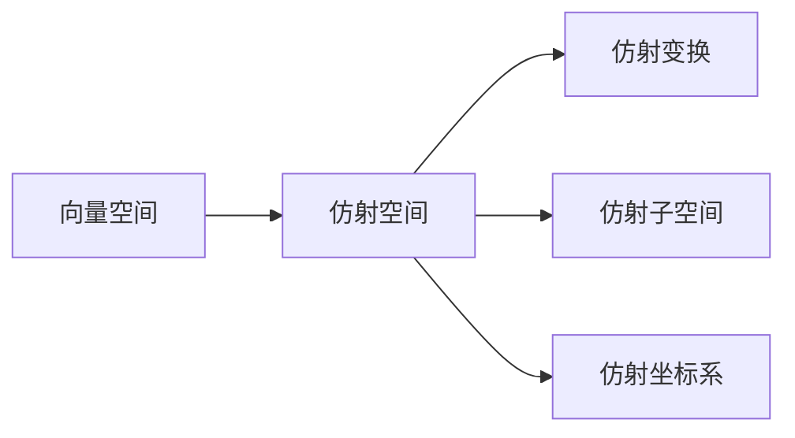

# 线性代数导引：仿射空间

## 1.背景介绍

线性代数是一门研究向量空间理论的数学分支,是数学的一个基础课程,也是工程、科学等学科的一个重要数学工具。线性代数在计算机图形学、机器学习、计算机视觉等领域有着广泛的应用。其中,仿射空间是线性代数中一个重要的概念,它是对向量空间的一种推广。

仿射空间可以看作是向量空间加上一个固定的向量,这个固定的向量称为仿射空间的位移向量或平移向量。仿射空间保留了向量空间的线性运算,同时增加了平移变换,使得仿射空间能够描述更加一般的几何变换。

## 2.核心概念与联系

### 2.1 向量空间

向量空间是线性代数的基础概念,它由一个非空集合及两种运算(加法和数乘)构成。向量空间满足以下8个公理:

1. 加法交换律
2. 加法结合律
3. 存在加法单位元(零向量)
4. 存在加法逆元
5. 数乘单位元存在
6. 数乘结合律
7. 数乘分配律
8. 数乘交换律

### 2.2 仿射空间

仿射空间是向量空间的一种推广,由一个向量空间V和一个固定的向量p(称为位移向量或平移向量)构成,记作(V,p)。仿射空间中的元素称为仿射点,由向量空间中的一个向量加上位移向量p构成。

仿射空间保留了向量空间的加法和数乘运算,同时增加了平移变换。对于任意仿射点x和向量v,有:

$$x+v = (x-p)+v+p$$

其中,x-p是向量空间V中的一个向量,v是V中的另一个向量。

### 2.3 仿射变换

仿射变换是指保持仿射空间结构的变换,包括线性变换和平移变换。线性变换是指对向量空间中的向量进行线性运算,而平移变换则是对整个仿射空间进行平移。

仿射变换可以用矩阵表示,其中线性变换部分用矩阵A表示,平移部分用向量b表示。对于仿射点x,仿射变换可表示为:

$$Ax+b$$

### 2.4 仿射子空间

仿射子空间是指仿射空间的一个子集,它本身也是一个仿射空间。仿射子空间由一个向量子空间V'和一个属于仿射空间的仿射点p'构成,记作(V',p')。

### 2.5 仿射坐标系

在仿射空间中,我们可以定义一个仿射坐标系,它由一个原点(仿射点)和一组基底向量构成。任何一个仿射点都可以用原点和基底向量的线性组合表示。



## 3.核心算法原理具体操作步骤

### 3.1 仿射点的表示

在n维仿射空间中,一个仿射点x可以表示为:

$$x = p + \sum_{i=1}^{n}x_ib_i$$

其中,p是位移向量,{b1,b2,...,bn}是基底向量,{x1,x2,...,xn}是仿射点x在该基底下的坐标。

### 3.2 仿射点的运算

1. 加法:对于仿射点x和y,它们的和定义为:

$$x+y = (p+\sum_{i=1}^{n}x_ib_i)+(p+\sum_{i=1}^{n}y_ib_i) = p+\sum_{i=1}^{n}(x_i+y_i)b_i$$

2. 数乘:对于仿射点x和实数k,它们的数乘定义为:

$$kx = k(p+\sum_{i=1}^{n}x_ib_i) = p+\sum_{i=1}^{n}kx_ib_i$$

### 3.3 仿射变换的表示

在n维仿射空间中,一个仿射变换可以用一个(n+1)×(n+1)的矩阵表示:

$$\begin{bmatrix}
a_{11} & a_{12} & \cdots & a_{1n} & b_1 \\
a_{21} & a_{22} & \cdots & a_{2n} & b_2 \\
\vdots & \vdots & \ddots & \vdots & \vdots \\
a_{n1} & a_{n2} & \cdots & a_{nn} & b_n \\
0 & 0 & \cdots & 0 & 1
\end{bmatrix}$$

其中,左上角的n×n矩阵表示线性变换部分,最右一列表示平移部分。

对于一个仿射点x,经过上述仿射变换后,得到新的仿射点x'可表示为:

$$x' = \begin{bmatrix}
a_{11} & a_{12} & \cdots & a_{1n} & b_1 \\
a_{21} & a_{22} & \cdots & a_{2n} & b_2 \\
\vdots & \vdots & \ddots & \vdots & \vdots \\
a_{n1} & a_{n2} & \cdots & a_{nn} & b_n \\
0 & 0 & \cdots & 0 & 1
\end{bmatrix}\begin{bmatrix}
x_1 \\
x_2 \\
\vdots \\
x_n \\
1
\end{bmatrix}$$

### 3.4 仿射子空间的表示

一个k维仿射子空间可以由一个k维向量子空间V'和一个仿射点p'构成,记作(V',p')。

其中,向量子空间V'可以由k个线性无关的基底向量{v1,v2,...,vk}生成。任何属于V'的向量u可以表示为:

$$u = \sum_{i=1}^{k}c_iv_i$$

而仿射点p'可以表示为:

$$p' = p + \sum_{i=1}^{n}d_ib_i$$

其中,p是整个仿射空间的位移向量,{b1,b2,...,bn}是整个仿射空间的基底。

因此,属于仿射子空间(V',p')的任何一个仿射点x可以表示为:

$$x = p' + \sum_{i=1}^{k}c_iv_i = p + \sum_{i=1}^{n}d_ib_i + \sum_{i=1}^{k}c_iv_i$$

## 4.数学模型和公式详细讲解举例说明

### 4.1 仿射点的表示

在三维仿射空间中,假设位移向量p为(1,2,3),基底为标准基{(1,0,0),(0,1,0),(0,0,1)}。那么一个仿射点x(4,5,6)可以表示为:

$$x = p + \sum_{i=1}^{3}x_ib_i = (1,2,3) + 4(1,0,0) + 5(0,1,0) + 6(0,0,1) = (5,7,9)$$

### 4.2 仿射点的运算

1. 加法:对于仿射点x(5,7,9)和y(2,3,4),它们的和为:

$$x+y = (5,7,9)+(2,3,4) = (7,10,13)$$

2. 数乘:对于仿射点x(5,7,9)和实数k=2,它们的数乘为:

$$2x = 2(5,7,9) = (10,14,18)$$

### 4.3 仿射变换的表示

假设一个三维仿射变换的矩阵为:

$$\begin{bmatrix}
1 & 0 & 0 & 2 \\
0 & 2 & 0 & 1 \\
0 & 0 & 3 & 0 \\
0 & 0 & 0 & 1
\end{bmatrix}$$

对于一个仿射点x(1,2,3),经过该仿射变换后,得到新的仿射点x'为:

$$x' = \begin{bmatrix}
1 & 0 & 0 & 2 \\
0 & 2 & 0 & 1 \\
0 & 0 & 3 & 0 \\
0 & 0 & 0 & 1
\end{bmatrix}\begin{bmatrix}
1 \\
2 \\
3 \\
1
\end{bmatrix} = \begin{bmatrix}
3 \\
5 \\
9 \\
1
\end{bmatrix}$$

因此,x'=(3,5,9)。

### 4.4 仿射子空间的表示

假设一个三维仿射空间的位移向量p为(1,2,3),基底为标准基{(1,0,0),(0,1,0),(0,0,1)}。现在构造一个二维仿射子空间(V',p'),其中向量子空间V'由基底向量{(1,1,0),(1,0,1)}生成,仿射点p'为(2,3,4)。

那么,属于该仿射子空间的任何一个仿射点x可以表示为:

$$x = p' + \sum_{i=1}^{2}c_iv_i = (2,3,4) + c_1(1,1,0) + c_2(1,0,1)$$

例如,当c1=1,c2=2时,x=(4,5,6)。

## 5.项目实践:代码实例和详细解释说明

下面是一个使用Python实现仿射变换的示例代码:

```python
import numpy as np

# 定义仿射变换矩阵
affine_matrix = np.array([[1, 0, 0, 2],
                          [0, 2, 0, 1],
                          [0, 0, 3, 0],
                          [0, 0, 0, 1]])

# 定义原始点
point = np.array([1, 2, 3, 1])

# 执行仿射变换
transformed_point = np.dot(affine_matrix, point)

print("原始点:", point[:3])
print("变换后点:", transformed_point[:3])
```

输出结果:

```
原始点: [1 2 3]
变换后点: [ 3  5  9]
```

代码解释:

1. 首先,我们导入NumPy库,用于进行矩阵运算。
2. 定义一个4x4的仿射变换矩阵`affine_matrix`,其中左上角的3x3矩阵表示线性变换部分,最右一列表示平移部分。
3. 定义一个表示原始点的4x1矩阵`point`,其中前三个元素表示点的坐标,最后一个元素为1,用于与仿射变换矩阵相乘。
4. 使用NumPy的`dot`函数计算仿射变换后的点`transformed_point`。
5. 输出原始点和变换后点的坐标。

在这个示例中,我们对一个三维点(1,2,3)进行了仿射变换,包括缩放、旋转和平移。变换后的点为(3,5,9)。

## 6.实际应用场景

仿射空间和仿射变换在计算机图形学、计算机视觉、机器人学等领域有着广泛的应用。下面是一些典型的应用场景:

1. **计算机图形学**:在三维图形渲染中,我们需要对物体进行各种几何变换,如平移、旋转、缩放等。这些变换可以用仿射变换来表示和实现。

2. **计算机视觉**:在图像处理和计算机视觉中,我们需要对图像进行几何变换,如平移、旋转、缩放等。这些变换也可以用仿射变换来实现。

3. **机器人学**:在机器人运动规划中,我们需要计算机器人的运动轨迹。机器人的运动可以看作是一系列的仿射变换,包括平移和旋转。

4. **医学图像处理**:在医学图像处理中,我们需要对医学影像进行校正、配准等操作。这些操作可以使用仿射变换来实现。

5. **计算机动画**:在计算机动画制作中,我们需要对角色进行各种变形和运动。这些变形和运动可以使用仿射变换来实现。

6. **地理信息系统(GIS)**:在地理信息系统中,我们需要对地理数据进行投影变换、坐标变换等操作。这些变换可以使用仿射变换来实现。

总的来说,仿射空间和仿射变换为我们提供了一种描述和处理几何变换的强大工具,在许多领域都有着重要的应用。

## 7.工具和资源推荐

在学习和使用仿射空间和仿射变换时,有一些工具和资源可以为您提供帮助:

1. **线性代数教材**:许多线性代数教材都会详细介绍仿射