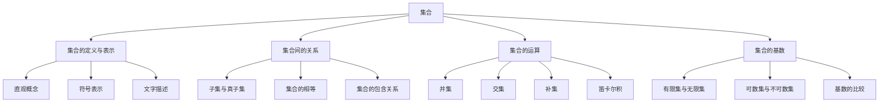

# 集合论导引：∑13集合

## 1. 背景介绍
### 1.1 集合论的起源与发展
#### 1.1.1 康托尔的贡献
#### 1.1.2 罗素悖论与公理化集合论
#### 1.1.3 现代集合论的建立

### 1.2 集合论在数学中的地位
#### 1.2.1 集合论是数学的基础
#### 1.2.2 集合论与其他数学分支的关系
#### 1.2.3 集合论在现代数学中的应用

## 2. 核心概念与联系
### 2.1 集合的定义与表示
#### 2.1.1 集合的直观概念
#### 2.1.2 集合的符号表示
#### 2.1.3 集合的文字描述

### 2.2 集合间的关系
#### 2.2.1 子集与真子集
#### 2.2.2 集合的相等
#### 2.2.3 集合的包含关系

### 2.3 集合的运算
#### 2.3.1 并集
#### 2.3.2 交集
#### 2.3.3 补集
#### 2.3.4 笛卡尔积

### 2.4 集合的基数
#### 2.4.1 有限集与无限集
#### 2.4.2 可数集与不可数集
#### 2.4.3 基数的比较



## 3. 核心算法原理具体操作步骤
### 3.1 并集的求解步骤
### 3.2 交集的求解步骤 
### 3.3 补集的求解步骤
### 3.4 幂集的生成步骤
### 3.5 笛卡尔积的求解步骤

## 4. 数学模型和公式详细讲解举例说明
### 4.1 集合的数学定义
设 $A$ 为一个集合，若 $a$ 是 $A$ 的元素，则记为 $a \in A$；否则记为 $a \notin A$。空集 $\emptyset$ 定义为不包含任何元素的集合。

### 4.2 子集的数学定义
设 $A, B$ 为两个集合，如果 $\forall x(x \in A \to x \in B)$，则称 $A$ 是 $B$ 的子集，记为 $A \subseteq B$。如果 $A \subseteq B$ 且 $A \neq B$，则称 $A$ 是 $B$ 的真子集，记为 $A \subset B$。

### 4.3 并集的数学定义
设 $A, B$ 为两个集合，集合 $A$ 与 $B$ 的并集定义为：
$$A \cup B = \{x | x \in A \vee x \in B\}$$

### 4.4 交集的数学定义
设 $A, B$ 为两个集合，集合 $A$ 与 $B$ 的交集定义为：  
$$A \cap B = \{x | x \in A \wedge x \in B\}$$

### 4.5 补集的数学定义
设 $A, B$ 为两个集合，若 $B$ 为全集，则 $A$ 相对于 $B$ 的补集定义为：
$$B - A = \{x | x \in B \wedge x \notin A\}$$

### 4.6 幂集的数学定义
设 $A$ 为一个集合，$A$ 的幂集定义为 $A$ 的所有子集组成的集合，记为 $\mathcal{P}(A)$：
$$\mathcal{P}(A) = \{B | B \subseteq A\}$$

### 4.7 笛卡尔积的数学定义
设 $A, B$ 为两个集合，$A$ 与 $B$ 的笛卡尔积定义为：
$$A \times B = \{(a,b) | a \in A \wedge b \in B\}$$

## 5. 项目实践：代码实例和详细解释说明
### 5.1 Python中的集合表示
在Python中，可以使用`set`类型来表示集合，例如：
```python
A = {1, 2, 3}
B = {2, 3, 4}
```

### 5.2 求并集的Python实现
```python
A = {1, 2, 3}
B = {2, 3, 4}
print(A | B)  # 输出：{1, 2, 3, 4}
print(A.union(B))  # 输出：{1, 2, 3, 4}
```

### 5.3 求交集的Python实现
```python
A = {1, 2, 3}  
B = {2, 3, 4}
print(A & B)  # 输出：{2, 3}
print(A.intersection(B))  # 输出：{2, 3}
```

### 5.4 求补集的Python实现
```python
A = {1, 2, 3}
B = {2, 3, 4}
print(B - A)  # 输出：{4}
print(B.difference(A))  # 输出：{4}
```

### 5.5 判断子集的Python实现
```python
A = {1, 2}
B = {1, 2, 3}
print(A <= B)  # 输出：True
print(A.issubset(B))  # 输出：True
```

### 5.6 生成幂集的Python实现
```python
from itertools import combinations

A = {1, 2, 3}
power_set = []
for i in range(len(A)+1):
    power_set.extend(combinations(A, i))

print(set(map(frozenset, power_set)))  
# 输出：{frozenset(), frozenset({1}), frozenset({2}), frozenset({3}), frozenset({1, 2}), frozenset({1, 3}), frozenset({2, 3}), frozenset({1, 2, 3})}
```

### 5.7 求笛卡尔积的Python实现
```python
A = {1, 2}
B = {'a', 'b'}
print(set(product(A, B)))  
# 输出：{(1, 'a'), (1, 'b'), (2, 'a'), (2, 'b')}
```

## 6. 实际应用场景
### 6.1 数据库中的集合运算
### 6.2 推荐系统中的相似度计算
### 6.3 文本挖掘中的词袋模型
### 6.4 社交网络分析中的社团发现
### 6.5 生物信息学中的基因集富集分析

## 7. 工具和资源推荐
### 7.1 Python中的集合操作库
- `set`类型
- `frozenset`类型
- `itertools`模块

### 7.2 在线集合运算工具
- [Wolfram Alpha](https://www.wolframalpha.com/)
- [MathPapa](https://www.mathpapa.com/setcalc/)

### 7.3 集合论学习资源
- 《Elements of Set Theory》- Herbert B. Enderton
- 《Set Theory: An Introduction to Independence Proofs》- Kenneth Kunen
- Coursera课程：[Mathematical Thinking in Computer Science](https://www.coursera.org/learn/what-is-a-proof)

## 8. 总结：未来发展趋势与挑战
### 8.1 集合论与计算机科学的深度融合
### 8.2 超大规模数据集下的高效集合运算算法
### 8.3 集合论在人工智能领域的新应用
### 8.4 集合论公理化体系的进一步完善

## 9. 附录：常见问题与解答
### 9.1 Q: 集合论与数学基础的关系是什么？
A: 集合论是现代数学的基础，其他数学分支如数论、代数、拓扑、分析等都建立在集合论的基础之上。集合论为数学提供了统一的语言和框架。

### 9.2 Q: 集合的基数有哪些？
A: 集合的基数反映了集合的大小，常见的基数有有限基数、可数基数（如自然数集的基数 $\aleph_0$）和不可数基数（如实数集的基数 $\mathfrak{c}$）。

### 9.3 Q: 集合论悖论有哪些？
A: 集合论的发展曾遇到过一些悖论，如罗素悖论、康托尔悖论等。这些悖论促使数学家们重新审视集合论的基础，并最终建立了公理化集合论。

### 9.4 Q: 集合论与计算机科学有何联系？
A: 集合论为计算机科学提供了重要的数学工具，如数据库的关系代数、形式语言与自动机理论、算法复杂性分析等，都有赖于集合论的概念和方法。

### 9.5 Q: 学习集合论有何意义？
A: 集合论是数学的基础，学习集合论有助于理解数学的语言和思想，培养抽象思维和逻辑推理能力。同时，集合论也是计算机科学等学科的重要数学工具，学习集合论有助于更好地理解和运用这些学科的知识。

作者：禅与计算机程序设计艺术 / Zen and the Art of Computer Programming