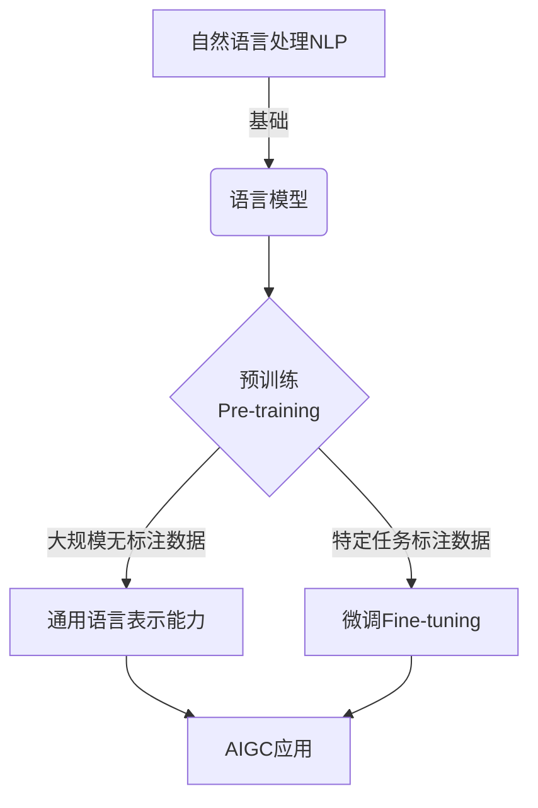

# AIGC从入门到实战：探秘ChatGPT到底是什么

## 1.背景介绍

### 1.1 人工智能的崛起

人工智能(Artificial Intelligence, AI)作为一门新兴的交叉学科,已经渗透到我们生活的方方面面。从语音助手到自动驾驶汽车,从推荐系统到医疗诊断,AI正在彻底改变着人类的生活方式和工作模式。

### 1.2 AIGC的概念

AIGC(AI Generated Content)即人工智能生成内容,是指利用人工智能技术自动生成文本、图像、音频、视频等多种形式的内容。作为人工智能领域的一个重要分支,AIGC已经取得了长足的进步,为内容创作带来了全新的机遇和挑战。

### 1.3 ChatGPT的出现

2022年11月,OpenAI推出了ChatGPT,这款基于GPT-3.5架构的对话式AI系统,凭借其出色的自然语言处理能力和广博的知识面,在短时间内就引起了全球关注。ChatGPT不仅能够进行问答对话,还可以生成文章、代码、诗歌等多种形式的内容,被视为AIGC领域的一次重大突破。

## 2.核心概念与联系

### 2.1 自然语言处理(NLP)

自然语言处理(Natural Language Processing, NLP)是人工智能的一个重要分支,旨在使计算机能够理解和生成人类语言。NLP技术是AIGC的核心基础,ChatGPT就是基于NLP技术实现的。

### 2.2 语言模型(Language Model)

语言模型是NLP领域的一个核心概念,它通过对大量文本数据进行训练,学习语言的统计规律,从而能够生成看似人类编写的自然语言。GPT(Generative Pre-trained Transformer)就是一种基于Transformer架构的大型语言模型。

### 2.3 预训练与微调(Pre-training & Fine-tuning)

预训练是指在大规模无标注数据上进行通用性训练,获得通用的语言表示能力。微调则是在特定任务的标注数据上进行进一步训练,使模型适应特定任务。ChatGPT就是通过预训练和微调两个阶段训练而成。



上图展示了NLP、语言模型、预训练与微调之间的关系,以及它们如何为AIGC应用提供支持。

## 3.核心算法原理具体操作步骤

ChatGPT的核心算法是基于Transformer架构的GPT(Generative Pre-trained Transformer)语言模型。其具体操作步骤如下:

### 3.1 预训练阶段

1) **数据预处理**: 从互联网上收集海量的文本数据,进行数据清洗、标记化等预处理操作。

2) **模型初始化**: 初始化一个基于Transformer架构的序列到序列(Seq2Seq)模型,包括embedding层、多层编码器和解码器。

3) **无监督预训练**: 在预处理后的大规模文本数据上,使用掩码语言模型(Masked Language Model)和下一句预测(Next Sentence Prediction)等无监督目标,对模型进行预训练,获得通用的语言表示能力。

### 3.2 微调阶段

4) **数据标注**: 针对特定的任务(如对话、文本生成等),收集相应的标注数据集。

5) **微调训练**: 在标注数据集上,使用监督学习的方式,对预训练模型进行微调,使其适应特定任务。

6) **生成输出**: 对于给定的输入,模型会生成相应的输出序列(如回答、生成文本等)。

### 3.3 关键技术

在上述过程中,还涉及到一些关键技术:

- **注意力机制(Attention Mechanism)**: 用于捕捉输入序列中不同位置之间的依赖关系。
- **Transformer架构**: 全注意力机制的序列到序列模型架构,高效并行计算。
- **掩码语言模型**: 通过预测被掩码的单词,学习上下文语义表示。
- **迁移学习(Transfer Learning)**: 将预训练模型中学习到的知识迁移到下游任务中。
- **生成式模型(Generative Model)**: 直接生成目标输出,而非传统的discriminative模型。

## 4.数学模型和公式详细讲解举例说明

### 4.1 Transformer架构

Transformer架构是GPT模型的核心,它完全基于注意力机制,摒弃了RNN和CNN等传统架构。其数学模型如下:

$$\begin{aligned}
    \text{Attention}(Q, K, V) &= \text{softmax}\left(\frac{QK^T}{\sqrt{d_k}}\right)V \\
    \text{MultiHead}(Q, K, V) &= \text{Concat}(head_1, \ldots, head_h)W^O\\
        \text{where}\ head_i &= \text{Attention}(QW_i^Q, KW_i^K, VW_i^V)
\end{aligned}$$

其中$Q$、$K$、$V$分别表示Query、Key和Value;$d_k$是缩放因子;$W_i^Q$、$W_i^K$、$W_i^V$和$W^O$是可学习的线性投影参数。

MultiHead注意力机制通过并行计算多个注意力头,能够更好地捕捉不同的依赖关系。

### 4.2 掩码语言模型

掩码语言模型(Masked Language Model, MLM)是预训练GPT模型的关键技术之一。其基本思想是在输入序列中随机掩码一些单词,然后让模型预测被掩码的单词。数学上,可以表示为:

$$\begin{aligned}
    \mathcal{L}_\text{MLM} &= -\mathbb{E}_{x \sim X} \left[ \sum_{i \in \text{mask}} \log P(x_i | x_{\backslash i}) \right] \\
    &= -\mathbb{E}_{x \sim X} \left[ \sum_{i \in \text{mask}} \log \frac{\exp(h_i^\top e(x_i))}{\sum_{x' \in \mathcal{V}} \exp(h_i^\top e(x'))} \right]
\end{aligned}$$

其中$x$是输入序列,$\text{mask}$是被掩码单词的位置集合,$h_i$是第$i$个位置的隐状态向量,$e(x_i)$是单词$x_i$的embedding向量,$\mathcal{V}$是词表。

通过最小化MLM损失函数,模型可以学习到良好的上下文语义表示能力。

### 4.3 生成式模型

与传统的discriminative模型不同,GPT是一种生成式模型(Generative Model),直接生成目标输出序列。具体来说,给定输入$x$,模型需要生成最可能的输出序列$\hat{y}$:

$$\hat{y} = \arg\max_y P(y|x;\theta)$$

其中$\theta$是模型参数。在自回归(Auto-Regressive)的框架下,输出序列的概率可以分解为:

$$P(y|x;\theta) = \prod_{t=1}^{T}P(y_t|y_{<t},x;\theta)$$

也就是说,生成每个单词时,都要条件于之前生成的单词和输入$x$。通过贪心搜索或beam search等方法,可以获得最可能的输出序列。

## 5.项目实践:代码实例和详细解释说明

为了更好地理解GPT模型的工作原理,我们来看一个使用Hugging Face的Transformers库构建和微调GPT模型的实例。

### 5.1 预训练模型加载

```python
from transformers import GPT2LMHeadModel, GPT2Tokenizer

# 加载预训练模型和分词器
model = GPT2LMHeadModel.from_pretrained('gpt2')
tokenizer = GPT2Tokenizer.from_pretrained('gpt2')
```

我们首先加载了预训练的GPT-2模型和分词器。GPT-2是OpenAI开源的一个基于Transformer的大型语言模型,可以用于文本生成等任务。

### 5.2 文本生成

```python
input_text = "Once upon a time, there was a"
input_ids = tokenizer.encode(input_text, return_tensors='pt')

output = model.generate(input_ids, max_length=100, do_sample=True, top_k=50, top_p=0.95, num_return_sequences=3)

for i in range(3):
    text = tokenizer.decode(output[i], skip_special_tokens=True)
    print(f"Generated text {i+1}: {text}")
```

上面的代码展示了如何使用预训练的GPT-2模型生成文本。我们首先将输入文本编码为token id序列,然后调用`model.generate()`方法生成输出序列。`max_length`参数控制生成序列的最大长度,`do_sample`表示是否进行采样,`top_k`和`top_p`则控制采样的策略。`num_return_sequences`指定生成多少个不同的序列。

最终,我们将生成的token id序列解码为文本,并打印出来。

### 5.3 微调模型

除了直接使用预训练模型进行文本生成,我们还可以在特定的数据集上对模型进行微调,以适应特定的任务。下面是一个在SQUAD数据集上微调GPT-2模型进行问答的示例:

```python
from transformers import GPT2ForQuestionAnswering, GPT2Tokenizer
from datasets import load_dataset

# 加载数据集
dataset = load_dataset('squad')

# 加载预训练模型和分词器
model = GPT2ForQuestionAnswering.from_pretrained('gpt2')
tokenizer = GPT2Tokenizer.from_pretrained('gpt2')

# 数据预处理和微调
# ...
```

在这个例子中,我们首先加载了SQUAD数据集,然后使用`GPT2ForQuestionAnswering`模型和`GPT2Tokenizer`分词器。接下来,我们需要对数据进行预处理,构建输入和标签,然后使用微调的方式在SQUAD数据集上训练模型。完整的代码过于冗长,这里就不再赘述。

通过上面的例子,我们可以看到,使用Transformers库可以方便地加载预训练模型、进行文本生成、以及在特定数据集上进行微调。这为我们实践和探索GPT模型提供了良好的基础。

## 6.实际应用场景

作为一种通用的语言模型,GPT及其变体可以应用于多种场景,包括但不限于:

### 6.1 文本生成

GPT模型可以生成各种形式的文本内容,如新闻报道、小说、诗歌、评论等。这为内容创作者提供了强大的辅助工具,提高了内容生产效率。

### 6.2 问答系统

通过在特定的问答数据集上进行微调,GPT模型可以构建出强大的问答系统,为用户提供准确、及时的回答。这在客户服务、智能助手等领域有着广泛的应用前景。

### 6.3 机器翻译

GPT模型的多语言版本可以用于机器翻译任务,实现跨语言的内容生成和理解。这对于促进不同语言文化之间的交流具有重要意义。

### 6.4 代码生成

除了自然语言文本,GPT模型还可以生成计算机程序代码。这为程序员提供了智能编码辅助,提高了开发效率。

### 6.5 智能写作助手

将GPT模型与文本编辑器相结合,可以构建智能写作助手,为用户提供内容创作建议、语法检查、风格优化等功能,大幅提升写作体验。

### 6.6 内容审核和分类

通过在特定数据集上进行微调,GPT模型还可以用于内容审核和分类,如垃圾信息识别、敏感内容检测等,为构建健康、有序的网络环境提供保障。

## 7.工具和资源推荐

在探索和实践GPT模型的过程中,以下工具和资源或许能够给你一些启发和帮助:

### 7.1 Hugging Face Transformers

Hugging Face Transformers是一个领先的自然语言处理库,提供了各种预训练模型(包括GPT系列)和相关工具,是进行GPT模型实践的不二之选。官方网站提供了丰富的教程和示例代码,是入门的绝佳资源。

地址: https://huggingface.co/transformers

### 7.2 OpenAI GPT-3 Playground

OpenAI提供了一个在线的GPT-3 Playground,允许