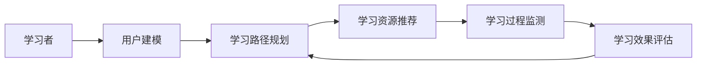

# AI人工智能深度学习算法：在教育培训中运用自主学习代理

## 1.背景介绍

### 1.1 人工智能与教育培训的结合

在当今时代,人工智能(Artificial Intelligence, AI)技术正在以前所未有的速度发展,并在各个领域得到广泛应用。教育培训作为一个重要的应用场景,也正在被AI技术所革新。传统的教育培训模式往往采用"一刀切"的方式,忽视了学习者个体之间的差异性。而AI技术的引入,为实现个性化、智能化的教育培训提供了新的可能。

### 1.2 自主学习代理的概念

自主学习代理(Autonomous Learning Agent)是AI技术在教育培训领域的一个重要应用。它是一种基于深度学习算法的智能系统,能够根据学习者的个人特点,自主地制定学习计划、选择学习资源、监测学习过程,并及时调整学习策略,从而最大限度地提高学习效率。

### 1.3 自主学习代理的优势

与传统的教育培训模式相比,自主学习代理具有以下优势:

1. 个性化:能够根据学习者的知识背景、学习能力、学习风格等因素,提供量身定制的学习方案。
2. 智能化:利用AI算法,能够实时分析学习者的学习行为数据,精准把握学习状态,及时调整教学策略。
3. 高效性:通过优化学习路径,减少无效学习时间,显著提高学习效率。
4. 自主性:学习者可以根据自己的时间安排,自主地开展学习,不受时空限制。

## 2.核心概念与联系

### 2.1 深度学习

深度学习(Deep Learning,DL)是自主学习代理的核心技术之一。它是一种多层次的机器学习方法,通过模拟人脑的神经网络结构,能够从海量数据中自动提取特征,建立复杂的数学模型,实现对未知数据的预测和决策。

### 2.2 强化学习

强化学习(Reinforcement Learning,RL)是自主学习代理的另一项关键技术。它是一种试错式的学习方法,通过不断与环境互动,根据反馈结果优化决策策略,最终达到特定目标。在自主学习代理中,强化学习被用于优化学习路径,提高学习效率。

### 2.3 知识图谱

知识图谱(Knowledge Graph)是一种结构化的知识表示方法,以图的形式描述概念之间的关联。在自主学习代理中,知识图谱被用于组织教学知识,为学习者推荐相关学习资源,帮助学习者更好地理解知识之间的联系。

### 2.4 技术架构

自主学习代理的技术架构如下图所示:



## 3.核心算法原理具体操作步骤

### 3.1 基于深度学习的用户建模

用户建模是自主学习代理的基础。通过收集学习者的个人信息、学习行为数据等,利用深度学习算法建立用户画像,刻画学习者的知识背景、学习能力、学习风格等特征。

具体步骤如下:

1. 数据收集:收集学习者的个人信息、学习行为数据等。
2. 数据预处理:对收集到的数据进行清洗、转换、标准化等处理。
3. 特征提取:利用深度学习算法(如卷积神经网络、循环神经网络等)从数据中自动提取特征。
4. 用户画像建模:基于提取的特征,建立用户画像模型,刻画学习者的各项特征。

### 3.2 基于强化学习的学习路径优化

学习路径优化是提高学习效率的关键。通过强化学习算法,自主学习代理能够根据学习者的实时反馈,不断调整学习路径,最大化学习收益。

具体步骤如下:

1. 状态表示:将学习过程抽象为一个马尔可夫决策过程(MDP),定义状态空间、动作空间和奖励函数。
2. 价值函数估计:利用Q-learning、SARSA等算法,估计不同状态-动作对的价值函数。
3. 策略优化:基于价值函数,利用ε-贪心、softmax等策略,选择最优动作,更新学习路径。
4. 策略评估:根据学习者的反馈,评估当前策略的有效性,并不断迭代优化。

### 3.3 基于知识图谱的学习资源推荐

学习资源推荐是提高学习效果的有效手段。通过构建教学知识图谱,自主学习代理能够根据学习者的知识掌握情况,精准推荐相关学习资源。

具体步骤如下:

1. 知识抽取:从教学材料、习题库等来源中抽取知识点,构建原始知识库。
2. 知识融合:利用自然语言处理技术,对原始知识进行清洗、归一、消歧等处理,构建融合后的知识库。
3. 知识图谱构建:基于融合后的知识库,利用本体构建、图嵌入等技术,构建教学知识图谱。
4. 资源推荐:根据学习者的知识掌握情况,在知识图谱上应用协同过滤、基于内容的推荐等算法,为学习者推荐相关学习资源。

## 4.数学模型和公式详细讲解举例说明

### 4.1 深度学习模型

在用户建模中,常用的深度学习模型包括卷积神经网络(CNN)和循环神经网络(RNN)。

以CNN为例,其数学模型可表示为:

$$
\begin{aligned}
z^{(l)}&=W^{(l)}*a^{(l-1)}+b^{(l)} \\
a^{(l)}&=f(z^{(l)})
\end{aligned}
$$

其中,$*$表示卷积操作,$W^{(l)}$和$b^{(l)}$分别表示第$l$层的卷积核和偏置,$f$表示激活函数(如ReLU函数)。

假设我们要建模学习者的学习风格,可以将学习行为数据(如视频观看时长、习题完成情况等)转化为多维时间序列,然后利用CNN对其进行特征提取和分类,得到学习者的学习风格特征。

### 4.2 强化学习模型

在学习路径优化中,常用的强化学习模型包括Q-learning和SARSA。

以Q-learning为例,其数学模型可表示为:

$$
Q(s,a) \leftarrow Q(s,a)+\alpha[r+\gamma \max_{a'}Q(s',a')-Q(s,a)]
$$

其中,$Q(s,a)$表示状态-动作对$(s,a)$的价值函数,$\alpha$表示学习率,$\gamma$表示折扣因子,$r$表示奖励值。

假设我们要优化学习者的学习路径,可以将学习过程抽象为一个MDP,状态表示学习者的知识掌握情况,动作表示学习资源的选择,奖励函数根据学习效果(如测试得分)来设计。然后利用Q-learning算法,不断更新价值函数,得到最优学习路径。

### 4.3 知识图谱模型

在学习资源推荐中,知识图谱可以用一个三元组$(h,r,t)$来表示,其中$h$表示头实体,$r$表示关系,$t$表示尾实体。

例如,三元组(Python, 属于, 编程语言)表示"Python属于编程语言"这一知识。

在构建知识图谱时,可以利用TransE等图嵌入模型,将实体和关系映射到同一个低维空间,使得$h+r \approx t$。

TransE的数学模型可表示为:

$$
f_r(h,t)=\|h+r-t\|_2^2
$$

其中,$f_r(h,t)$表示三元组$(h,r,t)$的能量函数,$\|\cdot\|_2$表示L2范数。

在推荐学习资源时,可以计算学习者当前知识状态与知识图谱中资源节点的相似度,选择相似度最高的资源进行推荐。

## 5.项目实践：代码实例和详细解释说明

下面以Python代码为例,演示如何利用深度学习算法实现用户画像建模。

```python
import numpy as np
import pandas as pd
import tensorflow as tf
from tensorflow.keras.models import Sequential
from tensorflow.keras.layers import Dense, Dropout, Conv1D, MaxPooling1D, Flatten

# 加载学习行为数据
data = pd.read_csv('learning_behavior.csv')

# 数据预处理
X = data.iloc[:, :-1].values
y = data.iloc[:, -1].values
X = np.reshape(X, (X.shape[0], X.shape[1], 1))
y = tf.keras.utils.to_categorical(y)

# 构建CNN模型
model = Sequential()
model.add(Conv1D(32, 3, activation='relu', input_shape=(X.shape[1], 1)))
model.add(MaxPooling1D(2))
model.add(Conv1D(64, 3, activation='relu'))
model.add(MaxPooling1D(2))
model.add(Conv1D(128, 3, activation='relu'))
model.add(Flatten())
model.add(Dense(64, activation='relu'))
model.add(Dropout(0.5))
model.add(Dense(y.shape[1], activation='softmax'))

# 编译模型
model.compile(loss='categorical_crossentropy',
              optimizer='adam',
              metrics=['accuracy'])

# 训练模型
model.fit(X, y, epochs=50, batch_size=32, validation_split=0.1)

# 保存模型
model.save('user_profile.h5')
```

代码解释:

1. 首先加载学习行为数据,并进行预处理,将特征数据转换为三维张量,将标签数据进行one-hot编码。
2. 然后构建一个包含三个卷积层、两个池化层和两个全连接层的CNN模型,用于提取学习行为特征和分类学习风格。
3. 接着编译模型,设置损失函数为交叉熵,优化器为Adam,评估指标为准确率。
4. 最后训练模型,设置迭代次数为50,批大小为32,验证集比例为10%,并将训练好的模型保存到本地。

通过上述代码,我们就可以建立学习者的用户画像模型,为后续的个性化学习提供支持。

## 6.实际应用场景

自主学习代理可以应用于以下教育培训场景:

### 6.1 智能教学系统

在智能教学系统中,自主学习代理可以根据学生的学习情况,自动生成个性化的学习路径和学习资源,实现因材施教。同时,通过实时监测学生的学习行为,及时调整教学策略,提高教学效果。

### 6.2 自适应学习平台

在自适应学习平台中,自主学习代理可以为学生提供个性化的学习体验。通过分析学生的学习行为和知识掌握情况,推荐适合的学习内容和学习活动,帮助学生更高效地学习。

### 6.3 智能家教系统

在智能家教系统中,自主学习代理可以扮演私人教练的角色。通过与学生的实时互动,了解学生的学习需求和学习特点,制定个性化的学习计划,并提供针对性的学习指导和反馈。

### 6.4 企业培训系统

在企业培训系统中,自主学习代理可以帮助员工快速掌握岗位所需技能。通过分析员工的知识背景和学习能力,推荐合适的培训课程和学习资源,并根据员工的学习进度和考核结果,调整后续培训安排。

## 7.工具和资源推荐

### 7.1 深度学习框架

- TensorFlow: 由Google开发的开源机器学习框架,支持多种深度学习模型的构建和训练。
- PyTorch: 由Facebook开发的开源机器学习库,具有动态计算图和自动求导等特性,适合研究和实验。
- Keras: 一个基于TensorFlow和Theano的高层神经网络API,易学易用,适合快速搭建深度学习模型。

### 7.2 强化学习库

- OpenAI Gym: 一个用于开发和比较强化学习算法的工具包,包含多个标准化的测试环境。
- TensorFlow Agents: 一个基于TensorFlow的强化学习库,提供多种强化学习算法的实现。
- Stable Baselines: 一个基于