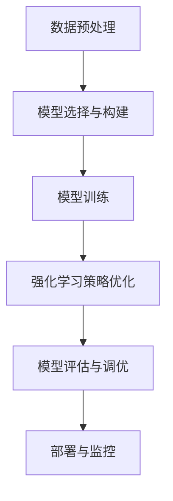

# AI人工智能深度学习算法：智能深度学习代理的任务处理流程

## 1.背景介绍

在过去的十年中，人工智能（AI）和深度学习（DL）技术取得了显著的进展。深度学习算法已经在图像识别、自然语言处理、语音识别等领域取得了突破性的成果。智能深度学习代理（Intelligent Deep Learning Agents，IDLA）作为一种新兴的技术，正在逐渐成为解决复杂任务的关键工具。本文将深入探讨智能深度学习代理的任务处理流程，帮助读者理解其核心概念、算法原理、数学模型、实际应用以及未来发展趋势。

## 2.核心概念与联系

### 2.1 智能深度学习代理

智能深度学习代理是一种能够自主学习和决策的系统，通常由多个深度学习模型和强化学习算法组成。它们能够在复杂环境中执行任务，并通过不断的学习和优化来提高性能。

### 2.2 深度学习

深度学习是一种基于人工神经网络的机器学习方法，具有多层结构。它通过大量的数据和计算资源，能够自动提取特征并进行分类、回归等任务。

### 2.3 强化学习

强化学习是一种通过与环境交互来学习策略的机器学习方法。智能代理通过试错法来获得最大化累积奖励的策略。

### 2.4 核心联系

智能深度学习代理将深度学习和强化学习结合起来，通过深度神经网络进行特征提取和决策，通过强化学习进行策略优化。

## 3.核心算法原理具体操作步骤

### 3.1 数据预处理

数据预处理是深度学习任务的第一步，包括数据清洗、归一化、特征提取等步骤。数据的质量直接影响模型的性能。

### 3.2 模型选择与构建

选择合适的深度学习模型（如卷积神经网络、循环神经网络等）并进行构建。模型的选择取决于具体任务的需求。

### 3.3 模型训练

使用大规模数据集对模型进行训练，通过反向传播算法优化模型参数。训练过程中需要监控损失函数和准确率等指标。

### 3.4 强化学习策略优化

在训练好的深度学习模型基础上，使用强化学习算法（如Q-learning、深度Q网络等）进行策略优化。智能代理通过与环境交互，不断调整策略以获得最大化的累积奖励。

### 3.5 模型评估与调优

使用验证集对模型进行评估，调整超参数和模型结构以提高性能。评估指标包括准确率、召回率、F1-score等。

### 3.6 部署与监控

将训练好的模型部署到生产环境中，并进行实时监控和维护。需要定期更新模型以应对数据分布的变化。



## 4.数学模型和公式详细讲解举例说明

### 4.1 深度神经网络

深度神经网络（DNN）由多个层组成，每一层包含若干神经元。神经元之间通过权重连接，输入通过激活函数进行非线性变换。

$$
y = f(Wx + b)
$$

其中，$W$ 是权重矩阵，$x$ 是输入向量，$b$ 是偏置向量，$f$ 是激活函数。

### 4.2 反向传播算法

反向传播算法用于优化神经网络的参数，通过最小化损失函数来调整权重和偏置。

$$
\frac{\partial L}{\partial W} = \frac{\partial L}{\partial y} \cdot \frac{\partial y}{\partial W}
$$

其中，$L$ 是损失函数，$y$ 是输出。

### 4.3 强化学习中的Q-learning

Q-learning 是一种无模型的强化学习算法，通过学习状态-动作值函数（Q函数）来选择最优策略。

$$
Q(s, a) = Q(s, a) + \alpha [r + \gamma \max_{a'} Q(s', a') - Q(s, a)]
$$

其中，$s$ 是当前状态，$a$ 是当前动作，$r$ 是即时奖励，$\alpha$ 是学习率，$\gamma$ 是折扣因子。

## 5.项目实践：代码实例和详细解释说明

### 5.1 数据预处理

```python
import numpy as np
from sklearn.preprocessing import StandardScaler

# 加载数据
data = np.load('data.npy')

# 数据清洗
data = data[~np.isnan(data).any(axis=1)]

# 数据归一化
scaler = StandardScaler()
data = scaler.fit_transform(data)
```

### 5.2 模型选择与构建

```python
import tensorflow as tf
from tensorflow.keras.models import Sequential
from tensorflow.keras.layers import Dense

# 构建模型
model = Sequential([
    Dense(64, activation='relu', input_shape=(data.shape[1],)),
    Dense(64, activation='relu'),
    Dense(1, activation='sigmoid')
])

# 编译模型
model.compile(optimizer='adam', loss='binary_crossentropy', metrics=['accuracy'])
```

### 5.3 模型训练

```python
# 训练模型
history = model.fit(data, labels, epochs=10, batch_size=32, validation_split=0.2)
```

### 5.4 强化学习策略优化

```python
import gym
import numpy as np

env = gym.make('CartPole-v1')
state = env.reset()

# 初始化Q表
Q = np.zeros((env.observation_space.shape[0], env.action_space.n))

# Q-learning参数
alpha = 0.1
gamma = 0.99
epsilon = 0.1

for episode in range(1000):
    state = env.reset()
    done = False
    while not done:
        if np.random.rand() < epsilon:
            action = env.action_space.sample()
        else:
            action = np.argmax(Q[state])
        
        next_state, reward, done, _ = env.step(action)
        Q[state, action] = Q[state, action] + alpha * (reward + gamma * np.max(Q[next_state]) - Q[state, action])
        state = next_state
```

### 5.5 模型评估与调优

```python
# 评估模型
loss, accuracy = model.evaluate(test_data, test_labels)
print(f'Loss: {loss}, Accuracy: {accuracy}')
```

### 5.6 部署与监控

```python
import tensorflow as tf
from tensorflow.keras.models import load_model

# 保存模型
model.save('model.h5')

# 加载模型
model = load_model('model.h5')

# 部署到生产环境
def predict(input_data):
    return model.predict(input_data)
```

## 6.实际应用场景

### 6.1 图像识别

智能深度学习代理在图像识别领域表现出色，能够自动识别和分类图像中的物体。应用场景包括自动驾驶、医疗影像分析等。

### 6.2 自然语言处理

在自然语言处理领域，智能深度学习代理能够进行文本分类、情感分析、机器翻译等任务。应用场景包括智能客服、舆情监控等。

### 6.3 语音识别

智能深度学习代理在语音识别领域也有广泛应用，能够将语音转换为文本，并进行语义理解。应用场景包括语音助手、智能家居等。

### 6.4 游戏AI

在游戏领域，智能深度学习代理能够通过强化学习算法学习游戏策略，表现出超越人类的水平。应用场景包括围棋、象棋等复杂游戏。

## 7.工具和资源推荐

### 7.1 开发工具

- TensorFlow：一个开源的深度学习框架，支持多种神经网络模型的构建和训练。
- PyTorch：另一个流行的深度学习框架，具有动态计算图和易用性。
- OpenAI Gym：一个用于开发和比较强化学习算法的工具包。

### 7.2 数据集

- ImageNet：一个大规模图像数据集，常用于图像分类任务。
- COCO：一个用于图像识别、分割和标注的大规模数据集。
- MNIST：一个手写数字识别数据集，常用于初学者练习。

### 7.3 学习资源

- 《深度学习》：Ian Goodfellow等人编写的经典教材，系统介绍了深度学习的基本概念和算法。
- Coursera深度学习课程：由Andrew Ng教授讲授的在线课程，涵盖了深度学习的基础知识和应用。

## 8.总结：未来发展趋势与挑战

### 8.1 未来发展趋势

智能深度学习代理在未来将继续发展，主要趋势包括：

- 更强的自主学习能力：智能代理将能够在更复杂的环境中自主学习和决策。
- 多模态学习：智能代理将能够同时处理多种类型的数据，如图像、文本、语音等。
- 更高的计算效率：随着硬件技术的发展，智能代理的计算效率将不断提高。

### 8.2 挑战

尽管智能深度学习代理有着广阔的前景，但也面临一些挑战：

- 数据隐私和安全：如何在保护用户隐私的前提下使用数据是一个重要问题。
- 模型解释性：深度学习模型的黑箱性质使得其决策过程难以解释，需要发展更好的解释方法。
- 伦理和法律问题：智能代理的广泛应用可能带来一些伦理和法律问题，需要制定相应的规范和法律。

## 9.附录：常见问题与解答

### 9.1 什么是智能深度学习代理？

智能深度学习代理是一种能够自主学习和决策的系统，通常由多个深度学习模型和强化学习算法组成。

### 9.2 深度学习和强化学习有什么区别？

深度学习是一种基于人工神经网络的机器学习方法，主要用于特征提取和分类。强化学习是一种通过与环境交互来学习策略的机器学习方法，主要用于决策和策略优化。

### 9.3 如何选择合适的深度学习模型？

选择合适的深度学习模型取决于具体任务的需求。常见的模型包括卷积神经网络（用于图像处理）、循环神经网络（用于序列数据处理）等。

### 9.4 强化学习中的Q-learning算法是什么？

Q-learning是一种无模型的强化学习算法，通过学习状态-动作值函数（Q函数）来选择最优策略。

### 9.5 智能深度学习代理的应用场景有哪些？

智能深度学习代理的应用场景包括图像识别、自然语言处理、语音识别、游戏AI等。

---

作者：禅与计算机程序设计艺术 / Zen and the Art of Computer Programming