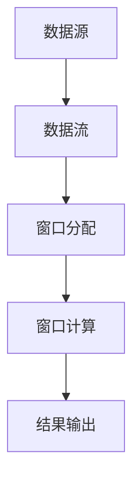
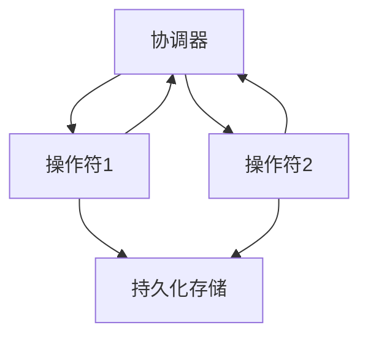

# Flink原理与代码实例讲解

## 1.背景介绍

Apache Flink 是一个开源的流处理框架，专为分布式数据流和批处理而设计。随着大数据技术的迅猛发展，实时数据处理需求日益增加，Flink 以其高吞吐量、低延迟和强大的容错能力，成为了许多企业的首选。本文将深入探讨 Flink 的核心原理、算法、数学模型，并通过代码实例展示其实际应用。

## 2.核心概念与联系

### 2.1 数据流与批处理

Flink 的核心在于其统一的流处理和批处理模型。数据流处理是指对连续不断的数据流进行实时处理，而批处理则是对静态数据集进行处理。Flink 通过 DataStream API 和 DataSet API 分别支持这两种处理模式。

### 2.2 时间语义

Flink 提供了三种时间语义：事件时间、处理时间和摄取时间。事件时间是指数据生成的时间，处理时间是指数据被处理的时间，摄取时间是指数据进入 Flink 系统的时间。事件时间语义是 Flink 的一大特色，能够处理乱序数据。

### 2.3 状态管理

Flink 的状态管理机制使得其能够高效地处理有状态的流处理任务。状态可以是键控状态（Keyed State）或操作符状态（Operator State），并且 Flink 提供了丰富的状态后端（State Backend）来存储这些状态。

### 2.4 容错机制

Flink 通过分布式快照（Distributed Snapshot）机制实现了强大的容错能力。该机制基于 Chandy-Lamport 算法，能够在不影响数据处理的情况下，定期保存系统状态，从而在故障发生时进行恢复。

## 3.核心算法原理具体操作步骤

### 3.1 数据流处理算法

Flink 的数据流处理算法主要包括窗口操作、状态管理和水位线（Watermark）机制。以下是一个简单的窗口操作示例：



### 3.2 分布式快照算法

分布式快照算法是 Flink 容错机制的核心。其操作步骤如下：

1. **触发快照**：协调器向所有操作符发送快照请求。
2. **标记边界**：操作符在接收到快照请求后，标记当前处理的边界。
3. **保存状态**：操作符将当前状态保存到持久化存储中。
4. **确认完成**：操作符向协调器确认快照完成。



## 4.数学模型和公式详细讲解举例说明

### 4.1 窗口操作数学模型

窗口操作是 Flink 数据流处理的核心。假设有一个数据流 $S = \{s_1, s_2, \ldots, s_n\}$，窗口操作可以定义为：

$$
W_i = \{s_j \mid t_j \in [T_i, T_i + \Delta T)\}
$$

其中，$W_i$ 表示第 $i$ 个窗口，$t_j$ 表示数据 $s_j$ 的时间戳，$T_i$ 表示窗口的起始时间，$\Delta T$ 表示窗口的长度。

### 4.2 分布式快照数学模型

分布式快照算法基于 Chandy-Lamport 算法，其核心思想是通过标记消息来记录系统状态。假设系统中有 $n$ 个操作符，$M$ 表示消息集合，$S_i$ 表示操作符 $i$ 的状态，则快照可以表示为：

$$
Snapshot = \{S_1, S_2, \ldots, S_n, M\}
$$

## 5.项目实践：代码实例和详细解释说明

### 5.1 环境搭建

首先，我们需要搭建 Flink 开发环境。可以通过以下命令安装 Flink：

```bash
wget https://archive.apache.org/dist/flink/flink-1.13.2/flink-1.13.2-bin-scala_2.11.tgz
tar -xzf flink-1.13.2-bin-scala_2.11.tgz
cd flink-1.13.2
./bin/start-cluster.sh
```

### 5.2 简单的流处理示例

以下是一个简单的 Flink 流处理示例，计算实时数据流中的单词频率：

```java
import org.apache.flink.api.common.functions.FlatMapFunction;
import org.apache.flink.api.java.tuple.Tuple2;
import org.apache.flink.streaming.api.datastream.DataStream;
import org.apache.flink.streaming.api.environment.StreamExecutionEnvironment;
import org.apache.flink.util.Collector;

public class WordCount {
    public static void main(String[] args) throws Exception {
        // 设置执行环境
        final StreamExecutionEnvironment env = StreamExecutionEnvironment.getExecutionEnvironment();

        // 读取数据流
        DataStream<String> text = env.socketTextStream("localhost", 9999);

        // 处理数据流
        DataStream<Tuple2<String, Integer>> counts = text
            .flatMap(new Tokenizer())
            .keyBy(value -> value.f0)
            .sum(1);

        // 输出结果
        counts.print();

        // 执行程序
        env.execute("Word Count Example");
    }

    public static final class Tokenizer implements FlatMapFunction<String, Tuple2<String, Integer>> {
        @Override
        public void flatMap(String value, Collector<Tuple2<String, Integer>> out) {
            for (String word : value.split("\\s")) {
                out.collect(new Tuple2<>(word, 1));
            }
        }
    }
}
```

### 5.3 详细解释

1. **设置执行环境**：`StreamExecutionEnvironment` 是 Flink 程序的入口。
2. **读取数据流**：通过 `socketTextStream` 方法从指定的主机和端口读取数据流。
3. **处理数据流**：使用 `flatMap` 方法将输入的文本分割成单词，并使用 `keyBy` 和 `sum` 方法计算每个单词的频率。
4. **输出结果**：使用 `print` 方法将结果输出到控制台。
5. **执行程序**：调用 `execute` 方法启动 Flink 程序。

## 6.实际应用场景

### 6.1 实时数据分析

Flink 广泛应用于实时数据分析场景，如金融交易监控、网络流量分析和社交媒体数据处理。其低延迟和高吞吐量使其能够处理大规模实时数据流。

### 6.2 机器学习

Flink 还可以用于实时机器学习模型的训练和预测。通过与 TensorFlow、PyTorch 等机器学习框架集成，Flink 可以实现在线学习和实时预测。

### 6.3 物联网

在物联网（IoT）领域，Flink 可以用于处理来自传感器的数据流，实现实时监控和预警。例如，智能城市中的交通监控系统可以使用 Flink 处理实时交通数据。

## 7.工具和资源推荐

### 7.1 开发工具

- **IntelliJ IDEA**：强大的 Java 开发工具，支持 Flink 开发。
- **VS Code**：轻量级的代码编辑器，支持多种编程语言和插件。

### 7.2 在线资源

- **Flink 官方文档**：详细的 API 文档和使用指南。
- **Flink 社区**：活跃的社区论坛和邮件列表，提供技术支持和交流平台。

### 7.3 学习资源

- **《Stream Processing with Apache Flink》**：一本全面介绍 Flink 的书籍，适合初学者和高级用户。
- **Coursera 和 Udemy 上的 Flink 课程**：提供系统的在线学习资源。

## 8.总结：未来发展趋势与挑战

Flink 作为一个强大的流处理框架，已经在多个领域得到了广泛应用。未来，随着大数据和物联网技术的进一步发展，Flink 的应用场景将更加广泛。然而，Flink 也面临一些挑战，如处理超大规模数据流的性能优化、与其他大数据框架的集成等。持续的技术创新和社区贡献将是 Flink 未来发展的关键。

## 9.附录：常见问题与解答

### 9.1 Flink 与 Spark 的区别是什么？

Flink 和 Spark 都是大数据处理框架，但 Flink 更侧重于流处理，而 Spark 更侧重于批处理。Flink 提供了更低的延迟和更强的容错能力，而 Spark 则在批处理性能上更具优势。

### 9.2 如何处理 Flink 中的乱序数据？

Flink 提供了水位线（Watermark）机制来处理乱序数据。通过定义水位线，Flink 可以在一定程度上容忍数据的乱序，并在水位线到达时触发窗口计算。

### 9.3 Flink 的状态管理如何实现？

Flink 的状态管理通过键控状态（Keyed State）和操作符状态（Operator State）实现。状态可以存储在内存、文件系统或分布式存储中，并通过分布式快照机制实现容错。

### 9.4 如何优化 Flink 程序的性能？

优化 Flink 程序的性能可以从以下几个方面入手：
- 合理设置并行度
- 使用高效的序列化机制
- 优化状态存储和检查点配置
- 避免数据倾斜

### 9.5 Flink 如何与其他大数据框架集成？

Flink 可以与 Kafka、Hadoop、Hive 等大数据框架集成，实现数据的高效处理和存储。通过连接器和 API，Flink 可以方便地与其他系统进行数据交换和协同处理。

---

作者：禅与计算机程序设计艺术 / Zen and the Art of Computer Programming