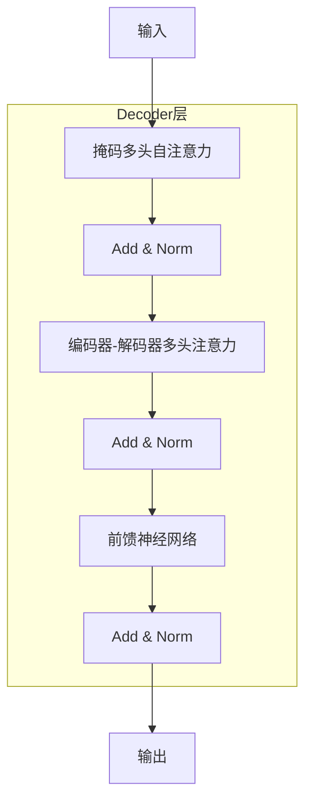

# GPT-4原理与代码实例讲解

## 1.背景介绍

人工智能技术的发展一直是科技领域的热点话题。近年来,自然语言处理(NLP)领域取得了长足进展,其中以GPT(Generative Pre-trained Transformer)系列模型最为瞩目。GPT-4作为OpenAI公司最新推出的大型语言模型,展现出令人惊叹的自然语言生成和理解能力,在多个任务上超越了人类水平。本文将深入探讨GPT-4的核心原理、算法细节、代码实现,以及在实际应用中的表现和未来发展趋势。

## 2.核心概念与联系

### 2.1 自注意力机制(Self-Attention)

自注意力机制是Transformer模型的核心,它能够捕捉输入序列中任意两个位置之间的关系。与RNN等序列模型不同,自注意力机制不存在递归计算和梯度消失问题,能更好地并行计算。

### 2.2 Transformer架构

Transformer架构由编码器(Encoder)和解码器(Decoder)组成。编码器将输入序列映射为连续的向量表示,解码器则根据编码器输出生成目标序列。两者均采用多头自注意力和前馈神经网络构建。

### 2.3 预训练与微调(Pre-training & Fine-tuning)

GPT模型采用无监督预训练和有监督微调的范式。预训练阶段在大规模文本数据上学习通用的语言表示,微调阶段在特定任务数据上进行模型调整,从而获得优异的泛化性能。

## 3.核心算法原理具体操作步骤

### 3.1 Transformer解码器(Decoder)

GPT-4的核心是基于Transformer解码器的自回归语言模型。解码器由多个相同的解码器层组成,每层包含以下子层:

1. **掩码多头自注意力(Masked Multi-Head Attention)**:通过掩码机制,每个位置的单词只能关注之前的单词,确保了自回归生成的合理性。
2. **编码器-解码器多头注意力(Encoder-Decoder Multi-Head Attention)**:允许解码器关注编码器的输出,用于序列到序列(Seq2Seq)任务。
3. **前馈神经网络(Feed-Forward Network)**:两个线性变换和ReLU激活函数,用于特征变换。
4. **残差连接(Residual Connection)**:将子层输入与输出相加,有助于梯度传播。
5. **层归一化(Layer Normalization)**:对输入进行归一化,提高训练稳定性。



### 3.2 注意力机制(Attention Mechanism)

注意力机制是Transformer的核心,它通过计算查询(Query)、键(Key)和值(Value)之间的相似性,动态地为每个位置分配注意力权重。

1. **缩放点积注意力(Scaled Dot-Product Attention)**:
   $$\text{Attention}(Q, K, V) = \text{softmax}(\frac{QK^T}{\sqrt{d_k}})V$$

2. **多头注意力(Multi-Head Attention)**:将查询、键和值线性投影到不同的表示子空间,并行运行多个注意力头,最后将结果拼接。
   $$\text{MultiHead}(Q, K, V) = \text{Concat}(head_1, ..., head_h)W^O$$
   其中 $head_i = \text{Attention}(QW_i^Q, KW_i^K, VW_i^V)$

通过自注意力和编码器-解码器注意力,GPT-4能够有效地融合上下文信息,捕捉长距离依赖关系。

## 4.数学模型和公式详细讲解举例说明

### 4.1 语言模型(Language Model)

语言模型是自然语言处理的基础,旨在估计一个序列的概率分布。GPT-4采用自回归语言模型,对于一个长度为$n$的序列$X=(x_1, x_2, ..., x_n)$,其概率可表示为:

$$P(X) = \prod_{t=1}^{n}P(x_t|x_1, ..., x_{t-1})$$

通过最大化上述条件概率的对数似然,可以训练出能够生成自然语言的模型。

### 4.2 交叉熵损失(Cross-Entropy Loss)

在训练过程中,GPT-4使用交叉熵损失函数来衡量模型预测与真实标签之间的差异:

$$\mathcal{L}(\theta) = -\frac{1}{N}\sum_{i=1}^{N}\log P(X^{(i)}|\theta)$$

其中$\theta$为模型参数,$X^{(i)}$为第$i$个训练样本序列,目标是最小化损失函数。

### 4.3 生成策略(Generation Strategies)

在推理阶段,GPT-4可以采用不同的生成策略,如贪婪搜索(Greedy Search)、束搜索(Beam Search)、核采样(Nucleus Sampling)和Top-K采样等。这些策略在生成质量和效率之间进行权衡。

例如,Top-K采样保留概率分布中前K个最高值,其他值置零,然后从剩余分布中采样:

$$P'(x) = \begin{cases}
\frac{P(x)}{\sum_{x'\in V_\text{top-k}}P(x')}, & x \in V_\text{top-k}\\
0, & \text{otherwise}
\end{cases}$$

其中$V_\text{top-k}$表示概率分布中前K个最高值对应的词汇表项。

## 5.项目实践:代码实例和详细解释说明

以下是一个使用PyTorch实现GPT-4解码器的简化示例:

```python
import torch
import torch.nn as nn

class MultiHeadAttention(nn.Module):
    def __init__(self, embed_dim, num_heads):
        super().__init__()
        self.embed_dim = embed_dim
        self.num_heads = num_heads
        self.head_dim = embed_dim // num_heads

        self.qkv_proj = nn.Linear(embed_dim, 3 * embed_dim)
        self.out_proj = nn.Linear(embed_dim, embed_dim)

    def forward(self, x, mask=None):
        batch_size, seq_len, _ = x.size()
        qkv = self.qkv_proj(x)
        q, k, v = qkv.chunk(3, dim=-1)

        q = q.view(batch_size, seq_len, self.num_heads, self.head_dim).transpose(1, 2)
        k = k.view(batch_size, seq_len, self.num_heads, self.head_dim).transpose(1, 2)
        v = v.view(batch_size, seq_len, self.num_heads, self.head_dim).transpose(1, 2)

        attn_scores = torch.matmul(q, k.transpose(-2, -1)) / math.sqrt(self.head_dim)
        if mask is not None:
            attn_scores = attn_scores.masked_fill(mask == 0, -1e9)
        attn_probs = nn.Softmax(dim=-1)(attn_scores)
        attn_output = torch.matmul(attn_probs, v)
        attn_output = attn_output.transpose(1, 2).contiguous().view(batch_size, seq_len, -1)
        out = self.out_proj(attn_output)
        return out

class DecoderLayer(nn.Module):
    def __init__(self, embed_dim, num_heads, ff_dim, dropout_rate=0.1):
        super().__init__()
        self.self_attn = MultiHeadAttention(embed_dim, num_heads)
        self.norm1 = nn.LayerNorm(embed_dim)
        self.ff = nn.Sequential(
            nn.Linear(embed_dim, ff_dim),
            nn.ReLU(),
            nn.Linear(ff_dim, embed_dim),
            nn.Dropout(dropout_rate)
        )
        self.norm2 = nn.LayerNorm(embed_dim)

    def forward(self, x, mask=None):
        residual = x
        x = self.self_attn(x, mask)
        x = self.norm1(x + residual)
        residual = x
        x = self.ff(x)
        x = self.norm2(x + residual)
        return x

class GPT4Decoder(nn.Module):
    def __init__(self, vocab_size, embed_dim, num_heads, ff_dim, num_layers, dropout_rate=0.1):
        super().__init__()
        self.token_embeddings = nn.Embedding(vocab_size, embed_dim)
        self.position_embeddings = nn.Embedding(512, embed_dim)
        self.layers = nn.ModuleList([DecoderLayer(embed_dim, num_heads, ff_dim, dropout_rate)
                                     for _ in range(num_layers)])
        self.norm = nn.LayerNorm(embed_dim)
        self.output_proj = nn.Linear(embed_dim, vocab_size)

    def forward(self, input_ids, attention_mask=None):
        batch_size, seq_len = input_ids.size()
        position_ids = torch.arange(seq_len, dtype=torch.long, device=input_ids.device)
        position_ids = position_ids.unsqueeze(0).expand(batch_size, seq_len)

        embeddings = self.token_embeddings(input_ids) + self.position_embeddings(position_ids)
        mask = self.create_mask(attention_mask, input_ids.size(-1))

        for layer in self.layers:
            embeddings = layer(embeddings, mask)

        embeddings = self.norm(embeddings)
        output = self.output_proj(embeddings)
        return output

    def create_mask(self, attention_mask, max_len):
        if attention_mask is None:
            attention_mask = torch.ones((max_len, max_len), dtype=torch.long)
            attention_mask = torch.tril(attention_mask)
        return attention_mask
```

上述代码实现了GPT-4解码器的核心组件,包括多头自注意力(MultiHeadAttention)、解码器层(DecoderLayer)和整体解码器(GPT4Decoder)。

- `MultiHeadAttention`类实现了多头自注意力机制,包括查询(Query)、键(Key)、值(Value)的线性投影,以及注意力计算和输出投影。
- `DecoderLayer`类构建了解码器层,包含自注意力子层、层归一化和前馈神经网络。
- `GPT4Decoder`类是整个解码器的实现,它包含词嵌入层、位置编码层、多个解码器层、输出投影层,以及用于生成掩码的辅助函数。

在使用时,我们可以初始化一个`GPT4Decoder`实例,并将输入序列传入`forward`方法进行推理。该实现仅为示例,在实际应用中还需要考虑模型初始化、数据预处理、训练过程等方面的细节。

## 6.实际应用场景

GPT-4凭借其强大的自然语言生成和理解能力,在多个领域展现出广阔的应用前景:

1. **文本生成**:可用于自动写作、内容创作、文案撰写等场景,提高生产效率。
2. **问答系统**:能够回答各种复杂问题,为用户提供准确、详尽的解答。
3. **机器翻译**:通过序列到序列的生成能力,实现高质量的多语种翻译。
4. **代码生成**:根据自然语言描述生成对应的代码,提高程序员的开发效率。
5. **智能助手**:可作为通用的智能助手,协助用户完成各种任务。
6. **教育领域**:生成个性化学习资料,提供在线辅导和答疑解惑。
7. **医疗健康**:分析病历资料,为医生提供辅助诊断和治疗建议。
8. **客户服务**:自动化处理客户咨询和投诉,提升服务质量和效率。

总的来说,GPT-4的应用范围十分广泛,它将为各行各业带来革命性的变革。

## 7.工具和资源推荐

在开发和使用GPT-4模型时,以下工具和资源可以为您提供帮助:

1. **OpenAI API**:OpenAI提供了GPT-4的API接口,方便开发者集成和使用模型。
2. **Hugging Face Transformers**:一个流行的NLP库,提供了预训练模型和相关工具。
3. **PyTorch/TensorFlow**:主流的深度学习框架,可用于自定义训练和微调GPT-4模型。
4. **NVIDIA NGC**:NVIDIA提供的GPU云服务,支持大规模模型的训练和推理。
5. **语料库**:如书籍、网页、维基百科等大规模文本数据,可用于模型预训练。
6. **评测数据集**:如GLUE、SuperGLUE等基准测试集,用于评估模型性能。
7. **在线社区**:如GitHub、Stack Overflow等,提供代码示例、技术讨论和问题解答。
8. **技术博客**:订阅相关领域的博客和新闻,了解最新研究进展