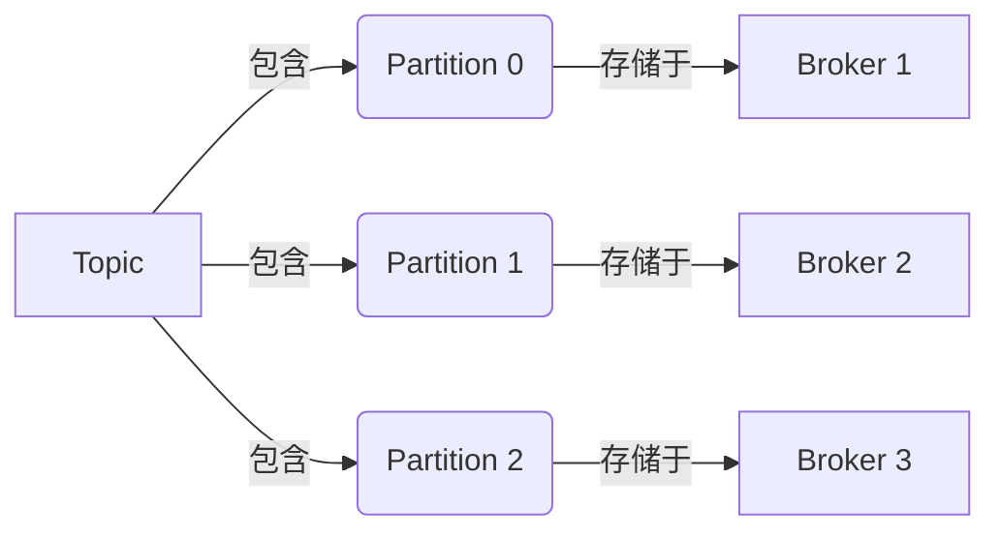
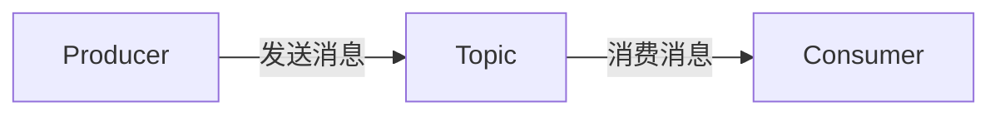
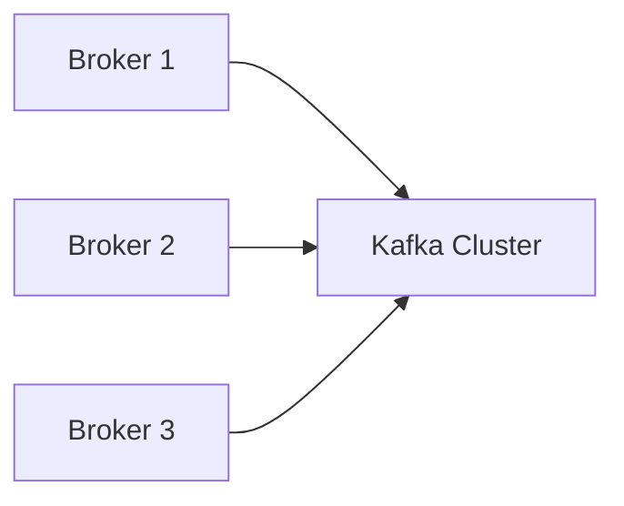
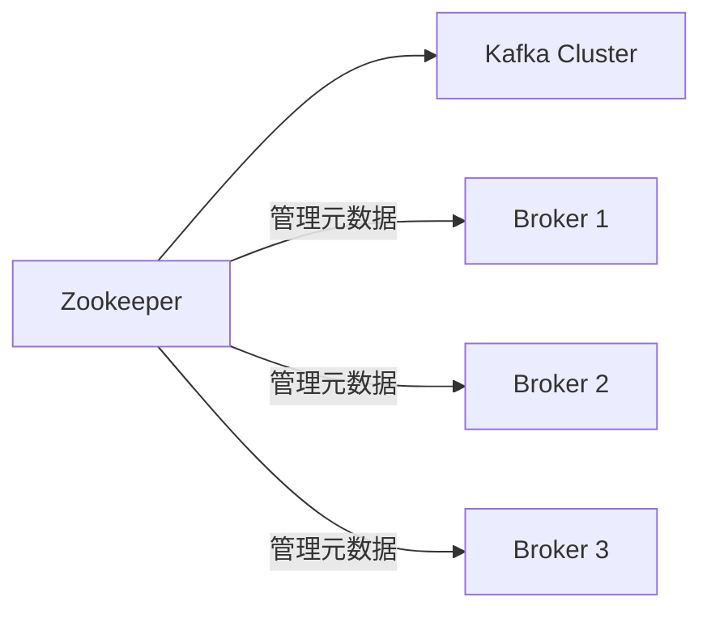
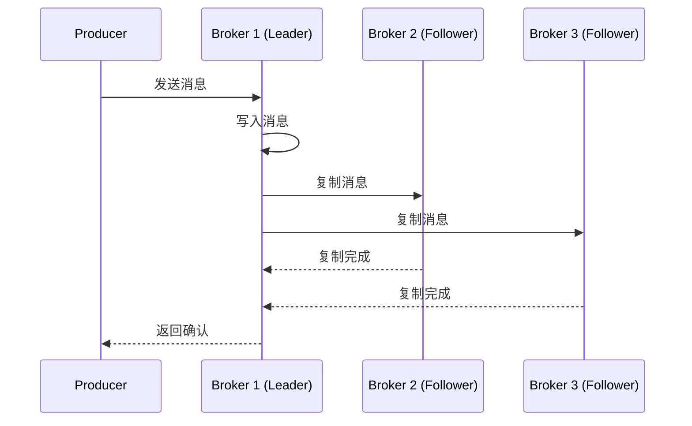
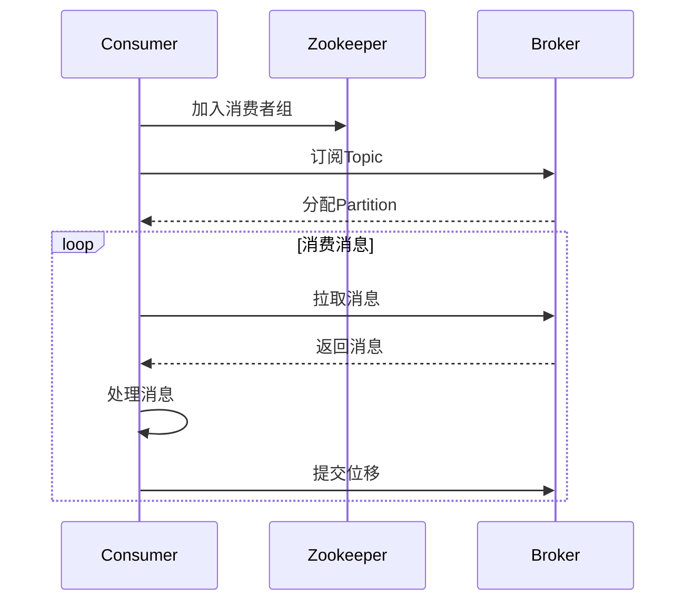

# Kafka原理与代码实例讲解

## 1. 背景介绍

Apache Kafka是一个分布式的流处理平台,最初由LinkedIn公司开发,后来被开源到Apache软件基金会,逐渐发展成为流处理领域的事实标准。Kafka的设计目标是提供一个统一、高吞吐、低延迟的平台,用于处理海量数据的实时流式传输。

Kafka具有以下几个关键特性:

- **高吞吐量**:Kafka可以持续地以高吞吐量处理海量数据流,即使有数以百万计的消息记录也可以毫秒级延迟处理。
- **可扩展性**:Kafka集群可以通过增加服务器数量来线性扩展,满足日益增长的数据吞吐量需求。
- **持久性**:消息被持久化到磁盘,并可在集群内进行备份,从而实现容错。
- **分布式**:Kafka具有分布式架构,消息可以分布在多个Broker上,从而提高并行处理能力。
- **实时性**:Kafka支持实时数据流的处理,消息被立即发送到消费者。

Kafka广泛应用于日志收集、消息系统、数据管道、流式处理、事件源(Event Sourcing)等场景,是大数据生态系统中不可或缺的核心组件。

## 2. 核心概念与联系

Kafka的核心概念包括以下几个方面:

### 2.1 Topic和Partition

Topic是Kafka中的消息逻辑通道,每个Topic可以被分为多个Partition。Partition是Kafka消息的基本存储单元,消息以顺序不变的方式被追加到Partition中。每个Partition只属于单个Broker,但一个Topic的不同Partition可以分布在不同的Broker上,从而实现负载均衡和容错。



### 2.2 Producer和Consumer

Producer是消息的生产者,负责向Kafka发送消息。Consumer是消息的消费者,从Kafka消费和处理消息。Producer和Consumer之间通过Topic进行通信。



### 2.3 Broker和Cluster

Broker是Kafka集群中的单个服务器实例,负责存储和处理消息。多个Broker组成一个Kafka集群,以提供高可用性和容错能力。



### 2.4 Zookeeper

Zookeeper是Kafka集群中的协调者,用于管理和监控Kafka集群中的Broker、Topic、Partition等元数据信息。Zookeeper还负责Leader选举和消费者组管理等功能。



## 3. 核心算法原理具体操作步骤

### 3.1 消息发送流程

当Producer向Kafka发送消息时,会经历以下步骤:

1. **选择Partition**:Producer根据消息的键值(Key)和分区策略(Partitioner)选择将消息发送到哪个Partition。如果没有指定Key,则使用循环(Round-Robin)策略。

2. **获取Partition元数据**:Producer从Zookeeper或Broker获取Topic的Partition元数据,包括Partition的Leader Broker信息。

3. **发送消息到Leader Broker**:Producer将消息发送到Partition的Leader Broker。

4. **Leader Broker写入消息**:Leader Broker将消息写入本地磁盘,并将消息位移(Offset)返回给Producer。

5. **Leader Broker复制消息到Follower**:Leader Broker将消息复制到Partition的所有Follower Broker。

6. **返回确认**:当所有同步副本(In-Sync Replicas)都复制完成后,Leader Broker向Producer返回确认消息。



### 3.2 消息消费流程

Consumer从Kafka消费消息的流程如下:

1. **加入消费者组**:Consumer向Zookeeper注册,加入一个消费者组(Consumer Group)。

2. **订阅Topic**:Consumer向Broker发送订阅请求,订阅一个或多个Topic。

3. **分配Partition**:Kafka根据消费者组的策略(如范围分配或者轮询分配),为每个Consumer分配一个或多个Partition。

4. **拉取消息**:Consumer从分配的Partition拉取消息,并维护消息位移(Offset)。

5. **处理消息**:Consumer处理拉取到的消息。

6. **提交位移**:Consumer定期向Kafka提交消息位移,以便在重启后继续消费。



## 4. 数学模型和公式详细讲解举例说明

### 4.1 分区分配策略

Kafka采用范围分配(Range Partitioning)和轮询分配(Round-Robin)两种分区分配策略,用于将Topic的Partition分配给不同的Consumer。

**范围分配策略**

范围分配策略将所有Partition按顺序排列,然后将连续的一段Partition范围分配给每个Consumer。这种策略可以确保每个Consumer分配到的Partition数量基本相同,从而实现较好的负载均衡。

假设有N个Partition和C个Consumer,则每个Consumer分配到的Partition数量为:

$$\lfloor \frac{N}{C} \rfloor \text{ 或 } \lceil \frac{N}{C} \rceil$$

其中$\lfloor x \rfloor$表示向下取整,$\lceil x \rceil$表示向上取整。

**轮询分配策略**

轮询分配策略将Partition按顺序依次分配给每个Consumer。这种策略简单,但可能导致不同Consumer分配到的Partition数量不均衡。

假设有N个Partition和C个Consumer,则第i个Consumer分配到的Partition数量为:

$$\lfloor \frac{N}{C} \rfloor + \begin{cases}
1, & \text{if } i \leq N \bmod C \\
0, & \text{otherwise}
\end{cases}$$

### 4.2 消息复制策略

Kafka采用主从复制(Leader-Follower Replication)策略来保证消息的持久性和可靠性。每个Partition有一个Leader Broker和多个Follower Broker。Leader Broker负责处理所有的生产和消费请求,而Follower Broker只负责从Leader复制消息。

当Leader Broker收到消息后,会先将消息写入本地磁盘,然后将消息复制到所有同步副本(In-Sync Replicas)上。只有当所有同步副本都复制完成后,Leader Broker才会向Producer返回确认消息。

同步副本是指与Leader保持同步的Follower Broker。如果某个Follower落后于Leader超过一定的位移距离,则被视为不同步,不再作为同步副本。

Kafka使用ISR(In-Sync Replicas)集合来跟踪同步副本。ISR集合中的Broker都是同步的,可以被选举为新的Leader。当Leader Broker失效时,Kafka会从ISR集合中选举一个新的Leader,从而保证数据的可用性和一致性。

## 5. 项目实践:代码实例和详细解释说明

### 5.1 Producer示例

以下是使用Java编写的Kafka Producer示例代码:

```java
Properties props = new Properties();
props.put("bootstrap.servers", "localhost:9092");
props.put("key.serializer", "org.apache.kafka.common.serialization.StringSerializer");
props.put("value.serializer", "org.apache.kafka.common.serialization.StringSerializer");

Producer<String, String> producer = new KafkaProducer<>(props);

for (int i = 0; i < 100; i++) {
    String message = "Message " + i;
    ProducerRecord<String, String> record = new ProducerRecord<>("test-topic", message);
    producer.send(record);
}

producer.flush();
producer.close();
```

1. 首先创建一个`Properties`对象,用于配置Producer的属性,包括`bootstrap.servers`(Kafka集群地址)、`key.serializer`(键序列化器)和`value.serializer`(值序列化器)等。

2. 使用配置属性创建一个`KafkaProducer`实例。

3. 使用循环发送100条消息到名为"test-topic"的Topic。每条消息的内容为"Message i"。

4. 调用`producer.flush()`确保所有消息都被发送出去。

5. 最后调用`producer.close()`关闭Producer。

### 5.2 Consumer示例

以下是使用Java编写的Kafka Consumer示例代码:

```java
Properties props = new Properties();
props.put("bootstrap.servers", "localhost:9092");
props.put("group.id", "test-group");
props.put("key.deserializer", "org.apache.kafka.common.serialization.StringDeserializer");
props.put("value.deserializer", "org.apache.kafka.common.serialization.StringDeserializer");

KafkaConsumer<String, String> consumer = new KafkaConsumer<>(props);
consumer.subscribe(Collections.singletonList("test-topic"));

while (true) {
    ConsumerRecords<String, String> records = consumer.poll(Duration.ofMillis(100));
    for (ConsumerRecord<String, String> record : records) {
        System.out.println("Received message: " + record.value());
    }
}
```

1. 首先创建一个`Properties`对象,用于配置Consumer的属性,包括`bootstrap.servers`(Kafka集群地址)、`group.id`(消费者组ID)、`key.deserializer`(键反序列化器)和`value.deserializer`(值反序列化器)等。

2. 使用配置属性创建一个`KafkaConsumer`实例。

3. 调用`consumer.subscribe()`订阅名为"test-topic"的Topic。

4. 进入一个无限循环,不断从Kafka拉取消息。每次调用`consumer.poll()`方法,获取一批新的消息记录。

5. 遍历消息记录,打印每条消息的内容。

6. 由于是一个无限循环,需要手动停止程序来退出Consumer。

## 6. 实际应用场景

Kafka广泛应用于以下场景:

1. **日志收集**:Kafka可以作为日志收集系统的中心化组件,从各种服务器和应用程序收集日志数据,并将其持久化存储。

2. **消息系统**:Kafka可以作为分布式消息队列,实现异步通信、解耦、缓冲等功能。

3. **数据管道**:Kafka可以作为数据管道,将数据从各种来源(如数据库、传感器等)实时传输到不同的目的地(如Hadoop、Spark等)进行进一步处理和分析。

4. **流式处理**:Kafka可以与流式处理框架(如Apache Spark Streaming、Apache Flink等)集成,实现实时数据处理和分析。

5. **事件源(Event Sourcing)**:在事件源架构中,Kafka可以作为事件存储和事件流,记录所有的状态变更事件。

6. **物联网(IoT)**:Kafka可以用于物联网场景,收集和处理来自大量设备和传感器的实时数据流。

7. **活动跟踪**:Kafka可以用于跟踪用户活动,如网站浏览记录、购物行为等,为个性化推荐和用户分析提供数据支持。

## 7. 工具和资源推荐

以下是一些与Kafka相关的有用工具和资源:

1. **Kafka Tool**:一个基于Web的Kafka集群管理工具,提供了Topic、Consumer Group、Broker等管理功能。

2. **Kafka Manager**:另一个流行的Kafka集群管理工具,具有更丰富的功能和可视化界面。

3. **Kafka Streams**:Kafka官方提供的流式处理库,可以在Kafka上构建流式应用程序。

4. **Confluent Platform**:Confluent