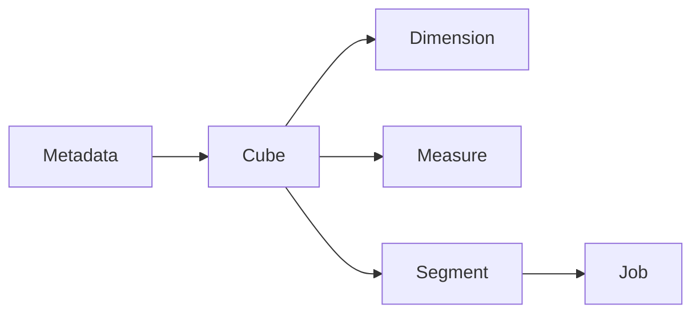

# Kylin原理与代码实例讲解

## 1.背景介绍

Apache Kylin是一款开源的分析型大数据处理引擎,专门为大规模数据分析而设计。它能够对海量多源数据进行高效的预计算,为分析型业务查询提供亚秒级的查询响应。Kylin广泛应用于需要快速分析响应的大数据场景,如商业智能分析、用户行为分析、风险管理等领域。

Kylin的核心思想是基于数据立方体(Cube)的预计算模型。通过对原始数据进行多维度的预先聚合和编码,将计算结果物化并缓存起来,从而加速后续的查询过程。这种预计算技术能够显著降低查询延迟,满足大数据分析的实时性需求。

## 2.核心概念与联系

Kylin的核心概念主要包括:

1. **Cube(数据立方体)**: 代表对原始数据的多维度抽象和聚合视图。Cube由多个Dimension(维度)和Measure(度量)组成。
2. **Dimension(维度)**: 描述数据的分析角度,如时间、地理位置、产品等。
3. **Measure(度量)**: 描述数据的度量指标,如销售额、利润等。
4. **Segment(数据段)**: 对应Cube的一个物化视图,包含该Cube在某个时间段内的数据快照。
5. **Job(作业)**: 执行构建Cube、刷新Segment等操作的任务单元。
6. **Metadata(元数据)**: 描述数据模型、Cube、Dimension等定义信息。

这些概念之间的关系如下:



## 3.核心算法原理具体操作步骤

Kylin的核心算法包括以下几个步骤:

### 3.1 Cube定义

首先需要根据业务需求定义Cube的模型,包括维度、度量、分区等。这个过程通过Kylin的Web UI或者REST API完成。

### 3.2 Cube构建

对于新创建的Cube,Kylin会触发一个全量构建Job,对源数据进行全量扫描、聚合和编码,生成Cube的初始Segment。构建过程包括以下阶段:

1. **Sampling(采样)**: 从源数据中抽取一部分数据,用于估算数据分布和选择合适的编码策略。
2. **SegmentPartition(分区)**: 根据配置的分区策略,将数据划分为多个分区。
3. **SegmentAggregation(聚合)**: 针对每个分区,执行多维聚合计算,生成聚合数据。
4. **SegmentMaterialization(物化)**: 对聚合数据进行编码和持久化,生成Segment文件。

### 3.3 Cube刷新

为了保持Cube与源数据的一致性,Kylin会定期执行增量刷新Job,更新Cube的Segment。刷新过程包括:

1. **SegmentCubingByLayer(分层Cubing)**: 根据数据的更新情况,确定需要重新计算的层次和分区。
2. **SegmentMerge(合并)**: 将新旧Segment合并,形成最新的数据视图。

### 3.4 查询处理

当查询请求到达时,Kylin会根据查询条件定位到相关的Cube和Segment,并通过以下步骤获取结果:

1. **QueryPlan(查询计划)**: 分析查询,生成查询计划树。
2. **QueryCoordination(查询协调)**: 根据查询计划,从多个Segment中获取相关的数据块。
3. **QueryExecution(查询执行)**: 对获取的数据块进行过滤、聚合等操作,最终返回查询结果。

## 4.数学模型和公式详细讲解举例说明

在Kylin的预计算过程中,涉及到一些重要的数学模型和公式,包括:

### 4.1 数据编码

Kylin采用高效的编码策略,将原始数据转换为紧凑的二进制格式,以减小存储空间和提高查询性能。常用的编码算法包括:

1. **Dictionary Encoding(字典编码)**: 将高重复率的维度值映射为整数ID,降低存储开销。编码公式为:

$$
ID = dict.get(value)
$$

其中,`dict`是维度值到ID的映射字典。

2. **Delta Encoding(增量编码)**: 针对有序数据,存储相邻值之间的差值,减小数值范围。编码公式为:

$$
encoded = value - prev\_value
$$

3. **Bitshuffling(位重排)**: 将多个整数值交织存储在一个64位的数据块中,提高内存利用率。

### 4.2 数据聚合

Kylin采用基于Cube的多维数据模型,通过预先聚合降低查询时的计算开销。常用的聚合算法包括:

1. **Group By**: 按照维度组合对度量值进行聚合,生成细粒度的聚合数据。

$$
agg\_value = \sum_{i \in group} measure\_i
$$

2. **Cube**: 对所有维度组合进行聚合,生成全维度的聚合数据。

$$
agg\_value = \sum_{i=1}^{n} \sum_{j=1}^{m} measure\_{ij}
$$

其中,`n`是维度组合数,`m`是该组合下的原始记录数。

3. **Rollup**: 对维度的子集进行聚合,生成部分维度的聚合数据。

$$
agg\_value = \sum_{i \in subset} \sum_{j=1}^{m} measure\_{ij}
$$

### 4.3 查询优化

Kylin在查询处理过程中,采用了多种优化策略,包括:

1. **Cube匹配**: 根据查询条件,选择最优的Cube和Segment作为查询源。
2. **层次裁剪**: 根据查询的聚合粒度,只从相应层次的Segment中获取数据。
3. **分区修剪**: 根据查询条件,过滤掉不相关的数据分区。
4. **投影列裁剪**: 只读取查询所需的列,减少IO开销。

## 5.项目实践:代码实例和详细解释说明

接下来,我们通过一个实际项目案例,演示Kylin的使用流程和代码实现。

假设我们需要构建一个销售数据分析Cube,包括以下维度和度量:

- 维度:
  - 时间(年、季度、月)
  - 产品(类别、名称)
  - 地理位置(国家、省份、城市)
- 度量:
  - 销售额
  - 销售数量
  - 利润

### 5.1 定义Cube元数据

首先,我们需要在Kylin中定义Cube的元数据模型,包括维度、度量、数据源等。可以通过Web UI或者REST API完成。下面是一个示例元数据定义:

```json
{
  "name": "sales_cube",
  "model_name": "sales_model",
  "dimensions": [
    {
      "name": "time",
      "table": "fact_sale",
      "columns": ["year", "quarter", "month"]
    },
    {
      "name": "product",
      "table": "dim_product",
      "columns": ["category", "name"]
    },
    {
      "name": "location",
      "table": "dim_location",
      "columns": ["country", "state", "city"]
    }
  ],
  "measures": [
    {
      "name": "sales_amount",
      "function": "SUM",
      "source": "fact_sale.amount"
    },
    {
      "name": "sales_qty",
      "function": "SUM",
      "source": "fact_sale.qty"
    },
    {
      "name": "profit",
      "function": "SUM",
      "source": "fact_sale.profit"
    }
  ],
  "data_source": {
    "type": "hive",
    "database": "sales_db"
  }
}
```

### 5.2 构建Cube

定义好元数据后,我们可以触发Cube的全量构建任务。以下是一个基于Kylin Java Client的示例代码:

```java
KylinClient client = KylinClientFactory.getKylinClient();

// 创建Cube
CubeDesc cubeDesc = client.createCube("sales_cube");

// 触发全量构建Job
JobInstance job = client.rebuildCube(cubeDesc);

// 等待Job完成
while (!job.getStatus().isComplete()) {
    Thread.sleep(5000);
}

if (job.getStatus().isSuccessful()) {
    System.out.println("Cube构建成功!");
} else {
    System.out.println("Cube构建失败: " + job.getStatus().getErrorMessage());
}
```

### 5.3 查询Cube

构建完成后,我们就可以通过SQL或者REST API查询Cube中的数据。下面是一个SQL查询示例:

```sql
SELECT
    year, quarter, product.category,
    SUM(sales_amount) AS total_sales,
    SUM(profit) AS total_profit
FROM sales_cube
WHERE location.country = 'USA'
GROUP BY year, quarter, product.category;
```

对应的Java代码如下:

```java
KylinClient client = KylinClientFactory.getKylinClient();

SQLResponse response = client.query("sales_cube", queryString);

for (RowBasedResultIterator rows = response.iterator(); rows.hasNext(); ) {
    List<String> row = rows.next();
    System.out.println(row);
}
```

### 5.4 增量刷新

如果源数据发生变化,我们需要执行增量刷新,以保持Cube的一致性。以下是一个增量刷新的示例代码:

```java
KylinClient client = KylinClientFactory.getKylinClient();

// 获取Cube实例
CubeInstance cube = client.getCubeInstance("sales_cube");

// 触发增量刷新Job
JobInstance job = client.refreshCube(cube);

// 等待Job完成
while (!job.getStatus().isComplete()) {
    Thread.sleep(5000);
}

if (job.getStatus().isSuccessful()) {
    System.out.println("Cube刷新成功!");
} else {
    System.out.println("Cube刷新失败: " + job.getStatus().getErrorMessage());
}
```

## 6.实际应用场景

Kylin广泛应用于需要快速分析响应的大数据场景,包括但不限于:

1. **商业智能(BI)**: 提供实时的数据分析和可视化,支持企业决策。
2. **用户行为分析**: 分析用户访问、浏览、购买等行为数据,优化产品和营销策略。
3. **风险管理**: 实时监控金融交易、网络安全等风险数据,及时发现异常情况。
4. **运维监控**: 分析系统日志、指标数据,监控系统健康状况和性能表现。
5. **物联网(IoT)**: 分析传感器数据,优化设备运行和资源调度。

## 7.工具和资源推荐

如果你想进一步学习和使用Kylin,以下是一些有用的工具和资源:

1. **Apache Kylin官网**: https://kylin.apache.org/
2. **Kylin文档**: https://kylin.apache.org/docs/
3. **Kylin源码**: https://github.com/apache/kylin
4. **Kylin社区**: https://kylin.apache.org/community/
5. **Kylin入门教程**: https://kylin.apache.org/docs/tutorial/
6. **Kylin性能调优指南**: https://kylin.apache.org/docs/howto/howto_optimize/

## 8.总结:未来发展趋势与挑战

作为一款优秀的大数据分析引擎,Kylin在未来仍将面临一些发展趋势和挑战:

1. **云原生支持**: 适配云计算环境,提供更好的弹性伸缩和资源利用。
2. **实时分析**: 支持对流式数据的实时分析,满足更高的时效性需求。
3. **AI/ML集成**: 集成机器学习算法,提供更智能的数据分析和预测能力。
4. **多数据源支持**: 支持更多种类的数据源,如NoSQL、对象存储等。
5. **性能优化**: 持续优化计算性能和资源利用效率,支持更大规模的数据处理。
6. **易用性提升**: 简化部署、配置和使用流程,降低使用门槛。

## 9.附录:常见问题与解答

最后,我们列出一些Kylin使用过程中的常见问题和解答:

1. **Q: Kylin与传统的OLAP系统有何区别?**
   A: Kylin专门面向大数据场景设计,能够处理更大规模的数据集,并提供更高的查询性能。同时,Kylin基于开源技术栈,具有更好的灵活性和扩展性。

2. **Q: Kylin是否支持实时数据分析?**
   A: 目前Kylin主要面向离线数据分析,对实时数据的支持还在持续改进中。您可以结合其他实时计算引擎(如Spark Streaming)来实现实时分析需求。