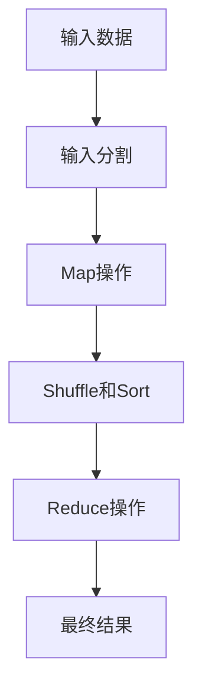

# MapReduce原理与代码实例讲解

## 1.背景介绍

在大数据时代，数据量的爆炸式增长对数据处理技术提出了巨大的挑战。传统的单机数据处理方式已经无法满足需求，分布式计算成为解决这一问题的关键技术。MapReduce作为一种经典的分布式计算框架，由Google在2004年提出，旨在简化大规模数据处理的编程模型。MapReduce通过将复杂的计算任务分解为简单的Map和Reduce操作，使得程序员可以轻松地编写并行计算程序，从而高效地处理海量数据。

## 2.核心概念与联系

### 2.1 Map操作

Map操作是MapReduce的第一步，它将输入数据分割成若干个小块，并对每个小块进行处理。具体来说，Map操作会将输入的键值对（key-value pair）映射为一组中间键值对。Map函数的输出通常会被分区，以便后续的Reduce操作可以并行处理。

### 2.2 Reduce操作

Reduce操作是MapReduce的第二步，它接收来自Map操作的中间键值对，并对具有相同键的值进行合并或汇总。Reduce函数的输出是最终的结果。通过将中间结果进行归并，Reduce操作能够有效地减少数据量，并生成最终的输出。

### 2.3 Shuffle和Sort

在Map和Reduce之间，MapReduce框架会自动执行Shuffle和Sort操作。Shuffle操作将中间结果按照键进行分组，并将相同键的值发送到同一个Reduce任务。Sort操作则对中间结果进行排序，以确保Reduce任务能够按顺序处理数据。

### 2.4 MapReduce的工作流程

MapReduce的工作流程可以概括为以下几个步骤：

1. **输入分割**：将输入数据分割成若干个小块。
2. **Map操作**：对每个小块执行Map函数，生成中间键值对。
3. **Shuffle和Sort**：对中间键值对进行分组和排序。
4. **Reduce操作**：对分组后的中间键值对执行Reduce函数，生成最终结果。

以下是MapReduce工作流程的Mermaid流程图：



## 3.核心算法原理具体操作步骤

### 3.1 输入分割

输入分割是MapReduce的第一步，它将输入数据分割成若干个小块（通常称为splits）。每个小块会被分配给一个Map任务进行处理。输入分割的目的是为了实现数据的并行处理，提高计算效率。

### 3.2 Map操作

Map操作是MapReduce的核心步骤之一。Map函数会对每个输入小块进行处理，并生成一组中间键值对。Map函数的定义如下：

```python
def map(key, value):
    # 处理输入数据，生成中间键值对
    intermediate_key_value_pairs = []
    # 具体的处理逻辑
    return intermediate_key_value_pairs
```

### 3.3 Shuffle和Sort

Shuffle和Sort操作是MapReduce框架自动执行的步骤。Shuffle操作会将中间键值对按照键进行分组，并将相同键的值发送到同一个Reduce任务。Sort操作则对中间键值对进行排序，以确保Reduce任务能够按顺序处理数据。

### 3.4 Reduce操作

Reduce操作是MapReduce的最后一步。Reduce函数会对分组后的中间键值对进行处理，并生成最终结果。Reduce函数的定义如下：

```python
def reduce(key, values):
    # 处理中间键值对，生成最终结果
    final_result = []
    # 具体的处理逻辑
    return final_result
```

## 4.数学模型和公式详细讲解举例说明

### 4.1 数学模型

MapReduce的数学模型可以用以下公式表示：

$$
\text{Map}: (k1, v1) \rightarrow [(k2, v2)]
$$

$$
\text{Reduce}: (k2, [v2]) \rightarrow [(k3, v3)]
$$

其中，$(k1, v1)$ 是输入的键值对，$(k2, v2)$ 是Map操作生成的中间键值对，$(k3, v3)$ 是Reduce操作生成的最终结果。

### 4.2 举例说明

假设我们有一个文本文件，内容如下：

```
hello world
hello mapreduce
```

我们的目标是统计每个单词的出现次数。我们可以定义如下的Map和Reduce函数：

```python
def map(key, value):
    words = value.split()
    intermediate_key_value_pairs = [(word, 1) for word in words]
    return intermediate_key_value_pairs

def reduce(key, values):
    word_count = sum(values)
    return [(key, word_count)]
```

Map操作会将输入文本分割成单词，并生成中间键值对：

```
("hello", 1), ("world", 1), ("hello", 1), ("mapreduce", 1)
```

Shuffle和Sort操作会将相同键的值分组：

```
("hello", [1, 1]), ("world", [1]), ("mapreduce", [1])
```

Reduce操作会对分组后的中间键值对进行汇总，生成最终结果：

```
("hello", 2), ("world", 1), ("mapreduce", 1)
```

## 5.项目实践：代码实例和详细解释说明

### 5.1 环境准备

在进行MapReduce项目实践之前，我们需要准备好开发环境。我们可以使用Hadoop作为MapReduce的实现框架。以下是Hadoop的安装步骤：

1. 下载Hadoop安装包：
   ```
   wget https://downloads.apache.org/hadoop/common/hadoop-3.3.1/hadoop-3.3.1.tar.gz
   ```

2. 解压安装包：
   ```
   tar -xzvf hadoop-3.3.1.tar.gz
   ```

3. 配置环境变量：
   ```
   export HADOOP_HOME=/path/to/hadoop-3.3.1
   export PATH=$PATH:$HADOOP_HOME/bin
   ```

### 5.2 代码实例

以下是一个简单的MapReduce代码实例，用于统计文本文件中每个单词的出现次数：

```python
from mrjob.job import MRJob

class WordCount(MRJob):

    def mapper(self, _, line):
        words = line.split()
        for word in words:
            yield (word, 1)

    def reducer(self, word, counts):
        yield (word, sum(counts))

if __name__ == '__main__':
    WordCount.run()
```

### 5.3 详细解释说明

#### 5.3.1 Mapper函数

Mapper函数会对输入的每一行文本进行处理，将其分割成单词，并生成中间键值对。具体实现如下：

```python
def mapper(self, _, line):
    words = line.split()
    for word in words:
        yield (word, 1)
```

#### 5.3.2 Reducer函数

Reducer函数会对具有相同键的中间键值对进行汇总，生成最终结果。具体实现如下：

```python
def reducer(self, word, counts):
    yield (word, sum(counts))
```

#### 5.3.3 运行代码

我们可以使用以下命令运行MapReduce程序：

```
python wordcount.py input.txt
```

其中，`input.txt` 是输入的文本文件。

## 6.实际应用场景

MapReduce作为一种通用的分布式计算框架，广泛应用于各种大数据处理场景。以下是一些典型的应用场景：

### 6.1 日志分析

在大规模的互联网应用中，日志数据量非常庞大。MapReduce可以用于对日志数据进行分析，例如统计访问量、分析用户行为等。

### 6.2 数据挖掘

MapReduce可以用于大规模数据挖掘任务，例如关联规则挖掘、聚类分析等。通过将数据分割成小块并行处理，MapReduce能够高效地完成复杂的数据挖掘任务。

### 6.3 搜索引擎

搜索引擎需要对海量的网页数据进行索引和排序。MapReduce可以用于构建倒排索引、计算PageRank等任务，从而提高搜索引擎的性能和准确性。

### 6.4 机器学习

MapReduce可以用于大规模机器学习任务，例如训练模型、特征提取等。通过将数据分割成小块并行处理，MapReduce能够加速机器学习算法的训练过程。

## 7.工具和资源推荐

### 7.1 Hadoop

Hadoop是最常用的MapReduce实现框架，提供了分布式存储和计算的基础设施。Hadoop的核心组件包括HDFS（Hadoop Distributed File System）和MapReduce。

### 7.2 Apache Spark

Apache Spark是一个基于内存的分布式计算框架，支持MapReduce编程模型。相比于Hadoop，Spark具有更高的计算效率和更丰富的功能。

### 7.3 MRJob

MRJob是一个Python库，用于简化MapReduce程序的编写和运行。MRJob支持在本地和Hadoop集群上运行MapReduce程序，提供了简洁的API。

### 7.4 数据集

在进行MapReduce项目实践时，我们可以使用一些公开的数据集，例如：

- [Kaggle](https://www.kaggle.com/datasets)
- [UCI Machine Learning Repository](https://archive.ics.uci.edu/ml/index.php)
- [AWS Public Datasets](https://registry.opendata.aws/)

## 8.总结：未来发展趋势与挑战

MapReduce作为一种经典的分布式计算框架，已经在大数据处理领域取得了广泛的应用。然而，随着数据规模的不断增长和计算需求的不断提高，MapReduce也面临着一些挑战和发展趋势。

### 8.1 发展趋势

#### 8.1.1 内存计算

内存计算是MapReduce发展的一个重要趋势。相比于传统的磁盘计算，内存计算具有更高的计算效率和更低的延迟。Apache Spark作为内存计算的代表，已经在大数据处理领域取得了显著的成果。

#### 8.1.2 流式计算

流式计算是MapReduce发展的另一个重要趋势。传统的MapReduce框架主要用于批处理任务，而流式计算则能够处理实时数据流。Apache Flink和Apache Storm是流式计算的代表框架。

### 8.2 挑战

#### 8.2.1 数据倾斜

数据倾斜是MapReduce面临的一个重要挑战。当某些键的值过多时，会导致某些Reduce任务的负载过重，从而影响整体计算效率。解决数据倾斜问题需要对数据进行合理的分区和负载均衡。

#### 8.2.2 容错性

在大规模分布式计算环境中，节点故障是不可避免的。MapReduce需要具备良好的容错性，能够在节点故障时自动重试任务，确保计算的正确性和可靠性。

## 9.附录：常见问题与解答

### 9.1 MapReduce适用于哪些场景？

MapReduce适用于大规模数据处理任务，特别是需要并行处理的数据密集型任务。例如，日志分析、数据挖掘、搜索引擎和机器学习等场景。

### 9.2 如何解决MapReduce中的数据倾斜问题？

解决数据倾斜问题可以通过以下几种方法：

1. **数据预处理**：在Map操作之前对数据进行预处理，减少数据倾斜的可能性。
2. **自定义分区器**：使用自定义分区器对数据进行合理分区，确保每个Reduce任务的负载均衡。
3. **二次排序**：在Shuffle和Sort操作中对数据进行二次排序，减少数据倾斜的影响。

### 9.3 MapReduce与Spark的区别是什么？

MapReduce和Spark都是分布式计算框架，但它们在设计理念和实现方式上有所不同。MapReduce主要用于批处理任务，采用磁盘计算的方式；而Spark则支持批处理和流式计算，采用内存计算的方式，具有更高的计算效率和更丰富的功能。

### 9.4 如何提高MapReduce的计算效率？

提高MapReduce计算效率可以通过以下几种方法：

1. **合理分区**：对数据进行合理分区，确保每个Map和Reduce任务的负载均衡。
2. **内存优化**：增加内存使用，减少磁盘I/O操作，提高计算效率。
3. **并行度优化**：增加Map和Reduce任务的并行度，充分利用集群资源。

### 9.5 MapReduce的容错机制是怎样的？

MapReduce具有良好的容错机制。当某个节点发生故障时，MapReduce框架会自动重试失败的任务，并在其他节点上重新执行。通过这种方式，MapReduce能够确保计算的正确性和可靠性。

---

作者：禅与计算机程序设计艺术 / Zen and the Art of Computer Programming