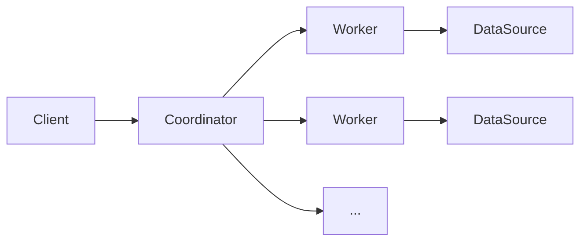

# Presto UDF原理与代码实例讲解

## 1. 背景介绍

### 1.1 Presto简介
Presto是由Facebook开源的一个分布式SQL查询引擎,用于交互式查询海量数据。它支持标准的ANSI SQL,可以集成Hive、Cassandra、关系型数据库以及专有数据存储等多种数据源,并能够进行高效的内存级计算。

### 1.2 UDF概念
UDF全称为User Defined Function,即用户自定义函数。在SQL引擎中,除了内置函数以外,UDF允许用户根据自己的需求来自定义函数,以拓展SQL的功能,提高灵活性。

### 1.3 Presto UDF应用场景
在实际应用中,我们经常会遇到一些内置函数无法满足需求的场景,比如:
- 复杂的数据清洗、转换
- 特定领域的计算逻辑
- 机器学习模型的预测
- 第三方API的调用

这时候就需要使用UDF来实现自定义逻辑。Presto作为一个灵活的分布式SQL引擎,同样支持UDF功能。

## 2. 核心概念与联系

### 2.1 Presto架构概览
为了更好地理解UDF在Presto中的工作原理,我们先来回顾一下Presto的整体架构:



Presto采用了典型的Master-Slave架构:
- Coordinator: 负责接收客户端请求,解析SQL,生成执行计划,协调Worker执行
- Worker: 负责实际执行查询任务,从数据源获取数据,执行计算

### 2.2 UDF在Presto中的定位
UDF作为一种自定义函数,本质上是对SQL语义的扩展。在Presto中,UDF与内置函数地位相同,可以在SQL中灵活使用。

当Coordinator解析到SQL中的UDF调用时,会加载对应的UDF类,并将其序列化后分发给Worker节点。在Worker执行计算任务时,就可以反序列化UDF对象,调用其定义的逻辑,完成自定义的计算过程。

## 3. 核心算法原理具体操作步骤

### 3.1 创建Maven项目
首先我们需要创建一个Maven项目,添加必要的Presto依赖:

```xml
<dependencies>
    <dependency>
        <groupId>com.facebook.presto</groupId>
        <artifactId>presto-main</artifactId>
        <version>0.271</version>
        <scope>provided</scope>
    </dependency>
</dependencies>
```

### 3.2 定义UDF函数
接下来我们来定义一个简单的UDF函数。在Presto中,UDF需要实现`ScalarFunction`接口:

```java
import com.facebook.presto.spi.function.Description;
import com.facebook.presto.spi.function.ScalarFunction;
import com.facebook.presto.spi.function.SqlType;
import io.airlift.slice.Slice;
import io.airlift.slice.Slices;

public class ReverseFunction {
    @ScalarFunction("reverse")
    @Description("反转字符串")
    @SqlType(StandardTypes.VARCHAR)
    public static Slice reverse(@SqlType(StandardTypes.VARCHAR) Slice slice) {
        return Slices.utf8Slice(new StringBuilder(slice.toStringUtf8()).reverse());
    }
}
```

这里我们定义了一个`reverse`函数,用于字符串反转。可以看到,使用`@ScalarFunction`注解来声明函数名称,`@Description`注解来添加描述,`@SqlType`注解来声明参数和返回值类型。

### 3.3 打包部署UDF
定义好UDF后,我们需要将其打包并部署到Presto集群中。

首先执行Maven打包命令:
```bash
mvn clean package
```

然后将打包好的jar文件上传到Presto的`plugin`目录下:
```bash
cp target/presto-udf-1.0.jar $PRESTO_HOME/plugin/udf/
```

重启Presto集群即可使UDF生效。

### 3.4 在SQL中使用UDF
部署完成后,就可以在SQL中使用我们自定义的`reverse`函数了:

```sql
presto> SELECT reverse('Hello, Presto UDF!');
     _col0
-----------------
 !FDU otsreP ,olleH
(1 row)
```

可以看到,字符串被成功反转了,说明UDF已经生效。

## 4. 数学模型和公式详细讲解举例说明
这里我们举一个更加复杂一点的例子,来演示如何在UDF中应用数学模型和公式。

假设我们要实现一个`normalize`函数,对数据进行min-max归一化处理:

$$
x' = \frac{x - min(x)}{max(x) - min(x)}
$$

其中$x$为原始数据,$x'$为归一化后的数据。

我们可以这样来实现:

```java
import com.facebook.presto.spi.function.Description;
import com.facebook.presto.spi.function.ScalarFunction;
import com.facebook.presto.spi.function.SqlType;
import com.facebook.presto.common.type.StandardTypes;

public class NormalizeFunction {
    @ScalarFunction("normalize")
    @Description("对数据进行min-max归一化")
    @SqlType(StandardTypes.DOUBLE)
    public static double normalize(@SqlType(StandardTypes.DOUBLE) double x, 
                                   @SqlType(StandardTypes.DOUBLE) double min,
                                   @SqlType(StandardTypes.DOUBLE) double max) {
        return (x - min) / (max - min);
    }
}
```

部署后,就可以在SQL中使用`normalize`函数了:

```sql
presto> SELECT normalize(x, min(x) OVER (), max(x) OVER ()) FROM (VALUES 1, 2, 3, 4, 5) t(x);
 _col0
-------
   0.0
  0.25
  0.5 
  0.75
   1.0
(5 rows)
```

可以看到,原始数据被归一化到了[0, 1]区间内。我们在UDF中应用了min-max归一化的数学公式,并利用Presto的窗口函数来计算min和max值。

## 5. 项目实践：代码实例和详细解释说明
下面我们再举一个实际项目中的例子。假设我们要实现一个IP地址转整数的UDF函数,可以这样来写:

```java
import com.facebook.presto.spi.function.Description;
import com.facebook.presto.spi.function.ScalarFunction;
import com.facebook.presto.spi.function.SqlType;
import io.airlift.slice.Slice;
import io.airlift.slice.Slices;
import com.facebook.presto.common.type.StandardTypes;

public class IPAddressToIntFunction {
    @Description("将IPv4地址转为整数")
    @ScalarFunction("ip_to_int")
    @SqlType(StandardTypes.BIGINT)
    public static long ipToInt(@SqlType(StandardTypes.VARCHAR) Slice slice) {
        String[] octets = slice.toStringUtf8().split("\\.");
        long result = 0;
        for (String octet : octets) {
            result = result * 256 + Integer.parseInt(octet);
        }
        return result;
    }
}
```

这里我们将IP地址按`.`分割成4个整数,然后将其组合成一个int64。可以这样使用:

```sql
presto> SELECT ip_to_int('192.168.1.100');
    _col0
-------------
 3232235876
(1 row)
```

转换后的整数可以方便地进行比较、排序等操作,在IP相关的应用场景中非常有用。

## 6. 实际应用场景
Presto UDF在实际的数据分析场景中有非常广泛的应用,比如:

### 6.1 数据清洗
对于一些格式不规范的数据,我们可以通过UDF进行转换和清洗,例如:
- 日期时间格式化
- 字符串截取、替换
- 脱敏处理

### 6.2 复杂计算
一些复杂的计算逻辑,可以封装在UDF中复用,例如:
- 金融领域的利率计算
- 地理信息的距离计算
- 复杂的数学模型

### 6.3 机器学习
对于一些预先训练好的机器学习模型,可以封装为UDF进行预测,例如:
- 用户画像标签预测
- 反欺诈风险预测
- 商品推荐

UDF让我们可以在SQL中灵活地应用各种计算逻辑,大大提高了分析效率。

## 7. 工具和资源推荐
如果你对Presto UDF的开发感兴趣,这里推荐一些有用的工具和资源:

- Presto官方文档: https://prestodb.io/docs/current/ 
- Presto Github: https://github.com/prestodb/presto
- Presto函数和运算符列表: https://prestodb.io/docs/current/functions.html
- Presto UDF示例: https://github.com/prestodb/presto/tree/master/presto-example-udf

多阅读Presto的源码和官方示例,可以帮助我们更好地掌握UDF的开发技巧。

## 8. 总结：未来发展趋势与挑战

### 8.1 UDF的发展趋势
随着大数据分析场景的不断丰富,UDF必将扮演越来越重要的角色。未来UDF的发展趋势可能包括:
- 更加复杂的算法和模型的支持
- 更多外部数据源和服务的集成
- 更加灵活和动态的UDF管理机制

### 8.2 UDF面临的挑战
UDF给SQL带来了无限的扩展可能,但同时也面临一些挑战:
- 性能问题:UDF会带来额外的序列化开销,因此对性能有一定影响
- 安全问题:UDF可能会引入恶意代码,因此需要做好安全防范
- 维护问题:大量的UDF会给系统维护带来难度

因此在实践中,我们需要权衡UDF的收益和成本,合理使用UDF,将其与SQL形成互补,发挥各自的优势。

## 9. 附录：常见问题与解答

### Q: Presto UDF支持哪些语言?
A: 目前Presto UDF只支持Java语言。但是你可以通过Java调用其他语言编写的程序,或者通过外部服务来支持多语言UDF。

### Q: Presto UDF的性能如何?
A: 由于UDF在每个Worker节点上都需要加载和初始化,因此会带来一定的性能开销。对于复杂的UDF,建议先在Java代码中进行充分的测试和优化,必要时可以考虑用C++等语言重写性能关键的部分。

### Q: 如何管理Presto UDF?
A: Presto支持动态添加和删除UDF,我们可以将UDF打包成一个插件,然后通过Presto的`system.add_plugin()`和`system.remove_plugin()`函数来管理。

### Q: Presto UDF是否支持窗口函数?
A: 目前Presto UDF还不支持自定义窗口函数,只能在普通的标量函数中使用窗口函数。未来Presto可能会支持自定义窗口函数,让UDF的表现力更上一层楼。

### Q: 如何处理UDF的异常?
A: 在UDF中可以抛出`PrestoException`来表示异常情况,Presto会捕获异常并中断查询。我们需要仔细处理UDF可能出现的各种异常,并给出明确的错误信息,方便定位问题。

Presto UDF为我们打开了一扇通向无限可能的大门,期待你的创意和实践!

作者：禅与计算机程序设计艺术 / Zen and the Art of Computer Programming