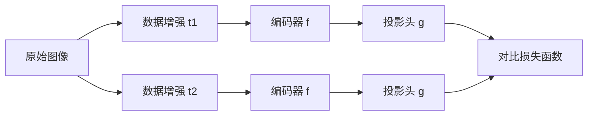

# SimCLR原理与代码实例讲解

## 1. 背景介绍
### 1.1 无监督表示学习的重要性
### 1.2 对比学习的兴起
### 1.3 SimCLR的诞生背景

## 2. 核心概念与联系
### 2.1 对比学习的基本思想
#### 2.1.1 正样本与负样本
#### 2.1.2 对比损失函数
### 2.2 SimCLR的核心创新
#### 2.2.1 数据增强策略
#### 2.2.2 对比预测编码器
#### 2.2.3 非线性投影头

## 3. 核心算法原理具体操作步骤
### 3.1 数据增强
#### 3.1.1 随机裁剪
#### 3.1.2 颜色变换
#### 3.1.3 高斯模糊
### 3.2 对比预测编码器
#### 3.2.1 基础编码器
#### 3.2.2 投影头
### 3.3 对比损失函数计算
#### 3.3.1 正负样本对构建
#### 3.3.2 交叉熵损失计算

## 4. 数学模型和公式详细讲解举例说明 
### 4.1 对比损失函数的数学表达
### 4.2 温度参数对损失函数的影响
### 4.3 梯度计算与参数更新

## 5. 项目实践：代码实例和详细解释说明
### 5.1 数据准备与预处理
### 5.2 SimCLR模型构建
#### 5.2.1 ResNet编码器
#### 5.2.2 MLP投影头
### 5.3 训练流程实现
#### 5.3.1 数据增强应用
#### 5.3.2 对比损失函数计算
#### 5.3.3 优化器设置与参数更新
### 5.4 下游任务微调与评估
#### 5.4.1 线性评估协议
#### 5.4.2 半监督学习场景

## 6. 实际应用场景
### 6.1 图像分类
### 6.2 目标检测
### 6.3 语义分割
### 6.4 医学影像分析

## 7. 工具和资源推荐
### 7.1 PyTorch实现
### 7.2 TensorFlow实现
### 7.3 预训练模型库
### 7.4 相关论文与教程

## 8. 总结：未来发展趋势与挑战
### 8.1 SimCLR的局限性
### 8.2 更大规模数据与模型的需求
### 8.3 多模态对比学习的探索
### 8.4 更高效的训练方法

## 9. 附录：常见问题与解答
### 9.1 如何选择合适的数据增强方法？
### 9.2 投影头的作用是什么？
### 9.3 如何平衡正负样本对的数量？
### 9.4 对比学习与传统监督学习的区别？



无监督表示学习旨在从大规模无标签数据中学习到有效的特征表示，对于降低深度学习的标注成本、提高模型泛化能力具有重要意义。近年来，对比学习作为一种新兴的无监督学习范式受到了广泛关注。SimCLR（A Simple Framework for Contrastive Learning of Visual Representations）是由谷歌研究团队提出的一种简单而有效的对比学习算法，在图像分类、目标检测等任务上取得了令人瞩目的成果。

SimCLR的核心思想是通过最大化同一图像经过不同数据增强后的特征表示之间的一致性，来学习到一个鲁棒的视觉特征提取器。具体而言，SimCLR从每张原始图像出发，通过随机裁剪、颜色变换、高斯模糊等数据增强方法生成两个不同的视图，将它们定义为正样本对；同时将其他图像的增强视图作为负样本。SimCLR的目标是让正样本对的特征表示尽可能相似，而与负样本的特征表示尽可能不同。通过这种方式，SimCLR可以学习到对图像内容敏感、对数据增强鲁棒的特征表示。

SimCLR采用了一个由基础编码器和投影头组成的对比预测编码器结构。基础编码器通常选择ResNet等主干网络，用于提取图像的高维特征；投影头则由一系列全连接层组成，将高维特征映射到一个低维的对比学习空间，增强特征的可分性。在训练过程中，SimCLR首先对原始图像应用随机数据增强，生成一对正样本，然后将它们分别输入编码器和投影头，得到它们的特征表示。接下来，SimCLR计算正样本对与其他负样本之间的对比损失，通常采用交叉熵损失函数。通过最小化对比损失，SimCLR可以使正样本对的特征表示趋于一致，而与负样本的特征表示趋于不同。

在数学建模方面，SimCLR的对比损失函数可以表示为：

$$
\mathcal{L}_{i, j}=-\log \frac{\exp \left(\operatorname{sim}\left(\boldsymbol{z}_{i}, \boldsymbol{z}_{j}\right) / \tau\right)}{\sum_{k=1}^{2 N} \mathbb{1}_{[k \neq i]} \exp \left(\operatorname{sim}\left(\boldsymbol{z}_{i}, \boldsymbol{z}_{k}\right) / \tau\right)}
$$

其中，$\boldsymbol{z}_i$和$\boldsymbol{z}_j$分别表示正样本对的特征表示，$\boldsymbol{z}_k$表示负样本的特征表示，$\operatorname{sim}(\cdot,\cdot)$表示余弦相似度，$\tau$是一个温度参数，用于控制softmax分布的平滑程度。直观地理解，对比损失函数鼓励正样本对的特征表示相似度尽可能大，而与负样本的相似度尽可能小。

下面给出SimCLR的PyTorch代码实现示例：

```python
import torch
import torch.nn as nn
import torchvision.transforms as transforms

# 数据增强
transform = transforms.Compose([
    transforms.RandomResizedCrop(224),
    transforms.RandomHorizontalFlip(),
    transforms.ColorJitter(0.8, 0.8, 0.8, 0.2),
    transforms.GaussianBlur(kernel_size=23, sigma=(0.1, 2.0)),
    transforms.ToTensor(),
    transforms.Normalize(mean=[0.485, 0.456, 0.406], std=[0.229, 0.224, 0.225])
])

# 基础编码器
class Encoder(nn.Module):
    def __init__(self, base_model):
        super().__init__()
        self.base_model = base_model
        
    def forward(self, x):
        return self.base_model(x)

# 投影头
class ProjectionHead(nn.Module):
    def __init__(self, input_dim, hidden_dim, output_dim):
        super().__init__()
        self.projection = nn.Sequential(
            nn.Linear(input_dim, hidden_dim),
            nn.ReLU(),
            nn.Linear(hidden_dim, output_dim)
        )
        
    def forward(self, x):
        return self.projection(x)

# 对比损失函数
def contrastive_loss(features, temperature=0.5):
    batch_size = features.shape[0]
    labels = torch.cat([torch.arange(batch_size) for i in range(2)], dim=0)
    labels = (labels.unsqueeze(0) == labels.unsqueeze(1)).float()
    
    features = nn.functional.normalize(features, dim=1)
    similarity_matrix = torch.matmul(features, features.T)
    
    mask = torch.eye(labels.shape[0], dtype=torch.bool)
    labels = labels[~mask].view(labels.shape[0], -1)
    similarity_matrix = similarity_matrix[~mask].view(similarity_matrix.shape[0], -1)
    
    positives = similarity_matrix[labels.bool()].view(labels.shape[0], -1)
    negatives = similarity_matrix[~labels.bool()].view(similarity_matrix.shape[0], -1)
    
    logits = torch.cat([positives, negatives], dim=1)
    labels = torch.zeros(logits.shape[0], dtype=torch.long)
    
    logits = logits / temperature
    return nn.CrossEntropyLoss()(logits, labels)

# SimCLR模型
class SimCLR(nn.Module):
    def __init__(self, base_model, projection_dim=128):
        super().__init__()
        self.encoder = Encoder(base_model)
        self.projection = ProjectionHead(base_model.fc.in_features, 2048, projection_dim)
        
    def forward(self, x1, x2):
        h1 = self.encoder(x1)
        h2 = self.encoder(x2)
        
        z1 = self.projection(h1)
        z2 = self.projection(h2)
        
        return z1, z2

# 训练
def train(model, dataloader, optimizer, temperature=0.5):
    model.train()
    total_loss = 0
    
    for images, _ in dataloader:
        images = torch.cat(images, dim=0)
        
        features = model(images)
        loss = contrastive_loss(features, temperature)
        
        optimizer.zero_grad()
        loss.backward()
        optimizer.step()
        
        total_loss += loss.item()
        
    return total_loss / len(dataloader)
```

以上代码展示了SimCLR的核心组件，包括数据增强、基础编码器、投影头和对比损失函数的实现。在训练过程中，我们首先对原始图像应用随机数据增强，生成两个不同的视图，然后将它们输入SimCLR模型，得到它们的特征表示。接下来，我们计算对比损失，并使用优化器更新模型参数。通过多个训练周期的迭代，SimCLR可以学习到一个鲁棒的视觉特征提取器。

SimCLR在图像分类、目标检测、语义分割等任务上展现出了优异的性能。例如，在ImageNet数据集上，SimCLR在线性评估协议下达到了76.5%的Top-1精度，超过了许多监督学习方法。此外，SimCLR学习到的特征表示可以很好地迁移到其他下游任务，在半监督学习场景下也取得了令人印象深刻的结果。

尽管SimCLR取得了巨大成功，但它仍然存在一些局限性。首先，SimCLR需要大规模的无标签数据和较大的模型容量才能发挥最佳性能，这对计算资源提出了较高要求。其次，SimCLR主要关注视觉领域，如何将其拓展到其他模态（如文本、音频）仍有待探索。未来的研究方向可能包括设计更高效的训练方法、探索多模态对比学习等。

总之，SimCLR为无监督表示学习提供了一种简单而有效的解决方案，极大地推动了对比学习的发展。它的成功启发了一系列后续工作，如MoCo、BYOL等，进一步扩展了对比学习的应用范围。相信随着研究的不断深入，对比学习将在更广泛的领域发挥重要作用，为人工智能的发展贡献力量。

作者：禅与计算机程序设计艺术 / Zen and the Art of Computer Programming