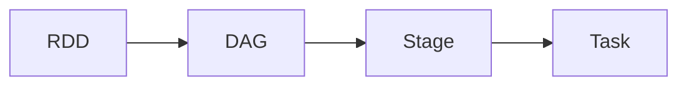
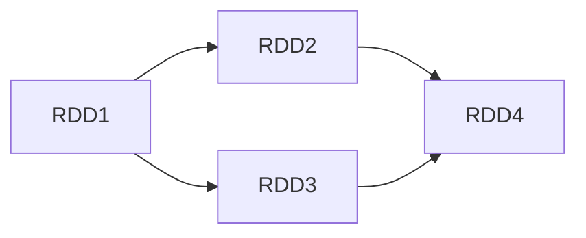
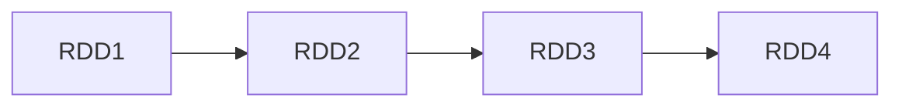

# Spark DAG原理与代码实例讲解

## 1. 背景介绍

### 1.1 大数据处理的挑战
在大数据时代,我们面临着海量数据处理的巨大挑战。传统的数据处理方式已经无法满足实时性、高吞吐量的需求。Spark作为一个快速、通用的大规模数据处理引擎,为大数据处理提供了高效的解决方案。

### 1.2 Spark的优势
Spark凭借其快速、易用、通用等特点,在大数据处理领域备受青睐。Spark提供了高级API,支持多种编程语言,可以轻松地构建大规模数据处理应用。Spark还支持内存计算,比Hadoop MapReduce快100倍。

### 1.3 DAG的重要性
在Spark中,DAG(Directed Acyclic Graph)是一个核心概念。DAG描述了RDD的依赖关系和转换操作,决定了Spark作业的执行方式和效率。理解DAG原理,对于优化Spark作业性能至关重要。

## 2. 核心概念与联系

### 2.1 RDD
RDD(Resilient Distributed Dataset)是Spark的基本计算单元。它是一个分布式的数据集合,可以并行操作。RDD支持两种操作:转换(Transformation)和行动(Action)。RDD还具有惰性求值、数据不可变、容错等特性。

### 2.2 DAG 
DAG是一种有向无环图,用于描述RDD之间的依赖关系。DAG中的每个节点代表一个RDD,边代表RDD之间的转换操作。通过DAG,Spark可以实现延迟计算和管道化,优化作业执行效率。

### 2.3 Stage
Stage是Spark作业执行的基本单位。Spark会根据DAG将作业划分为若干个Stage,每个Stage包含一组可以一起执行的任务。Stage之间存在依赖关系,后一个Stage依赖前一个Stage的输出。

### 2.4 Task
Task是Spark中的最小执行单元,一个Stage包含多个Task。每个Task负责处理RDD的一个分区数据。Task在Executor进程中执行,执行结果由Driver进程收集。

### 2.5 概念关系
下图展示了RDD、DAG、Stage和Task之间的关系:



## 3. 核心算法原理具体操作步骤

### 3.1 DAG构建
1. 应用程序定义RDD及其转换操作
2. Spark根据RDD的转换操作构建DAG
3. DAG采用拓扑排序算法,生成一个有序的RDD序列

### 3.2 DAG划分Stage
1. 从DAG的最后一个RDD开始,反向遍历DAG
2. 遇到宽依赖(Shuffle依赖)就断开,划分出一个Stage
3. 遇到窄依赖就将RDD加入同一个Stage
4. 重复步骤2-3,直到遍历完DAG

### 3.3 生成Task
1. 对于每个Stage,根据RDD的分区数生成Task
2. 每个Task处理RDD的一个分区数据
3. 将Task分发到Executor进程执行

### 3.4 调度执行
1. Driver进程负责调度Task,将Task分发给Executor进程
2. Executor进程执行Task,并将结果返回给Driver进程
3. 所有Task执行完毕,Stage结束
4. 所有Stage完成,作业执行结束

## 4. 数学模型和公式详细讲解举例说明

### 4.1 DAG模型
DAG可以用邻接表或邻接矩阵表示。设DAG有$n$个节点,则邻接矩阵$A$定义为:

$$
A_{ij} = 
\begin{cases}
1, & \text{if RDD}_i\text{依赖RDD}_j \\
0, & \text{otherwise}
\end{cases}
$$

例如,考虑以下DAG:


其邻接矩阵为:

$$
A = 
\begin{bmatrix}
0 & 0 & 0 & 0\\
1 & 0 & 0 & 0\\
1 & 0 & 0 & 0\\
0 & 1 & 1 & 0
\end{bmatrix}
$$

### 4.2 Stage划分模型
设DAG有$n$个RDD,划分为$m$个Stage。定义Stage划分矩阵$S$:

$$
S_{ij} = 
\begin{cases}
1, & \text{if RDD}_i\text{属于Stage}_j \\
0, & \text{otherwise}
\end{cases}
$$

例如,对于上述DAG,划分为2个Stage:
- Stage1: RDD1, RDD2, RDD3
- Stage2: RDD4

则Stage划分矩阵为:

$$
S = 
\begin{bmatrix}
1 & 0\\
1 & 0\\
1 & 0\\
0 & 1
\end{bmatrix}
$$

### 4.3 Task生成模型
设Stage$i$包含$n_i$个RDD,第$j$个RDD有$p_{ij}$个分区,则Stage$i$生成的Task数为:

$$
T_i = \sum_{j=1}^{n_i} p_{ij}
$$

例如,对于Stage1,假设:
- RDD1有2个分区
- RDD2有3个分区
- RDD3有2个分区

则Stage1生成的Task数为:$T_1 = 2 + 3 + 2 = 7$

## 5. 项目实践:代码实例和详细解释说明

下面通过一个简单的Spark作业来演示DAG的构建和执行过程。

### 5.1 示例代码

```scala
val sc = new SparkContext(...)

val rdd1 = sc.textFile("input.txt")
val rdd2 = rdd1.flatMap(_.split(" "))
val rdd3 = rdd2.map((_, 1))
val rdd4 = rdd3.reduceByKey(_ + _)

rdd4.saveAsTextFile("output")
```

### 5.2 代码解释
1. 创建SparkContext对象sc
2. 从文件"input.txt"创建RDD1
3. 对RDD1执行flatMap操作,将每行文本按空格分割,生成RDD2
4. 对RDD2执行map操作,将每个单词映射为(word, 1)形式的键值对,生成RDD3
5. 对RDD3执行reduceByKey操作,按单词聚合并求和,生成RDD4
6. 将RDD4保存到文件"output"

### 5.3 DAG构建过程
根据示例代码,Spark构建出如下DAG:



### 5.4 Stage划分过程
根据DAG,Spark将作业划分为2个Stage:
- Stage1: RDD1, RDD2, RDD3
- Stage2: RDD4

其中,RDD3到RDD4的reduceByKey操作引入了Shuffle依赖,因此将DAG划分为两个Stage。

### 5.5 Task生成和执行过程
对于Stage1,假设RDD1有2个分区,则Stage1生成2个Task。每个Task读取一个分区数据,执行flatMap和map操作,并将结果写入Shuffle文件。

对于Stage2,假设RDD4有3个分区,则Stage2生成3个Task。每个Task读取Shuffle文件中的一个分区数据,执行reduceByKey操作,并将结果写入输出文件。

## 6. 实际应用场景

Spark DAG在许多实际场景中发挥着重要作用,例如:

### 6.1 日志处理
Spark可以用于处理海量日志数据,如Web服务器日志、应用程序日志等。通过DAG,Spark可以高效地执行日志解析、过滤、聚合等操作,生成各种统计报表。

### 6.2 用户行为分析
电商、社交网络等领域需要分析用户行为数据,如点击、浏览、购买等。Spark DAG可以表示复杂的用户行为分析流程,实现用户画像、推荐系统等应用。

### 6.3 机器学习
Spark MLlib提供了多种机器学习算法,如分类、回归、聚类等。机器学习流程通常包括数据预处理、特征工程、模型训练、模型评估等步骤,可以用DAG来描述和优化。

## 7. 工具和资源推荐

### 7.1 Spark官方文档
Spark官方文档提供了详尽的用户指南、API文档、示例程序等,是学习和使用Spark的权威资料。

### 7.2 Spark UI
Spark UI是一个Web界面,用于监控Spark作业的执行情况。通过Spark UI,可以查看作业的DAG、Stage、Task等信息,了解作业的运行进度和性能瓶颈。

### 7.3 Spark源码
阅读Spark源码有助于深入理解Spark的实现原理。Spark源码在GitHub上开源,社区活跃,是学习Spark内部机制的好资源。

## 8. 总结:未来发展趋势与挑战

### 8.1 Spark 3.0的新特性
Spark 3.0引入了许多新特性,如动态分区修剪、自适应查询执行、加速器感知调度等。这些特性进一步优化了Spark的性能和易用性。

### 8.2 Spark与AI的结合
Spark正在与AI技术加速融合,如TensorFlow、PyTorch等。Spark可以作为AI应用的数据处理和特征工程引擎,与AI框架无缝集成。

### 8.3 Spark的挑战
Spark面临的挑战包括:
- 数据安全和隐私保护
- 实时流处理的低延迟需求
- 云环境下的资源管理和成本优化
- 超大规模数据的存储和计算

## 9. 附录:常见问题与解答

### 9.1 什么是宽依赖和窄依赖?
- 窄依赖:每个父RDD的分区最多被一个子RDD的分区使用。
- 宽依赖:多个子RDD的分区会依赖同一个父RDD的分区,会引入Shuffle。

### 9.2 如何优化Spark作业的性能?
- 使用序列化的自定义数据格式,减少数据体积
- 避免不必要的Shuffle操作,尽量使用map-side预聚合
- 调整资源配置,如内存、CPU核数、并行度等
- 开启数据本地性,将计算任务调度到数据所在节点

### 9.3 Spark如何容错?
- Spark RDD具有容错性,可以根据血统关系重新计算丢失的分区数据
- Spark Streaming使用状态检查点和写前日志实现容错
- Spark还支持数据检查点,将RDD持久化到可靠存储

---

作者:禅与计算机程序设计艺术 / Zen and the Art of Computer Programming