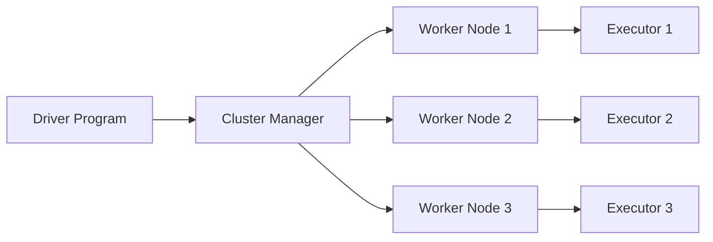
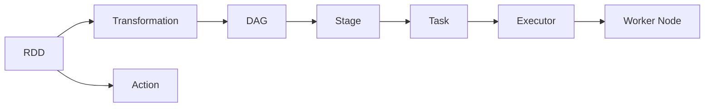

# Spark原理与代码实例讲解

## 1. 背景介绍

### 1.1 大数据处理的挑战
在当今大数据时代,企业面临着海量数据处理的巨大挑战。传统的数据处理方式已经无法满足实时性、高并发等方面的要求。为了应对这一挑战,Apache Spark应运而生。

### 1.2 Spark的诞生
Spark起源于加州大学伯克利分校AMPLab,由当时还是博士生的Matei Zaharia等人于2009年开发。Spark最初是为了解决Hadoop MapReduce的一些局限性,如数据复用、迭代计算等问题。经过多年发展,Spark已成为最活跃的大数据开源项目之一。

### 1.3 Spark生态系统
围绕Spark,形成了一个庞大的生态系统。核心组件包括:
- Spark Core:提供基本功能,如内存计算、存储系统、调度等
- Spark SQL:用于结构化数据处理
- Spark Streaming:流式数据处理
- MLlib:机器学习库
- GraphX:图计算引擎

此外还有众多第三方工具,如Zeppelin、Hue等,极大丰富了Spark生态。

## 2. 核心概念与联系

### 2.1 RDD
RDD(Resilient Distributed Dataset)是Spark的核心抽象,表示一个不可变、可分区、里面的元素可并行计算的集合。RDD具有以下特点:
- 不可变性:RDD中的数据只能读取,不能修改
- 分区性:RDD数据可分布在集群的不同节点上
- 里面的元素可并行计算
- 容错性:可自动从节点失败中恢复

### 2.2 DAG
Spark使用DAG(Directed Acyclic Graph)有向无环图来表示RDD之间的依赖关系。当执行一个Action操作时,Spark根据RDD的血缘关系构建DAG图,再交给DAG Scheduler进行Stage的划分与任务调度。

### 2.3 Spark运行架构
一个Spark应用程序通常由Driver Program和Worker Node两部分组成:



- Driver Program:运行Application的main()函数并创建SparkContext
- Cluster Manager:在集群上获取资源的外部服务,如Yarn、Mesos等
- Worker Node:集群中运行计算任务的节点
- Executor:运行在Worker Node上为某应用启动的一个进程,负责运行Task,并为应用程序存储数据

### 2.4 核心概念关系



由上图可知,RDD是Spark的基本计算单元,RDD之间通过Transformation(转换)衍生出新的RDD,通过Action(行动)触发RDD的计算。Spark根据RDD的依赖关系构建DAG图,再划分Stage,每个Stage包含一系列Task。Task是最小的计算单元,由Executor运行在Worker Node上执行。

## 3. 核心算法原理具体操作步骤

### 3.1 RDD的创建
可以通过以下4种方式创建RDD:
1. 从集合中创建:使用SparkContext的parallelize()方法
2. 从外部存储创建:如HDFS、HBase等,使用SparkContext的textFile()等方法
3. 从其他RDD转换:通过一个已有RDD执行Transformation操作衍生出新的RDD
4. 使用newAPIHadoopRDD()、newAPIHadoopFile()等方法从Hadoop数据源创建

### 3.2 RDD的Transformation
常见的Transformation算子包括:
- map(func):对RDD中每个元素执行func函数,返回新的RDD
- filter(func):对RDD元素执行func函数,返回结果为true的元素组成新RDD
- flatMap(func):与map类似,但每个输入元素可以映射到0或多个输出
- groupByKey():应用于(K,V)键值对的数据集时,返回(K, Iterable)形式的新数据集
- reduceByKey(func):应用于(K,V)键值对,返回(K,V)形式的数据集,其中值是对每个key执行func聚合后的结果
- join():对(K,V)和(K,W)类型的数据集进行内连接,返回(K,(V,W))类型的新数据集

### 3.3 RDD的Action
常见的Action算子包括:
- reduce(func):通过func函数聚合RDD中的所有元素,这个功能必须是可交换且可并联的
- collect():在驱动程序中,以数组的形式返回数据集的所有元素
- count():返回RDD的元素个数
- first():返回RDD的第一个元素(类似于take(1))
- take(n):返回一个由数据集的前n个元素组成的数组
- saveAsTextFile(path):将数据集的元素以textfile的形式保存到HDFS文件系统或者其他支持的文件系统,对于每个元素,Spark将会调用toString方法,将它装换为文件中的文本

### 3.4 RDD的持久化
Spark提供了persist()和cache()方法对一个RDD进行持久化,持久化后的RDD将会被保留在计算节点的内存中被后面的程序重复使用。Spark支持多种持久化级别,默认情况下,persist()会把数据以序列化的形式缓存在JVM的堆空间中。

### 3.5 RDD的分区
Spark对RDD进行了分区,提高了并行计算的效率。分区的一些核心原理:
1. 分区数=并行度。即分区数=参与计算的CPU core数量
2. 分区器Partitioner决定了RDD中分区的个数、元素如何分配到各个分区中
3. Spark提供了两种分区器:HashPartitioner和RangePartitioner
4. 用户可以自定义分区器,继承org.apache.spark.Partitioner
5. 只有Key-Value RDD才有分区器,非Key-Value RDD的分区器为None
6. 每个RDD的分区ID范围:0~numPartitions-1

## 4. 数学模型和公式详细讲解举例说明

### 4.1 逻辑回归
Spark MLlib提供了逻辑回归算法的实现。逻辑回归的数学模型如下:

$$h_\theta(x) = \frac{1}{1+e^{-\theta^Tx}}$$

其中,$\theta$是模型参数,$x$是输入特征。逻辑回归通过最小化以下损失函数来求解$\theta$:

$$J(\theta) = -\frac{1}{m}\sum_{i=1}^m[y^{(i)}log(h_\theta(x^{(i)}))+(1-y^{(i)})log(1-h_\theta(x^{(i)}))]$$

其中,$m$是训练样本数量,$y^{(i)}$是第$i$个样本的真实标签。

### 4.2 ALS矩阵分解
Spark MLlib提供了交替最小二乘(ALS)算法用于矩阵分解。假设我们有一个评分矩阵$R$,其中$r_{ui}$表示用户$u$对物品$i$的评分。ALS的目标是找到两个低秩矩阵$U$和$V$,使得:

$$R \approx U^TV$$

其中,$U$表示用户特征矩阵,$V$表示物品特征矩阵。ALS通过最小化以下损失函数求解$U$和$V$:

$$\min_{U,V} \sum_{r_{ui} \in R_{train}} (r_{ui} - u_u^Tv_i)^2 + \lambda(\sum_u n_{u} \lVert u_u \rVert^2 + \sum_i n_{i} \lVert v_i \rVert^2)$$

其中,$\lambda$是正则化参数,$n_u$和$n_i$分别表示用户$u$和物品$i$出现的次数。

## 5. 项目实践：代码实例和详细解释说明

### 5.1 WordCount
WordCount是大数据处理中的"Hello World"程序。下面是使用Spark实现WordCount的完整代码:

```scala
val textFile = sc.textFile("hdfs://...")
val counts = textFile.flatMap(line => line.split(" "))
                 .map(word => (word, 1))
                 .reduceByKey(_ + _)
counts.saveAsTextFile("hdfs://...")
```

代码解释:
1. 使用sc.textFile()从HDFS读取文本文件,创建名为textFile的RDD
2. 对textFile执行flatMap操作,将每一行文本按空格切分成单词,生成新的RDD
3. 使用map操作将每个单词映射为(word, 1)的形式
4. 使用reduceByKey按单词进行分组并累加其出现次数
5. 将结果保存到HDFS的文本文件中

### 5.2 使用ALS进行电影推荐
下面是使用Spark MLlib的ALS算法实现电影推荐的代码示例:

```scala
val ratings = sc.textFile("hdfs://...").map { line =>
  val fields = line.split("::")
  (fields(0).toInt, fields(1).toInt, fields(2).toDouble)
}.cache()

val model = ALS.train(ratings, 50, 10, 0.01)

val usersProducts = ratings.map { case (user, product, rate) =>
  (user, product)
}
val predictions = model.predict(usersProducts).map { case Rating(user, product, rate) =>
  ((user, product), rate)
}

val ratesAndPreds = ratings.map { case (user, product, rate) =>
  ((user, product), rate)
}.join(predictions)

val MSE = ratesAndPreds.map { case ((user, product), (r1, r2)) =>
  val err = (r1 - r2)
  err * err
}.mean()

println(s"Mean Squared Error = $MSE")
```

代码解释:
1. 从HDFS读取评分数据,创建名为ratings的RDD,其中每个元素为(userId, movieId, rating)
2. 使用ALS.train()训练隐语义模型,rank=50,iterations=10,lambda=0.01
3. 从ratings中提取(userId, movieId)数据,用于后续预测评分
4. 使用model.predict()对(userId, movieId)进行评分预测
5. 将真实评分与预测评分进行Join,用于计算均方误差MSE
6. 通过map与mean算子计算MSE,并打印输出

## 6. 实际应用场景

### 6.1 日志分析
Spark常用于海量日志数据的实时分析。如分析Nginx访问日志,统计PV、UV等指标。

### 6.2 用户行为分析
电商、O2O等公司使用Spark分析用户行为数据,如统计用户的购买、浏览、搜索等行为,为营销决策提供支持。

### 6.3 广告点击预测
互联网广告平台使用Spark进行广告点击预测,训练CTR预估模型,实时预测用户对广告的点击概率,进行广告定向投放。

### 6.4 社交网络分析
社交网络公司使用Spark分析海量用户社交数据,发现社交关系,挖掘社区、影响力等信息。

## 7. 工具和资源推荐

### 7.1 编程语言
Spark支持使用Scala、Java、Python、R等多种语言进行编程。推荐使用Scala,因为Spark本身就是使用Scala编写的。

### 7.2 开发工具
- IDEA:Java/Scala开发Spark程序的IDE首选
- Pycharm:Python开发Spark程序的IDE首选
- Zeppelin:基于Web的交互式开发Spark程序的工具
- Jupyter Notebook:基于Web的交互式开发Spark程序的工具

### 7.3 部署工具
- Spark Standalone:Spark自带的资源管理和任务调度框架
- Hadoop YARN:Hadoop生态圈中的资源管理系统
- Apache Mesos:分布式系统内核,支持多种计算框架

### 7.4 学习资源
- 官方文档:https://spark.apache.org/docs/latest/
- Spark源码:https://github.com/apache/spark
- 《Spark大数据处理:技术、应用与性能优化》
- 《Spark快速大数据分析》
- 慕课网Spark课程

## 8. 总结：未来发展趋势与挑战

### 8.1 发展趋势
- 基于AI的Spark:将深度学习等AI技术与Spark结合,增强Spark在复杂计算场景下的能力
- Spark + Flink:Spark负责批处理,Flink负责流处理,发挥两者各自的优势
- Spark + Kubernetes:使用Kubernetes作为Spark的资源管理和任务调度系统,提高Spark作业的灵活性
- Spark + Pulsar:使用Pulsar作为Spark Streaming的数据源,提升流式数据处理的性能

###