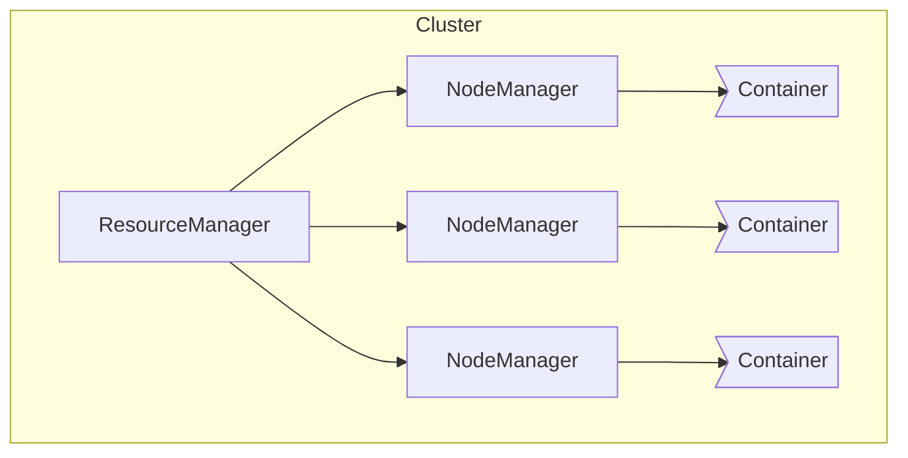

# Yarn原理与代码实例讲解

## 1.背景介绍

在大数据时代,分布式计算框架的重要性日益凸显。Apache Hadoop作为开源分布式计算平台,为海量数据的存储和处理提供了可靠的解决方案。然而,Hadoop的默认资源调度器存在诸多限制,例如资源利用率低、无法处理多种工作负载等。为了解决这些问题,Apache Yarn(Yet Another Resource Negotiator)应运而生。

Yarn是Hadoop的资源管理和作业调度框架,负责集群资源管理和作业监控,为上层计算引擎(如MapReduce、Spark等)提供统一的资源管理和调度服务。它将资源管理和作业调度/监控相分离,打造通用的资源管理和调度平台,支持多种计算框架在同一个集群上运行。

## 2.核心概念与联系

### 2.1 Yarn架构

Yarn采用主从架构,主要由ResourceManager、NodeManager、ApplicationMaster和Container等组件构成。



- **ResourceManager(RM)**: 整个集群的资源管理和调度总控制器,负责资源分配、作业监控和容错处理等。
- **NodeManager(NM)**: 运行在每个节点上,负责节点上资源管理、任务执行和监控等。
- **ApplicationMaster(AM)**: 每个应用程序对应一个AM,负责应用内部资源协调和任务调度。
- **Container**: 资源抽象的基本单位,封装了CPU、内存等多维资源,用于运行任务。

### 2.2 工作流程

1. 客户端向RM提交应用程序。
2. RM为应用程序分配第一个Container,启动AM。
3. AM向RM申请资源容器,运行任务。
4. AM监控任务进度,完成后向RM释放资源。

## 3.核心算法原理具体操作步骤 

### 3.1 资源管理

Yarn采用动态资源分配策略,根据应用需求和集群状态动态调整资源分配。主要算法包括:

1. **容量调度器(Capacity Scheduler)**

   按队列划分集群资源,支持层次化队列。采用FIFO策略,先到先服务。

2. **公平调度器(Fair Scheduler)** 

   根据应用运行时间分配资源,确保长时间运行的应用获得足够资源,短时间应用也能被服务。

3. **延迟调度器(Delay Scheduler)**

   基于延迟调度策略,为每个作业设置延迟运行时间,减少资源抢占。

### 3.2 容错机制

Yarn采用主备容错设计,RM实现热备份,NM实现重新同步等机制:

1. **RM容错**: RM主备实例通过共享状态进行热备份,备机定期从主机获取状态。主机宕机时,备机接管集群。

2. **NM容错**: NM定期向RM发送心跳,维持连接。NM宕机后,RM将其上的任务重新调度。

3. **AM容错**: AM宕机后,RM会根据应用状态重新启动AM实例。

## 4.数学模型和公式详细讲解举例说明

### 4.1 资源模型

Yarn将集群资源抽象为多维资源向量,包括CPU、内存等。资源模型如下:

$$
R = (r_1, r_2, ..., r_n)
$$

其中$R$表示资源向量,$r_i$表示第$i$种资源量。

应用程序对资源的需求也用资源向量表示:

$$
Q = (q_1, q_2, ..., q_n)
$$

调度器根据$R$和$Q$进行资源分配。

### 4.2 资源局部性

为提高数据局部性,Yarn会尽量将任务调度到存储数据的节点上运行。定义节点的局部性级别:

- node-local: 任务运行在存储数据的节点。
- rack-local: 任务运行在同一机架的节点。 
- off-rack: 任务运行在其他机架的节点。

调度器优先选择node-local节点,其次是rack-local,最后是off-rack。

### 4.3 公平调度算法

公平调度器基于最大最小公平份额,按应用运行时间分配资源。具体算法如下:

1. 计算每个应用的公平资源份额:

$$
share_i = \frac{C}{activeApps} \times weight_i
$$

其中$C$为集群总资源,$activeApps$为活跃应用数,$weight_i$为应用$i$的权重。

2. 计算应用资源deficiency:

$$
deficiency_i = \max(0, share_i - usage_i)  
$$

其中$usage_i$为应用$i$已使用资源。

3. 按deficiency排序,优先分配资源给deficiency最大的应用。

## 5.项目实践:代码实例和详细解释说明

下面通过一个示例项目,展示如何在Yarn上运行MapReduce作业。

### 5.1 项目结构

```
yarn-mapreduce-example
├── pom.xml
├── src
│   ├── main
│   │   ├── java
│   │   │   └── com
│   │   │       └── example
│   │   │           ├── WordCount.java
│   │   │           ├── WordCountMapper.java
│   │   │           └── WordCountReducer.java
│   │   └── resources
│   │        └── input
│   │            └── file.txt
```

- `WordCount.java`: 主类,提交MapReduce作业
- `WordCountMapper.java`: Map阶段实现
- `WordCountReducer.java`: Reduce阶段实现  
- `file.txt`: 输入文件

### 5.2 代码解析

#### 5.2.1 WordCount.java

```java
// 配置作业
Configuration conf = new Configuration();
Job job = Job.getInstance(conf, "word count");

// 设置作业类
job.setJarByClass(WordCount.class);

// 设置Mapper和Reducer类
job.setMapperClass(WordCountMapper.class);
job.setReducerClass(WordCountReducer.class);

// 设置输入输出路径
FileInputFormat.addInputPath(job, new Path(args[0]));
FileOutputFormat.setOutputPath(job, new Path(args[1]));

// 提交作业
System.exit(job.waitForCompletion(true) ? 0 : 1);
```

1. 创建`Configuration`和`Job`对象。
2. 设置作业主类、Mapper和Reducer类。
3. 设置输入输出路径。
4. 提交作业,等待完成。

#### 5.2.2 WordCountMapper.java

```java
public class WordCountMapper extends Mapper<LongWritable, Text, Text, IntWritable> {
    private final IntWritable one = new IntWritable(1);
    private Text word = new Text();

    public void map(LongWritable key, Text value, Context context) throws IOException, InterruptedException {
        String line = value.toString();
        StringTokenizer tokenizer = new StringTokenizer(line);
        while (tokenizer.hasMoreTokens()) {
            word.set(tokenizer.nextToken());
            context.write(word, one);
        }
    }
}
```

1. 定义输出key和value类型。
2. 对每行输入数据进行单词分割。
3. 以单词为key,值为1,输出到Context。

#### 5.2.3 WordCountReducer.java  

```java
public class WordCountReducer extends Reducer<Text, IntWritable, Text, IntWritable> {
    private IntWritable result = new IntWritable();

    public void reduce(Text key, Iterable<IntWritable> values, Context context) throws IOException, InterruptedException {
        int sum = 0;
        for (IntWritable val : values) {
            sum += val.get();
        }
        result.set(sum);
        context.write(key, result);
    }
}
```

1. 定义输出key和value类型。  
2. 遍历values,对值进行累加。
3. 输出`<单词,总数>`到Context。

### 5.3 运行作业

1. 打包项目为jar文件。
2. 将jar文件上传到Hadoop集群。
3. 运行命令:

```
yarn jar yarn-mapreduce-example.jar com.example.WordCount /input /output
```

其中`/input`为输入路径,`/output`为输出路径。

## 6.实际应用场景

Yarn广泛应用于以下场景:

1. **大数据分析**: 支持在Yarn上运行Hive、Spark等分析工具,实现海量数据的ETL和分析。

2. **机器学习**: 结合Spark MLlib等库,可在Yarn上训练和部署机器学习模型。

3. **流式计算**: 支持在Yarn上运行Storm、Flink等流计算框架,实时处理数据流。

4. **物联网**: 利用Yarn的资源隔离和弹性伸缩特性,可高效处理物联网设备产生的海量数据。

5. **科学计算**: 在Yarn上运行MPI等科学计算框架,实现高性能计算。

## 7.工具和资源推荐

1. **Apache Hadoop**: Yarn的官方发行版,提供完整的文档和示例。

2. **Cloudera Distribution of Hadoop(CDH)**: 基于Hadoop的商业发行版,提供企业级支持。

3. **Hortonworks Data Platform(HDP)**: 另一种基于Hadoop的商业发行版。

4. **Apache Ambari**: 开源的Hadoop集群管理工具,简化了集群部署和监控。

5. **Apache Slider**: 一种在Yarn上运行长期服务的框架,支持服务高可用。

6. **UtilYARN**: 社区维护的Yarn相关工具集合,包括性能监控、日志分析等功能。

## 8.总结:未来发展趋势与挑战

Yarn为Hadoop带来了资源统一管理和调度的能力,极大提高了集群资源利用率。但随着大数据场景的不断演进,Yarn也面临一些新的挑战:

1. **多租户资源隔离**: 如何在同一集群上为不同租户提供安全可靠的资源隔离。

2. **异构计算资源管理**: 除CPU和内存外,如何支持GPU、FPGA等异构计算资源的管理和调度。

3. **云原生支持**: 如何与Kubernetes等云原生技术深度整合,实现资源编排和弹性伸缩。  

4. **安全性和合规性**: 加强安全认证、审计等功能,满足企业级安全合规需求。

5. **人工智能工作负载**: 支持分布式AI训练和推理等新型工作负载的资源调度。

未来,Yarn需要持续创新,以适应新兴技术趋势,保持其在大数据生态中的核心地位。

## 9.附录:常见问题与解答

1. **Yarn与Mesos、Kubernetes有何区别?**

   Mesos和Kubernetes主要面向云原生场景,提供容器级资源调度。而Yarn更侧重大数据计算,提供多维度资源管理和调度。三者在定位和侧重点上有所不同。

2. **Yarn是否支持GPU等异构硬件资源?**

   Yarn原生支持CPU和内存资源的管理和调度。对于GPU等异构资源,需要通过插件的方式集成第三方调度器,如YARN-GPU项目。

3. **如何实现Yarn的高可用?**

   Yarn支持RM的主备热备份,NM的重新同步等容错机制。同时可通过Zookeeper实现元数据高可用,确保服务高可用性。

4. **Yarn是否支持云环境?**

   Yarn原生支持物理机和虚拟机环境。对于云环境,可通过Yarn on Cloud等方案,在公有云上部署和运行Yarn集群。

5. **Yarn是否支持Kubernetes?**

   Apache Hadoop 3.x版本开始支持在Kubernetes上部署和运行Yarn,实现与云原生技术的无缝集成。