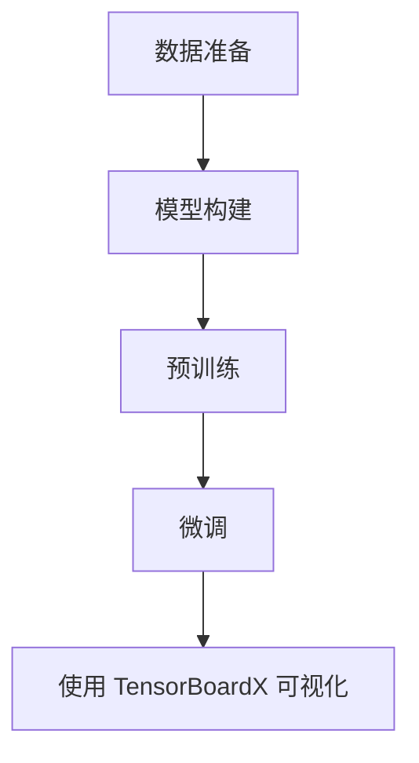

# 从零开始大模型开发与微调：tensorboardX可视化组件的使用

## 1.背景介绍

在人工智能和深度学习领域，大模型的开发与微调是一个复杂且重要的过程。随着模型规模的不断扩大，如何有效地监控和调试模型变得尤为关键。TensorBoardX 是一个强大的可视化工具，能够帮助开发者更好地理解和优化模型。本篇文章将详细介绍如何从零开始进行大模型的开发与微调，并使用 TensorBoardX 进行可视化。

## 2.核心概念与联系

### 2.1 大模型开发与微调

大模型（如 GPT-3、BERT 等）通常包含数以亿计的参数，训练这些模型需要大量的计算资源和时间。微调（Fine-tuning）是指在预训练模型的基础上，针对特定任务进行进一步训练，以提高模型在该任务上的表现。

### 2.2 TensorBoardX

TensorBoardX 是一个基于 TensorBoard 的可视化工具，支持 PyTorch 等深度学习框架。它能够记录和展示训练过程中的各种指标，如损失函数、准确率、梯度等，帮助开发者更好地理解和优化模型。

### 2.3 核心联系

大模型的开发与微调需要对训练过程进行细致的监控和调试，而 TensorBoardX 提供了强大的可视化功能，能够帮助开发者实时观察和分析训练过程中的各种指标，从而更好地优化模型。

## 3.核心算法原理具体操作步骤

### 3.1 数据准备

在进行大模型开发与微调之前，首先需要准备好训练数据。数据的质量和数量直接影响模型的性能。

### 3.2 模型构建

选择合适的模型架构是成功的关键。常见的大模型架构包括 Transformer、BERT、GPT 等。

### 3.3 预训练

预训练是指在大规模数据集上训练模型，使其能够学习到通用的特征和模式。预训练通常需要大量的计算资源和时间。

### 3.4 微调

微调是在预训练模型的基础上，针对特定任务进行进一步训练。微调的过程通常包括以下步骤：

1. 加载预训练模型
2. 准备特定任务的数据集
3. 设置优化器和损失函数
4. 进行训练和验证

### 3.5 使用 TensorBoardX 进行可视化

在训练和微调过程中，使用 TensorBoardX 记录和展示各种指标，帮助开发者实时观察和分析训练过程。



## 4.数学模型和公式详细讲解举例说明

### 4.1 损失函数

损失函数是衡量模型预测结果与真实结果之间差异的指标。常见的损失函数包括均方误差（MSE）、交叉熵损失等。

$$
L(y, \hat{y}) = \frac{1}{N} \sum_{i=1}^{N} (y_i - \hat{y}_i)^2
$$

### 4.2 优化算法

优化算法用于最小化损失函数，常见的优化算法包括随机梯度下降（SGD）、Adam 等。

$$
\theta_{t+1} = \theta_t - \eta \nabla_\theta L(\theta_t)
$$

### 4.3 正则化

正则化是防止模型过拟合的一种方法，常见的正则化方法包括 L1 正则化和 L2 正则化。

$$
L_{reg} = \lambda \sum_{i=1}^{N} \| \theta_i \|_2^2
$$

## 5.项目实践：代码实例和详细解释说明

### 5.1 环境配置

首先，确保已经安装了 PyTorch 和 TensorBoardX。

```bash
pip install torch tensorboardX
```

### 5.2 数据加载

使用 PyTorch 的 DataLoader 加载训练数据。

```python
import torch
from torch.utils.data import DataLoader, TensorDataset

# 假设已经有训练数据 X_train 和 y_train
dataset = TensorDataset(X_train, y_train)
dataloader = DataLoader(dataset, batch_size=32, shuffle=True)
```

### 5.3 模型定义

定义一个简单的神经网络模型。

```python
import torch.nn as nn

class SimpleModel(nn.Module):
    def __init__(self):
        super(SimpleModel, self).__init__()
        self.fc = nn.Linear(10, 1)
    
    def forward(self, x):
        return self.fc(x)

model = SimpleModel()
```

### 5.4 训练过程

定义损失函数和优化器，并使用 TensorBoardX 记录训练过程中的指标。

```python
import torch.optim as optim
from tensorboardX import SummaryWriter

criterion = nn.MSELoss()
optimizer = optim.Adam(model.parameters(), lr=0.001)
writer = SummaryWriter(log_dir='./logs')

for epoch in range(100):
    for i, (inputs, targets) in enumerate(dataloader):
        outputs = model(inputs)
        loss = criterion(outputs, targets)
        
        optimizer.zero_grad()
        loss.backward()
        optimizer.step()
        
        if i % 10 == 0:
            writer.add_scalar('Loss/train', loss.item(), epoch * len(dataloader) + i)
```

### 5.5 可视化结果

在终端中运行 TensorBoard，查看训练过程中的指标。

```bash
tensorboard --logdir=./logs
```

## 6.实际应用场景

### 6.1 自然语言处理

大模型在自然语言处理（NLP）领域有广泛的应用，如机器翻译、文本生成、情感分析等。

### 6.2 计算机视觉

在计算机视觉领域，大模型被用于图像分类、目标检测、图像生成等任务。

### 6.3 语音识别

大模型在语音识别领域也有重要应用，如语音转文字、语音合成等。

## 7.工具和资源推荐

### 7.1 工具

- PyTorch：一个流行的深度学习框架，支持动态计算图。
- TensorBoardX：一个基于 TensorBoard 的可视化工具，支持 PyTorch。

### 7.2 资源

- [PyTorch 官方文档](https://pytorch.org/docs/)
- [TensorBoardX GitHub 仓库](https://github.com/lanpa/tensorboardX)
- [深度学习课程](https://www.coursera.org/learn/deep-learning)

## 8.总结：未来发展趋势与挑战

随着计算资源的不断提升和算法的不断优化，大模型在各个领域的应用将越来越广泛。然而，大模型的训练和微调仍然面临着计算资源需求高、训练时间长等挑战。未来，如何提高模型的训练效率和优化效果，将是一个重要的研究方向。

## 9.附录：常见问题与解答

### 9.1 如何选择合适的模型架构？

选择模型架构需要根据具体任务和数据特点来决定。常见的大模型架构包括 Transformer、BERT、GPT 等。

### 9.2 如何处理过拟合问题？

过拟合是指模型在训练数据上表现良好，但在测试数据上表现较差。常见的解决方法包括使用正则化、增加数据量、使用数据增强等。

### 9.3 如何提高训练效率？

提高训练效率的方法包括使用更高效的优化算法、调整学习率、使用分布式训练等。

---

作者：禅与计算机程序设计艺术 / Zen and the Art of Computer Programming