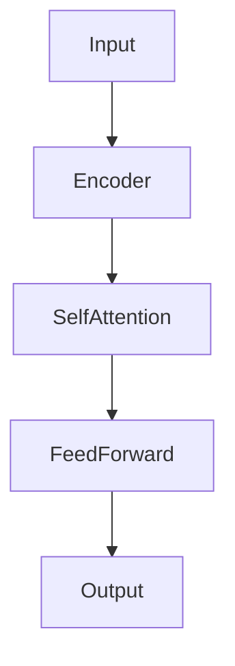

# 从零开始大模型开发与微调：文本数据处理

## 1.背景介绍

在人工智能和自然语言处理（NLP）领域，大模型（如GPT-3、BERT等）已经成为解决复杂文本处理任务的核心工具。这些模型通过大量的预训练数据和复杂的神经网络架构，能够在多种语言任务中表现出色。然而，开发和微调这些大模型并不是一件简单的事情，尤其是当涉及到文本数据处理时。本文将详细介绍从零开始大模型开发与微调的全过程，重点放在文本数据处理上。

## 2.核心概念与联系

### 2.1 大模型

大模型通常指的是具有数亿到数千亿参数的深度学习模型。这些模型通过大量的预训练数据进行训练，能够捕捉到语言的复杂结构和语义关系。

### 2.2 微调

微调是指在预训练模型的基础上，使用特定任务的数据进行进一步训练，以提高模型在该任务上的表现。微调可以显著减少训练时间和计算资源，同时提高模型的准确性。

### 2.3 文本数据处理

文本数据处理是指对原始文本数据进行清洗、预处理和特征提取的过程。这一步骤对于大模型的训练和微调至关重要，因为它直接影响到模型的输入质量和训练效果。

### 2.4 核心联系

大模型、微调和文本数据处理三者之间有着紧密的联系。文本数据处理是大模型训练和微调的基础，而微调则是将大模型应用到具体任务中的关键步骤。

## 3.核心算法原理具体操作步骤

### 3.1 数据收集与清洗

数据收集是大模型开发的第一步。数据的质量和多样性直接影响到模型的性能。常见的数据源包括公开数据集、网络爬虫和企业内部数据。

#### 3.1.1 数据清洗

数据清洗是指去除数据中的噪音和无关信息。常见的清洗操作包括去除HTML标签、去除停用词、拼写纠正等。

```python
import re
from nltk.corpus import stopwords

def clean_text(text):
    text = re.sub(r'<.*?>', '', text)  # 去除HTML标签
    text = re.sub(r'\W', ' ', text)  # 去除非字母字符
    text = text.lower()  # 转换为小写
    text = ' '.join([word for word in text.split() if word not in stopwords.words('english')])  # 去除停用词
    return text
```

### 3.2 数据预处理

数据预处理是指将清洗后的文本数据转换为模型可以接受的格式。常见的预处理操作包括分词、词干提取和词向量生成。

#### 3.2.1 分词

分词是将文本分割成单独的词或子词。常见的分词工具包括NLTK、Spacy和BERT的分词器。

```python
import nltk
nltk.download('punkt')

def tokenize_text(text):
    return nltk.word_tokenize(text)
```

#### 3.2.2 词向量生成

词向量生成是将分词后的文本转换为数值向量。常见的方法包括Word2Vec、GloVe和BERT的词嵌入。

```python
from gensim.models import Word2Vec

def generate_word_vectors(tokenized_texts):
    model = Word2Vec(sentences=tokenized_texts, vector_size=100, window=5, min_count=1, workers=4)
    return model
```

### 3.3 模型训练

模型训练是指使用预处理后的数据训练大模型。常见的训练框架包括TensorFlow、PyTorch和Hugging Face的Transformers。

```python
from transformers import BertTokenizer, BertForSequenceClassification, Trainer, TrainingArguments

tokenizer = BertTokenizer.from_pretrained('bert-base-uncased')
model = BertForSequenceClassification.from_pretrained('bert-base-uncased')

def train_model(train_dataset, val_dataset):
    training_args = TrainingArguments(
        output_dir='./results',
        num_train_epochs=3,
        per_device_train_batch_size=8,
        per_device_eval_batch_size=8,
        warmup_steps=500,
        weight_decay=0.01,
        logging_dir='./logs',
    )
    trainer = Trainer(
        model=model,
        args=training_args,
        train_dataset=train_dataset,
        eval_dataset=val_dataset,
    )
    trainer.train()
```

### 3.4 模型微调

模型微调是指在预训练模型的基础上，使用特定任务的数据进行进一步训练。微调可以显著提高模型在特定任务上的表现。

```python
def fine_tune_model(train_dataset, val_dataset):
    training_args = TrainingArguments(
        output_dir='./results',
        num_train_epochs=3,
        per_device_train_batch_size=8,
        per_device_eval_batch_size=8,
        warmup_steps=500,
        weight_decay=0.01,
        logging_dir='./logs',
    )
    trainer = Trainer(
        model=model,
        args=training_args,
        train_dataset=train_dataset,
        eval_dataset=val_dataset,
    )
    trainer.train()
```

## 4.数学模型和公式详细讲解举例说明

### 4.1 词向量生成

词向量生成是文本数据处理中的关键步骤。常见的方法包括Word2Vec和GloVe。

#### 4.1.1 Word2Vec

Word2Vec通过训练一个浅层神经网络，将词映射到一个固定大小的向量空间。其核心思想是相似的词在向量空间中距离较近。

$$
\text{Word2Vec}(\text{word}) = \text{NN}(\text{context})
$$

#### 4.1.2 GloVe

GloVe通过统计词共现矩阵，将词映射到一个固定大小的向量空间。其核心思想是相似的词在共现矩阵中具有相似的分布。

$$
\text{GloVe}(\text{word}) = \text{log}(\text{co-occurrence matrix})
$$

### 4.2 BERT模型

BERT（Bidirectional Encoder Representations from Transformers）是一个基于Transformer的预训练模型。其核心思想是通过双向编码器捕捉上下文信息。

#### 4.2.1 Transformer架构

Transformer架构由编码器和解码器组成。编码器通过自注意力机制捕捉输入序列的上下文信息。



#### 4.2.2 自注意力机制

自注意力机制通过计算输入序列中每个词与其他词的相关性，捕捉上下文信息。

$$
\text{Attention}(Q, K, V) = \text{softmax}\left(\frac{QK^T}{\sqrt{d_k}}\right)V
$$

## 5.项目实践：代码实例和详细解释说明

### 5.1 数据集准备

首先，我们需要准备一个文本数据集。这里以IMDB电影评论数据集为例。

```python
from datasets import load_dataset

dataset = load_dataset('imdb')
train_dataset = dataset['train']
val_dataset = dataset['test']
```

### 5.2 数据预处理

接下来，我们需要对数据进行预处理，包括分词和词向量生成。

```python
def preprocess_data(dataset):
    tokenized_texts = [tokenize_text(text) for text in dataset['text']]
    word_vectors = generate_word_vectors(tokenized_texts)
    return word_vectors
```

### 5.3 模型训练

使用预处理后的数据训练BERT模型。

```python
train_word_vectors = preprocess_data(train_dataset)
val_word_vectors = preprocess_data(val_dataset)

train_model(train_word_vectors, val_word_vectors)
```

### 5.4 模型微调

在预训练模型的基础上，使用特定任务的数据进行微调。

```python
fine_tune_model(train_word_vectors, val_word_vectors)
```

## 6.实际应用场景

### 6.1 情感分析

情感分析是大模型在文本数据处理中的一个典型应用。通过微调预训练模型，我们可以实现对电影评论、社交媒体帖子等文本的情感分类。

### 6.2 机器翻译

机器翻译是另一个重要的应用场景。通过大模型和微调技术，我们可以实现高质量的多语言翻译。

### 6.3 问答系统

问答系统是大模型在NLP中的一个重要应用。通过微调预训练模型，我们可以实现对用户问题的准确回答。

## 7.工具和资源推荐

### 7.1 开源数据集

- IMDB电影评论数据集
- SQuAD问答数据集
- WMT机器翻译数据集

### 7.2 开源工具

- TensorFlow
- PyTorch
- Hugging Face Transformers

### 7.3 在线资源

- Coursera上的NLP课程
- GitHub上的开源项目
- ArXiv上的研究论文

## 8.总结：未来发展趋势与挑战

大模型和微调技术在文本数据处理中的应用前景广阔。然而，随着模型规模的不断扩大，计算资源和数据隐私问题也成为了新的挑战。未来，我们需要在提高模型性能的同时，注重资源优化和隐私保护。

## 9.附录：常见问题与解答

### 9.1 如何选择合适的数据集？

选择数据集时，应考虑数据的质量、规模和多样性。公开数据集如IMDB、SQuAD和WMT是不错的选择。

### 9.2 如何处理数据不平衡问题？

数据不平衡问题可以通过数据增强、重采样和使用加权损失函数等方法解决。

### 9.3 如何优化模型性能？

优化模型性能可以通过调整超参数、使用更复杂的模型架构和增加训练数据等方法实现。

---

作者：禅与计算机程序设计艺术 / Zen and the Art of Computer Programming