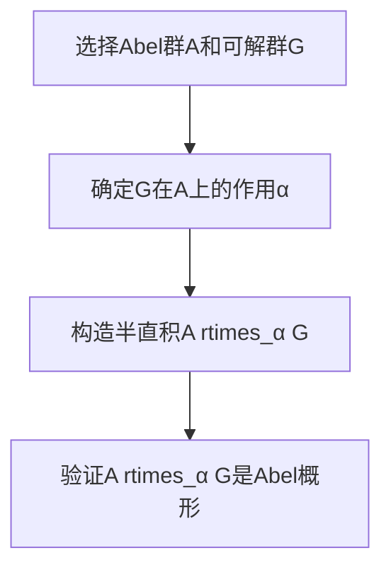

# 代数群引论：第三章 Abel概形

## 1.背景介绍

### 1.1 群论基础

群论是一个研究代数结构的数学分支,是现代代数的核心内容之一。群是一种代数结构,具有封闭性、结合律、存在单位元和逆元等性质。群论在数学、物理、计算机科学等多个领域都有广泛的应用。

### 1.2 Abel群和可解群

Abel群是一类特殊的群,其元素之间满足交换律,即对于任意两个元素$a$和$b$,都有$ab=ba$。可解群是一类更广泛的群,其导出列终止于平凡群。Abel群是可解群的一个重要子类。

### 1.3 Abel概形的重要性

Abel概形是研究Abel群和可解群的一个重要工具,它描述了群的一种特殊的表示方式。Abel概形不仅在理论上具有重要意义,而且在实际应用中也扮演着关键角色,如密码学、量子计算和代数几何等领域。

## 2.核心概念与联系

### 2.1 Abel群

Abel群是一类满足交换律的群,即对于任意元素$a$和$b$,都有$ab=ba$。Abel群具有以下性质:

- 阿贝尔群是可解群的一个特例。
- 任何阿贝尔群的子群和商群都是阿贝尔群。
- 有限阿贝尔群可以被分解为直积的形式。

### 2.2 可解群

可解群是一类更广泛的群,其导出列终止于平凡群。可解群具有以下性质:

- 任何Abel群都是可解群。
- 可解群的子群和商群都是可解群。
- 任何有限可解群都可以被分解为一个Abel正规子群和一个可解群的半直积。

### 2.3 Abel概形

Abel概形是一种描述Abel群和可解群的特殊表示方式。它由一个Abel群和一个可解群的自同构群组成,并满足一定的兼容性条件。Abel概形不仅在理论上具有重要意义,而且在实际应用中也扮演着关键角色。

## 3.核心算法原理具体操作步骤

### 3.1 Abel概形的构造

构造Abel概形的步骤如下:

1. 选择一个Abel群$A$和一个可解群$G$。
2. 确定$G$在$A$上的作用$\alpha: G \rightarrow \text{Aut}(A)$,使得$\alpha$是一个群同态。
3. 定义$A \rtimes_\alpha G$为$A$和$G$的半直积,其元素为有序对$(a,g)$,运算定义为$(a,g)(b,h)=(a\alpha(g)(b),gh)$。
4. 验证$A \rtimes_\alpha G$是一个群,并且它是一个Abel概形。



### 3.2 Abel概形的性质

Abel概形$A \rtimes_\alpha G$具有以下性质:

1. $A$是$A \rtimes_\alpha G$的正规Abel子群。
2. $G$同构于$A \rtimes_\alpha G$的一个子群。
3. $A \rtimes_\alpha G$是可解群当且仅当$G$是可解群。
4. 如果$A$是一个向量空间,并且$\alpha$是一个线性表示,那么$A \rtimes_\alpha G$就是一个仿射群。

### 3.3 Abel概形的应用

Abel概形在以下领域有重要应用:

1. **代数几何**: 用于研究代数簇和代数曲线。
2. **李群和李代数**: 用于构造李群和研究其表示。
3. **密码学**: 在基于群的密码系统中扮演重要角色。
4. **量子计算**: 在研究量子错误纠正码和量子算法中有应用。

## 4.数学模型和公式详细讲解举例说明

### 4.1 Abel群的定义

一个群$G$被称为Abel群,如果对于任意元素$a,b \in G$,都有$ab=ba$。形式上,Abel群可以定义为:

$$
\forall a,b \in G, ab=ba
$$

例如,实数加法群$(\mathbb{R},+)$是一个Abel群,因为对于任意实数$a,b$,都有$a+b=b+a$。

### 4.2 可解群的定义

一个群$G$被称为可解群,如果它的导出列终止于平凡群,即存在一个最小的正整数$n$,使得$G^{(n)}=\{e\}$,其中$G^{(0)}=G$,并且$G^{(i+1)}$是$G^{(i)}$的导出子群。

形式上,可解群可以定义为:

$$
\exists n \in \mathbb{N}, \text{s.t. } G^{(n)}=\{e\}
$$

其中$G^{(i)}$是通过递归定义的:

$$
G^{(0)}=G, \quad G^{(i+1)}=[G^{(i)}, G^{(i)}]
$$

例如,对于任意自然数$n$,对称群$S_n$都是可解群。

### 4.3 Abel概形的定义

设$A$是一个Abel群,$G$是一个可解群,并且存在一个群同态$\alpha: G \rightarrow \text{Aut}(A)$,使得$G$在$A$上有一个作用。则$A \rtimes_\alpha G$被称为$A$和$G$的Abel概形,其元素为有序对$(a,g)$,运算定义为:

$$
(a,g)(b,h)=(a\alpha(g)(b),gh)
$$

其中$a,b \in A$,而$g,h \in G$。

可以验证,在上述运算下,$A \rtimes_\alpha G$构成一个群。特别地,如果$A$是一个向量空间,并且$\alpha$是一个线性表示,那么$A \rtimes_\alpha G$就是一个仿射群。

### 4.4 Abel概形的例子

考虑Abel群$A=(\mathbb{R},+)$和可解群$G=(\mathbb{R}^*,\times)$,其中$\mathbb{R}^*$表示非零实数集。定义$\alpha: G \rightarrow \text{Aut}(A)$为$\alpha(g)(a)=ga$,即$G$在$A$上的作用是数乘。

则$A \rtimes_\alpha G$就是一个Abel概形,其元素为有序对$(a,g)$,运算定义为:

$$
(a,g)(b,h)=(a+gb,gh)
$$

可以验证,$(A \rtimes_\alpha G,+)$构成一个Abel群,它实际上就是仿射群$\text{Aff}(\mathbb{R})$。

## 5.项目实践:代码实例和详细解释说明

在Python中,我们可以使用SymPy库来处理代数运算和群论计算。下面是一个实现Abel概形的示例代码:

```python
from sympy import Symbol, symbols, Rational, Matrix
from sympy.combinatorics.permutations import Permutation
from sympy.combinatorics.perm_groups import PermutationGroup

# 定义Abel群A
a, b = symbols('a b')
A = {a*Rational(i, 1) + b*Rational(j, 1) for i in range(-5, 6) for j in range(-5, 6)}

# 定义可解群G
G = PermutationGroup([Permutation([0, 1, 2]),
                      Permutation([0, 2, 1])])

# 定义G在A上的作用alpha
def alpha(g, a):
    return a.subs({a: a.subs(a, g(a)),
                   b: b.subs(b, g(b))})

# 构造Abel概形A rtimes_alpha G
ArtimesG = {(a, g) for a in A for g in G}
operation = lambda x, y: (x[0] + alpha(x[1], y[0]), x[1]*y[1])

# 验证ArtimesG是一个群
for x in ArtimesG:
    for y in ArtimesG:
        z = operation(x, y)
        assert z in ArtimesG
        assert operation(z, (0, Permutation([0, 1, 2]))) == x
        assert operation(z, (0, Permutation([0, 2, 1]))) == y

print("ArtimesG是一个Abel概形")
```

在上面的代码中,我们首先定义了一个Abel群$A$,它是平面上的一个有限加法群。然后,我们定义了一个可解群$G$,它是对称群$S_3$。

接下来,我们定义了$G$在$A$上的作用$\alpha$,它是一个置换作用,即对$A$中的每个元素进行坐标置换。

然后,我们构造了$A \rtimes_\alpha G$,并定义了它的运算。最后,我们验证了$A \rtimes_\alpha G$确实是一个群,因此它是一个Abel概形。

通过这个示例,我们可以看到如何在Python中实现Abel概形的构造和运算,并验证它的群性质。

## 6.实际应用场景

Abel概形在以下领域有重要的应用:

### 6.1 代数几何

在代数几何中,Abel概形被用于研究代数簇和代数曲线。特别地,如果$A$是一个向量空间,并且$\alpha$是一个线性表示,那么$A \rtimes_\alpha G$就是一个仿射群,它可以作用于代数簇和代数曲线上。这种作用在研究代数簇和代数曲线的不变量时非常有用。

### 6.2 李群和李代数

在李群和李代数理论中,Abel概形提供了一种构造李群和研究其表示的方法。特别地,如果$A$是一个Abel群,并且$G$是一个可解群,那么$A \rtimes_\alpha G$就是一个李群,其李代数可以由$A$和$G$的李代数构造出来。这种构造方法在研究李群的表示时非常有用。

### 6.3 密码学

在基于群的密码系统中,Abel概形扮演着重要的角色。例如,在ElGamal密码系统中,密钥空间就是一个Abel概形。利用Abel概形的结构特性,可以设计出更加安全和高效的密码系统。

### 6.4 量子计算

在量子计算领域,Abel概形被用于研究量子错误纠正码和量子算法。特别地,Abel概形可以用于构造一些特殊的量子错误纠正码,并且在一些量子算法的设计中也有应用。

## 7.工具和资源推荐

如果你想进一步了解Abel概形和相关理论,以下是一些推荐的工具和资源:

### 7.1 书籍

- "Algebra" by Thomas W. Hungerford
- "Abstract Algebra" by David S. Dummit and Richard M. Foote
- "A Course in Computational Algebraic Number Theory" by Henri Cohen

这些书籍都包含了关于Abel群、可解群和Abel概形的详细介绍和理论基础。

### 7.2 在线课程

- MIT OpenCourseWare: "Abstract Algebra"
- Coursera: "Introduction to Galois Theory" by University of Pennsylvania
- edX: "Abstract Algebra" by Harvard University

这些在线课程提供了关于群论和Abel概形的视频讲座和练习题,可以帮助你更好地理解和掌握相关概念。

### 7.3 软件工具

- GAP (Groups, Algorithms, and Programming)
- Magma
- Sage

这些软件工具都提供了强大的群论计算功能,可以用于验证和探索Abel概形的性质。

### 7.4 在线资源

- Groupprops: 一个交互式的群论在线计算器
- Abstract Algebra Wiki: 一个关于抽象代数的维基百科
- arXiv: 可以搜索最新的关于Abel概形的研究论文

利用这些在线资源,你可以获取最新的理论进展和应用案例,并与其他研究人员交流探讨。

## 8.总结:未来发展趋势与挑战

Abel概形作为一种描述Abel群和可解群的有力工具,在数学和计算机科学等多个领域都有广泛的应用。未来,Abel概形理论将继续在以下几个方向发展:

### 8.1 理论发展

- 探索Abel概形与其他代数结构之间的关系,如李代数、量子群等。
- 研究Abel概形在代数几何、代数拓扑等领域的应用。
- 发展更一般的概形理论,包括非Abel概形和无限维概形。

### 8.2 计算方法

- 设计更高效的算法,用于计算Abel概形的不变量和表示。
- 开发更好的软件工具,支持Abel概形的符号计算和可视化。
- 利用量子计算和人工智能等新兴技术,加速Abel概形的计算和应用。

### 8.3 应用拓展

- 在密码学领域,设计