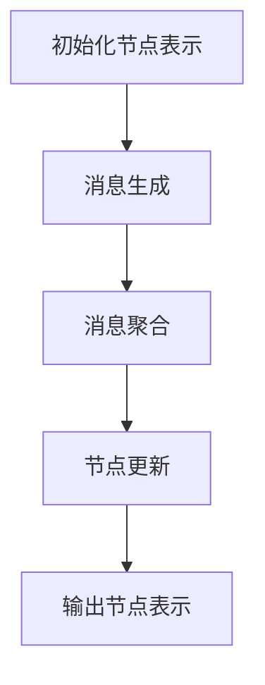

# 图神经网络(Graph Neural Networks) - 原理与代码实例讲解

## 1.背景介绍

在现代数据科学和机器学习领域，图数据结构的应用越来越广泛。图神经网络（Graph Neural Networks, GNNs）作为一种新兴的深度学习模型，能够有效地处理和分析图结构数据。图数据在社交网络、生物信息学、推荐系统等领域有着广泛的应用。传统的神经网络在处理图数据时存在局限性，而GNNs通过引入图结构信息，能够更好地捕捉节点之间的关系和图的全局特性。

## 2.核心概念与联系

### 2.1 图的基本概念

在深入了解GNNs之前，我们需要先掌握一些图的基本概念：

- **节点（Node）**：图中的基本单位，表示实体。
- **边（Edge）**：连接两个节点的线，表示节点之间的关系。
- **邻居（Neighbor）**：与某个节点直接相连的节点。
- **度（Degree）**：与某个节点相连的边的数量。

### 2.2 图神经网络的基本概念

图神经网络是一类能够在图结构数据上进行学习的神经网络模型。其核心思想是通过消息传递机制（Message Passing Mechanism）在图的节点之间传递信息，从而更新节点的表示（Embedding）。

### 2.3 图神经网络的联系

GNNs与传统神经网络的主要区别在于其能够处理图结构数据。传统神经网络通常处理的是固定维度的向量数据，而GNNs则能够处理任意结构的图数据。GNNs通过在图的节点之间传递信息，能够捕捉到图的全局特性和节点之间的复杂关系。

## 3.核心算法原理具体操作步骤

### 3.1 消息传递机制

消息传递机制是GNNs的核心。其基本步骤如下：

1. **消息生成（Message Generation）**：每个节点从其邻居节点接收信息。
2. **消息聚合（Message Aggregation）**：将接收到的邻居节点的信息进行聚合。
3. **节点更新（Node Update）**：使用聚合后的信息更新节点的表示。

### 3.2 算法流程图



### 3.3 具体操作步骤

1. **初始化节点表示**：为每个节点初始化一个表示向量，通常使用随机初始化或预训练的嵌入向量。
2. **消息生成**：每个节点从其邻居节点接收信息，生成消息。
3. **消息聚合**：将接收到的邻居节点的信息进行聚合，常用的聚合方法有求和、平均和最大值。
4. **节点更新**：使用聚合后的信息更新节点的表示，通常使用一个神经网络层来实现。
5. **输出节点表示**：经过多轮消息传递后，输出最终的节点表示。

## 4.数学模型和公式详细讲解举例说明

### 4.1 消息传递公式

设 $h_i^{(k)}$ 表示节点 $i$ 在第 $k$ 轮消息传递后的表示，$N(i)$ 表示节点 $i$ 的邻居节点集合，消息传递的公式可以表示为：

$$
m_i^{(k+1)} = \sum_{j \in N(i)} M(h_i^{(k)}, h_j^{(k)}, e_{ij})
$$

其中，$M$ 是消息生成函数，$e_{ij}$ 表示节点 $i$ 和节点 $j$ 之间的边的特征。

### 4.2 节点更新公式

节点更新的公式可以表示为：

$$
h_i^{(k+1)} = U(h_i^{(k)}, m_i^{(k+1)})
$$

其中，$U$ 是节点更新函数，通常使用一个神经网络层来实现。

### 4.3 举例说明

假设我们有一个简单的图，包含三个节点 $A$、$B$ 和 $C$，以及边 $A-B$ 和 $B-C$。初始节点表示为 $h_A^{(0)}$、$h_B^{(0)}$ 和 $h_C^{(0)}$。经过一轮消息传递后，节点 $A$ 的表示更新为：

$$
m_A^{(1)} = M(h_A^{(0)}, h_B^{(0)}, e_{AB})
$$

$$
h_A^{(1)} = U(h_A^{(0)}, m_A^{(1)})
$$

## 5.项目实践：代码实例和详细解释说明

### 5.1 环境准备

在开始代码实例之前，我们需要安装一些必要的库：

```bash
pip install torch
pip install dgl
```

### 5.2 数据准备

我们使用DGL库来创建一个简单的图：

```python
import dgl
import torch

# 创建一个包含3个节点和2条边的图
g = dgl.graph(([0, 1], [1, 2]))
```

### 5.3 模型定义

定义一个简单的GNN模型：

```python
import torch.nn as nn
import torch.nn.functional as F
from dgl.nn.pytorch import GraphConv

class GNN(nn.Module):
    def __init__(self, in_feats, h_feats, num_classes):
        super(GNN, self).__init__()
        self.conv1 = GraphConv(in_feats, h_feats)
        self.conv2 = GraphConv(h_feats, num_classes)

    def forward(self, g, in_feat):
        h = self.conv1(g, in_feat)
        h = F.relu(h)
        h = self.conv2(g, h)
        return h
```

### 5.4 模型训练

定义训练函数并进行训练：

```python
def train(g, features, labels, mask):
    optimizer = torch.optim.Adam(model.parameters(), lr=0.01)
    for epoch in range(100):
        model.train()
        logits = model(g, features)
        loss = F.cross_entropy(logits[mask], labels[mask])
        optimizer.zero_grad()
        loss.backward()
        optimizer.step()
        print('Epoch %d | Loss: %.4f' % (epoch, loss.item()))

# 初始化节点特征和标签
features = torch.eye(3)
labels = torch.tensor([0, 1, 2])
mask = torch.tensor([True, True, True])

# 创建模型
model = GNN(3, 5, 3)

# 训练模型
train(g, features, labels, mask)
```

### 5.5 结果分析

训练完成后，我们可以使用模型进行预测：

```python
model.eval()
with torch.no_grad():
    logits = model(g, features)
    print(logits)
```

## 6.实际应用场景

### 6.1 社交网络分析

在社交网络中，节点表示用户，边表示用户之间的关系。GNNs可以用于用户推荐、社区检测等任务。

### 6.2 生物信息学

在生物信息学中，节点表示基因或蛋白质，边表示它们之间的相互作用。GNNs可以用于基因功能预测、蛋白质结构预测等任务。

### 6.3 推荐系统

在推荐系统中，节点表示用户或物品，边表示用户与物品之间的交互。GNNs可以用于个性化推荐、冷启动问题等任务。

## 7.工具和资源推荐

### 7.1 DGL（Deep Graph Library）

DGL是一个专门用于图神经网络的深度学习框架，支持多种图神经网络模型，提供了丰富的API和示例代码。

### 7.2 PyTorch Geometric

PyTorch Geometric是一个基于PyTorch的图神经网络库，提供了多种图神经网络模型和数据处理工具。

### 7.3 相关书籍和论文

- 《Graph Neural Networks: A Review of Methods and Applications》
- 《Deep Learning on Graphs: A Survey》

## 8.总结：未来发展趋势与挑战

图神经网络作为一种新兴的深度学习模型，具有广泛的应用前景。然而，GNNs在实际应用中仍然面临一些挑战，如大规模图数据的处理、模型的可解释性等。未来，随着研究的深入，GNNs有望在更多领域取得突破。

## 9.附录：常见问题与解答

### 9.1 GNNs与传统神经网络的区别是什么？

GNNs能够处理图结构数据，而传统神经网络通常处理固定维度的向量数据。

### 9.2 如何选择合适的消息传递机制？

消息传递机制的选择取决于具体的应用场景和数据特性。常用的消息传递机制包括求和、平均和最大值。

### 9.3 GNNs的训练时间长吗？

GNNs的训练时间取决于图的规模和模型的复杂度。对于大规模图数据，可以使用分布式训练方法来加速训练过程。

---

作者：禅与计算机程序设计艺术 / Zen and the Art of Computer Programming