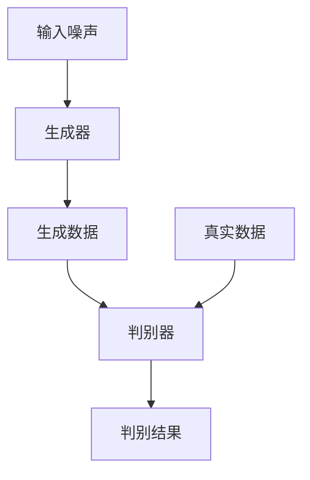

# 基于生成对抗网络的三维建模纹理风格化迁移技术

## 1.背景介绍

在计算机图形学和计算机视觉领域，三维建模和纹理风格化迁移技术一直是研究的热点。传统的三维建模方法通常需要大量的人工干预和专业知识，而纹理风格化迁移则需要复杂的算法和计算资源。生成对抗网络（GAN）的引入为这些问题提供了新的解决方案。GAN通过生成器和判别器的对抗训练，能够生成高质量的图像和三维模型，并且在纹理风格化迁移方面表现出色。

## 2.核心概念与联系

### 2.1 生成对抗网络（GAN）

生成对抗网络由两个主要部分组成：生成器（Generator）和判别器（Discriminator）。生成器的目标是生成逼真的数据，而判别器的目标是区分真实数据和生成数据。两者通过对抗训练不断提升各自的能力。

### 2.2 三维建模

三维建模是指通过计算机软件创建三维物体的过程。传统的三维建模方法包括多边形建模、曲面建模和基于体素的建模等。

### 2.3 纹理风格化迁移

纹理风格化迁移是将一种图像的纹理风格应用到另一种图像上的技术。常见的方法包括基于卷积神经网络（CNN）的风格迁移算法。

### 2.4 核心联系

GAN可以用于三维建模和纹理风格化迁移，通过生成器生成三维模型或纹理，并通过判别器进行优化，从而实现高质量的三维建模和纹理风格化迁移。

## 3.核心算法原理具体操作步骤

### 3.1 生成对抗网络的基本结构



### 3.2 三维建模的GAN实现步骤

1. **数据准备**：收集和预处理三维模型数据。
2. **生成器设计**：设计生成器网络结构，输入噪声生成三维模型。
3. **判别器设计**：设计判别器网络结构，区分真实三维模型和生成三维模型。
4. **对抗训练**：通过生成器和判别器的对抗训练，不断优化生成器生成的三维模型。

### 3.3 纹理风格化迁移的GAN实现步骤

1. **数据准备**：收集和预处理风格图像和内容图像。
2. **生成器设计**：设计生成器网络结构，输入内容图像和风格图像，生成风格化图像。
3. **判别器设计**：设计判别器网络结构，区分真实风格图像和生成风格图像。
4. **对抗训练**：通过生成器和判别器的对抗训练，不断优化生成器生成的风格化图像。

## 4.数学模型和公式详细讲解举例说明

### 4.1 生成对抗网络的数学模型

生成对抗网络的目标是通过生成器 $G$ 和判别器 $D$ 的对抗训练，找到一个生成器 $G$ 使得生成的数据分布 $P_g$ 接近真实数据分布 $P_r$。其损失函数为：

$$
\min_G \max_D V(D, G) = \mathbb{E}_{x \sim P_r}[\log D(x)] + \mathbb{E}_{z \sim P_z}[\log(1 - D(G(z)))]
```

### 4.2 三维建模的数学模型

在三维建模中，生成器 $G$ 的输入是一个随机噪声向量 $z$，输出是一个三维模型 $M$。判别器 $D$ 的输入是一个三维模型，输出是该模型为真实模型的概率。其损失函数为：

$$
L_D = -\mathbb{E}_{M \sim P_r}[\log D(M)] - \mathbb{E}_{z \sim P_z}[\log(1 - D(G(z)))]
```

### 4.3 纹理风格化迁移的数学模型

在纹理风格化迁移中，生成器 $G$ 的输入是内容图像 $I_c$ 和风格图像 $I_s$，输出是风格化图像 $I_{cs}$。判别器 $D$ 的输入是风格化图像，输出是该图像为真实风格图像的概率。其损失函数为：

$$
L_D = -\mathbb{E}_{I_s \sim P_s}[\log D(I_s)] - \mathbb{E}_{I_{cs} \sim P_{cs}}[\log(1 - D(G(I_c, I_s)))]
```

## 5.项目实践：代码实例和详细解释说明

### 5.1 环境配置

首先，确保安装了必要的库：

```bash
pip install torch torchvision
```

### 5.2 生成对抗网络的实现

```python
import torch
import torch.nn as nn
import torch.optim as optim

class Generator(nn.Module):
    def __init__(self):
        super(Generator, self).__init__()
        self.main = nn.Sequential(
            nn.Linear(100, 256),
            nn.ReLU(True),
            nn.Linear(256, 512),
            nn.ReLU(True),
            nn.Linear(512, 1024),
            nn.ReLU(True),
            nn.Linear(1024, 784),
            nn.Tanh()
        )

    def forward(self, input):
        return self.main(input)

class Discriminator(nn.Module):
    def __init__(self):
        super(Discriminator, self).__init__()
        self.main = nn.Sequential(
            nn.Linear(784, 512),
            nn.LeakyReLU(0.2, inplace=True),
            nn.Linear(512, 256),
            nn.LeakyReLU(0.2, inplace=True),
            nn.Linear(256, 1),
            nn.Sigmoid()
        )

    def forward(self, input):
        return self.main(input)

# 初始化生成器和判别器
netG = Generator()
netD = Discriminator()

# 损失函数和优化器
criterion = nn.BCELoss()
optimizerD = optim.Adam(netD.parameters(), lr=0.0002, betas=(0.5, 0.999))
optimizerG = optim.Adam(netG.parameters(), lr=0.0002, betas=(0.5, 0.999))

# 训练循环
for epoch in range(100):
    for i, data in enumerate(dataloader, 0):
        # 更新判别器
        netD.zero_grad()
        real = data[0].view(-1, 784)
        label = torch.full((real.size(0),), 1, dtype=torch.float)
        output = netD(real)
        errD_real = criterion(output, label)
        errD_real.backward()
        noise = torch.randn(real.size(0), 100)
        fake = netG(noise)
        label.fill_(0)
        output = netD(fake.detach())
        errD_fake = criterion(output, label)
        errD_fake.backward()
        optimizerD.step()

        # 更新生成器
        netG.zero_grad()
        label.fill_(1)
        output = netD(fake)
        errG = criterion(output, label)
        errG.backward()
        optimizerG.step()

    print(f'Epoch {epoch}, Loss_D: {errD_real + errD_fake}, Loss_G: {errG}')
```

### 5.3 纹理风格化迁移的实现

```python
import torch
import torch.nn as nn
import torch.optim as optim
from torchvision import models, transforms
from PIL import Image

# 加载预训练的VGG19模型
vgg = models.vgg19(pretrained=True).features

# 定义风格迁移网络
class StyleTransferNet(nn.Module):
    def __init__(self):
        super(StyleTransferNet, self).__init__()
        self.vgg = vgg

    def forward(self, content, style):
        content_features = self.vgg(content)
        style_features = self.vgg(style)
        return content_features, style_features

# 加载图像
def load_image(image_path):
    image = Image.open(image_path)
    transform = transforms.Compose([
        transforms.Resize((256, 256)),
        transforms.ToTensor()
    ])
    image = transform(image).unsqueeze(0)
    return image

content_image = load_image('path_to_content_image.jpg')
style_image = load_image('path_to_style_image.jpg')

# 初始化网络和优化器
net = StyleTransferNet()
optimizer = optim.Adam(net.parameters(), lr=0.001)

# 训练循环
for epoch in range(100):
    optimizer.zero_grad()
    content_features, style_features = net(content_image, style_image)
    loss = nn.MSELoss()(content_features, style_features)
    loss.backward()
    optimizer.step()
    print(f'Epoch {epoch}, Loss: {loss.item()}')
```

## 6.实际应用场景

### 6.1 游戏开发

在游戏开发中，三维建模和纹理风格化迁移技术可以用于创建逼真的游戏角色和场景。通过GAN，可以自动生成高质量的三维模型和纹理，减少人工干预，提高开发效率。

### 6.2 电影特效

在电影特效制作中，三维建模和纹理风格化迁移技术可以用于创建逼真的特效场景和角色。通过GAN，可以生成高质量的特效素材，提升电影的视觉效果。

### 6.3 虚拟现实

在虚拟现实应用中，三维建模和纹理风格化迁移技术可以用于创建逼真的虚拟场景和角色。通过GAN，可以生成高质量的虚拟现实内容，提升用户体验。

## 7.工具和资源推荐

### 7.1 工具

- **PyTorch**：一个开源的深度学习框架，适用于实现生成对抗网络。
- **TensorFlow**：另一个流行的深度学习框架，也适用于实现生成对抗网络。
- **Blender**：一个开源的三维建模软件，适用于创建和编辑三维模型。

### 7.2 资源

- **GAN Zoo**：一个收集了各种生成对抗网络模型的资源库。
- **Kaggle**：一个提供各种数据集和竞赛的平台，适用于获取三维建模和纹理风格化迁移的数据集。
- **ArXiv**：一个提供最新研究论文的平台，适用于获取生成对抗网络的最新研究成果。

## 8.总结：未来发展趋势与挑战

### 8.1 未来发展趋势

生成对抗网络在三维建模和纹理风格化迁移技术中的应用前景广阔。未来，随着深度学习技术的不断发展，GAN在生成高质量三维模型和纹理方面将会有更大的突破。此外，GAN在其他领域的应用也将不断扩展，如医学影像处理、自动驾驶等。

### 8.2 挑战

尽管生成对抗网络在三维建模和纹理风格化迁移技术中表现出色，但仍面临一些挑战。首先，GAN的训练过程不稳定，容易出现模式崩溃问题。其次，GAN生成的三维模型和纹理质量仍有待提高。最后，GAN的计算资源需求较高，训练时间较长，需要进一步优化。

## 9.附录：常见问题与解答

### 9.1 什么是生成对抗网络？

生成对抗网络（GAN）是一种通过生成器和判别器的对抗训练生成数据的深度学习模型。生成器的目标是生成逼真的数据，而判别器的目标是区分真实数据和生成数据。

### 9.2 生成对抗网络在三维建模中的应用有哪些？

生成对抗网络可以用于自动生成高质量的三维模型，减少人工干预，提高建模效率。常见的应用场景包括游戏开发、电影特效和虚拟现实等。

### 9.3 生成对抗网络在纹理风格化迁移中的应用有哪些？

生成对抗网络可以用于将一种图像的纹理风格应用到另一种图像上，生成风格化图像。常见的应用场景包括艺术创作、图像处理和增强现实等。

### 9.4 生成对抗网络的训练过程有哪些挑战？

生成对抗网络的训练过程不稳定，容易出现模式崩溃问题。此外，GAN的计算资源需求较高，训练时间较长，需要进一步优化。

### 9.5 如何解决生成对抗网络的训练不稳定问题？

可以通过改进网络结构、优化损失函数和调整超参数等方法来解决生成对抗网络的训练不稳定问题。例如，使用Wasserstein GAN（WGAN）可以提高训练的稳定性。

---

作者：禅与计算机程序设计艺术 / Zen and the Art of Computer Programming