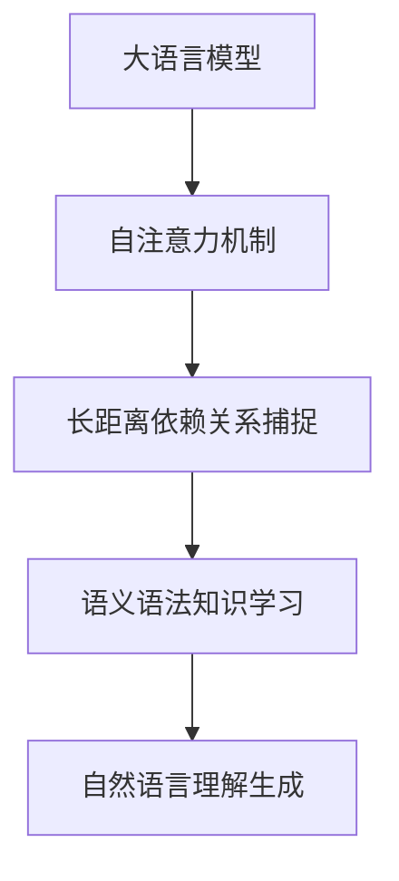
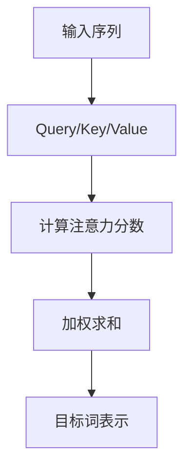

好的,我明白了您的要求。以下是题为《大语言模型原理与工程实践:即时奖励》的技术博客文章正文内容:

# 大语言模型原理与工程实践:即时奖励

## 1.背景介绍

### 1.1 人工智能的发展历程

人工智能(AI)是当代科技发展的核心领域之一,自20世纪50年代问世以来,已经经历了多个发展阶段。早期的人工智能系统主要基于符号主义和逻辑规则,但由于知识库的构建和推理过程的复杂性,遇到了"知识获取瓶颈"。

### 1.2 机器学习和深度学习的兴起

21世纪初,机器学习和深度学习技术的兴起,为人工智能发展注入了新的动力。深度学习能够从大量数据中自动学习特征表示,极大提高了人工智能系统处理复杂问题的能力。

### 1.3 大语言模型的崛起

近年来,benefiting from 大规模计算能力、海量训练数据和新型神经网络架构,大型语言模型取得了突破性进展,在自然语言处理、问答系统、文本生成等领域展现出卓越的性能,成为人工智能发展的重要力量。

## 2.核心概念与联系

### 2.1 什么是大语言模型?

大语言模型(Large Language Model,LLM)是一种基于深度学习的自然语言处理模型,能够从海量文本数据中学习语言的语义和语法知识。它通过自注意力机制捕捉长距离依赖关系,从而更好地理解和生成自然语言。



### 2.2 大语言模型与传统NLP模型

传统的NLP模型通常针对特定任务(如文本分类、机器翻译等)进行训练和优化。而大语言模型则是通过自监督学习方式在大量无标注文本数据上进行预训练,获得通用的语言表示能力,再通过微调等技术应用到下游任务。

### 2.3 大语言模型的优势

- 泛化能力强,可支持多种NLP任务
- 持续学习能力,可通过增量学习不断扩展知识
- 上下文理解能力好,能捕捉长距离语义依赖
- 生成质量高,输出更加连贯流畅

## 3.核心算法原理具体操作步骤

### 3.1 自注意力机制(Self-Attention)

自注意力机制是大语言模型的核心,它允许模型在计算目标词的表示时关注整个输入序列的不同位置,捕捉长距离依赖关系。具体步骤如下:

1. 计算Query(Q)、Key(K)和Value(V)向量
2. 计算注意力分数: $\text{Attention}(Q,K,V)=\text{softmax}(\frac{QK^T}{\sqrt{d_k}})V$
3. 对注意力加权的V向量求和,得到目标词的表示



### 3.2 掩码语言模型(Masked LM)

掩码语言模型是训练大语言模型的常用技术,通过随机掩码部分输入词,模型需要预测被掩码的词。这种自监督方式有助于模型学习语义和语法知识。

1. 随机选择输入序列中的部分词,用特殊标记[MASK]替换
2. 模型基于上下文预测被掩码词的概率分布
3. 将预测概率与实际词进行交叉熵损失计算,反向传播优化模型

### 3.3 生成式预训练(Generative Pre-training)

生成式预训练是另一种常用技术,模型需要根据上文生成下文,这种方式能够增强模型的生成能力。

1. 给定输入序列前缀,模型生成下文
2. 将生成的下文与实际下文计算损失
3. 反向传播优化模型参数

## 4.数学模型和公式详细讲解举例说明

### 4.1 自注意力机制数学原理

给定一个长度为n的输入序列$X=(x_1,x_2,...,x_n)$,我们计算Query、Key和Value向量:

$$\begin{aligned}
Q&=XW_Q\\
K&=XW_K\\
V&=XW_V
\end{aligned}$$

其中$W_Q,W_K,W_V$是可训练的投影矩阵。对于序列中的第i个位置,我们计算其注意力向量:

$$\text{head}_i=\text{Attention}(Q_i,K,V)=\text{softmax}(\frac{Q_iK^T}{\sqrt{d_k}})V$$

$d_k$是缩放因子,避免点积过大导致梯度消失。多头注意力通过连接多个注意力头的结果来捕捉不同子空间的信息:

$$\text{MultiHead}(Q,K,V)=\text{Concat}(\text{head}_1,...,\text{head}_h)W^O$$

其中$W^O$是可训练的投影矩阵。

### 4.2 掩码语言模型目标函数

假设输入序列$X=(x_1,...,x_n)$中有m个被掩码的词,我们用$C$表示所有被掩码词的位置索引集合。目标是最大化被掩码词的概率:

$$\mathcal{L}=\sum_{i\in C}\log P(x_i|X\backslash x_i)$$

其中$X\backslash x_i$表示将$x_i$从$X$中移除后的序列。

### 4.3 生成式预训练目标函数

对于给定的输入序列前缀$X_p$,我们希望模型生成与实际下文$X_f$相匹配的概率分布。目标函数为:

$$\mathcal{L}=-\sum_{t=1}^{|X_f|}\log P(x_t^f|X_p,x_1^f,...,x_{t-1}^f)$$

其中$x_t^f$是下文的第t个词。

## 5.项目实践:代码实例和详细解释说明

以下是使用PyTorch实现的多头自注意力机制代码示例:

```python
import torch
import torch.nn as nn

class MultiHeadAttention(nn.Module):
    def __init__(self, d_model, num_heads):
        super().__init__()
        self.num_heads = num_heads
        self.head_dim = d_model // num_heads
        
        self.qkv_proj = nn.Linear(d_model, 3 * d_model)
        self.out_proj = nn.Linear(d_model, d_model)
        
    def forward(self, x):
        batch_size, seq_len, d_model = x.size()
        qkv = self.qkv_proj(x).chunk(3, dim=-1)  # 分割为Q,K,V
        q, k, v = map(lambda t: t.view(batch_size, seq_len, self.num_heads, self.head_dim).transpose(1, 2), qkv)
        
        attn_scores = torch.matmul(q, k.transpose(-2, -1)) / math.sqrt(self.head_dim)
        attn_probs = nn.functional.softmax(attn_scores, dim=-1)
        attn_output = torch.matmul(attn_probs, v).transpose(1, 2).contiguous().view(batch_size, seq_len, d_model)
        
        return self.out_proj(attn_output)
```

这段代码实现了多头自注意力层,具体步骤如下:

1. 通过`qkv_proj`线性层将输入`x`投影到Query、Key和Value空间。
2. 将Q、K、V拆分为`num_heads`个头,每个头的维度为`head_dim`。
3. 计算每个头的注意力分数`attn_scores`,并通过softmax函数得到概率分布`attn_probs`。
4. 使用`attn_probs`对V进行加权求和,得到每个头的注意力输出。
5. 将所有头的输出拼接,并通过`out_proj`线性层进行投影,得到最终输出。

这个实现体现了自注意力机制的核心思想,可以应用于Transformer等大语言模型中。

## 6.实际应用场景

大语言模型在自然语言处理领域有着广泛的应用,下面列举一些典型场景:

### 6.1 对话系统

大语言模型可以作为对话系统的核心模块,通过上下文理解和生成自然语言回复,实现人机对话交互。例如OpenAI的GPT-3就被应用于对话系统ChatGPT中。

### 6.2 问答系统

大语言模型擅长从文本中提取知识并回答相关问题,可以构建高效的问答系统。谷歌的LaMBDA、OpenAI的InstructGPT等模型都在问答任务上表现出色。

### 6.3 文本摘要

通过理解原文语义,大语言模型能够生成高质量的文本摘要,为信息过载时代带来高效的内容浓缩。例如谷歌的PubMedQA就是一款基于大模型的生物医学文献摘要系统。

### 6.4 内容创作

大语言模型的强大生成能力也可应用于内容创作领域,如新闻、小说、诗歌、剧本等。虽然目前的生成质量还无法完全取代人工创作,但已展现出巨大潜力。

### 6.5 代码生成

除了自然语言处理,大语言模型也能生成计算机程序代码。OpenAI的Codex、DeepMind的AlphaCode等模型都能根据自然语言描述生成对应功能的代码,提高了编程效率。

## 7.工具和资源推荐

### 7.1 预训练模型

- GPT系列(OpenAI)
- T5(Google)  
- BERT(Google)
- XLNet(Google&CMU)
- PALM(Google)

### 7.2 模型训练框架

- PyTorch
- TensorFlow
- Jax
- Megatron-LM

### 7.3 NLP工具库

- Hugging Face Transformers
- AllenNLP
- spaCy
- NLTK

### 7.4 数据集

- C4 Corpus
- BookCorpus
- Wikipedia
- PubMed
- StackOverflow

### 7.5 在线演示

- OpenAI Playground
- Anthropic's Constitutional AI
- Google's LaMBDA
- DeepMind's AlphaCode

## 8.总结:未来发展趋势与挑战

### 8.1 模型规模持续增长

未来大语言模型的规模将持续增长,参数量有望突破万亿级。规模的增长将进一步提升模型的表现,但也带来训练、推理等方面的挑战。

### 8.2 多模态融合

除了文本,大模型还将融合视觉、语音等多模态信息,实现更通用的认知能力。多模态融合是未来的重要发展方向。

### 8.3 可解释性和安全性

随着大模型在越来越多领域的应用,其可解释性和安全性问题日益受到重视。如何确保模型输出的可靠性和公平性,避免潜在风险,是需要解决的重大挑战。

### 8.4 小型高效模型

为满足移动端和嵌入式设备的需求,研究小型高效大语言模型也是未来的重点方向之一。通过模型压缩、知识蒸馏等技术,在保持性能的同时降低计算和存储开销。

### 8.5 人工智能与人类的关系

随着人工智能能力的不断提高,人工智能与人类的关系也将发生深刻变化。如何实现人机共存、相互促进,是一个需要社会各界深入探讨的重大课题。

## 9.附录:常见问题与解答

### 9.1 大语言模型与小型模型相比有何优势?

大语言模型通过在海量数据上预训练,获得了更强的泛化能力和语义理解能力。它们可以支持多种自然语言处理任务,且性能往往优于针对特定任务训练的小型模型。

### 9.2 大语言模型存在哪些潜在风险?

大语言模型存在一些潜在风险,如生成有害、不实或带有偏见的内容、隐私和安全问题、对模型误用的风险等。因此需要采取适当的监管措施来确保其安全可靠。

### 9.3 如何提高大语言模型的效率?

提高大语言模型效率的一些方法包括:模型压缩、知识蒸馏、高效注意力机制