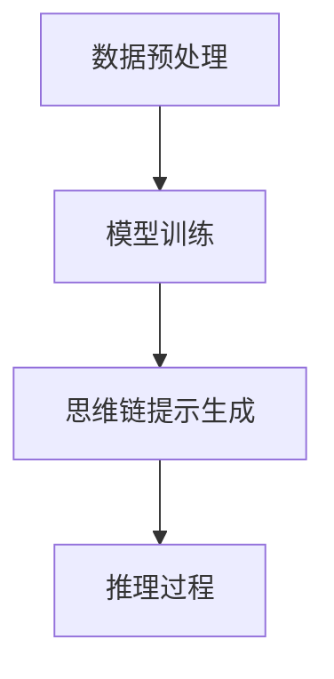

# 大语言模型原理与工程实践：思维链提示

## 1.背景介绍

大语言模型（Large Language Model, LLM）是近年来人工智能领域的一个重要突破。它们通过训练海量的文本数据，能够生成高质量的自然语言文本，完成翻译、问答、文本生成等任务。思维链提示（Chain-of-Thought Prompting, CoT）是一种新兴的技术，旨在通过引导模型逐步推理，从而提高其在复杂任务中的表现。

## 2.核心概念与联系

### 2.1 大语言模型

大语言模型是基于深度学习的自然语言处理模型，通常采用Transformer架构。它们通过大量的文本数据进行训练，能够理解和生成自然语言。典型的大语言模型包括GPT-3、BERT等。

### 2.2 思维链提示

思维链提示是一种通过引导模型逐步推理的技术。它通过提供一系列的提示，引导模型逐步解决复杂问题。这种方法可以显著提高模型在复杂任务中的表现。

### 2.3 联系

大语言模型和思维链提示的结合，可以显著提高模型在复杂任务中的表现。思维链提示通过引导模型逐步推理，能够更好地利用大语言模型的强大能力，从而解决复杂问题。

## 3.核心算法原理具体操作步骤

### 3.1 数据预处理

在训练大语言模型之前，需要对数据进行预处理。这包括文本清洗、分词、去除停用词等步骤。

### 3.2 模型训练

大语言模型的训练通常采用自监督学习方法。模型通过预测下一个词或填补缺失词来进行训练。训练过程中，模型会不断调整参数，以最小化预测误差。

### 3.3 思维链提示生成

思维链提示的生成需要根据具体任务进行设计。通常，提示会包含一系列的步骤，引导模型逐步解决问题。

### 3.4 推理过程

在推理过程中，模型会根据思维链提示逐步进行推理，最终生成答案。这个过程可以通过多轮推理来提高准确性。



## 4.数学模型和公式详细讲解举例说明

### 4.1 语言模型的数学基础

语言模型的核心是概率论。给定一个词序列 $w_1, w_2, ..., w_n$，语言模型的目标是计算这个序列的概率 $P(w_1, w_2, ..., w_n)$。根据链式法则，这个概率可以分解为：

$$
P(w_1, w_2, ..., w_n) = P(w_1) \cdot P(w_2|w_1) \cdot P(w_3|w_1, w_2) \cdot ... \cdot P(w_n|w_1, w_2, ..., w_{n-1})
$$

### 4.2 Transformer模型

Transformer模型通过自注意力机制来捕捉词与词之间的关系。自注意力机制的核心是计算词与词之间的相似度，然后根据相似度加权求和。具体公式如下：

$$
Attention(Q, K, V) = softmax\left(\frac{QK^T}{\sqrt{d_k}}\right)V
$$

其中，$Q$、$K$、$V$分别表示查询、键和值矩阵，$d_k$是键的维度。

### 4.3 思维链提示的数学表示

思维链提示可以看作是一个多步推理过程。假设有一个任务 $T$，思维链提示 $C$ 可以表示为一系列的步骤 $C_1, C_2, ..., C_m$。模型在每一步 $C_i$ 中生成中间结果 $R_i$，最终结果 $R$ 由所有中间结果组合得到：

$$
R = f(R_1, R_2, ..., R_m)
$$

## 5.项目实践：代码实例和详细解释说明

### 5.1 数据预处理

```python
import re
import nltk
from nltk.corpus import stopwords

# 下载停用词
nltk.download('stopwords')

def preprocess_text(text):
    # 转换为小写
    text = text.lower()
    # 去除标点符号
    text = re.sub(r'[^\w\s]', '', text)
    # 分词
    words = text.split()
    # 去除停用词
    words = [word for word in words if word not in stopwords.words('english')]
    return ' '.join(words)

sample_text = "This is a sample text for preprocessing."
cleaned_text = preprocess_text(sample_text)
print(cleaned_text)
```

### 5.2 模型训练

```python
from transformers import GPT2LMHeadModel, GPT2Tokenizer, Trainer, TrainingArguments

# 加载预训练模型和分词器
model_name = 'gpt2'
model = GPT2LMHeadModel.from_pretrained(model_name)
tokenizer = GPT2Tokenizer.from_pretrained(model_name)

# 准备数据集
texts = ["Sample text 1", "Sample text 2"]
inputs = tokenizer(texts, return_tensors='pt', max_length=512, truncation=True, padding=True)

# 定义训练参数
training_args = TrainingArguments(
    output_dir='./results',
    num_train_epochs=1,
    per_device_train_batch_size=2,
    save_steps=10_000,
    save_total_limit=2,
)

# 创建Trainer
trainer = Trainer(
    model=model,
    args=training_args,
    train_dataset=inputs,
)

# 开始训练
trainer.train()
```

### 5.3 思维链提示生成

```python
def generate_chain_of_thought_prompt(task_description):
    # 根据任务描述生成思维链提示
    prompt = f"Task: {task_description}\n"
    prompt += "Step 1: Analyze the problem.\n"
    prompt += "Step 2: Break down the problem into smaller parts.\n"
    prompt += "Step 3: Solve each part step by step.\n"
    prompt += "Step 4: Combine the solutions to get the final answer.\n"
    return prompt

task_description = "Solve a complex math problem."
cot_prompt = generate_chain_of_thought_prompt(task_description)
print(cot_prompt)
```

### 5.4 推理过程

```python
def perform_inference(model, tokenizer, prompt):
    inputs = tokenizer(prompt, return_tensors='pt')
    outputs = model.generate(inputs['input_ids'], max_length=100)
    return tokenizer.decode(outputs[0], skip_special_tokens=True)

# 执行推理
result = perform_inference(model, tokenizer, cot_prompt)
print(result)
```

## 6.实际应用场景

### 6.1 教育领域

大语言模型和思维链提示可以用于教育领域，帮助学生解决复杂的数学问题、编写作文等。

### 6.2 医疗领域

在医疗领域，这些技术可以用于辅助诊断、生成医疗报告等。

### 6.3 客户服务

大语言模型可以用于自动化客户服务，提供高质量的问答服务。

### 6.4 内容生成

在内容生成领域，这些技术可以用于生成高质量的文章、新闻报道等。

## 7.工具和资源推荐

### 7.1 工具

- **Hugging Face Transformers**：一个强大的自然语言处理库，支持多种预训练模型。
- **TensorFlow**：一个广泛使用的深度学习框架。
- **PyTorch**：另一个流行的深度学习框架，特别适合研究和开发。

### 7.2 资源

- **ArXiv**：一个开放获取的学术论文预印本平台，包含大量关于大语言模型和思维链提示的研究论文。
- **Kaggle**：一个数据科学竞赛平台，提供丰富的数据集和竞赛机会。

## 8.总结：未来发展趋势与挑战

大语言模型和思维链提示技术在未来有着广阔的发展前景。然而，这些技术也面临着一些挑战，如计算资源的需求、数据隐私问题等。未来的研究将致力于提高模型的效率和安全性，探索更多的应用场景。

## 9.附录：常见问题与解答

### 9.1 大语言模型的训练需要多长时间？

训练时间取决于模型的规模和计算资源。通常，大型模型的训练需要数周甚至数月的时间。

### 9.2 如何选择合适的思维链提示？

选择思维链提示需要根据具体任务进行设计。通常，可以通过实验来确定最有效的提示。

### 9.3 大语言模型的应用有哪些限制？

大语言模型在处理长文本和复杂推理任务时可能表现不佳。此外，它们对计算资源的需求较高，可能不适合资源有限的场景。

---

作者：禅与计算机程序设计艺术 / Zen and the Art of Computer Programming