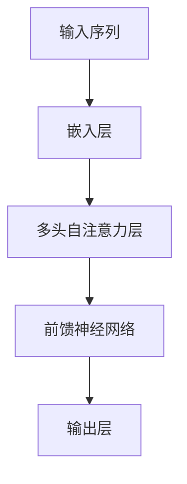
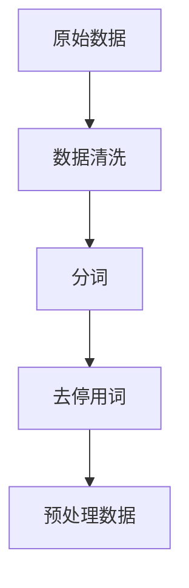

# 大语言模型原理基础与前沿 能源消耗和温室气体排放

## 1.背景介绍

### 1.1 大语言模型的兴起

大语言模型（Large Language Models, LLMs）近年来在自然语言处理（NLP）领域取得了显著的进展。自从OpenAI发布了GPT系列模型以来，LLMs在文本生成、翻译、问答系统等多个应用场景中展现了强大的能力。这些模型通过大量的训练数据和复杂的神经网络架构，能够生成高质量的自然语言文本。

### 1.2 能源消耗与环境影响

然而，训练和运行这些大规模模型需要大量的计算资源，这直接导致了高昂的能源消耗和显著的温室气体排放。根据一些研究，训练一个大型的深度学习模型可能需要消耗数百兆瓦时的电力，相当于数百个家庭一年的用电量。这不仅增加了运营成本，还对环境产生了负面影响。

### 1.3 研究目的

本文旨在探讨大语言模型的原理基础与前沿技术，重点分析其在能源消耗和温室气体排放方面的影响。通过深入研究和实际案例分析，提供解决问题的方法和最佳实践，以期为读者提供实用的技术洞察。

## 2.核心概念与联系

### 2.1 大语言模型的基本结构

大语言模型通常基于Transformer架构，这种架构通过自注意力机制（Self-Attention Mechanism）来捕捉输入序列中的长距离依赖关系。以下是一个简化的Transformer架构的Mermaid流程图：



### 2.2 训练过程与计算资源

训练大语言模型通常需要大量的计算资源，包括高性能的GPU或TPU集群。训练过程涉及大量的矩阵运算和梯度下降优化，这些操作都需要消耗大量的电力。

### 2.3 能源消耗与温室气体排放的联系

能源消耗直接与温室气体排放相关。大多数数据中心依赖于传统的电力供应，而这些电力大部分来自化石燃料。每消耗一度电，都会产生相应的二氧化碳排放。因此，训练和运行大语言模型的能源消耗越高，其温室气体排放也越多。

## 3.核心算法原理具体操作步骤

### 3.1 数据预处理

在训练大语言模型之前，首先需要进行数据预处理。这包括数据清洗、分词、去停用词等步骤。以下是一个简单的数据预处理流程：



### 3.2 模型训练

模型训练是大语言模型开发的核心步骤。主要包括以下几个步骤：

1. **初始化参数**：随机初始化模型参数。
2. **前向传播**：计算模型的预测输出。
3. **计算损失**：根据预测输出和真实标签计算损失。
4. **反向传播**：计算梯度并更新模型参数。

### 3.3 模型优化

模型优化是通过调整模型参数来最小化损失函数的过程。常用的优化算法包括随机梯度下降（SGD）、Adam等。

### 3.4 模型评估

模型评估是通过验证集来评估模型的性能。常用的评估指标包括准确率、精确率、召回率等。

## 4.数学模型和公式详细讲解举例说明

### 4.1 自注意力机制

自注意力机制是Transformer架构的核心。其基本思想是通过计算输入序列中每个元素与其他元素的相关性来捕捉长距离依赖关系。自注意力机制的计算公式如下：

$$
\text{Attention}(Q, K, V) = \text{softmax}\left(\frac{QK^T}{\sqrt{d_k}}\right)V
$$

其中，$Q$、$K$、$V$分别表示查询矩阵、键矩阵和值矩阵，$d_k$表示键矩阵的维度。

### 4.2 损失函数

在训练大语言模型时，常用的损失函数是交叉熵损失函数。其计算公式如下：

$$
L = -\sum_{i=1}^{N} y_i \log(\hat{y}_i)
$$

其中，$y_i$表示真实标签，$\hat{y}_i$表示模型的预测概率。

### 4.3 梯度下降

梯度下降是优化模型参数的常用方法。其基本思想是通过计算损失函数的梯度来更新模型参数。梯度下降的更新公式如下：

$$
\theta = \theta - \eta \nabla_\theta L
$$

其中，$\theta$表示模型参数，$\eta$表示学习率，$L$表示损失函数。

## 5.项目实践：代码实例和详细解释说明

### 5.1 数据预处理代码示例

以下是一个简单的数据预处理代码示例，使用Python和NLTK库：

```python
import nltk
from nltk.corpus import stopwords
from nltk.tokenize import word_tokenize

# 下载停用词
nltk.download('stopwords')
nltk.download('punkt')

# 原始数据
text = "大语言模型在自然语言处理领域取得了显著的进展。"

# 分词
tokens = word_tokenize(text)

# 去停用词
filtered_tokens = [word for word in tokens if word not in stopwords.words('chinese')]

print(filtered_tokens)
```

### 5.2 模型训练代码示例

以下是一个简单的模型训练代码示例，使用PyTorch库：

```python
import torch
import torch.nn as nn
import torch.optim as optim

# 定义模型
class SimpleModel(nn.Module):
    def __init__(self, input_size, hidden_size, output_size):
        super(SimpleModel, self).__init__()
        self.fc1 = nn.Linear(input_size, hidden_size)
        self.relu = nn.ReLU()
        self.fc2 = nn.Linear(hidden_size, output_size)

    def forward(self, x):
        out = self.fc1(x)
        out = self.relu(out)
        out = self.fc2(out)
        return out

# 初始化模型、损失函数和优化器
model = SimpleModel(input_size=10, hidden_size=20, output_size=1)
criterion = nn.MSELoss()
optimizer = optim.SGD(model.parameters(), lr=0.01)

# 训练数据
inputs = torch.randn(100, 10)
targets = torch.randn(100, 1)

# 训练模型
for epoch in range(100):
    # 前向传播
    outputs = model(inputs)
    loss = criterion(outputs, targets)
    
    # 反向传播和优化
    optimizer.zero_grad()
    loss.backward()
    optimizer.step()
    
    if (epoch+1) % 10 == 0:
        print(f'Epoch [{epoch+1}/100], Loss: {loss.item():.4f}')
```

### 5.3 模型评估代码示例

以下是一个简单的模型评估代码示例，使用Scikit-learn库：

```python
from sklearn.metrics import mean_squared_error

# 预测
predictions = model(inputs).detach().numpy()

# 计算均方误差
mse = mean_squared_error(targets.numpy(), predictions)
print(f'Mean Squared Error: {mse:.4f}')
```

## 6.实际应用场景

### 6.1 文本生成

大语言模型在文本生成方面表现出色，可以用于自动撰写文章、生成对话等应用场景。例如，GPT-3可以生成高质量的新闻报道、技术文档等。

### 6.2 机器翻译

大语言模型在机器翻译方面也有广泛应用。通过训练多语言数据集，模型可以实现高质量的自动翻译，减少了人工翻译的工作量。

### 6.3 问答系统

大语言模型可以用于构建智能问答系统，提供自动化的客户服务和技术支持。例如，许多企业已经开始使用基于大语言模型的聊天机器人来处理客户查询。

### 6.4 情感分析

大语言模型还可以用于情感分析，帮助企业了解客户的情感倾向，从而改进产品和服务。例如，通过分析社交媒体上的评论，企业可以了解客户对产品的满意度。

## 7.工具和资源推荐

### 7.1 开源框架

- **TensorFlow**：一个广泛使用的深度学习框架，支持大规模模型训练和部署。
- **PyTorch**：一个灵活且易于使用的深度学习框架，广泛应用于研究和生产环境。
- **Hugging Face Transformers**：一个专注于NLP任务的开源库，提供了多种预训练的大语言模型。

### 7.2 数据集

- **Common Crawl**：一个包含大量网页数据的开源数据集，常用于训练大语言模型。
- **Wikipedia**：一个包含丰富知识的开源数据集，适用于多种NLP任务。
- **OpenWebText**：一个高质量的开源文本数据集，专为训练大语言模型设计。

### 7.3 计算资源

- **Google Colab**：一个免费的在线Jupyter笔记本环境，提供GPU支持，适合小规模模型训练。
- **AWS EC2**：亚马逊提供的云计算服务，支持大规模模型训练和部署。
- **Google Cloud TPU**：谷歌提供的高性能计算资源，专为深度学习任务设计。

## 8.总结：未来发展趋势与挑战

### 8.1 未来发展趋势

随着计算资源的不断提升和算法的不断优化，大语言模型在未来将继续发展。以下是一些可能的趋势：

- **模型压缩与优化**：通过模型压缩和优化技术，减少模型的计算资源需求和能源消耗。
- **分布式训练**：通过分布式训练技术，提高模型训练的效率和速度。
- **多模态学习**：结合文本、图像、音频等多种模态的数据，提升模型的综合能力。

### 8.2 挑战与解决方案

尽管大语言模型在多个领域取得了显著进展，但仍面临一些挑战：

- **能源消耗与环境影响**：需要开发更加高效的算法和硬件，减少能源消耗和温室气体排放。
- **数据隐私与安全**：需要加强数据隐私和安全保护，防止数据泄露和滥用。
- **伦理与社会影响**：需要考虑大语言模型的伦理和社会影响，确保其应用符合社会价值观。

## 9.附录：常见问题与解答

### 9.1 大语言模型的训练需要多长时间？

训练大语言模型的时间取决于模型的规模和计算资源。一般来说，训练一个大型模型可能需要数周甚至数月的时间。

### 9.2 如何减少大语言模型的能源消耗？

可以通过以下几种方法减少大语言模型的能源消耗：

- 使用更加高效的算法和硬件。
- 采用模型压缩和优化技术。
- 利用可再生能源供电的数据中心。

### 9.3 大语言模型的应用有哪些风险？

大语言模型的应用可能带来以下风险：

- 数据隐私和安全风险。
- 伦理和社会影响风险。
- 模型偏见和歧视风险。

### 9.4 如何评估大语言模型的性能？

可以通过以下几种方法评估大语言模型的性能：

- 使用标准的评估指标，如准确率、精确率、召回率等。
- 通过实际应用场景进行测试和验证。
- 进行用户反馈和满意度调查。

---

作者：禅与计算机程序设计艺术 / Zen and the Art of Computer Programming