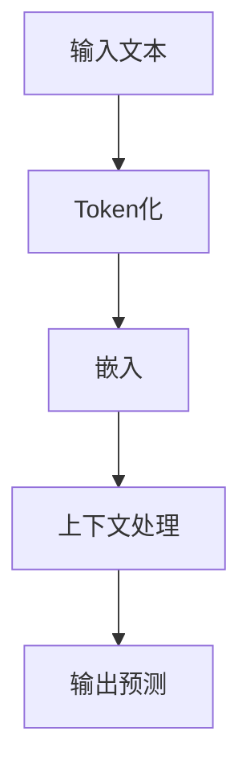

# 大语言模型应用指南：语言模型中的token

## 1.背景介绍

在自然语言处理（NLP）领域，语言模型（Language Model, LM）是一个核心组件。它们被广泛应用于各种任务，如机器翻译、文本生成、情感分析等。近年来，随着深度学习技术的发展，基于神经网络的语言模型（如GPT-3、BERT等）取得了显著的进展。这些模型的一个关键概念是“token”，它在模型的训练和推理过程中扮演了重要角色。

### 1.1 什么是Token

Token是语言模型处理文本的基本单位。它可以是一个单词、一个子词，甚至是一个字符。不同的语言模型可能采用不同的token化策略。例如，BERT使用的是WordPiece，GPT-3使用的是Byte Pair Encoding（BPE）。

### 1.2 Token的重要性

Token化的质量直接影响语言模型的性能。一个好的token化策略可以提高模型的训练效率和推理效果。反之，不合理的token化可能导致模型难以理解文本的语义结构，从而影响其性能。

### 1.3 文章结构

本文将深入探讨语言模型中的token概念，涵盖其核心算法原理、数学模型、实际应用场景等内容。通过详细的代码实例和解释，帮助读者更好地理解和应用这一关键技术。

## 2.核心概念与联系

### 2.1 Token化（Tokenization）

Token化是将文本分割成token的过程。常见的token化方法包括：

- **Word Tokenization**：将文本分割成单词。
- **Subword Tokenization**：将文本分割成子词单元，如BPE和WordPiece。
- **Character Tokenization**：将文本分割成字符。

### 2.2 Token与词汇表（Vocabulary）

词汇表是模型在训练和推理过程中使用的token集合。词汇表的大小和质量直接影响模型的性能。一个好的词汇表应当覆盖常见的词汇，同时避免过多的稀有词汇。

### 2.3 Token与嵌入（Embedding）

每个token在输入到模型之前都会被转换为一个向量，这个向量称为嵌入。嵌入是通过查找嵌入矩阵获得的，嵌入矩阵是模型训练过程中学习到的。

### 2.4 Token与上下文（Context）

语言模型通过上下文信息来预测下一个token或填补缺失的token。上下文信息可以是前面的token序列，也可以是双向的（如BERT）。

## 3.核心算法原理具体操作步骤

### 3.1 Token化算法

#### 3.1.1 Word Tokenization

Word Tokenization是最简单的token化方法，它将文本分割成单词。常用的工具有NLTK、Spacy等。

```python
import nltk
nltk.download('punkt')
from nltk.tokenize import word_tokenize

text = "Hello, world! This is a test."
tokens = word_tokenize(text)
print(tokens)
```

#### 3.1.2 Subword Tokenization

Subword Tokenization将文本分割成子词单元，常用的方法有BPE和WordPiece。

```python
from tokenizers import Tokenizer, models, pre_tokenizers, decoders, trainers

# Initialize a tokenizer
tokenizer = Tokenizer(models.BPE())

# Customize pre-tokenizer
tokenizer.pre_tokenizer = pre_tokenizers.Whitespace()

# Train the tokenizer
trainer = trainers.BpeTrainer(vocab_size=1000, min_frequency=2)
tokenizer.train(["path/to/text/file.txt"], trainer)

# Tokenize a text
output = tokenizer.encode("Hello, world! This is a test.")
print(output.tokens)
```

### 3.2 嵌入算法

嵌入算法将token转换为向量，常用的方法有Word2Vec、GloVe和BERT等。

```python
from transformers import BertTokenizer, BertModel
import torch

tokenizer = BertTokenizer.from_pretrained('bert-base-uncased')
model = BertModel.from_pretrained('bert-base-uncased')

text = "Hello, world! This is a test."
inputs = tokenizer(text, return_tensors="pt")
outputs = model(**inputs)

print(outputs.last_hidden_state)
```

### 3.3 上下文处理

上下文处理是语言模型的核心任务，常用的方法有RNN、LSTM、Transformer等。



## 4.数学模型和公式详细讲解举例说明

### 4.1 语言模型的数学定义

语言模型的目标是估计一个给定序列的概率。对于一个序列 $X = (x_1, x_2, ..., x_n)$，语言模型的目标是计算 $P(X)$。

$$
P(X) = P(x_1, x_2, ..., x_n) = \prod_{i=1}^{n} P(x_i | x_1, x_2, ..., x_{i-1})
$$

### 4.2 嵌入矩阵

嵌入矩阵 $E$ 是一个 $|V| \times d$ 的矩阵，其中 $|V|$ 是词汇表的大小，$d$ 是嵌入向量的维度。每个token $t$ 的嵌入向量 $e_t$ 是通过查找嵌入矩阵获得的。

$$
e_t = E[t]
$$

### 4.3 Transformer模型

Transformer模型是当前最先进的语言模型架构之一。它由多个编码器和解码器堆叠而成。每个编码器和解码器包含多头自注意力机制和前馈神经网络。

$$
\text{Attention}(Q, K, V) = \text{softmax}\left(\frac{QK^T}{\sqrt{d_k}}\right)V
$$

其中，$Q$、$K$、$V$ 分别是查询、键和值矩阵，$d_k$ 是键的维度。

## 5.项目实践：代码实例和详细解释说明

### 5.1 使用BERT进行文本分类

#### 5.1.1 数据准备

首先，我们需要准备训练数据。假设我们有一个情感分析的数据集，每条数据包含一个文本和一个标签。

```python
import pandas as pd

data = {
    "text": ["I love this movie!", "I hate this movie!"],
    "label": [1, 0]
}
df = pd.DataFrame(data)
```

#### 5.1.2 数据预处理

接下来，我们需要对文本进行token化，并将其转换为模型可以接受的格式。

```python
from transformers import BertTokenizer

tokenizer = BertTokenizer.from_pretrained('bert-base-uncased')

def preprocess(text):
    return tokenizer(text, padding='max_length', truncation=True, return_tensors="pt")

df['input'] = df['text'].apply(preprocess)
```

#### 5.1.3 模型训练

然后，我们可以使用BERT模型进行训练。

```python
from transformers import BertForSequenceClassification, Trainer, TrainingArguments

model = BertForSequenceClassification.from_pretrained('bert-base-uncased', num_labels=2)

training_args = TrainingArguments(
    output_dir='./results',
    num_train_epochs=3,
    per_device_train_batch_size=8,
    per_device_eval_batch_size=8,
    warmup_steps=500,
    weight_decay=0.01,
    logging_dir='./logs',
)

trainer = Trainer(
    model=model,
    args=training_args,
    train_dataset=df['input'],
    eval_dataset=df['input']
)

trainer.train()
```

### 5.2 模型评估

训练完成后，我们可以对模型进行评估。

```python
results = trainer.evaluate()
print(results)
```

## 6.实际应用场景

### 6.1 机器翻译

语言模型在机器翻译中扮演了重要角色。通过将源语言的文本token化并输入到模型中，模型可以生成目标语言的翻译结果。

### 6.2 文本生成

语言模型可以用于生成高质量的文本。例如，GPT-3可以生成新闻文章、故事、代码等。

### 6.3 情感分析

通过训练语言模型进行情感分析，可以自动识别文本中的情感倾向，如正面、负面或中性。

### 6.4 问答系统

语言模型可以用于构建智能问答系统，通过理解用户的问题并生成相应的答案。

## 7.工具和资源推荐

### 7.1 工具

- **Hugging Face Transformers**：一个强大的NLP库，支持多种预训练模型。
- **NLTK**：一个经典的NLP库，提供了丰富的文本处理工具。
- **Spacy**：一个高效的NLP库，适用于大规模文本处理。

### 7.2 资源

- **OpenAI GPT-3**：一个强大的预训练语言模型，支持多种NLP任务。
- **BERT**：一个双向编码器表示的预训练模型，广泛应用于各种NLP任务。
- **Word2Vec**：一个经典的词嵌入模型，适用于词向量的学习。

## 8.总结：未来发展趋势与挑战

### 8.1 发展趋势

- **更大的模型**：随着计算能力的提升，未来的语言模型将会越来越大，能够处理更复杂的任务。
- **多模态模型**：结合文本、图像、音频等多种模态的信息，提升模型的理解能力。
- **自监督学习**：通过自监督学习，模型可以在没有标注数据的情况下进行训练，提升其泛化能力。

### 8.2 挑战

- **计算资源**：训练和推理大型语言模型需要大量的计算资源，如何高效利用资源是一个重要挑战。
- **数据隐私**：在处理敏感数据时，如何保护用户隐私是一个重要问题。
- **模型解释性**：当前的语言模型是黑箱模型，如何提升其解释性是一个重要研究方向。

## 9.附录：常见问题与解答

### 9.1 什么是token？

Token是语言模型处理文本的基本单位，可以是单词、子词或字符。

### 9.2 为什么token化很重要？

Token化的质量直接影响语言模型的性能。好的token化策略可以提高模型的训练效率和推理效果。

### 9.3 如何选择合适的token化方法？

选择合适的token化方法取决于具体的应用场景和数据特点。一般来说，子词token化（如BPE、WordPiece）在大多数情况下表现较好。

### 9.4 语言模型的未来发展方向是什么？

未来的语言模型将会越来越大，能够处理更复杂的任务。同时，多模态模型和自监督学习也是重要的发展方向。

---

作者：禅与计算机程序设计艺术 / Zen and the Art of Computer Programming