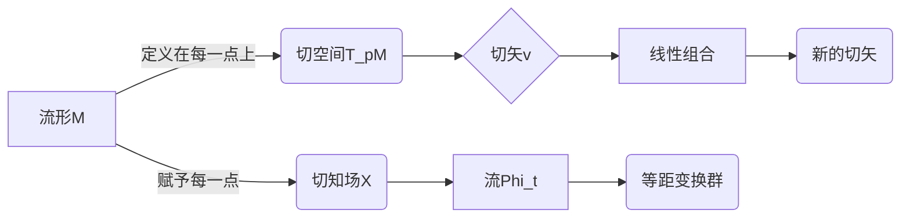

# 微分几何入门与广义相对论：切矢和切知场

## 1.背景介绍

微分几何是研究曲线、曲面和更高维流形的几何性质的数学分支。它是现代几何学的基础,并在广义相对论、量子场论、弦理论等物理学领域有着广泛的应用。切矢和切知场是微分几何中最基本和最重要的概念之一。

切矢描述了在流形上某一点的无穷小变化,而切知场则描述了整个流形上的无穷小变化。它们是研究微分流形内部几何结构的重要工具,是微分几何和广义相对论的核心概念。

## 2.核心概念与联系

### 2.1 流形(Manifold)

流形是现代微分几何的研究对象。一个n维流形可以看作是局部像n维欧几里得空间,但在整体上可能有很复杂的拓扑结构。

### 2.2 切矢(Tangent Vector)

切矢是定义在流形上某一点的有向无穷小矢量。对于每一点,都有无穷多个切矢,它们的集合构成了切空间(Tangent Space)。

### 2.3 切知场(Tangent Field/Vector Field)

切知场是在整个流形上赋予每一点一个切矢的知场。它描述了整个流形上的无穷小变化。

### 2.4 张量(Tensor)

张量是一种几何对象,它可以看作是在流形上的多线性映射。切矢和切知场都是最简单的张量。张量在微分几何和广义相对论中扮演着极其重要的角色。

### 2.5 余切空间(Cotangent Space)和余切知场(Cotangent Field)

余切空间和余切知场是切空间和切知场的对偶概念,它们描述了在流形上的线性泛函和知场。

## 3.核心算法原理具体操作步骤

### 3.1 切矢的定义和性质

在流形M上的一点p,我们可以定义切矢为:

$$
v=\sum_{i=1}^n v^i \frac{\partial}{\partial x^i}\Big|_p
$$

其中$\{x^i\}$是局部坐标系,而$\{v^i\}$是切矢在该坐标系下的分量。切矢具有以下性质:

1. 切矢是无穷小矢量,它描述了流形在该点的无穷小变化。
2. 切矢空间在每一点都是切向的,且与流形的内部几何结构有关。
3. 切矢可以通过仿射变换线性组合得到新的切矢。

### 3.2 切知场的定义和性质

切知场是一个赋予每个流形点一个切矢的知场:

$$
X=\sum_{i=1}^n X^i(x) \frac{\partial}{\partial x^i}
$$

其中$\{X^i(x)\}$是切知场在局部坐标系下的分量函数。切知场具有以下性质:

1. 切知场描述了整个流形上的无穷小变化。
2. 切知场可以通过仿射变换线性组合得到新的切知场。
3. 切知场的流(Flow)描述了沿着知场方向的变化。

### 3.3 李导数(Lie Derivative)

李导数是沿着一个切知场方向对张量知场进行微分的算子,是研究切知场和张量知场变化的重要工具。对于一个张量知场T和切知场X,李导数定义为:

$$
\mathcal{L}_X T = X(T) - \sum_{i,j} T(\cdots, [X,Y_i], \cdots)Y_j
$$

其中$[X,Y]$是X和Y的李括号,是切知场之间的一种乘积运算。李导数满足李导数公理,可以用于研究知场的变换规律。

### 3.4 生成矢量和等距变换群

对于一个切知场X,它诱导了一个流$\phi_t$,使得$\frac{d\phi_t}{dt}=X\circ\phi_t$。这个流对应了一个变换群,称为X生成的等距变换群。通过研究这个变换群,我们可以了解切知场描述的无穷小变化。



## 4.数学模型和公式详细讲解举例说明

### 4.1 流形的数学模型

一个n维流形M可以用若干个坐标卡片$\{(U_\alpha,\varphi_\alpha)\}$来描述,其中$U_\alpha$是M的一个开覆盖,而$\varphi_\alpha:U_\alpha\rightarrow\mathbb{R}^n$是坐标映射。在每个坐标卡片内部,流形局部像$\mathbb{R}^n$,但在卡片交界处需要过渡函数$\varphi_{\alpha\beta}=\varphi_\beta\circ\varphi_\alpha^{-1}$来衔接。

例如,2维球面$\mathbb{S}^2$可以用两个坐标卡片$(U_1,\varphi_1)$和$(U_2,\varphi_2)$来覆盖,其中:

$$
\begin{align*}
U_1&=\{(x,y,z)\in\mathbb{R}^3|z>0\},&\varphi_1(x,y,z)&=\left(\frac{x}{1+z},\frac{y}{1+z}\right)\\
U_2&=\{(x,y,z)\in\mathbb{R}^3|z<0\},&\varphi_2(x,y,z)&=\left(\frac{x}{1-z},\frac{y}{1-z}\right)
\end{align*}
$$

在$U_1\cap U_2$区域,过渡函数为:

$$
\varphi_{21}(u,v)=\left(\frac{u}{1+\sqrt{1-u^2-v^2}},\frac{v}{1+\sqrt{1-u^2-v^2}}\right)
$$

### 4.2 切矢和切知场的例子

在$\mathbb{R}^3$中,我们可以取$(x,y,z)$为标准坐标系,则基本切矢为:

$$
\frac{\partial}{\partial x},\frac{\partial}{\partial y},\frac{\partial}{\partial z}
$$

任何一个切矢都可以用它们的线性组合表示。例如,矢量$v=(1,2,3)$对应的切矢为:

$$
v=\frac{\partial}{\partial x}+2\frac{\partial}{\partial y}+3\frac{\partial}{\partial z}
$$

对于切知场,我们可以取旋转矢量场:

$$
X=y\frac{\partial}{\partial z}-z\frac{\partial}{\partial y}
$$

这个切知场描述了$\mathbb{R}^3$中绕z轴的无穷小旋转。

### 4.3 张量的例子

在$\mathbb{R}^n$中,我们有基本切矢$\{\partial/\partial x^i\}$和对偶基$\{dx^i\}$。任何一个(0,2)型张量都可以用它们的线性组合表示:

$$
T=\sum_{i,j}T_{ij}dx^i\otimes dx^j
$$

例如,标准欧几里得度规张量可以写为:

$$
g=\sum_{i=1}^n(dx^i)^2
$$

在曲面上,度规张量的形式会更加复杂。对于单位2维球面,其度规张量为:

$$
g=\frac{1}{(1+z^2)^2}(dx^2+dy^2)
$$

### 4.4 李导数和生成矢量场的例子

对于切知场$X=y\partial/\partial z-z\partial/\partial y$,它生成的流为:

$$
\phi_t(x,y,z)=(x\cos t-y\sin t,x\sin t+y\cos t,z)
$$

该流诱导了绕z轴旋转的等距变换群。我们可以计算李导数:

$$
\begin{align*}
\mathcal{L}_Xx&=X(x)=0\\
\mathcal{L}_Xy&=X(y)=z\\
\mathcal{L}_Xz&=X(z)=-y
\end{align*}
$$

这说明了x是不变量,而y和z的变化速率正是绕z轴旋转的切矢。

## 5.项目实践：代码实例和详细解释说明

为了更好地理解切矢和切知场的概念,我们可以通过编程来模拟和可视化它们。以下是一个使用Python和Matplotlib库的示例代码,用于可视化2维平面上的切矢场和切知场。

```python
import numpy as np
import matplotlib.pyplot as plt

# 定义流形为2维平面
x, y = np.meshgrid(np.linspace(-2, 2, 21), np.linspace(-2, 2, 21))

# 定义一个切矢场
vx = x
vy = y

# 定义一个切知场
ux = y
uy = -x

# 绘制切矢场
fig, ax = plt.subplots()
ax.quiver(x, y, vx, vy)
ax.set_title('Tangent Vector Field')
ax.set_xlabel('x')
ax.set_ylabel('y')
ax.axis('equal')

# 绘制切知场
fig, ax = plt.subplots()
ax.quiver(x, y, ux, uy)
ax.set_title('Tangent Field')
ax.set_xlabel('x')
ax.set_ylabel('y')
ax.axis('equal')

plt.show()
```

在这个示例中,我们首先定义了一个2维平面作为流形。然后,我们定义了一个切矢场`(vx, vy)`和一个切知场`(ux, uy)`。

对于切矢场,我们选择了`vx = x`和`vy = y`,这描述了一个从原点发出的矢量场。

对于切知场,我们选择了`ux = y`和`uy = -x`,这描述了一个绕原点旋转的矢量场。

接下来,我们使用Matplotlib的`quiver`函数分别绘制了这两个矢量场。`quiver`函数可以根据给定的网格点和矢量值绘制矢量场。

最后,我们调整了图形的标题、坐标轴标签和纵横比,以获得更好的可视化效果。

运行这段代码后,你将看到两个窗口,分别显示了切矢场和切知场的可视化结果。通过观察这些矢量场,你可以更好地理解它们描述的无穷小变化。

## 6.实际应用场景

切矢和切知场在许多领域都有重要应用,尤其是在广义相对论、流体力学、电磁学和计算机图形学等领域。以下是一些典型的应用场景:

### 6.1 广义相对论

在广义相对论中,时空被描述为一个4维流形,切矢和切知场用于描述物体在时空中的运动和引力场的性质。例如,测地线方程描述了物体在引力场中的运动轨迹,而引力场本身可以用Ricci张量和Einstein张量来表示,这些都需要使用切矢和切知场的概念。

### 6.2 流体力学

在流体力学中,切知场常被用来描述流体的运动。流体的速度场就是一个切知场,而流体的涡旋和散度等性质可以用切知场的散度和旋度来表示。此外,流体力学中的许多基本定律,如连续性方程和Navier-Stokes方程,都可以用切知场的语言来表达。

### 6.3 电磁学

在电磁学中,电场和磁场都可以用切知场来描述。例如,电场强度就是一个切知场,而磁感应强度也可以看作是一个伪切知场(Pseudo-Vector Field)。利用切知场的概念,我们可以方便地研究电磁场的性质和电磁感应定律。

### 6.4 计算机图形学

在计算机图形学中,切矢和切知场被广泛应用于曲面建模、纹理映射和流形学习等领域。例如,在曲面建模中,切矢和切知场可以用于描述曲面的局部几何性质,从而实现光滑细分和细化操作。在纹理映射中,切知场可以用于指导纹理的变形和扭曲。而在流形学习中,切知场可以用于表示流形上的无穷小变化,从而实现流形的插值和外推。

## 7.工具和资源推荐

如果你想进一步学习和研究切矢、切知场和微分几何,以下是一些推荐的工具和资源:

### 7.1 数学软件

- Mathematica: 一款强大的符号计算软件,可以方便地进行微分几何