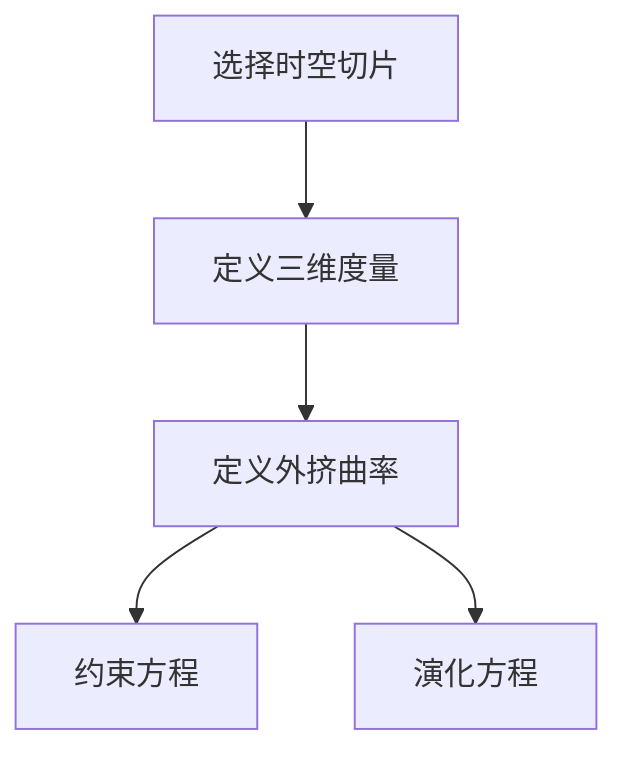

# 微分几何入门与广义相对论：哈氏理论离不开3+1分解

## 1.背景介绍

微分几何和广义相对论是现代物理学和数学中两个重要的领域。微分几何提供了研究曲面和流形的工具，而广义相对论则是爱因斯坦提出的描述引力的理论。哈氏理论（ADM分解）是广义相对论中的一个重要方法，它通过3+1分解将时空分解为空间和时间，从而简化了广义相对论的方程。

### 1.1 微分几何的基本概念

微分几何是研究曲面和流形的数学分支。它使用微积分和线性代数的工具来研究几何对象的性质。微分几何的基本概念包括流形、切空间、联络和曲率。

### 1.2 广义相对论的基本概念

广义相对论是爱因斯坦在1915年提出的理论，它描述了引力作为时空的弯曲。广义相对论的基本方程是爱因斯坦场方程，它描述了时空的几何与物质和能量的分布之间的关系。

### 1.3 哈氏理论的背景

哈氏理论（ADM分解）是由阿恩诺德·哈氏（Richard Arnowitt）、斯坦利·德赛尔（Stanley Deser）和查尔斯·米斯纳（Charles Misner）在20世纪50年代末提出的。它通过将时空分解为空间和时间，从而将广义相对论的方程简化为一组约束方程和演化方程。

## 2.核心概念与联系

### 2.1 流形与时空

在微分几何中，流形是一个局部类似于欧几里得空间的拓扑空间。广义相对论中的时空可以看作是一个四维流形，其中每一点都可以用四个坐标来描述。

### 2.2 切空间与四维时空

切空间是流形上每一点的局部线性近似。在广义相对论中，切空间对应于时空中每一点的局部惯性参考系。

### 2.3 联络与曲率

联络是描述流形上平行移动的工具，而曲率则是描述流形弯曲程度的量。在广义相对论中，联络和曲率对应于引力场的几何性质。

### 2.4 3+1分解的基本思想

3+1分解是将四维时空分解为三维空间和一维时间的过程。通过这种分解，可以将广义相对论的方程简化为一组约束方程和演化方程，从而更容易求解。

## 3.核心算法原理具体操作步骤

### 3.1 选择时空切片

首先，需要选择一个时空切片，即一个三维空间超曲面。这个超曲面可以看作是一个瞬时的空间状态。

### 3.2 定义三维度量

在选定的时空切片上，定义一个三维度量 $h_{ij}$，它描述了三维空间的几何性质。

### 3.3 定义外挤曲率

外挤曲率 $K_{ij}$ 描述了时空切片在四维时空中的嵌入方式。它反映了三维空间在时间方向上的变化。

### 3.4 约束方程和演化方程

通过3+1分解，可以将爱因斯坦场方程分解为一组约束方程和演化方程。约束方程描述了三维空间的几何性质，而演化方程描述了三维空间在时间方向上的变化。



## 4.数学模型和公式详细讲解举例说明

### 4.1 四维时空度量

在广义相对论中，四维时空的度量可以表示为
$$
ds^2 = g_{\mu\nu} dx^\mu dx^\nu
$$
其中 $g_{\mu\nu}$ 是四维度量张量。

### 4.2 3+1分解的度量

通过3+1分解，四维度量可以表示为
$$
ds^2 = -\alpha^2 dt^2 + h_{ij} (dx^i + \beta^i dt)(dx^j + \beta^j dt)
$$
其中 $\alpha$ 是称为拉普斯函数的标量，$\beta^i$ 是称为移位向量的三维向量，$h_{ij}$ 是三维度量张量。

### 4.3 约束方程

约束方程包括哈密顿约束和动量约束。哈密顿约束方程为
$$
R + K^2 - K_{ij} K^{ij} = 16 \pi G \rho
$$
其中 $R$ 是三维空间的标量曲率，$K$ 是外挤曲率的迹，$\rho$ 是能量密度。

动量约束方程为
$$
\nabla_j (K^{ij} - h^{ij} K) = 8 \pi G J^i
$$
其中 $\nabla_j$ 是三维空间的协变导数，$J^i$ 是动量密度。

### 4.4 演化方程

演化方程描述了三维度量和外挤曲率在时间方向上的变化。三维度量的演化方程为
$$
\partial_t h_{ij} = -2 \alpha K_{ij} + \nabla_i \beta_j + \nabla_j \beta_i
$$

外挤曲率的演化方程为
$$
\partial_t K_{ij} = -\nabla_i \nabla_j \alpha + \alpha (R_{ij} + K K_{ij} - 2 K_{ik} K^k_j) + \beta^k \nabla_k K_{ij} + K_{ik} \nabla_j \beta^k + K_{jk} \nabla_i \beta^k
$$

## 5.项目实践：代码实例和详细解释说明

### 5.1 选择编程语言和工具

在实际项目中，我们可以使用Python和NumPy库来实现3+1分解的算法。NumPy提供了强大的数值计算功能，可以方便地进行矩阵和张量的运算。

### 5.2 定义三维度量和外挤曲率

首先，我们需要定义三维度量和外挤曲率。以下是一个简单的示例代码：

```python
import numpy as np

# 定义三维度量
h = np.array([[1, 0, 0],
              [0, 1, 0],
              [0, 0, 1]])

# 定义外挤曲率
K = np.array([[0, 0, 0],
              [0, 0, 0],
              [0, 0, 0]])
```

### 5.3 计算约束方程

接下来，我们需要计算约束方程。以下是计算哈密顿约束的示例代码：

```python
# 计算三维空间的标量曲率
R = np.trace(np.linalg.inv(h) @ K @ K) - np.trace(K) ** 2

# 计算哈密顿约束
rho = 0  # 假设能量密度为0
H = R + np.trace(K) ** 2 - np.trace(K @ K) - 16 * np.pi * rho
print("哈密顿约束:", H)
```

### 5.4 计算演化方程

最后，我们需要计算演化方程。以下是计算三维度量演化方程的示例代码：

```python
# 定义拉普斯函数和移位向量
alpha = 1
beta = np.array([0, 0, 0])

# 计算三维度量的演化方程
partial_t_h = -2 * alpha * K + np.outer(beta, np.ones(3)) + np.outer(np.ones(3), beta)
print("三维度量的演化方程:", partial_t_h)
```

## 6.实际应用场景

### 6.1 黑洞模拟

3+1分解在黑洞模拟中有广泛的应用。通过将时空分解为空间和时间，可以更容易地模拟黑洞的形成和演化。

### 6.2 宇宙学模拟

在宇宙学中，3+1分解可以用于模拟宇宙的膨胀和结构形成。通过将宇宙分解为空间和时间，可以更容易地研究宇宙的演化。

### 6.3 引力波研究

3+1分解在引力波研究中也有重要应用。通过将时空分解为空间和时间，可以更容易地模拟引力波的传播和探测。

## 7.工具和资源推荐

### 7.1 Python和NumPy

Python是一种强大的编程语言，NumPy是Python的一个强大的数值计算库。它们可以用于实现3+1分解的算法。

### 7.2 GRChombo

GRChombo是一个用于广义相对论数值模拟的开源软件。它提供了实现3+1分解的工具和算法，可以用于黑洞和宇宙学的模拟。

### 7.3 Einstein Toolkit

Einstein Toolkit是一个用于广义相对论数值模拟的开源软件框架。它提供了实现3+1分解的工具和算法，可以用于引力波和黑洞的研究。

## 8.总结：未来发展趋势与挑战

### 8.1 未来发展趋势

随着计算能力的提高和数值算法的发展，3+1分解在广义相对论中的应用将会越来越广泛。未来，3+1分解可能会在黑洞、宇宙学和引力波研究中发挥更重要的作用。

### 8.2 挑战

尽管3+1分解在广义相对论中有广泛的应用，但它也面临一些挑战。例如，如何处理奇点和边界条件是一个重要的问题。此外，如何提高数值算法的精度和稳定性也是一个需要解决的难题。

## 9.附录：常见问题与解答

### 9.1 什么是3+1分解？

3+1分解是将四维时空分解为三维空间和一维时间的过程。通过这种分解，可以将广义相对论的方程简化为一组约束方程和演化方程。

### 9.2 3+1分解的应用有哪些？

3+1分解在黑洞模拟、宇宙学模拟和引力波研究中有广泛的应用。通过将时空分解为空间和时间，可以更容易地模拟和研究这些现象。

### 9.3 如何实现3+1分解的算法？

可以使用Python和NumPy库来实现3+1分解的算法。首先需要定义三维度量和外挤曲率，然后计算约束方程和演化方程。

### 9.4 3+1分解的未来发展趋势是什么？

随着计算能力的提高和数值算法的发展，3+1分解在广义相对论中的应用将会越来越广泛。未来，3+1分解可能会在黑洞、宇宙学和引力波研究中发挥更重要的作用。

---

作者：禅与计算机程序设计艺术 / Zen and the Art of Computer Programming