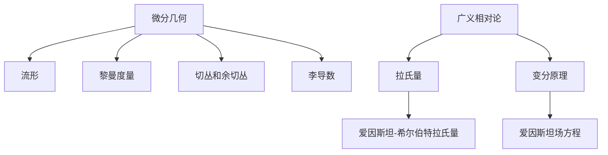
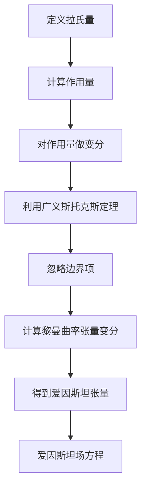

# 微分几何入门与广义相对论：拉氏理论

## 1.背景介绍

微分几何是研究微分流形及其上的各种几何结构的数学分支。它在物理学中有着广泛的应用,特别是在相对论理论中扮演着核心角色。广义相对论是爱因斯坦于1915年提出的引力理论,描述了时空的本质以及物质对时空的曲率影响。拉氏理论(Lagrangian Theory)是广义相对论的数学基础,它通过变分原理推导出广义相对论场方程。

## 2.核心概念与联系

### 2.1 流形(Manifold)

流形是微分几何研究的基本对象。一个n维流形是一个局部像n维欧几里得空间的拓扑空间,并且在每一点都有切空间的结构。流形提供了一种描述时空连续性的数学工具。

### 2.2 黎曼度量(Riemannian Metric)

黎曼度量定义了流形上的内积结构,从而引入了长度和角度的概念。它是描述时空几何性质的关键工具。在广义相对论中,黎曼度量描述了时空的曲率,并被引力场方程确定。

### 2.3 切丛和余切丛(Tangent and Cotangent Bundles)

切丛是所有切向量构成的丛空间,而余切丛是所有余切向量构成的丛空间。它们为流形上的向量场和微分形式提供了数学描述。在广义相对论中,切丛和余切丛用于描述时空中的物理量如能量动量张量。

### 2.4 李导数(Lie Derivative)

李导数是一种测量在流形上沿着向量场做平移时,张量场是如何变化的工具。它在研究广义相对论中的物理量的协变性时扮演着重要角色。

### 2.5 拉氏量(Lagrangian)

拉氏量是一个定义在切丛上的函数,它描述了物理系统的动力学。在广义相对论中,爱因斯坦-希尔伯特拉氏量描述了时空曲率和物质场的相互作用。

### 2.6 变分原理(Variational Principle)

变分原理是基于拉氏量的最小作用量原理,通过求解拉氏量的极值来推导出运动方程。在广义相对论中,它导出了著名的爱因斯坦场方程。



## 3.核心算法原理具体操作步骤

### 3.1 拉氏量的变分原理

拉氏量的变分原理是推导广义相对论场方程的核心。具体步骤如下:

1) 定义拉氏量 $\mathcr{L}$,通常为黎曼曲率标量 $R$ 与物质场的拉氏量之和:

$$\mathscr{L} = \frac{1}{16\pi G}R + \mathscr{L}_\text{matter}$$

2) 计算作用量 $S$,即拉氏量在整个时空区域的积分:

$$S = \int_\mathcr{M} \mathscr{L} \sqrt{-g} d^4 x$$

3) 对作用量 $S$ 做变分,得到 $\delta S = 0$,这就是最小作用量原理。

4) 利用广义斯托克斯定理,将体积积分化为边界积分:

$$\delta S = \frac{1}{16\pi G}\int_\mathscr{M} \delta R \sqrt{-g} d^4x + \text{边界项}$$

5) 由于变分过程中,边界项可以被忽略,因此只需考虑体积积分项。

6) 通过一系列复杂的计算,可以得到:

$$\delta R = G_{\mu\nu}\delta g^{\mu\nu}$$

其中 $G_{\mu\nu}$ 是著名的爱因斯坦张量。

7) 将上式代入作用量的变分公式,并令 $\delta S = 0$,就可以得到广义相对论的核心方程:

$$G_{\mu\nu} = 8\pi G T_{\mu\nu}$$

这就是著名的爱因斯坦场方程,描述了物质是如何决定时空曲率的。

### 3.2 算法流程图



## 4.数学模型和公式详细讲解举例说明

### 4.1 黎曼曲率张量

黎曼曲率张量 $R^\rho{}_{\sigma\mu\nu}$ 描述了流形上的曲率,是微分几何的核心概念。它可以由仿射连接系数 $\Gamma^\rho_{\mu\nu}$ 计算得到:

$$R^\rho{}_{\sigma\mu\nu} = \partial_\mu\Gamma^\rho_{\nu\sigma} - \partial_\nu\Gamma^\rho_{\mu\sigma} + \Gamma^\rho_{\mu\lambda}\Gamma^\lambda_{\nu\sigma} - \Gamma^\rho_{\nu\lambda}\Gamma^\lambda_{\mu\sigma}$$

曲率张量具有一些代数性质,如反对称性、循环恒等式等,这些性质在计算中非常有用。

### 4.2 黎曼曲率标量

黎曼曲率标量 $R$ 是由黎曼曲率张量按某种方式合同得到的标量,它描述了整个流形的总曲率:

$$R = g^{\mu\nu}R_{\mu\nu}$$

其中 $R_{\mu\nu}$ 是黎曼曲率张量的迹,称为黎曼曲率张量。在广义相对论中,曲率标量就是拉氏量的一部分。

### 4.3 爱因斯坦张量

爱因斯坦张量 $G_{\mu\nu}$ 是由黎曼曲率张量以及度规张量 $g_{\mu\nu}$ 构成的,描述了时空的曲率:

$$G_{\mu\nu} = R_{\mu\nu} - \frac{1}{2}g_{\mu\nu}R$$

爱因斯坦张量是爱因斯坦场方程的左边项,与能量动量张量 $T_{\mu\nu}$ 相对应。它满足张量的协变性和保证方程在任何坐标系下都成立。

### 4.4 爱因斯坦场方程

爱因斯坦场方程是广义相对论的核心方程:

$$G_{\mu\nu} = 8\pi G T_{\mu\nu}$$

它描述了时空曲率(左边项)与物质分布(右边项)之间的关系。这个方程展示了物质是如何决定时空几何的,同时也说明了时空几何是如何影响物质的运动的。

### 4.5 实例:球对称黑洞

考虑一个球对称静态黑洞,其度规可以写为:

$$ds^2 = -\left(1-\frac{2GM}{r}\right)dt^2 + \left(1-\frac{2GM}{r}\right)^{-1}dr^2 + r^2d\Omega^2$$

其中 $M$ 是黑洞质量, $d\Omega^2$ 是单位球面的线元。将这个度规代入爱因斯坦方程,可以求解出黑洞的各种性质,如事件视界半径、奇点处的曲率等。

## 5.项目实践:代码实例和详细解释说明

为了计算广义相对论中的一些物理量,我们可以利用计算机代数系统如Mathematica或Python中的SymPy库。以下是一个使用SymPy计算黎曼曲率张量的示例:

```python
import sympy as sp 

# 定义坐标和度规张量
coords = sp.symbols('t x y z')
g = sp.diag(-1, 1, 1, 1).tolist()

# 定义仿射连接
G = sp.matrices.zeros(4, 4, 4)

# 计算黎曼曲率张量
R = sp.matrices.zeros(4, 4, 4, 4)
for mu in range(4):
    for nu in range(4):
        for rho in range(4):
            for sigma in range(4):
                R[mu, nu, rho, sigma] = sp.simplify(
                    sp.diff(G[rho, sigma, nu], coords[mu]) 
                    - sp.diff(G[rho, sigma, mu], coords[nu])
                    + sum(G[lam, sigma, nu] * G[rho, lam, mu] 
                          - G[lam, sigma, mu] * G[rho, lam, nu] 
                          for lam in range(4))
                )

print(R)
```

这段代码首先定义了坐标和度规张量,然后计算了仿射连接系数(这里为0,因为是平直空间)。接下来,它利用黎曼曲率张量的定义公式,通过求导和代数运算计算出了曲率张量的各个分量。

输出结果为一个4x4x4x4的张量,其中大部分分量都为0(因为是平直空间)。这个例子展示了如何使用符号计算工具来处理广义相对论中的复杂数学对象。

## 6.实际应用场景

微分几何和广义相对论的理论在许多领域都有着广泛的应用,包括:

1. **宇宙学**:广义相对论描述了宇宙的起源、演化和最终命运,是现代宇宙学的理论基础。

2. **黑洞物理学**:黑洞是广义相对论最引人注目的预言之一,对黑洞的研究有助于检验和深化对引力的理解。

3. **引力波探测**:广义相对论预言了引力波的存在,最近的引力波探测标志着一个新的天文学时代的到来。

4. **导航和测量**:GPS系统中需要考虑相对论效应,微分几何提供了必要的数学工具。

5. **粒子物理学**:规范场论和弦理论都需要借助微分几何的语言和概念。

6. **计算机图形学**:微分几何在曲面建模、动画等领域有着广泛应用。

总的来说,微分几何和广义相对论不仅在基础物理学研究中扮演着核心角色,而且对于工程技术的发展也有着深远的影响。

## 7.工具和资源推荐

对于想要深入学习微分几何和广义相对论的读者,以下是一些推荐的工具和资源:

1. **教材**:
   - 《几何学基础》(Foundations of Geometry)by Michael Spivak
   - 《广义相对论原理》(The Principle of General Relativity)by Ludvigsen
   - 《引力场与几何》(Gravitation and Geometry)by Ludvigsen and Vickers

2. **在线课程**:
   - MIT公开课程:General Relativity
   - 斯坦福在线课程:General Relativity

3. **计算工具**:
   - Mathematica
   - Python中的SymPy库
   - Maple
   - GRTensorII

4. **学术期刊**:
   - Classical and Quantum Gravity
   - General Relativity and Gravitation
   - Journal of Geometry and Physics

5. **在线社区**:
   - Physics Stack Exchange
   - Geometric Algebra Forums
   - Usenet物理学新闻组

利用这些资源,读者可以系统地学习微分几何和广义相对论的基础知识,并跟上该领域的最新研究进展。

## 8.总结:未来发展趋势与挑战

虽然广义相对论已成为现代物理学的基石,但它并不是一个完美无缺的理论。未来的发展趋势和挑战包括:

1. **量子化引力**:将量子力学和广义相对论统一是当代理论物理学最大的难题之一。寻找量子引力的理论是一个长期的目标。

2. **奇点和宇宙学奇点**:广义相对论在奇点处会发生破裂,需要一个更基本的理论来解决这个问题。理解宇宙奇点的性质也是一个巨大的挑战。

3. **实验检验**:虽然广义相对论在太阳系范围内已得到精确验证,但在更大尺度上仍有待进一步检验,如通过引力波天文学。

4. **数值相对论**:发展更精确、高效的数值算法来模拟