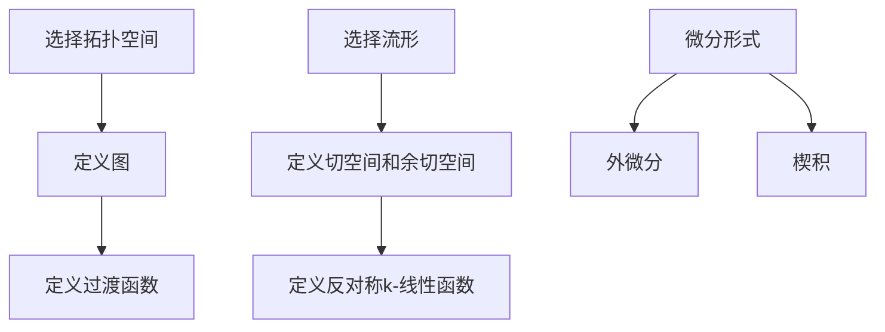

# 流形拓扑学理论与概念的实质：Rn中的微分形式

## 1.背景介绍

流形拓扑学是现代数学和物理学中的一个重要分支，它研究的是高维空间中的几何结构和拓扑性质。流形是一个局部类似于欧几里得空间的空间，而微分形式是流形上的一种重要工具，用于描述流形上的微分结构。本文将深入探讨流形拓扑学中的核心概念，特别是Rn中的微分形式，并通过实际示例和代码实例帮助读者理解这些复杂的数学概念。

## 2.核心概念与联系

### 2.1 流形的定义

流形是一个局部类似于欧几里得空间的空间。具体来说，一个n维流形是一个拓扑空间，其中每一点都有一个邻域同胚于n维欧几里得空间。流形的定义可以通过图和过渡函数来形式化。

### 2.2 微分形式的定义

微分形式是流形上的一种几何对象，用于描述流形上的微分结构。一个k-形式是一个反对称的k-线性函数，它将k个切向量映射到实数。微分形式在流形上的积分和微分运算中起着关键作用。

### 2.3 流形与微分形式的联系

流形和微分形式之间的联系可以通过切空间和余切空间来理解。切空间是流形上每一点的切向量的集合，而余切空间是切空间的对偶空间。微分形式是余切空间上的函数，它们可以在流形上进行积分和微分运算。

## 3.核心算法原理具体操作步骤

### 3.1 流形的构造

构造一个流形通常需要以下步骤：

1. 选择一个拓扑空间。
2. 定义一个覆盖该空间的图。
3. 定义图之间的过渡函数。

### 3.2 微分形式的构造

构造一个微分形式通常需要以下步骤：

1. 选择一个流形。
2. 定义流形上的切空间和余切空间。
3. 定义一个反对称的k-线性函数。

### 3.3 微分形式的运算

微分形式的运算包括外微分和楔积。外微分是一个将k-形式映射到(k+1)-形式的运算，而楔积是一个将两个微分形式结合成一个新的微分形式的运算。



## 4.数学模型和公式详细讲解举例说明

### 4.1 流形的数学模型

一个n维流形M可以表示为一个拓扑空间和一个图的集合 $\{(U_i, \phi_i)\}$，其中 $U_i$ 是M的一个开集，$\phi_i: U_i \to \mathbb{R}^n$ 是一个同胚。

### 4.2 微分形式的数学模型

一个k-形式 $\omega$ 是一个反对称的k-线性函数 $\omega: T_pM \times \cdots \times T_pM \to \mathbb{R}$，其中 $T_pM$ 是流形M在点p处的切空间。

### 4.3 外微分和楔积的公式

外微分 $d\omega$ 是一个将k-形式 $\omega$ 映射到(k+1)-形式的运算，定义为：

$$
d\omega(X_0, \ldots, X_k) = \sum_{i=0}^k (-1)^i X_i \omega(X_0, \ldots, \hat{X_i}, \ldots, X_k) + \sum_{0 \leq i < j \leq k} (-1)^{i+j} \omega([X_i, X_j], X_0, \ldots, \hat{X_i}, \ldots, \hat{X_j}, \ldots, X_k)
$$

楔积 $\omega \wedge \eta$ 是一个将两个微分形式 $\omega$ 和 $\eta$ 结合成一个新的微分形式的运算，定义为：

$$
(\omega \wedge \eta)(X_1, \ldots, X_{k+l}) = \frac{1}{k!l!} \sum_{\sigma \in S_{k+l}} \text{sgn}(\sigma) \omega(X_{\sigma(1)}, \ldots, X_{\sigma(k)}) \eta(X_{\sigma(k+1)}, \ldots, X_{\sigma(k+l)})
$$

## 5.项目实践：代码实例和详细解释说明

### 5.1 流形的Python实现

以下是一个简单的Python代码示例，用于构造一个二维流形：

```python
import numpy as np

class Manifold:
    def __init__(self, charts):
        self.charts = charts

    def add_chart(self, chart):
        self.charts.append(chart)

class Chart:
    def __init__(self, U, phi):
        self.U = U
        self.phi = phi

# 定义图
U1 = lambda x: x[0] > 0
phi1 = lambda x: np.log(x[0]), x[1]

U2 = lambda x: x[0] < 0
phi2 = lambda x: -np.log(-x[0]), x[1]

# 构造流形
charts = [Chart(U1, phi1), Chart(U2, phi2)]
manifold = Manifold(charts)
```

### 5.2 微分形式的Python实现

以下是一个简单的Python代码示例，用于构造一个微分形式：

```python
class DifferentialForm:
    def __init__(self, degree, func):
        self.degree = degree
        self.func = func

    def evaluate(self, *vectors):
        return self.func(*vectors)

# 定义一个1-形式
omega = DifferentialForm(1, lambda v: v[0] - v[1])

# 计算1-形式在向量(1, 2)处的值
value = omega.evaluate((1, 2))
print(value)  # 输出 -1
```

## 6.实际应用场景

### 6.1 物理学中的应用

微分形式在物理学中有广泛的应用，特别是在电磁学和广义相对论中。麦克斯韦方程组可以用微分形式的语言来简洁地表示，而广义相对论中的爱因斯坦场方程也可以用微分形式来描述。

### 6.2 数据科学中的应用

在数据科学中，流形学习是一种用于降维和数据表示的方法。流形学习假设高维数据实际上位于一个低维流形上，通过学习这个流形的结构，可以实现数据的降维和特征提取。

### 6.3 计算机图形学中的应用

在计算机图形学中，流形和微分形式用于描述和处理曲面和形状。流形上的微分形式可以用于计算曲面的曲率和其他几何性质，从而实现高质量的图形渲染和形状分析。

## 7.工具和资源推荐

### 7.1 数学软件

- **Mathematica**：一个强大的数学软件，支持流形和微分形式的计算。
- **Maple**：另一个流行的数学软件，提供丰富的符号计算功能。

### 7.2 编程库

- **SymPy**：一个Python库，用于符号数学计算，支持微分形式的计算。
- **SciPy**：一个Python库，提供科学计算功能，包括流形学习算法。

### 7.3 在线资源

- **arXiv**：一个开放获取的学术论文存档，包含大量关于流形和微分形式的研究论文。
- **Khan Academy**：一个在线教育平台，提供关于微分几何和拓扑学的课程。

## 8.总结：未来发展趋势与挑战

流形拓扑学和微分形式在现代数学和物理学中有着广泛的应用，未来的发展趋势包括：

- **高维流形的研究**：随着计算能力的提高，高维流形的研究将变得更加深入和广泛。
- **流形学习的应用**：在数据科学和机器学习中，流形学习将继续发挥重要作用，特别是在高维数据的降维和特征提取方面。
- **计算工具的改进**：随着数学软件和编程库的不断发展，流形和微分形式的计算将变得更加高效和便捷。

然而，流形拓扑学和微分形式的研究也面临一些挑战：

- **计算复杂性**：高维流形和微分形式的计算复杂性较高，需要高效的算法和计算工具。
- **理论与应用的结合**：将复杂的数学理论应用于实际问题需要跨学科的合作和深入的研究。

## 9.附录：常见问题与解答

### 9.1 什么是流形？

流形是一个局部类似于欧几里得空间的空间。具体来说，一个n维流形是一个拓扑空间，其中每一点都有一个邻域同胚于n维欧几里得空间。

### 9.2 什么是微分形式？

微分形式是流形上的一种几何对象，用于描述流形上的微分结构。一个k-形式是一个反对称的k-线性函数，它将k个切向量映射到实数。

### 9.3 流形和微分形式有什么联系？

流形和微分形式之间的联系可以通过切空间和余切空间来理解。切空间是流形上每一点的切向量的集合，而余切空间是切空间的对偶空间。微分形式是余切空间上的函数，它们可以在流形上进行积分和微分运算。

### 9.4 如何在Python中实现流形和微分形式？

可以使用Python中的类和函数来实现流形和微分形式。流形可以通过定义图和过渡函数来构造，而微分形式可以通过定义反对称的k-线性函数来构造。

### 9.5 流形和微分形式有哪些实际应用？

流形和微分形式在物理学、数据科学和计算机图形学中有广泛的应用。例如，麦克斯韦方程组和爱因斯坦场方程可以用微分形式来表示，流形学习可以用于数据降维和特征提取，而流形上的微分形式可以用于计算曲面的几何性质。

---

作者：禅与计算机程序设计艺术 / Zen and the Art of Computer Programming