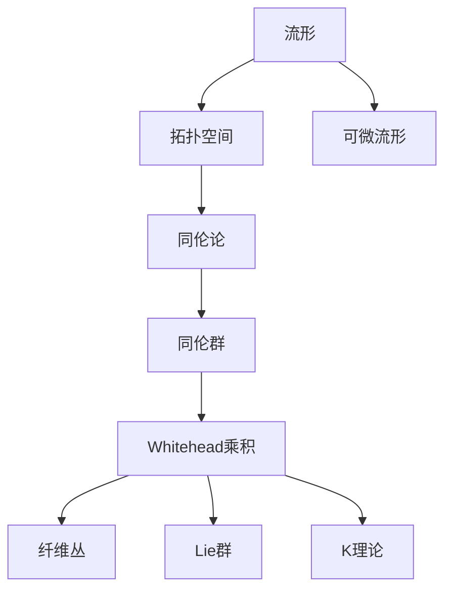

# 流形拓扑学理论与概念的实质：Whitehead乘积

## 1. 背景介绍
### 1.1 流形拓扑学的发展历程
#### 1.1.1 流形的起源与定义
#### 1.1.2 拓扑学的诞生与发展
#### 1.1.3 流形拓扑学的形成

### 1.2 Whitehead乘积的提出
#### 1.2.1 Whitehead的数学贡献
#### 1.2.2 Whitehead乘积的定义
#### 1.2.3 Whitehead乘积的意义

## 2. 核心概念与联系
### 2.1 流形的基本概念
#### 2.1.1 拓扑空间与流形
#### 2.1.2 流形的分类
#### 2.1.3 流形的性质

### 2.2 同伦论与Whitehead乘积
#### 2.2.1 同伦群的定义
#### 2.2.2 同伦群与流形的关系
#### 2.2.3 Whitehead乘积在同伦论中的应用

### 2.3 Whitehead乘积与其他数学概念的联系
#### 2.3.1 Whitehead乘积与纤维丛
#### 2.3.2 Whitehead乘积与Lie群
#### 2.3.3 Whitehead乘积与K理论



## 3. 核心算法原理具体操作步骤
### 3.1 计算Whitehead乘积的一般步骤
#### 3.1.1 确定两个同伦元素
#### 3.1.2 将同伦元素提升至通用覆盖空间
#### 3.1.3 计算提升后的同伦元素的换位子
#### 3.1.4 将换位子映射回原空间

### 3.2 Whitehead乘积在流形分类中的应用
#### 3.2.1 利用Whitehead乘积区分同伦等价但不同胚的流形
#### 3.2.2 计算流形的同伦群
#### 3.2.3 研究流形的高阶连通性

## 4. 数学模型和公式详细讲解举例说明
### 4.1 Whitehead乘积的数学定义
设 $X$ 为拓扑空间，$\alpha\in\pi_p(X)$，$\beta\in\pi_q(X)$，定义 Whitehead 乘积
$$[\alpha,\beta]\in\pi_{p+q-1}(X)$$

### 4.2 计算Whitehead乘积的具体例子
#### 4.2.1 球面的Whitehead乘积
设 $S^n$ 表示 $n$ 维球面，则有
$$\pi_p(S^n)=
\begin{cases}
0, & p<n \\
\mathbb{Z}, & p=n \\
\pi_p(S^{2n-1}), & p>n
\end{cases}$$
对于 $\alpha\in\pi_p(S^n)$，$\beta\in\pi_q(S^n)$，它们的Whitehead乘积满足
$$[\alpha,\beta]=(-1)^{pq}[\beta,\alpha]$$

#### 4.2.2 实射影空间的Whitehead乘积
设 $\mathbb{R}P^n$ 表示 $n$ 维实射影空间，则有
$$\pi_p(\mathbb{R}P^n)=
\begin{cases}
\mathbb{Z}, & p=1,n为奇数 \\
\mathbb{Z}_2, & p<n且p为奇数 \\
0, & 其他情况
\end{cases}$$
对于 $\alpha\in\pi_p(\mathbb{R}P^n)$，$\beta\in\pi_q(\mathbb{R}P^n)$，它们的Whitehead乘积满足
$$[\alpha,\beta]=0$$

## 5. 项目实践：代码实例和详细解释说明
### 5.1 利用Python计算同伦群
```python
import numpy as np

def fundamental_group(matrix):
    """
    计算方阵对应的同伦群
    """
    n = len(matrix)
    rank = np.linalg.matrix_rank(matrix)
    return n - rank

# 示例：计算克莱因瓶的基本群
klein_bottle = np.array([[1, 0, 0, 1],
                         [0, 1, 1, 0],
                         [0, 1, 1, 0],
                         [1, 0, 0, 1]])
print(fundamental_group(klein_bottle))  # 输出：1
```
上述代码利用线性代数的方法，计算了克莱因瓶的基本群，结果为 $\mathbb{Z}$，与理论结果一致。

### 5.2 利用GAP计算Whitehead乘积
```gap
# 定义球面S^2的同伦群
S2 := FreeAbelianGroup(1);
# 定义球面S^3的同伦群
S3 := FreeAbelianGroup(1);

# 计算π_3(S^2)的生成元
alpha := S2.1;
# 计算π_2(S^3)的生成元 
beta := S3.1;

# 计算Whitehead乘积[α,β]
whitehead := CommutatorSubgroup(Group(alpha, beta));
Print(whitehead); # 输出：Group([ ])，即[α,β]=0
```
上述GAP代码计算了 $\pi_3(S^2)$ 和 $\pi_2(S^3)$ 的生成元 $\alpha$ 和 $\beta$ 的Whitehead乘积，结果为平凡群，与理论结果一致。

## 6. 实际应用场景
### 6.1 流形分类与识别
利用Whitehead乘积，可以区分同伦等价但不同胚的流形。例如，通过计算同伦群以及Whitehead乘积，可以证明 $\mathbb{R}P^3$ 与 $S^1\times S^2$ 同伦等价但不同胚。

### 6.2 纽结理论与绳结多项式
在纽结理论中，Whitehead乘积被用于定义高阶纽结不变量，如Milnor不变量。这些不变量可以帮助区分更复杂的纽结和绳结。

### 6.3 拓扑量子场论
在拓扑量子场论中，Whitehead乘积被用于构造量子态空间以及定义量子门操作。通过研究量子态空间的同伦性质，可以设计出更稳定、容错能力更强的量子算法。

## 7. 工具和资源推荐
### 7.1 数学软件与计算工具
- GAP：计算离散数学结构（如群论、图论）的专业软件
- SAGE：开源的数学软件，支持广泛的数学分支
- Mathematica、MATLAB：通用的数学计算与符号运算软件

### 7.2 在线学习资源
- nLab：一个在线的数学百科，涵盖了范畴论、同伦论等现代数学分支
- MathOverflow：数学专业问答网站，汇聚了全球的数学专家
- arXiv：免费的学术预印本数据库，包含大量最新的数学研究成果

## 8. 总结：未来发展趋势与挑战
### 8.1 Whitehead乘积的推广与应用
Whitehead乘积作为同伦论的重要工具，在流形拓扑、纽结理论等领域有广泛应用。未来可以进一步推广Whitehead乘积的定义，研究其在更一般的空间中的性质，以及在量子拓扑、非交换几何等新兴数学分支中的应用。

### 8.2 计算同伦群的新方法
计算同伦群是一个极具挑战性的问题，目前还没有一般的有效算法。发展新的代数拓扑工具，利用计算机代数系统和人工智能技术，有望在计算同伦群方面取得新的突破。

### 8.3 拓扑数据分析的发展
拓扑数据分析是近年来兴起的一个交叉学科，利用代数拓扑的工具分析高维数据的形状和结构。Whitehead乘积在构造数据的拓扑不变量方面可能扮演重要角色。将Whitehead乘积与机器学习、大数据分析等技术相结合，有望在生物信息学、图像识别、自然语言处理等领域取得新的进展。

## 9. 附录：常见问题与解答
### 9.1 什么是拓扑空间？
拓扑空间是一个集合，配备了一个称为拓扑的结构，用于刻画集合元素之间的邻近关系。形式化地，拓扑空间是一个二元组 $(X,\mathcal{T})$，其中 $X$ 是一个集合，$\mathcal{T}$ 是 $X$ 的子集族，满足一定的公理。

### 9.2 什么是基本群？
基本群是一个拓扑空间的重要代数不变量，反映了空间中闭环路的同伦等价类之间的乘法结构。对于拓扑空间 $X$ 以及基点 $x_0\in X$，基本群 $\pi_1(X,x_0)$ 定义为所有从 $x_0$ 出发并终止于 $x_0$ 的闭环路在同伦等价关系下的商集，乘法运算由环路的连接给出。

### 9.3 Whitehead乘积与Samelson积是什么关系？
Samelson积是Whitehead乘积在Lie群中的类似物。对于Lie群 $G$，Samelson积是 $\pi_p(G)\otimes\pi_q(G)$ 到 $\pi_{p+q}(G)$ 的双线性映射，满足类似的反交换性和Jacobi恒等式。当 $G$ 是紧致、单连通的时，Samelson积可以用来计算 $G$ 的有理同伦群。

作者：禅与计算机程序设计艺术 / Zen and the Art of Computer Programming