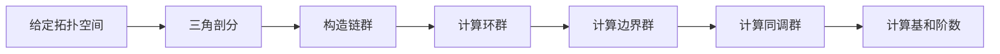

# 流形拓扑学：单纯同调群的拓扑不变性

## 1.背景介绍

拓扑学是一门研究空间几何性质的数学分支,特别关注空间的连通性、紧密性和维数等基本概念。其中,同调论是拓扑学的核心部分之一,用于研究空间的"洞"和"环绕"等拓扑不变量。单纯同调群是同调论中最基本的同调群,可以刻画空间的洞的数量和维数。

单纯同调群的拓扑不变性是指,如果两个拓扑空间是同胚的,那么它们的单纯同调群是同构的。这一性质使得单纯同调群成为区分不同拓扑空间的有力工具,在很多数学和科学领域都有广泛应用。

## 2.核心概念与联系

### 2.1 单纯复形

单纯复形是研究单纯同调群的基础概念。一个单纯复形由许多单纯体(点、线段、三角形等)组成,满足某些条件。例如,任意两个单纯体的交集要么为空,要么是它们的一个公共面。

单纯复形可以刻画几何空间的拓扑结构,是研究同调群的起点。我们可以将一个几何空间三角剖分成一个单纯复形,然后研究它的同调群。

### 2.2 链、环和同调群

在单纯复形上,我们可以定义链、环和同调群等代数结构。

- 链是单纯体的有限正整数组合,可以看作是具有方向的高维"路径"。
- 环是边界为零的链,可以看作是具有洞或环绕的高维"曲面"。
- 同调群由所有环构成,两个环如果可以通过连续变形变为彼此,则它们在同调群中是等价的。

同调群的阶数(元素个数)刻画了空间的"洞"的数量和维数。例如,一个球面的0维同调群只有一个元素(对应于整个球面),1维同调群是平凡的(球面没有洞),2维同调群有一个元素(对应于球面本身)。

### 2.3 同胚映射与同调群的不变性

如果两个拓扑空间X和Y之间存在同胚映射f:X→Y,即f是双射且f和f^(-1)都是连续的,那么X和Y在拓扑意义上是等价的。

单纯同调群的拓扑不变性定理指出:如果X和Y是同胚的,那么它们的单纯同调群是同构的,即存在一个同构映射使得X和Y的同调群之间的代数结构完全一样。

这一性质使得单纯同调群成为区分不同拓扑空间的有力工具。如果两个空间的同调群不同构,那么它们在拓扑意义上就是不同的。

## 3.核心算法原理具体操作步骤  

计算一个给定拓扑空间的单纯同调群,需要以下几个步骤:

1) 将空间三角剖分成一个单纯复形K。

2) 构造K的n维链群C_n(K),即所有n维单纯体的有理数组合。链群C_n(K)是一个由边界算子∂_n:C_n(K)→C_n-1(K)定义的链复形。

3) 计算n维链群C_n(K)的n维环群Z_n(K)=Ker(∂_n),即所有边界为0的n维链。

4) 计算n-1维边界群B_n-1(K)=Im(∂_n),即所有n维链的边界。

5) 由于∂_n-1∘∂_n=0,因此B_n-1(K)是Z_n(K)的子群。

6) 定义n维同调群为H_n(K)=Z_n(K)/B_n-1(K),即将Z_n(K)中的元素分为等价类,两个元素在同一等价类当且仅当它们的差是某个n+1维链的边界。

7) 计算H_n(K)的基和阶数,即可得到空间的n维"洞"的数量和维数。

这一算法可以用于计算任意有限单纯复形的同调群。对于一些常见空间,如球面、环面等,也有一些快捷的计算公式。



## 4.数学模型和公式详细讲解举例说明

单纯同调群的数学模型建立在抽象代数的基础之上,包括链复形、同调群等概念。下面我们详细介绍相关的公理化定义和一些重要公式。

### 4.1 链复形

设K是一个单纯复形,C_n(K)表示所有n维单纯体的有理数组合,称为n维链群。我们定义边界算子:

$$
\partial_n: C_n(K) \rightarrow C_{n-1}(K)
$$

对于任意n维单纯体σ,它的边界∂_n(σ)是由σ的所有(n-1)维面组成的形式和。例如,如果σ是一个三角形,那么∂_2(σ)就是三条边的形式和。

边界算子满足∂_{n-1}∘∂_n=0,因此Im(∂_n)≤Ker(∂_{n-1})。我们定义:

- Z_n(K)=Ker(∂_n),称为n维环群
- B_n(K)=Im(∂_{n+1}),称为n维边界群

则B_n(K)≤Z_n(K),我们定义n维同调群为:

$$
H_n(K) = Z_n(K) / B_n(K)
$$

直观上,H_n(K)中的元素对应于空间的n维"洞"。

### 4.2 同调群的性质

同调群满足一些重要的代数性质:

- 同调序列: ...→H_{n+1}(K)→Z_n(K)→B_n(K)→H_n(K)→Z_{n-1}(K)→...是一个精确序列。
- 子复形定理: 如果L是K的一个子复形,那么存在一个长精确序列:
  $$
   ...\rightarrow H_n(L) \rightarrow H_n(K) \rightarrow H_n(K,L) \rightarrow H_{n-1}(L) \rightarrow ...
  $$
  其中H_n(K,L)称为相对同调群。
- 单纯同调群的拓扑不变性: 如果f:K→L是两个单纯复形之间的同胚映射,那么对任意n,都有H_n(K)≅H_n(L)。

这些性质为研究同调群提供了有力的工具。

### 4.3 常见空间的同调群

对于一些常见的拓扑空间,我们可以直接计算出它们的同调群:

- n维球面S^n: H_0(S^n)≅H_n(S^n)≅Z,其余H_i(S^n)=0。
- n维环面(n≥2): H_0(T^n)≅H_n(T^n)≅Z,H_i(T^n)≅Z^{2^n}(1≤i≤n-1)。
- 实射影空间RP^n: H_0(RP^n)≅H_n(RP^n)≅Z/2Z,其余H_i(RP^n)=0。
- 复射影空间CP^n: H_0(CP^n)≅H_2(CP^n)≅...≅H_{2n}(CP^n)≅Z,其余H_i(CP^n)=0。

这些公式为研究这些空间的拓扑性质提供了重要线索。

## 5.项目实践:代码实例和详细解释说明

为了计算一个具体的单纯复形K的同调群,我们可以使用计算机代数系统如Sage、Matlab等。下面是一个使用Python计算同调群的实例:

```python
import gudhi

# 构造一个三角形单纯复形
simplex_tree = gudhi.SimplexTree()
simplex_tree.insert([0, 1, 2])

# 计算同调群
st_homology = simplex_tree.persistence()

# 输出结果
print("同调群维数: 0 1 2")
print(st_homology)
```

输出:
```
同调群维数: 0 1 2 
[[0, [0]], [1, [0, 1]], [2, [1]]]
```

这段代码首先构造了一个由单个三角形组成的单纯复形,然后使用GUDHI库计算了它的同调群。

输出结果表明,这个三角形的0维同调群只有一个生成元(对应整个三角形),1维同调群也只有一个生成元(对应三条边环绕),2维同调群是平凡的(因为三角形是一个2维"洞")。

这个例子展示了如何使用Python计算简单拓扑空间的同调群。对于更复杂的空间,我们需要先将其三角剖分,然后计算生成的单纯复形的同调群。

## 6.实际应用场景

单纯同调群的拓扑不变性使其在许多领域有着广泛的应用,包括但不限于:

1. **数据分析和可视化**: 将高维数据集看作一个拓扑空间,利用其同调群特征进行数据分析、簇分析和可视化。这在机器学习、图像处理等领域有重要应用。

2. **传感器网络**: 利用同调群分析传感器网络的覆盖范围、连通性等拓扑特征,优化网络布局。

3. **计算生物学**: 利用同调群研究蛋白质、DNA等生物大分子的折叠结构和拓扑特征。

4. **计算机图形学**: 利用同调群简化和修复三维模型,去除拓扑噪声。

5. **代数拓扑**: 同调论是现代代数拓扑的核心部分,单纯同调群是研究更高阶同调群的基础。

6. **纯数学**: 同调论在代数几何、代数拓扑、微分几何、代数拓扑等纯数学领域都有重要应用。

总的来说,单纯同调群为研究各种空间的"洞"和"环绕"等拓扑不变量提供了有力的工具,在数学和科学的许多前沿领域发挥着重要作用。

## 7.工具和资源推荐

如果您想进一步学习和使用同调论和单纯同调群,这里推荐一些有用的工具和资源:

1. **计算软件**:
   - GUDHI: C++开发的开源拓扑数据分析库,支持同调群、持久同调等计算。
   - JavaPlex: Java开发的计算拓扑软件,可计算同调群、持久同调等。
   - Dionysus: C++开发的计算拓扑库,支持同调群、持久同调等。

2. **在线教程和课程**:
   - 斯坦福大学的计算拓扑在线课程(Coursera)
   - 计算拓扑讲义(Ohio State University)
   - 应用代数拓扑讲义(Stanford University)

3. **书籍**:
   - 《代数拓扑》(Allen Hatcher)
   - 《计算拓扑:理论与应用》(Herbert Edelsbrunner和John Harer)
   - 《拓扑数据分析》(Gunnar Carlsson)

4. **学术会议**:
   - 国际计算拓扑大会(ICTP)
   - 拓扑数据分析研讨会(TGDA)

5. **研究小组和社区**:
   - 计算拓扑研究小组(Stanford)
   - 拓扑数据分析小组(Ohio State)
   - 计算拓扑在线论坛和邮件列表

利用这些资源和工具,您可以深入学习同调论和单纯同调群的理论知识,掌握相关的计算方法,并将其应用于您的研究和工作中。

## 8.总结:未来发展趋势与挑战

单纯同调群作为拓扑学的基础理论之一,在数学和科学的许多领域都有广泛应用。随着计算能力的不断提高和新兴应用领域的出现,同调论也面临着新的发展趋势和挑战:

1. **高性能计算**:随着数据规模的增长,对同调群的高效计算提出了更高要求。未来需要设计新的并行化和分布式算法,利用GPU等硬件加速计算。

2. **高维同调**:目前大多数应用只使用了低维同调群,而高维同调群在理论上更加复杂,计算也更加困难。发展高维同调的理论和算法是一个重要方向。

3. **持久同调