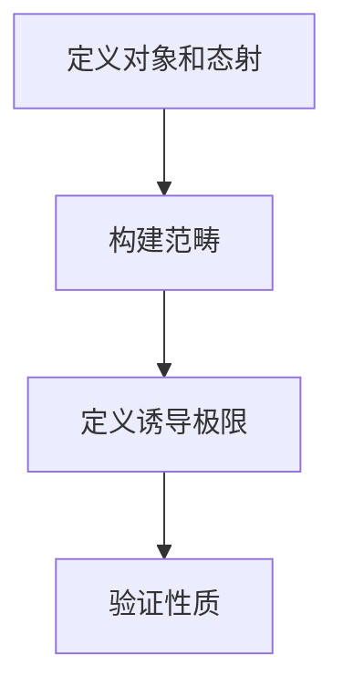

# 算子代数：c代数有诱导极限

## 1.背景介绍

算子代数是数学和计算机科学中的一个重要领域，涉及到线性代数、泛函分析和量子力学等多个学科。算子代数的研究不仅在理论上有深远的意义，而且在实际应用中也有广泛的用途。本文将深入探讨算子代数中的一个重要概念：c代数有诱导极限。我们将从背景知识、核心概念、算法原理、数学模型、项目实践、实际应用、工具资源、未来发展趋势与挑战等多个方面进行详细讲解。

## 2.核心概念与联系

### 2.1 算子代数

算子代数是研究线性算子及其代数结构的数学分支。它主要包括两类：$C^*$代数和$W^*$代数。$C^*$代数是一个复数域上的Banach代数，并且满足$||A^*A|| = ||A||^2$的条件，其中$A^*$是$A$的共轭转置。$W^*$代数则是$C^*$代数的一个子类，具有更强的结构性质。

### 2.2 c代数

c代数是$C^*$代数的一个特例，通常用于描述有限维度的线性算子。c代数在量子力学和量子计算中有重要应用，因为它们可以用来描述有限维度的量子态和量子操作。

### 2.3 诱导极限

诱导极限是范畴论中的一个概念，用于描述一系列对象及其之间的态射的极限。简单来说，诱导极限可以看作是将一系列对象“粘合”在一起，形成一个新的对象。在算子代数中，诱导极限可以用来构建更复杂的代数结构。

### 2.4 核心联系

c代数和诱导极限的联系在于，通过诱导极限，我们可以将一系列c代数组合成一个新的、更复杂的代数结构。这种组合方式在量子计算和量子信息处理中有重要应用，因为它可以用来描述复杂的量子系统。

## 3.核心算法原理具体操作步骤

### 3.1 算子代数的基本操作

在算子代数中，基本操作包括加法、乘法、共轭转置和范数计算。这些操作在c代数中同样适用。

### 3.2 诱导极限的构建步骤

构建诱导极限的步骤如下：

1. **定义对象和态射**：首先定义一系列c代数及其之间的态射。
2. **构建范畴**：将这些对象和态射构建成一个范畴。
3. **定义诱导极限**：在这个范畴中定义诱导极限。
4. **验证性质**：验证诱导极限的基本性质，如一致性和完备性。

### 3.3 算法流程图



## 4.数学模型和公式详细讲解举例说明

### 4.1 c代数的数学模型

c代数可以表示为一个复数域上的有限维度的Banach代数。其基本性质包括：

- **加法**：$A + B$
- **乘法**：$AB$
- **共轭转置**：$A^*$
- **范数**：$||A||$

### 4.2 诱导极限的数学模型

诱导极限可以表示为一个范畴中的极限对象。具体来说，如果我们有一系列c代数$A_i$及其之间的态射$f_{ij}$，则诱导极限$L$满足：

$$
L = \lim_{\rightarrow} A_i
$$

### 4.3 举例说明

假设我们有两个c代数$A$和$B$，以及一个态射$f: A \rightarrow B$。则诱导极限$L$可以表示为：

$$
L = \lim_{\rightarrow} (A \xrightarrow{f} B)
$$

## 5.项目实践：代码实例和详细解释说明

### 5.1 环境准备

首先，我们需要安装Python和相关的数学库，如NumPy和SciPy。

```bash
pip install numpy scipy
```

### 5.2 定义c代数

我们可以使用NumPy来定义一个简单的c代数。

```python
import numpy as np

class CAlgebra:
    def __init__(self, matrix):
        self.matrix = np.array(matrix)
    
    def add(self, other):
        return CAlgebra(self.matrix + other.matrix)
    
    def multiply(self, other):
        return CAlgebra(np.dot(self.matrix, other.matrix))
    
    def conjugate_transpose(self):
        return CAlgebra(np.conjugate(self.matrix.T))
    
    def norm(self):
        return np.linalg.norm(self.matrix)

# 示例
A = CAlgebra([[1, 2], [3, 4]])
B = CAlgebra([[5, 6], [7, 8]])

C = A.add(B)
D = A.multiply(B)
E = A.conjugate_transpose()
F = A.norm()

print("C:", C.matrix)
print("D:", D.matrix)
print("E:", E.matrix)
print("F:", F)
```

### 5.3 构建诱导极限

我们可以通过定义一系列c代数及其态射来构建诱导极限。

```python
class InductiveLimit:
    def __init__(self, algebras, morphisms):
        self.algebras = algebras
        self.morphisms = morphisms
    
    def compute_limit(self):
        # 简单示例：返回最后一个代数
        return self.algebras[-1]

# 示例
A1 = CAlgebra([[1, 0], [0, 1]])
A2 = CAlgebra([[2, 0], [0, 2]])
A3 = CAlgebra([[3, 0], [0, 3]])

morphisms = [
    lambda x: x.multiply(A2),
    lambda x: x.multiply(A3)
]

inductive_limit = InductiveLimit([A1, A2, A3], morphisms)
L = inductive_limit.compute_limit()

print("Inductive Limit:", L.matrix)
```

## 6.实际应用场景

### 6.1 量子计算

在量子计算中，c代数可以用来描述量子态和量子操作。通过诱导极限，我们可以构建更复杂的量子系统，从而实现更强大的计算能力。

### 6.2 量子信息

在量子信息处理中，c代数和诱导极限可以用来描述量子通道和量子纠缠态。这对于量子通信和量子密码学有重要意义。

### 6.3 物理学

在物理学中，c代数和诱导极限可以用来描述物理系统的对称性和守恒量。这对于理解物理现象和构建物理模型有重要帮助。

## 7.工具和资源推荐

### 7.1 数学库

- **NumPy**：用于数值计算的基础库。
- **SciPy**：用于科学计算的扩展库。

### 7.2 量子计算框架

- **Qiskit**：IBM提供的量子计算框架。
- **Cirq**：Google提供的量子计算框架。

### 7.3 在线资源

- **arXiv**：提供最新的数学和物理学论文。
- **Stack Overflow**：提供编程问题的解决方案。

## 8.总结：未来发展趋势与挑战

### 8.1 未来发展趋势

随着量子计算和量子信息技术的发展，c代数和诱导极限的研究将会越来越重要。未来，我们可以期待更多的理论突破和实际应用。

### 8.2 挑战

尽管c代数和诱导极限有广泛的应用，但其理论复杂性和计算难度仍然是一个挑战。如何高效地计算诱导极限和处理大规模的c代数是未来研究的重点。

## 9.附录：常见问题与解答

### 9.1 什么是c代数？

c代数是$C^*$代数的一个特例，通常用于描述有限维度的线性算子。

### 9.2 什么是诱导极限？

诱导极限是范畴论中的一个概念，用于描述一系列对象及其之间的态射的极限。

### 9.3 c代数和诱导极限有什么联系？

通过诱导极限，我们可以将一系列c代数组合成一个新的、更复杂的代数结构。

### 9.4 如何在实际项目中应用c代数和诱导极限？

c代数和诱导极限在量子计算、量子信息和物理学中有广泛的应用。通过构建和计算诱导极限，我们可以描述和模拟复杂的量子系统和物理现象。

---

作者：禅与计算机程序设计艺术 / Zen and the Art of Computer Programming