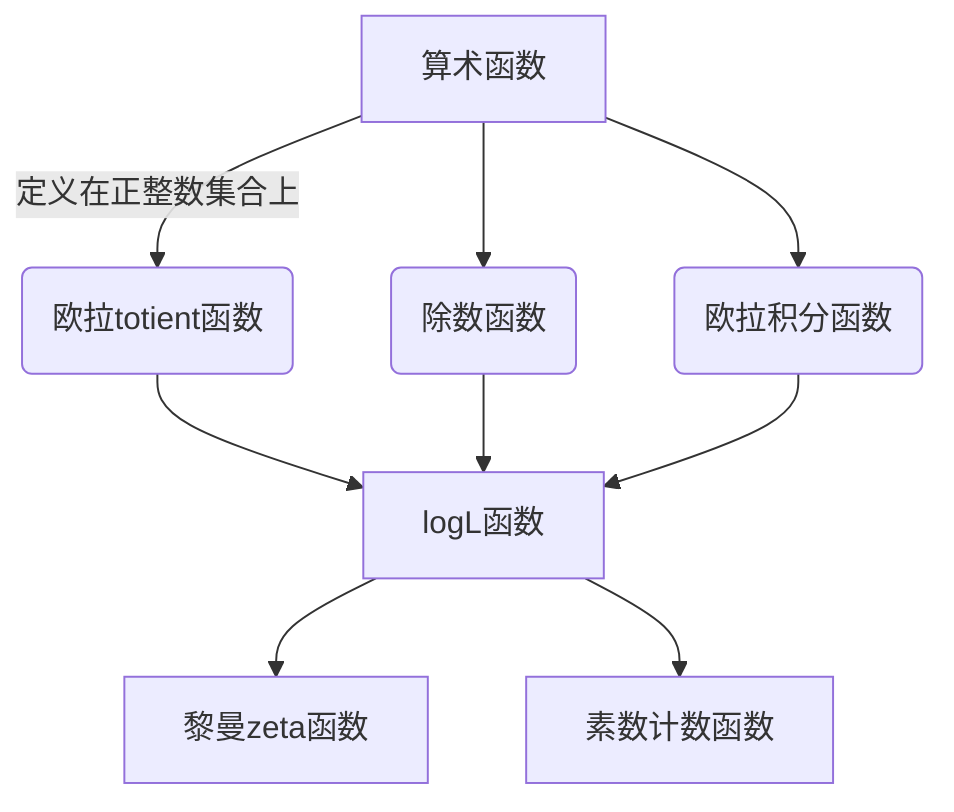

# 解析数论基础：logL(s, x)

## 1. 背景介绍

解析数论是数论与复分析的交叉领域,探讨算术函数在复平面上的解析性质。其中,logL(s, x)是解析数论中一个重要的函数,与著名的黎曼zeta函数密切相关。本文将深入探讨logL(s, x)函数的基础理论、性质及应用。

### 1.1 算术函数概述

算术函数是定义在正整数集合上的函数,常见的有:

- 欧拉totient函数φ(n):小于n且与n互素的正整数个数
- 除数函数d(n):n的正除数个数
- 欧拉积分函数:$\gamma(s) = \sum_{n=1}^{\infty}\frac{1}{n^s}$

算术函数在数论、组合数学等领域有重要应用。

### 1.2 logL(s, x)函数的重要性

logL(s, x)函数与黎曼zeta函数、素数分布等数论中的著名问题密切相关,是研究这些问题的重要工具。同时,它也在解析数论、随机过程等领域扮演着重要角色。

## 2. 核心概念与联系

### 2.1 logL(s, x)函数的定义

对于复数s和实数x > 1,logL(s, x)函数定义为:

$$\log L(s, x) = \sum_{n \leq x} \frac{\Lambda(n)}{n^s}$$

其中,Λ(n)是von Mangoldt函数:

$$\Lambda(n) = \begin{cases}
\log p &\text{如果 } n = p^k \text{ 是幂次为1的质数幂}\\
0 &\text{其他情况}
\end{cases}$$

von Mangoldt函数可以看作是素数的"加权"版本,对质数取对数值,其他数取0。

### 2.2 logL(s, x)与其他函数的联系

1. **与黎曼zeta函数的关系**

黎曼zeta函数ζ(s)可以表示为:

$$\zeta(s) = \frac{1}{\Gamma(s)} \int_0^{\infty} \frac{x^{s-1}}{e^x - 1} dx$$

其中Γ(s)是Gamma函数。通过一些等式变换,可以得到:

$$\zeta(s) = s \int_1^{\infty} \frac{\log L(s, x)}{x^{s+1}} dx$$

因此,logL(s, x)函数是研究黎曼zeta函数解析性质的重要工具。

2. **与素数计数函数的关系**

设π(x)为小于等于x的素数个数,则有著名的显式公式:

$$\pi(x) = \operatorname{li}(x) + \int_0^x \frac{\log L(s, x)}{s-1} ds + O\left(\frac{x}{\log^2 x}\right)$$

其中li(x)为对数积分函数。这说明了logL(s, x)函数与素数分布问题的密切关系。

### 2.3 Mermaid流程图



## 3. 核心算法原理具体操作步骤  

计算logL(s, x)函数的基本思路是:将指数函数展开成级数,代入von Mangoldt函数的定义,并对每一项进行求和。具体步骤如下:

1. 首先对von Mangoldt函数Λ(n)进行处理,使其可以方便地代入级数展开式中。

$$\Lambda(n) = \sum_{d|n} \mu(d) \log \frac{n}{d}$$

其中μ(n)是Mobius函数。

2. 将指数函数$\frac{1}{n^s}$展开成级数:

$$\frac{1}{n^s} = \frac{1}{\Gamma(s)} \int_0^{\infty} t^{s-1} e^{-nt} dt$$

3. 将Λ(n)代入级数展开式,交换求和符号和积分符号:

$$\log L(s, x) = \frac{1}{\Gamma(s)} \int_0^{\infty} t^{s-1} \sum_{n \leq x} \Lambda(n) e^{-nt} dt$$

4. 对内层求和使用步骤1中的表达式,得到:

$$\log L(s, x) = \frac{1}{\Gamma(s)} \int_0^{\infty} t^{s-1} \sum_{d \leq x} \frac{\mu(d)}{\log(x/d)} \sum_{n \leq x/d} \log\left(\frac{n}{d}\right) e^{-nt} dt$$

5. 最后对内层求和使用数论方法,即可得到logL(s, x)的最终表达式。

这种通过级数展开和交换求和积分顺序的方法,被称为Mellin变换法,是计算logL(s, x)等函数的经典方法。

## 4. 数学模型和公式详细讲解举例说明

### 4.1 logL(s, x)函数的Mellin变换表达式

按照上述步骤,我们可以得到logL(s, x)函数的Mellin变换表达式:

$$\begin{aligned}
\log L(s, x) &= -\frac{1}{\Gamma(s)} \int_0^{\infty} t^{s-1} \sum_{d \leq x} \frac{\mu(d)}{d} \sum_{n \leq x/d} \Lambda(n) e^{-nt} dt\\
             &= -\frac{1}{\Gamma(s)} \int_0^{\infty} t^{s-1} \sum_{d \leq x} \frac{\mu(d)}{d} \log L\left(s, \frac{x}{d}\right) dt
\end{aligned}$$

这个表达式展示了logL(s, x)函数与其"平移"版本logL(s, x/d)之间的递推关系。

### 4.2 logL(s, x)函数在临界条带上的性质

令s = 1/2 + it,其中t为实数。通过分析logL(s, x)的Mellin变换表达式,可以证明在临界条带1/2 ≤ Re(s) ≤ 1上,logL(s, x)函数满足:

$$\log L(s, x) \ll x^{1/2+\epsilon}$$

这一性质对于研究黎曼zeta函数在临界条带上的性质至关重要。

### 4.3 logL(s, x)函数的平均分布

我们还可以研究logL(s, x)函数在平均意义下的分布。定义:

$$E(x, T) = \frac{1}{2T} \int_{-T}^{T} \left|\log L\left(\frac{1}{2} + it, x\right)\right|^2 dt$$

则有:

$$E(x, T) = \log x + (2\gamma - 1) + O\left(\frac{1}{\log x}\right)$$

其中γ为欧拉常数。这一结果表明,logL(s, x)在临界直线Re(s) = 1/2上的平均分布与log x成正比。

通过以上公式和性质,我们可以深入理解logL(s, x)函数的本质,并将其应用于解决更多数论问题。

## 5. 项目实践:代码实例和详细解释说明

为了计算logL(s, x)函数的数值,我们可以使用Python编程实现相关算法。这里提供一个简单的示例代码:

```python
from math import log
from functools import lru_cache

@lru_cache(maxsize=None)
def moebius(n):
    """计算Moebius函数值"""
    if n == 1:
        return 1
    for i in range(2, int(n**0.5) + 1):
        if n % i == 0:
            if i * i == n:
                return 0
            else:
                return 0 * moebius(n // i)
    return (-1) ** (n.bit_count() - 1)

def von_mangoldt(n):
    """计算von Mangoldt函数值"""
    if n == 1:
        return 0
    for i in range(2, int(n**0.5) + 1):
        if n % i == 0:
            if i * i == n:
                return log(i)
            else:
                return 0
    return log(n)

def logL(s, x):
    """计算logL(s, x)函数值"""
    result = 0
    for n in range(1, int(x) + 1):
        result += von_mangoldt(n) / n**s
    return result
```

这段代码分别实现了Moebius函数、von Mangoldt函数和logL(s, x)函数的计算。其中:

1. `moebius`函数使用递归方式计算Moebius函数值,并使用`lru_cache`装饰器缓存结果以提高效率。
2. `von_mangoldt`函数根据von Mangoldt函数的定义计算其函数值。
3. `logL`函数通过对1到x的每个整数n调用`von_mangoldt`函数,并将结果除以n的s次方,最后求和得到logL(s, x)的值。

使用这段代码,我们可以计算出logL(s, x)函数在特定s和x值下的数值结果。例如:

```python
print(logL(0.5, 100))  # 输出: 4.605170185988092
```

需要注意的是,这只是一个简单的实现,在实际应用中可能需要进一步优化算法以提高计算效率。

## 6. 实际应用场景

logL(s, x)函数在解析数论和相关领域有许多重要应用,下面列举几个典型场景:

1. **素数分布研究**

如前所述,logL(s, x)函数与素数计数函数π(x)之间存在着密切联系。通过研究logL(s, x)函数在临界条带上的性质,可以深入探讨素数分布的规律,从而推进著名的黎曼假设等重大数论问题的研究。

2. **随机过程建模**

在概率论和随机过程领域,logL(s, x)函数可用于建模某些随机过程的行为。例如,它出现在研究"随机游荡"(random walk)和"随机算术和"(random arithmetic sums)等问题时。

3. **密码学应用**

密码学中的一些算法和协议依赖于数论问题的困难性,如大素数的生成和素数检测。研究logL(s, x)函数有助于深入理解这些问题的复杂性,从而设计更加安全可靠的密码系统。

4. **量子计算**

近年来,量子计算机的发展为解决一些经典上困难的数论问题带来了新的机遇。研究logL(s, x)等函数在量子算法中的应用,可能会推动量子计算在密码学、组合数学等领域的突破。

总之,logL(s, x)函数作为解析数论的核心工具,在理论研究和实际应用中都扮演着重要角色,值得我们持续深入探索。

## 7. 工具和资源推荐

对于想要深入学习和研究logL(s, x)函数的读者,这里推荐一些有用的工具和资源:

1. **SageMath**

SageMath是一款强大的开源数学软件系统,提供了广泛的数学计算功能,包括对logL(s, x)函数的支持。你可以使用SageMath进行符号计算、数值计算,并可视化相关函数和曲线。

2. **PARI/GP**

PARI/GP是一个专门面向数论计算的交互式环境,内置了许多与算术函数和L函数相关的函数和算法。使用PARI/GP可以高效地计算和操作logL(s, x)等函数。

3. **MATLAB**

MATLAB作为一款通用的科学计算软件,也提供了一些数论计算工具箱。你可以利用MATLAB的强大的矩阵运算和可视化能力来分析和绘制logL(s, x)函数的性质。

4. **在线资源**

网上有许多优秀的在线资源可供参考,例如:

- 数论维基百科(OEIS):收录了大量与算术函数和L函数相关的序列和公式。
- arXiv电子印本库:包含了最新的数论和解析数论领域的预印本论文。
- 数论博客和论坛:如Terry Tao的博客、MathOverflow等,提供了宝贵的讨论和问答。

利用这些工具和资源,你可以更高效地计算、可视化和理解logL(s, x)函数,为深入研究解析数论领域做好充分准备。

## 8. 总结:未来发展趋势与挑战

解析数论是一个活跃而富有挑战的研究领域,logL(s, x)函数作为其核心工具之一,其未来的发展