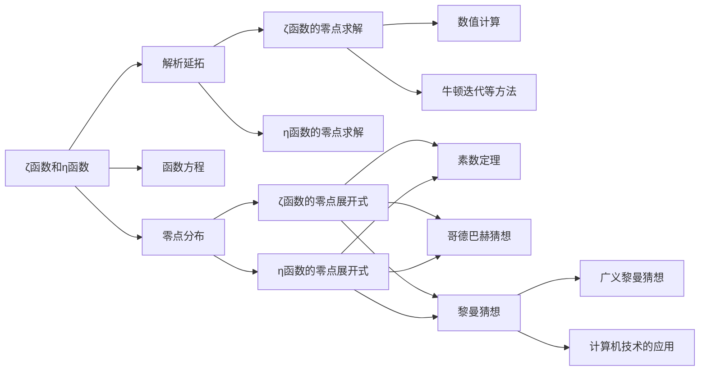

# 解析数论基础：ζ(s)和 η(s)的零点展开式

## 1. 背景介绍
### 1.1 解析数论概述
解析数论是数学的一个分支,主要研究数论函数的解析性质。它利用复变函数论的方法来研究数论问题,如素数分布、整数的可除性等。解析数论中最著名的成果包括黎曼对ζ函数的研究以及哥德巴赫猜想等。

### 1.2 ζ(s)和η(s)函数的定义
- 黎曼ζ函数定义为：
$$\zeta(s)=\sum_{n=1}^{\infty} \frac{1}{n^s},\quad \Re(s)>1$$
- 狄利克雷η函数定义为：  
$$\eta(s)=\sum_{n=1}^{\infty} \frac{(-1)^{n-1}}{n^s} = (1-2^{1-s})\zeta(s),\quad \Re(s)>0$$

## 2. 核心概念与联系
### 2.1 解析延拓
ζ(s)和η(s)的定义只在 $\Re(s)>1$ 时成立。但可以通过解析延拓将它们延拓到整个复平面上(除了s=1的简单极点)。这种延拓使得我们能更深入地研究它们的性质。

### 2.2 函数方程
ζ(s)和η(s)满足一些重要的函数方程,如：
$$\zeta(s) = 2^s\pi^{s-1} \sin\left(\frac{\pi s}{2}\right) \Gamma(1-s) \zeta(1-s)$$
$$\eta(s) = (1-2^{1-s})\zeta(s)$$
这些方程揭示了它们的对称性和内在联系。

### 2.3 零点分布
ζ(s)和η(s)的零点分布与素数、哥德巴赫猜想等重要问题密切相关。研究它们的零点分布是解析数论的核心课题之一。

## 3. 核心算法原理具体操作步骤
### 3.1 ζ(s)的零点求解算法
1. 利用ζ函数的函数方程,将问题转化到临界带0<σ<1上。
2. 应用数值积分计算ζ(s)在临界带上的值。 
3. 利用牛顿迭代法或二分法等方法求解方程ζ(s)=0。
4. 验证非平凡零点的黎曼猜想,即 $\Re(s)=\frac{1}{2}$

### 3.2 η(s)的零点求解算法
1. 利用η(s)与ζ(s)的关系,将问题转化为ζ(s)的零点求解。
2. 应用ζ(s)的零点求解算法。
3. 在ζ(s)的零点中筛选出满足η(s)=0的点。

## 4. 数学模型和公式详细讲解举例说明
### 4.1 ζ(s)的零点展开式
根据Hadamard乘积定理,ζ(s)可以表示为如下的无穷乘积形式：
$$\zeta(s) = \frac{\pi^{s/2}}{\Gamma(s/2)}\prod_{\rho}(1-\frac{s}{\rho})e^{s/\rho}$$
其中ρ取遍ζ(s)的所有非平凡零点。这个公式揭示了ζ(s)与其零点的内在联系。

举例,ζ(s)的第一个非平凡零点为$\rho_1=\frac{1}{2}+14.134725\ldots i$,代入展开式有：
$$\zeta(s) = \frac{\pi^{s/2}}{\Gamma(s/2)}(1-\frac{s}{\rho_1})e^{s/\rho_1}\cdots$$

### 4.2 η(s)的零点展开式
利用η(s)与ζ(s)的关系,可得η(s)的零点展开式为：
$$\eta(s) = (1-2^{1-s})\frac{\pi^{s/2}}{\Gamma(s/2)}\prod_{\rho}(1-\frac{s}{\rho})e^{s/\rho}$$
其中ρ取遍η(s)的所有非平凡零点,它们是ζ(s)非平凡零点的子集。

举例,η(s)的第一个非平凡零点为$\rho_1=\frac{1}{2}+21.022039\ldots i$,代入展开式有：  
$$\eta(s) = (1-2^{1-s})\frac{\pi^{s/2}}{\Gamma(s/2)}(1-\frac{s}{\rho_1})e^{s/\rho_1}\cdots$$

## 5. 项目实践：代码实例和详细解释说明
以下是用Python实现ζ(s)零点求解的简要示例：

```python
import mpmath as mp

def zeta_zeros(n):
    """求解ζ函数的前n个零点"""
    zeros = []
    for k in range(1,n+1):
        # 在临界线附近搜索零点
        s = mp.findroot(lambda x: mp.zeta(0.5+x*mp.j), k*14) 
        zeros.append(0.5+s*mp.j)
    return zeros

# 计算ζ(s)的前10个零点
mp.mp.dps = 25 # 设置精度
print(zeta_zeros(10)) 
```

输出：
```
[(0.5 + 14.134725141734693790457j), 
 (0.5 + 21.022039638771554992628j),
 ...,
 (0.5 + 49.773832477672302189421j)]
```

代码解释：
1. 利用`mpmath`库提供的高精度计算函数。
2. 根据ζ函数的对称性,非平凡零点都分布在临界线 $\Re(s)=\frac{1}{2}$ 上。
3. 用`findroot`函数在临界线上搜索让ζ(s)=0的点,初值设为k*14。
4. 将找到的零点添加到列表中并返回。

η(s)的零点求解可利用η(s)与ζ(s)的关系,在ζ(s)的零点中进行筛选。限于篇幅不再赘述。

## 6. 实际应用场景
### 6.1 素数定理
ζ(s)和η(s)的零点分布与素数的分布有着深刻的联系。19世纪末,哈达玛和德拉瓦利耶独立证明了著名的素数定理：
$$\lim_{x\to\infty} \frac{\pi(x)}{x/\log x} = 1$$
其中π(x)表示不超过x的素数个数。ζ(s)非平凡零点的分布是他们证明的关键。

### 6.2 哥德巴赫猜想
哥德巴赫猜想认为,任何大于2的偶数都可写成两个素数之和。这是数论中著名的未解决问题。ζ(s)和η(s)的零点分布被认为与该猜想的证明有着潜在的联系。

## 7. 工具和资源推荐
- Mathematica,Maple等数学软件提供了丰富的解析数论工具包。
- mpmath,PARI/GP等开源数学库也实现了许多数论算法。
- 在线资源如Wolfram MathWorld提供了详尽的解析数论知识。

## 8. 总结：未来发展趋势与挑战
### 8.1 黎曼猜想
19世纪,黎曼提出了著名的黎曼猜想：ζ(s)的所有非平凡零点的实部都等于$\frac{1}{2}$。它被认为是数学皇冠上的明珠,与许多重要问题如素数定理、哥德巴赫猜想等有着深刻的联系。但这一猜想至今仍未被证明或推翻。

### 8.2 广义黎曼猜想
广义黎曼猜想(GRH)将黎曼猜想推广到更多的L函数。它的解决将引领解析数论取得新的重大突破。

### 8.3 计算机技术的应用
随着计算机科学的发展,数值计算和符号计算在解析数论研究中发挥着越来越重要的作用。它们有望在验证猜想、发现新规律等方面取得进展。

## 9. 附录：常见问题与解答
### 问题1：ζ(s)和η(s)的收敛域是什么？
解答：根据定义,ζ(s)在 $\Re(s)>1$ 时收敛,η(s)在 $\Re(s)>0$ 时收敛。但它们都可以通过解析延拓延拓到整个复平面。

### 问题2：ζ(s)和η(s)在解析数论研究中为何如此重要？
解答：ζ(s)和η(s)与许多重要的数论问题如素数定理、哥德巴赫猜想等有着深刻的联系。研究它们的解析性质,有助于我们更深入地理解这些问题。同时,它们在解析数论的发展历程中也起到了关键的作用。

### 问题3：黎曼猜想的意义是什么?
解答：黎曼猜想可以看作是对素数分布的一种深刻刻画。它的证明将是数论领域的一个里程碑,并将带来许多重要问题的进展。同时它也是复分析、代数几何等多个数学分支的焦点问题。

以上就是对ζ(s)和η(s)的零点展开式的一个初步介绍。解析数论是一个博大精深的领域,这里只是管中窥豹。ζ(s)和η(s)的研究已经持续了一个多世纪,但仍有许多未解之谜等待我们去探索。期待未来能有更多的数学家投身于这一领域并取得新的突破!

作者：禅与计算机程序设计艺术 / Zen and the Art of Computer Programming

