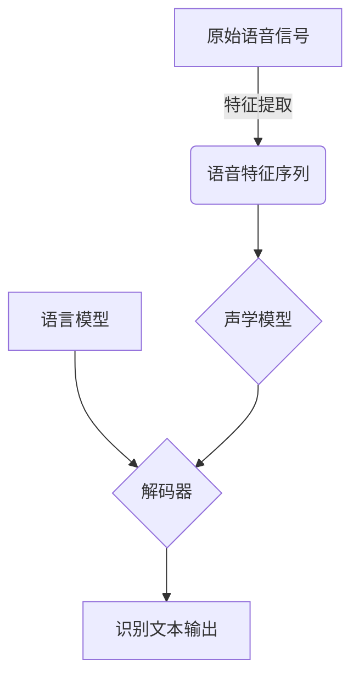

# 语音识别原理与代码实战案例讲解

## 1.背景介绍

语音识别技术是一种将人类语音转换为相应文本或命令的过程,广泛应用于人机交互、语音助手、会议记录、车载系统等领域。随着深度学习算法的不断发展,语音识别的准确率和实时性都有了显著提升。本文将深入探讨语音识别的核心原理、算法流程和实现方法,并通过实战案例讲解代码细节,为读者提供全面的理解。

## 2.核心概念与联系

语音识别技术涉及多个核心概念,包括:

1. **语音信号处理**: 将原始语音信号转换为适合模型处理的特征向量序列。
2. **声学模型(Acoustic Model)**: 根据语音特征估计潜在语音单元序列的概率模型。
3. **语言模型(Language Model)**: 根据上下文估计单词或词序列的概率分布。
4. **解码器(Decoder)**: 将声学模型和语言模型的输出综合,搜索出最可能的词序列。

这些概念相互关联,构成了完整的语音识别系统。



## 3.核心算法原理具体操作步骤

### 3.1 语音信号处理

1. **预加重**: 通过滤波器增强高频部分,补偿人耳和传声系统的衰减。
2. **分帧**: 将连续语音信号分割成短时间帧,通常20-30ms帧长。
3. **加窗**: 对每帧语音施加窗函数(如汉明窗),减少时域aliasing。
4. **傅里叶变换**: 对加窗后的帧进行傅里叶变换,获得频域谱。
5. **滤波器组**: 通过三角滤波器组或梅尔滤波器组,将频谱分为若干频带。
6. **倒谱法**: 对滤波器组输出做对数运算和DCT变换,得到倒谱系数(MFCC)特征向量。

### 3.2 声学模型

声学模型的目标是估计给定语音特征序列$\boldsymbol{X}$时,潜在语音单元序列$\boldsymbol{Q}$的条件概率$P(\boldsymbol{Q}|\boldsymbol{X})$。常用的模型有:

1. **高斯混合模型(GMM-HMM)**: 使用高斯混合模型(GMM)表示每个语音单元的状态输出概率,并使用隐马尔可夫模型(HMM)对语音单元序列建模。
2. **深度神经网络(DNN-HMM)**: 使用前馈深度神经网络替代GMM,作为声学模型。
3. **循环神经网络(RNN)**: 直接对长序列语音特征进行建模,无需先转化为语音单元。

### 3.3 语言模型

语言模型的目标是估计词序列$\boldsymbol{W}$的概率$P(\boldsymbol{W})$,常用的模型有:

1. **N-gram模型**: 利用有限长度的历史上下文估计当前词的概率。
2. **神经网络语言模型**: 使用递归神经网络或transformer等模型直接对词序列建模。

### 3.4 解码器

解码器的目标是将声学模型和语言模型的输出综合,搜索出最可能的词序列$\hat{\boldsymbol{W}}$:

$$\hat{\boldsymbol{W}} = \arg\max_{\boldsymbol{W}} P(\boldsymbol{W}|\boldsymbol{X}) = \arg\max_{\boldsymbol{W}} P(\boldsymbol{X}|\boldsymbol{W})P(\boldsymbol{W})$$

常用的解码算法有:

1. **词束搜索(Word Beam Search)**: 基于Viterbi算法,同时考虑声学模型和语言模型的概率。
2. **前缀树(Prefix Tree)**: 构建词前缀树,对树上的路径进行剪枝和打分。

## 4.数学模型和公式详细讲解举例说明

### 4.1 声学模型

对于GMM-HMM声学模型,语音单元$q_t$在时间$t$的输出概率由GMM给出:

$$b_j(o_t) = \sum_{m=1}^M c_{jm}\mathcal{N}(o_t;\mu_{jm},\Sigma_{jm})$$

其中$b_j(o_t)$是第$j$个状态生成观测$o_t$的概率,$c_{jm}$是第$m$个混合高斯成分的权重系数,满足$\sum_mc_{jm}=1$。$\mathcal{N}(\cdot;\mu,\Sigma)$是高斯分布密度函数。

对于DNN-HMM声学模型,DNN输出是发射向量$z_t$,通过softmax层转化为状态后验概率:

$$P(q_t=j|o_t) = \frac{\exp(z_t^{(j)})}{\sum_j\exp(z_t^{(j)})}$$

### 4.2 N-gram语言模型

对于N-gram语言模型,给定历史词$w_{i-N+1}^{i-1}$,当前词$w_i$的条件概率为:

$$P(w_i|w_{i-N+1}^{i-1}) = \frac{C(w_{i-N+1}^i)}{C(w_{i-N+1}^{i-1})}$$

其中$C(\cdot)$表示词序列的计数。为解决数据稀疏问题,通常使用平滑技术如加法平滑(Add-one)、回退(Backoff)等。

### 4.3 解码器

对于基于前缀树的解码器,在第$t$时刻,前缀树上的每个节点对应一个部分路径$q_1^t$,其对应的概率为:

$$\log P(q_1^t,o_1^t) = \log P(q_1^{t-1},o_1^{t-1}) + \log P(q_t|q_{t-1}) + \log P(o_t|q_t)$$

解码器通过剪枝策略剔除低概率路径,最终输出概率最大的路径对应的词序列。

## 5.项目实践:代码实例和详细解释说明

以下是一个基于PyTorch实现的简单语音识别系统示例,包括MFCC特征提取、DNN声学模型和N-gram语言模型。

### 5.1 MFCC特征提取

```python
import librosa
import numpy as np

def extract_mfcc(wav_file, n_mfcc=13):
    # 加载语音文件
    y, sr = librosa.load(wav_file)
    
    # 预加重
    y = np.append(y[0], y[1:] - 0.97 * y[:-1])
    
    # 分帧
    frames = librosa.util.frame(y, frame_length=320, hop_length=160)
    
    # 加窗
    win = np.hamming(320)
    frames *= win
    
    # FFT
    fft = np.fft.rfft(frames, n=320)
    
    # 滤波器组
    mel_filter = librosa.filters.mel(sr, n_fft=320, n_mels=40)
    mel_spec = np.dot(mel_filter, np.abs(fft))
    
    # 倒谱系数
    mfcc = librosa.feature.mfcc(S=librosa.power_to_db(mel_spec), n_mfcc=n_mfcc)
    
    return mfcc
```

上述代码使用librosa库实现MFCC特征提取的核心步骤。首先加载语音文件,进行预加重、分帧和加窗。然后对每帧进行FFT变换,通过梅尔滤波器组获得梅尔频谱。最后计算倒谱系数作为MFCC特征。

### 5.2 DNN声学模型

```python
import torch
import torch.nn as nn

class AcousticModel(nn.Module):
    def __init__(self, input_size, hidden_size, num_classes):
        super(AcousticModel, self).__init__()
        self.fc1 = nn.Linear(input_size, hidden_size)
        self.fc2 = nn.Linear(hidden_size, hidden_size)
        self.fc3 = nn.Linear(hidden_size, num_classes)
        self.relu = nn.ReLU()
        
    def forward(self, x):
        out = self.relu(self.fc1(x))
        out = self.relu(self.fc2(out))
        out = self.fc3(out)
        return out

# 实例化模型
input_size = 13  # MFCC特征维度
hidden_size = 128
num_classes = 40  # 声学单元数量
model = AcousticModel(input_size, hidden_size, num_classes)

# 训练模型
criterion = nn.CrossEntropyLoss()
optimizer = torch.optim.Adam(model.parameters(), lr=0.001)

for epoch in range(10):
    for mfcc, labels in train_loader:
        optimizer.zero_grad()
        outputs = model(mfcc)
        loss = criterion(outputs, labels)
        loss.backward()
        optimizer.step()
```

上述代码定义了一个简单的前馈DNN作为声学模型,包含一个输入层、两个隐藏层和一个输出层。输入是MFCC特征序列,输出是声学单元的后验概率。使用交叉熵损失函数和Adam优化器进行训练。

### 5.3 N-gram语言模型

```python
from collections import defaultdict

class NgramLanguageModel:
    def __init__(self, n=3, smoothing=0.1):
        self.n = n
        self.smoothing = smoothing
        self.ngram_counts = defaultdict(int)
        self.vocab = set()
        
    def fit(self, sentences):
        for sentence in sentences:
            sentence = ['<s>'] * (self.n - 1) + sentence + ['</s>']
            for i in range(len(sentence) - self.n + 1):
                ngram = tuple(sentence[i:i+self.n])
                self.ngram_counts[ngram] += 1
                self.vocab.update(ngram)
                
    def score(self, sentence):
        score = 0.0
        sentence = ['<s>'] * (self.n - 1) + sentence + ['</s>']
        for i in range(len(sentence) - self.n + 1):
            ngram = tuple(sentence[i:i+self.n])
            count = self.ngram_counts[ngram]
            prefix = ngram[:-1]
            prefix_count = sum(self.ngram_counts[p] for p in self.ngram_counts if p[:-1] == prefix[:-1])
            score += np.log((count + self.smoothing) / (prefix_count + self.smoothing * len(self.vocab)))
        return score
```

上述代码实现了一个简单的N-gram语言模型,支持加法平滑(Add-one smoothing)。`fit`方法用于根据语料统计N-gram计数,`score`方法用于计算给定句子的对数概率分数。

### 5.4 解码器

```python
def decode(acoustic_model, language_model, mfcc):
    # 声学模型输出
    logits = acoustic_model(mfcc)
    
    # 前缀树搜索
    prefixes = [('<s>',)]
    for t in range(mfcc.shape[1]):
        new_prefixes = []
        for prefix in prefixes:
            for c in range(logits.shape[-1]):
                new_prefix = prefix + (c,)
                new_prefixes.append(new_prefix)
        
        # 剪枝和打分
        prefixes = sorted(new_prefixes, key=lambda p: acoustic_score(logits, p) + language_model.score(p), reverse=True)[:beam_width]
    
    # 输出最优路径
    best_path = prefixes[0][1:]
    return ''.join(idx2char[i] for i in best_path)
```

上述代码实现了一个简单的基于前缀树的解码器。首先获取声学模型在每个时间步的输出logits。然后初始化前缀树,在每个时间步扩展所有可能的前缀路径。对于每个新路径,计算声学模型分数和语言模型分数的总和,按分数排序并剪枝保留前beam_width个路径。最后输出得分最高的路径对应的字符序列。

## 6.实际应用场景

语音识别技术在以下场景中有广泛应用:

1. **虚拟助手**: 如Siri、Alexa等,用户可以通过语音与设备进行自然交互。
2. **会议记录**: 自动将会议对话转录为文字记录,提高效率。
3. **车载系统**: 驾驶员可以使用语音控制导航、音乐等车载功能。
4. **无障碍辅助**: 帮助视障人士或其他残障人士与计算机交互。
5. **语音输入法**: 用户可以使用语音直接输入文字。
6. **语音识别机器人**: 机器人可以理解和响应人类的语音指令。

## 7.工具和资源推荐

以下是一些常用的语音识别工具和资源:

1. **Kaldi**: 一个开源的语音识别