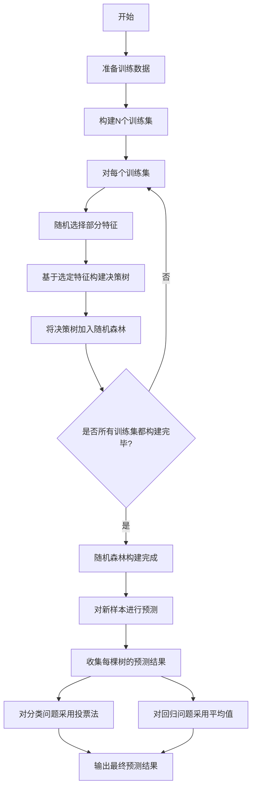

# 随机森林 原理与代码实例讲解

## 1.背景介绍

随机森林(Random Forest)是一种广泛应用于机器学习领域的强大算法,它属于集成学习方法的一种。集成学习的核心思想是通过构建并结合多个基础模型来提高预测性能,从而获得比单一模型更加准确、鲁棒的预测结果。

随机森林算法由Leo Breiman于2001年提出,它以决策树(Decision Tree)为基础模型,通过构建多个决策树并将它们的预测结果进行组合,从而形成一个强大的集成模型。随机森林在解决分类和回归问题时都表现出了优异的性能,因此被广泛应用于各个领域,包括计算机视觉、自然语言处理、生物信息学等。

## 2.核心概念与联系

### 2.1 决策树(Decision Tree)

决策树是随机森林的基础模型,它是一种树形结构的监督学习算法,用于解决分类和回归问题。决策树通过对特征进行递归分割,将数据空间划分为多个区域,每个区域对应一个预测值。

决策树的构建过程如下:

1. 从根节点开始,选择一个最优特征进行数据划分。
2. 对于每个子节点,重复步骤1,直到满足停止条件。
3. 生成叶节点,为每个叶节点分配一个预测值。

决策树具有易于理解和解释的优点,但也存在过拟合的风险。单棵决策树的泛化能力有限,因此需要集成多棵决策树来提高性能。

### 2.2 集成学习(Ensemble Learning)

集成学习是将多个基础模型组合起来,形成一个强大的集成模型的过程。集成学习的核心思想是通过组合多个基础模型,可以克服单一模型的局限性,提高预测的准确性和鲁棒性。

常见的集成学习方法包括:

- bagging(Bootstrap Aggregating):通过对原始数据进行有放回抽样,构建多个基础模型,然后对它们的预测结果进行平均或投票。
- boosting:通过迭代训练基础模型,每次训练时侧重于上一轮分类错误的样本,最终将多个基础模型线性组合。
- stacking:将多个基础模型的预测结果作为新的特征,输入到另一个模型(元模型)进行训练。

随机森林就是一种基于bagging思想的集成学习方法。

## 3.核心算法原理具体操作步骤

### 3.1 随机森林算法原理

随机森林的核心思想是通过构建多棵决策树,并对它们的预测结果进行组合,从而获得更加准确和鲁棒的预测结果。具体步骤如下:

1. 从原始数据中通过有放回抽样的方式,多次随机抽取N个训练样本,构建N个训练集。
2. 对于每个训练集,采用随机特征选择的方式,从所有特征中随机选择一部分特征,并基于这些特征构建一棵决策树。
3. 对于每棵决策树,让其在对应的训练集上生长到底,不进行剪枝。
4. 对于新的测试样本,将其输入到每棵决策树中,收集每棵树的预测结果。
5. 对于分类问题,采用投票法(majority vote)确定最终的类别预测结果。对于回归问题,采用平均值作为最终的预测结果。

### 3.2 随机特征选择

在构建每棵决策树时,随机森林不是从所有特征中选择最优特征,而是从所有特征中随机选择一部分特征,这就是随机特征选择。

对于分类问题,通常选择 $\sqrt{p}$ 个特征,其中 $p$ 是总特征数。对于回归问题,通常选择 $p/3$ 个特征。

随机特征选择的目的是:

1. 减少模型对于某些特征的依赖,提高模型的泛化能力。
2. 减少特征间的相关性,使得每棵决策树之间的差异性更大。
3. 降低计算复杂度,提高训练效率。

### 3.3 Mermaid流程图

以下是随机森林算法的Mermaid流程图:



## 4.数学模型和公式详细讲解举例说明

### 4.1 基尼系数(Gini Impurity)

在构建决策树时,需要选择一个最优特征进行数据划分。基尼系数是衡量数据集纯度的一种指标,它可以用于特征选择。

对于二分类问题,设数据集 $D$ 中第 $k$ 类样本所占的比例为 $p_k$,则 $D$ 的基尼系数定义为:

$$
\begin{aligned}
Gini(D) &= \sum_{k=1}^{K}p_k(1-p_k)\\
        &= 1-\sum_{k=1}^{K}p_k^2\\
        &= 2p(1-p)
\end{aligned}
$$

其中 $K$ 为类别数,当 $K=2$ 时,上式可以简化为最后一个等式。

基尼系数的取值范围为 $[0,1]$,当数据集 $D$ 纯度越高时,基尼系数越小。因此,在选择最优特征时,我们希望基尼系数的减小值最大。

对于给定的特征 $A$,其基尼值定义为:

$$Gini(D,A)=\sum_{t\in T}\frac{|D_t|}{|D|}Gini(D_t)$$

其中 $T$ 为根据特征 $A$ 划分后的子节点集合, $D_t$ 为子节点 $t$ 对应的数据集, $|D_t|$ 和 $|D|$ 分别为 $D_t$ 和 $D$ 的样本数量。

我们选择使得 $Gini(D)-Gini(D,A)$ 最大的特征 $A$ 作为最优特征。

### 4.2 袋外估计(Out-of-Bag Estimation)

在随机森林中,由于每棵决策树都是基于有放回抽样的子集进行训练的,因此对于每棵树,都存在一部分样本没有被用作训练数据,这些样本被称为袋外数据(Out-of-Bag Data)。

袋外估计就是利用这些袋外数据对随机森林进行无偏估计和评估,它可以用于:

1. 评估随机森林的泛化能力,而无需单独的测试集。
2. 计算特征重要性。

对于每棵决策树,将其袋外数据输入到该树中,收集预测结果。然后,对于所有树的袋外数据,计算平均误差或其他评估指标,就可以得到随机森林的无偏估计。

袋外估计的优点是:

1. 无需单独的测试集,可以充分利用所有训练数据。
2. 评估结果更加可靠,因为每个样本都被多棵树评估过。

### 4.3 特征重要性(Feature Importance)

随机森林还可以用于计算每个特征对于模型预测结果的重要性,这对于特征选择和模型解释性非常有帮助。

常见的特征重要性计算方法有:

1. 平均减少不纯度(Mean Decrease in Impurity, MDI)
2. 平均减少准确率(Mean Decrease in Accuracy, MDA)

MDI 基于这样一个事实:如果一个特征在构建决策树时被频繁使用,那么它一定对于提高模型性能很重要。具体来说,对于每个特征,计算在所有决策树中,使用该特征作为分裂节点时,导致的不纯度(如基尼系数)的减小值,然后对所有树取平均,作为该特征的重要性评分。

MDA 则是基于袋外估计的思想。对于每个特征,随机permute它的值,然后计算这种permute操作导致的模型预测准确率的降低。降低的幅度越大,说明该特征对于模型的预测能力越重要。

## 5.项目实践:代码实例和详细解释说明

以下是使用Python中的scikit-learn库构建随机森林分类器的代码示例:

```python
from sklearn.ensemble import RandomForestClassifier
from sklearn.datasets import make_classification
from sklearn.model_selection import train_test_split
from sklearn.metrics import accuracy_score

# 生成模拟数据
X, y = make_classification(n_samples=1000, n_features=10, n_informative=5, random_state=42)

# 划分训练集和测试集
X_train, X_test, y_train, y_test = train_test_split(X, y, test_size=0.2, random_state=42)

# 创建随机森林分类器
rf = RandomForestClassifier(n_estimators=100, max_depth=None, random_state=42)

# 训练模型
rf.fit(X_train, y_train)

# 在测试集上进行预测
y_pred = rf.predict(X_test)

# 计算准确率
accuracy = accuracy_score(y_test, y_pred)
print(f"Accuracy: {accuracy:.2f}")

# 计算特征重要性
importances = rf.feature_importances_
print("Feature importances:")
for feature, importance in zip(range(X.shape[1]), importances):
    print(f"Feature {feature}: {importance:.2f}")
```

代码解释:

1. 首先,我们使用scikit-learn提供的`make_classification`函数生成模拟的分类数据,其中`n_informative=5`表示有5个特征对分类结果有影响。
2. 将数据划分为训练集和测试集。
3. 创建`RandomForestClassifier`对象,设置`n_estimators=100`表示构建100棵决策树。
4. 使用`fit`方法在训练集上训练随机森林模型。
5. 在测试集上进行预测,并计算预测准确率。
6. 使用`feature_importances_`属性获取每个特征的重要性评分。

运行结果:

```
Accuracy: 0.96
Feature importances:
Feature 0: 0.01
Feature 1: 0.02
Feature 2: 0.24
Feature 3: 0.31
Feature 4: 0.27
Feature 5: 0.03
Feature 6: 0.02
Feature 7: 0.01
Feature 8: 0.04
Feature 9: 0.05
```

从结果可以看出,随机森林在这个模拟数据集上取得了96%的准确率。同时,它也正确地识别出了对分类结果有影响的5个特征(Feature 2~6),并给出了它们的重要性评分。

## 6.实际应用场景

随机森林由于其优异的性能和易用性,在各个领域都有广泛的应用,包括但不限于:

1. **计算机视觉**:图像分类、目标检测、语义分割等。
2. **自然语言处理**:文本分类、情感分析、命名实体识别等。
3. **生物信息学**:基因表达数据分析、蛋白质结构预测等。
4. **金融**:信用评分、欺诈检测、风险管理等。
5. **推荐系统**:个性化推荐、用户行为预测等。
6. **医疗**:疾病诊断、生存率预测、医学影像分析等。

## 7.工具和资源推荐

如果你想进一步学习和使用随机森林算法,以下是一些推荐的工具和资源:

1. **Python库**:scikit-learn、XGBoost、LightGBM等机器学习库都提供了随机森林的实现。
2. **R包**:randomForest、ranger等R包提供了随机森林的实现。
3. **在线课程**:Coursera、edX、Udacity等平台提供了机器学习相关的优质课程。
4. **书籍**:《机器学习》(周志华)、《An Introduction to Statistical Learning》等经典书籍。
5. **论文**:Breiman的原始论文《Random Forests》(2001)是必读的经典论文。
6. **开源项目**:GitHub上有许多开源的随机森林相关项目,可以学习和参与。

## 8.总结:未来发展趋势