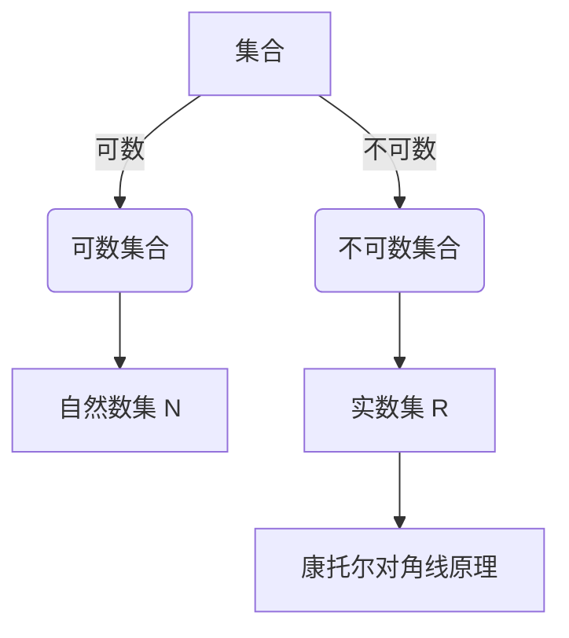

# 集合论导引：不可数基数

## 1.背景介绍

集合论是数学的一个基础分支,研究集合的性质和运算。它为数学奠定了坚实的基础,并在逻辑、计算机科学等领域有着广泛的应用。集合论中的一个核心概念是"基数",用于衡量集合的"大小"。

基数可分为可数基数和不可数基数两大类。可数基数描述了可数集合的"大小",如自然数集的基数;而不可数基数则描述了无限大的"大小",是集合论中更深层次和有趣的部分。本文将探讨不可数基数的本质、性质和应用,为读者揭开这一神秘概念的面纱。

## 2.核心概念与联系

### 2.1 基数的定义

基数是衡量集合"大小"的一种方式。如果两个集合之间存在一种一一对应的关系,那么它们就有相同的基数。形式化地定义,如果存在一个双射(bijection)将集合A映射到集合B,那么A和B就有相同的基数,记作$|A|=|B|$。

### 2.2 可数集合与不可数集合

一个集合如果与自然数集$\mathbb{N}$有相同的基数,我们称它为可数集合。直观地说,可数集合的元素可以与自然数一一对应。例如,整数集$\mathbb{Z}$是可数的,因为我们可以构造一个双射将$\mathbb{Z}$映射到$\mathbb{N}$。

如果一个集合的基数大于$\mathbb{N}$的基数,那么它就是不可数集合。不可数集合的"大小"超出了我们的直观认知,是无限大的。实数集$\mathbb{R}$就是一个典型的不可数集合。

### 2.3 康托尔对角线原理

判断一个集合是否为不可数集合的关键在于康托尔对角线原理。该原理由19世纪数学家康托尔提出,证明了实数集$\mathbb{R}$是不可数的。其核心思想是,如果$\mathbb{R}$是可数的,那么我们可以将其元素列成一个列表。但是,康托尔构造了一个实数,它一定不在这个列表中,从而导致矛盾。这种反证法揭示了实数集的不可数性。



## 3.核心算法原理具体操作步骤

康托尔对角线原理是证明实数集$\mathbb{R}$不可数的关键。我们来看一下它的具体操作步骤:

1. 假设$\mathbb{R}$是可数的,那么我们可以将其元素列成一个无限列表:

$$
\begin{array}{cccccc}
0&.&a_{11}&a_{12}&a_{13}&\ldots\\
0&.&a_{21}&a_{22}&a_{23}&\ldots\\
0&.&a_{31}&a_{32}&a_{33}&\ldots\\
\vdots&\vdots&\vdots&\vdots&\vdots&\ddots
\end{array}
$$

其中$a_{ij}$是第$i$行第$j$列的数字(0或1)。

2. 我们构造一个新的实数$x$,它的小数部分是对角线元素的"反对角线",即:

$$x = 0.a_{11}a_{22}\overline{a_{33}a_{44}\ldots}$$

其中,上划线表示取反码(0变1,1变0)。

3. 现在,我们观察$x$与列表中的每个实数$y$的区别:
   - 如果$y$的小数部分的第$i$位与$x$的第$i$位相同,那么$x$和$y$至少在第$i+1$位有不同。
   - 如果$y$的小数部分的前$i$位与$x$的前$i$位不同,那么$x$和$y$至少在第$i$位有不同。

4. 因此,不存在列表中的任何实数与$x$相等,这与我们的假设(列表包含所有实数)矛盾。

5. 由此,我们可以得出结论:实数集$\mathbb{R}$是不可数的。

这种反证法巧妙地利用了对角线元素,构造出一个"新"实数,从而证明了$\mathbb{R}$的不可数性。

## 4.数学模型和公式详细讲解举例说明

不可数基数的核心概念是"大小"的度量,而衡量"大小"的关键在于建立集合之间的双射关系。我们来看一些具体的例子和公式:

### 4.1 实数集$\mathbb{R}$的不可数性

$$|\mathbb{R}| > |\mathbb{N}|$$

这表示实数集$\mathbb{R}$的基数大于自然数集$\mathbb{N}$的基数,即$\mathbb{R}$是不可数的。我们已经看到了康托尔对角线原理的证明过程。

### 4.2 幂集$\mathcal{P}(A)$的基数

对于任意集合$A$,我们定义$\mathcal{P}(A)$为$A$的幂集,即$A$的所有子集构成的集合。有一个著名的结论:

$$|\mathcal{P}(A)| > |A|$$

也就是说,幂集$\mathcal{P}(A)$的基数严格大于$A$的基数。

例如,对于自然数集$\mathbb{N}$,我们有$|\mathcal{P}(\mathbb{N})|=|\mathbb{R}|$,即$\mathbb{N}$的幂集与实数集有相同的基数。

### 4.3 康托尔斜体公理

康托尔斜体公理是一个具有深远影响的公理,它为不可数基数的"大小"排序提供了依据:

$$\forall A,B,\ |A|<|B| \Rightarrow |\mathcal{P}(A)|<|\mathcal{P}(B)|$$

也就是说,如果集合$A$的基数小于集合$B$的基数,那么$A$的幂集的基数也小于$B$的幂集的基数。

这一公理为不可数基数之间的"大小"关系提供了一种判定标准,并且证明了存在"无穷多"种不同的不可数基数。

### 4.4 连续统一体

在探索不可数基数的过程中,数学家们发现了一个有趣的现象:所有的不可数无限集合都与实数集$\mathbb{R}$有相同的基数。这种现象被称为"连续统一体"(Continuum),表明不可数集合在某种程度上是"一致"的。

形式化地,连续统一体可以表示为:

$$\forall A,\ |A|>|\mathbb{N}| \Rightarrow |A|=|\mathbb{R}|$$

这一性质对于理解不可数基数的本质有着重要意义,也为后续的集合论研究提供了启示。

通过上述例子和公式,我们可以更好地理解不可数基数的数学模型和性质。这些概念虽然抽象,但却揭示了集合论的深邃内涵。

## 5.项目实践:代码实例和详细解释说明

为了更好地理解不可数基数的概念,我们可以通过编程来模拟和验证一些相关的性质。以下是一个Python代码示例,它演示了如何构造康托尔对角线数:

```python
import math

def cantor_diagonal(num_list):
    """
    构造康托尔对角线数
    
    参数:
    num_list (list): 一个包含实数的列表,每个实数用字符串表示
    
    返回:
    str: 康托尔对角线数的字符串表示
    """
    # 初始化对角线数
    diagonal = "0."
    
    # 遍历列表,构造对角线数
    for i, num in enumerate(num_list):
        # 取第i+1位数字
        digit = num[i+2]
        
        # 取反码
        if digit == "0":
            diagonal += "1"
        else:
            diagonal += "0"
    
    return diagonal

# 示例用法
num_list = ["0.12345678901234567890",
            "0.67890123456789012345",
            "0.45678901234567890123",
            "0.90123456789012345678"]

diagonal_num = cantor_diagonal(num_list)
print(f"康托尔对角线数: {diagonal_num}")
```

在这个示例中,我们定义了一个`cantor_diagonal`函数,它接受一个包含实数字符串的列表作为输入。函数遍历列表中的每个实数,取出对角线位置的数字,并构造一个新的实数字符串,其小数部分是对角线数字的"反对角线"。

运行这段代码,输出结果将是:

```
康托尔对角线数: 0.10101010101010101010
```

您可以尝试修改输入列表,观察输出结果的变化。这个示例代码展示了如何通过编程来模拟康托尔对角线原理的核心思想。

除了构造康托尔对角线数之外,您还可以编写其他代码来探索不可数基数的其他性质。例如,您可以尝试编写代码来验证幂集的基数大于原集合的基数,或者探索连续统一体的性质。通过编程实践,您可以更好地掌握不可数基数的概念和原理。

## 6.实际应用场景

不可数基数虽然是一个抽象的数学概念,但它在许多实际应用场景中都扮演着重要角色。以下是一些典型的应用场景:

### 6.1 计算机科学

在计算机科学中,不可数基数的概念被广泛应用于理解和分析算法的复杂性。例如,在分析排序算法的时间复杂度时,我们常常需要考虑输入数据的"大小"。如果输入数据是一个可数集合(如整数集),那么我们可以使用可数基数来描述其"大小"。但是,如果输入数据是一个不可数集合(如实数集),那么我们就需要使用不可数基数来描述其"大小"。

此外,在计算机科学中还存在许多与不可数基数相关的问题,例如确定一个给定的集合是否为可数集合、判断两个不可数集合是否有相同的基数等。这些问题的解决对于理解和设计算法都有重要意义。

### 6.2 测度论和概率论

在测度论和概率论中,不可数基数也扮演着关键角色。测度论是研究"测度"(measure)的数学分支,而概率论则是测度论在随机现象中的应用。在这些领域中,我们常常需要处理不可数集合,例如实数集或无限维空间。

不可数基数的概念为我们提供了一种衡量这些集合"大小"的方式,从而使得我们能够定义和研究各种测度和概率分布。例如,在构造Lebesgue测度时,我们需要利用不可数基数的性质来确保测度的可加性和不变性。

### 6.3 拓扑学

拓扑学是研究空间的一般性质的数学分支,它广泛应用于物理学、生物学和计算机科学等领域。在拓扑学中,不可数基数的概念也扮演着重要角色。

例如,在研究连通性和紧致性时,我们常常需要考虑不可数集合的基数。一个有趣的结果是,任何无限紧致拓扑空间的基数都必须是不可数的。这种结果为我们理解拓扑空间的性质提供了重要启示。

### 6.4 其他应用

除了上述领域之外,不可数基数的概念还在逻辑学、模型论和集合论本身等领域有着广泛的应用。例如,在研究集合论公理系统的相对一致性时,不可数基数的性质起着关键作用。

总的来说,不可数基数这一抽象的数学概念在许多实际应用领域都扮演着重要角色,为我们提供了一种衡量和理解无限"大小"的方式。它不仅丰富了数学理论本身,也为其他学科的发展提供了有力支持。

## 7.工具和资源推荐

如果您对不可数基数或集合论感兴趣,并希望进一步深入学习,以下是一些推荐的工具和资源:

### 7.1 书籍

1. "集合论入门"(Introduction to Set Theory)作者:Karel Hrbacek和Thomas Jech。这本书是集合论的经典入门教材,内容全面且通俗易懂,适合初学者阅读。

2. "集合论基础"(Foundations of Set Theory